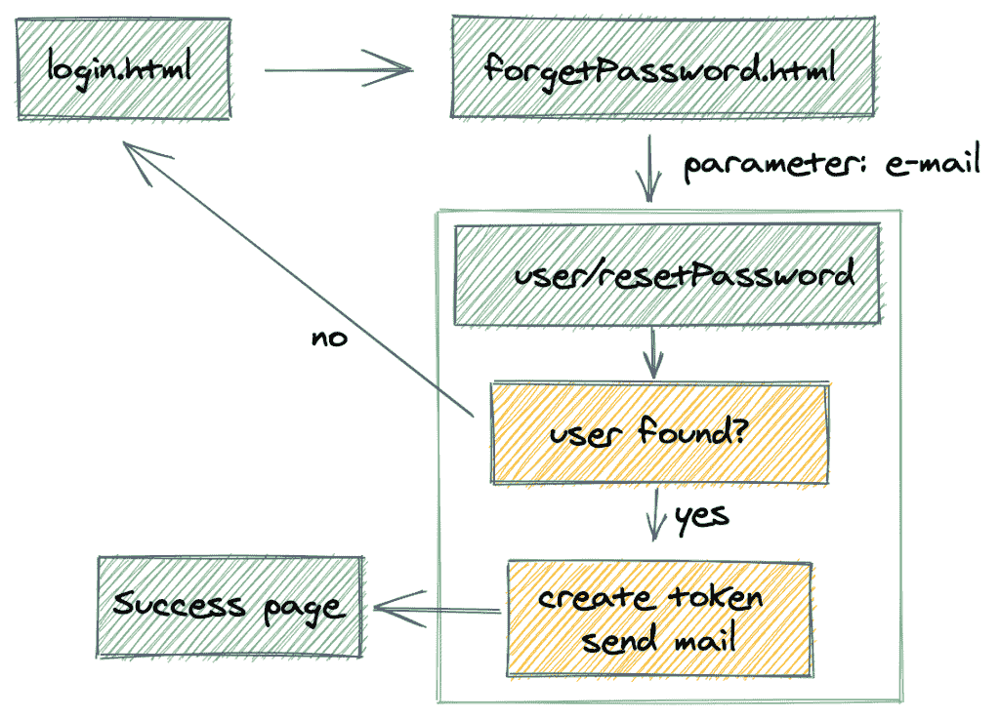
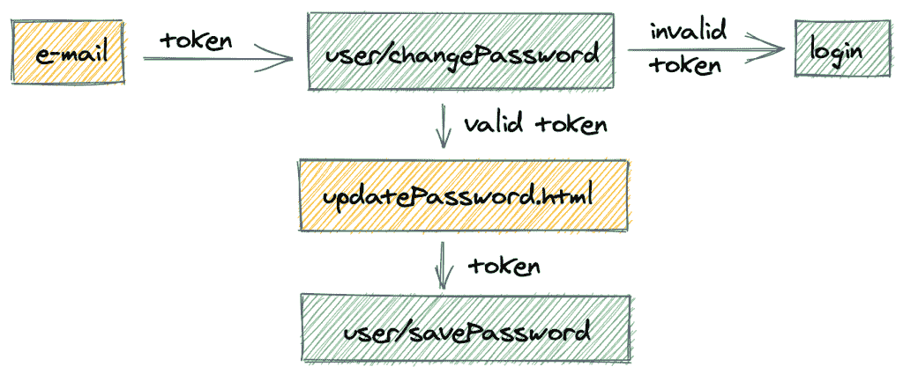

# spring Security–重置您的密码

> 原文：<https://web.archive.org/web/20220930061024/https://www.baeldung.com/spring-security-registration-i-forgot-my-password>

[This article is part of a series:](javascript:void(0);)[• Spring Security Registration Tutorial](/web/20220625235825/https://www.baeldung.com/spring-security-registration)
[• The Registration Process With Spring Security](/web/20220625235825/https://www.baeldung.com/registration-with-spring-mvc-and-spring-security)
[• Registration – Activate a New Account by Email](/web/20220625235825/https://www.baeldung.com/registration-verify-user-by-email)
[• Spring Security Registration – Resend Verification Email](/web/20220625235825/https://www.baeldung.com/spring-security-registration-verification-email)
[• Registration with Spring Security – Password Encoding](/web/20220625235825/https://www.baeldung.com/spring-security-registration-password-encoding-bcrypt)
[• The Registration API becomes RESTful](/web/20220625235825/https://www.baeldung.com/registration-restful-api)
• Spring Security – Reset Your Password (current article)[• Registration – Password Strength and Rules](/web/20220625235825/https://www.baeldung.com/registration-password-strength-and-rules)
[• Updating your Password](/web/20220625235825/https://www.baeldung.com/updating-your-password/)

## **1。概述**

在本教程中——我们继续正在进行的 **`Registration with Spring Security`系列**，看看**“T1”的基本功能**——这样用户就可以在需要时安全地重置自己的密码。

## 2.请求重置您的密码

密码重置流程通常在用户单击登录页面上的某种“重置”按钮时开始。然后，我们可以向用户询问他们的电子邮件地址或其他识别信息。确认后，我们可以生成一个令牌并向用户发送电子邮件。

下图显示了我们将在本文中实现的流程:

## **3。密码重置令牌**

让我们首先创建一个`PasswordResetToken`实体，用它来重置用户的密码:

[PRE0]

当触发密码重置时，将创建一个令牌，并且将通过电子邮件向用户发送一个包含该令牌的特殊链接**。**

令牌和链接仅在设定的时间段内有效(在本例中为 24 小时)。

## **4。`forgotPassword.html`**

该过程的第一页是**“`I forgot my password`”页**——在这里，用户被提示输入他们的电子邮件地址，以便开始实际的重置过程。

因此，让我们设计一个简单的`forgotPassword.html`询问用户的电子邮件地址:

[PRE1]

我们现在需要从登录页面链接到这个新的“`reset password`”页面:

[PRE2]

## **5。创建`PasswordResetToken`**

让我们从创建新的`PasswordResetToken`开始，并通过电子邮件发送给用户:

[PRE3]

这里是`createPasswordResetTokenForUser()`方法:

[PRE4]

下面是方法`constructResetTokenEmail()`–用于发送带有重置令牌的电子邮件:

[PRE5]

请注意我们如何使用一个简单的对象`GenericResponse`来表示我们对客户端的响应:

[PRE6]

## **6。`PasswordResetToken`勾选**

一旦用户点击他们电子邮件中的链接，`user/changePassword`端点:

*   验证令牌是否有效
*   向用户显示`updatePassword`页面，用户可以在其中输入新密码

然后，新密码和令牌被传递到`user/savePassword`端点:

用户收到带有重置密码的唯一链接的电子邮件，然后单击该链接:

[PRE7]

这里是`validatePasswordResetToken()`方法:

[PRE8]

## **7。更改密码**

此时，用户会看到简单的`Password Reset`页面——这里唯一可能的选项是**提供一个新密码**:

### **7.1。`updatePassword.html`**

[PRE9]

注意，我们显示了 reset 标记，并在下面保存密码的调用中将它作为 POST 参数传递。

### 7.2。保存密码

最后，当提交上一个 post 请求时，新的用户密码被保存:

[PRE10]

这里是`changeUserPassword()`方法:

[PRE11]

而`PasswordDto`:

[PRE12]

## **8。结论**

在本文中，我们为成熟的身份验证过程实现了一个简单但非常有用的特性——作为系统的用户，可以选择重置自己的密码。

本教程的**完整实现**可以在[的 GitHub 项目](https://web.archive.org/web/20220625235825/https://github.com/Baeldung/spring-security-registration "The Full Registration/Authentication Example Project on Github ")中找到——这是一个基于 Eclipse 的项目，所以它应该很容易导入和运行。

Next **»**[Registration – Password Strength and Rules](/web/20220625235825/https://www.baeldung.com/registration-password-strength-and-rules)**«** Previous[The Registration API becomes RESTful](/web/20220625235825/https://www.baeldung.com/registration-restful-api)