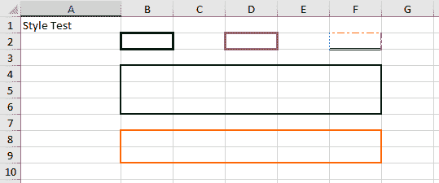

# 使用 Apache POI 为 Excel 单元格添加边框

> 原文：<https://web.archive.org/web/20220930061024/https://www.baeldung.com/apache-poi-add-borders>

## 1.概观

在本教程中，我们将学习如何使用 [Apache POI](https://web.archive.org/web/20220524015028/https://poi.apache.org/) Java 库给 Excel 表格添加边框。

关于 excel 处理的更多基础知识，我们可以从用 Java 使用 Microsoft Excel 的[开始。](/web/20220524015028/https://www.baeldung.com/java-microsoft-excel)

## 2.Excel 边框

我们可以为一个 excel 单元格或一系列单元格创建边框。这些**边界线可以有多种样式**。一些示例样式包括粗线、细线、中线、点线。为了增加更多的变化，**我们可以有彩色边框**。

这张图片展示了一些变化的边界:

[](/web/20220524015028/https://www.baeldung.com/wp-content/uploads/2021/11/ExcelCellBorders.png)

*   单元格`B2`有粗线边框
*   `D2`单元格有宽的紫色边框
*   `F2`单元格是用一个疯狂的边框，边框的每一边都用不同的样式和颜色
*   范围`B4:F6`具有中等大小的边框
*   区域`B8:F9`带有中等大小的橙色边框

## 3.Excel 边框的编码

Apache POI 库提供了多种处理边界的方法。一种简单的方法是引用单元格区域并应用边框。

### 3.1.单元格区域或区域

要引用一系列单元格，我们可以使用`CellRangeAddress` class:

```java
CellRangeAddress region = new CellRangeAddress(7, 8, 1, 5);
```

`CellRangeAddress`构造函数接受四个参数第一行、最后一行、第一列和最后一列。每个行和列的索引从零开始。在上面的代码中，指的是单元格范围`B8:F9`。

我们也可以使用`CellRangeAddress`类来引用一个单元格:

```java
CellRangeAddress region = new CellRangeAddress(1, 1, 5, 5);
```

上面的代码引用的是`F2`单元格。

### 3.2.单元格边框

每个边框都有四条边:顶部、底部、左侧和右侧边框。**我们必须分别设置每一边的边框样式**。`BorderStyle`类提供了多种样式。

我们可以使用`RangeUtil`类设置边框:

```java
RegionUtil.setBorderTop(BorderStyle.DASH_DOT, region, sheet);
RegionUtil.setBorderBottom(BorderStyle.DOUBLE, region, sheet);
RegionUtil.setBorderLeft(BorderStyle.DOTTED, region, sheet);
RegionUtil.setBorderRight(BorderStyle.SLANTED_DASH_DOT, region, sheet); 
```

### 3.3.边框颜色

边框颜色也必须在每一侧单独设置。`IndexedColors`类提供了一系列的颜色来使用。

我们可以使用`RangeUtil`类设置边框颜色:

```java
RegionUtil.setTopBorderColor(IndexedColors.RED.index, region, sheet);
RegionUtil.setBottomBorderColor(IndexedColors.GREEN.index, region, sheet);
RegionUtil.setLeftBorderColor(IndexedColors.BLUE.index, region, sheet);
RegionUtil.setRightBorderColor(IndexedColors.VIOLET.index, region, sheet); 
```

## 4.结论

在这篇短文中，我们看到了如何使用`CellRangeAddress`、`RegionUtil`、`BorderStyles`和`IndexedColors`类生成各种单元格边框。边框的每一边都必须单独设置。

像往常一样，代码和测试可以在 GitHub 的[上获得。](https://web.archive.org/web/20220524015028/https://github.com/eugenp/tutorials/tree/master/apache-poi)