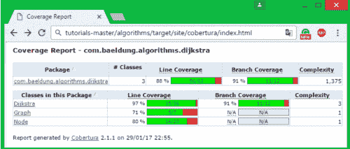
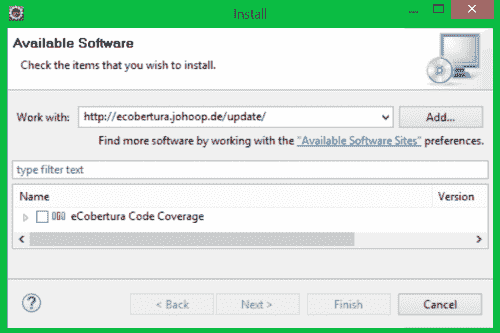
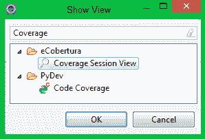

# Cobertura 简介

> 原文：<https://web.archive.org/web/20220930061024/https://www.baeldung.com/cobertura>

## 1。概述

在本文中，我们将展示使用[Cobertura](https://web.archive.org/web/20221002070307/https://cobertura.github.io/cobertura/)T3**生成代码覆盖报告的几个方面。**

简单地说，Cobertura 是一个报告工具，它计算代码库的测试覆盖率——Java 项目中单元测试访问的分支/行的百分比。

## 2。Maven 插件

### 2.1。Maven 配置

为了在您的 Java 项目中开始计算[代码覆盖率](/web/20221002070307/https://www.baeldung.com/cs/code-coverage)，您需要**在您的`pom.xml`文件**的报告部分下声明 Cobertura Maven 插件:

```java
<reporting>
    <plugins>
        <plugin>
            <groupId>org.codehaus.mojo</groupId>
            <artifactId>cobertura-maven-plugin</artifactId>
            <version>2.7</version>
        </plugin>
    </plugins>
</reporting>
```

你可以随时在 [Maven 中心库](https://web.archive.org/web/20221002070307/https://search.maven.org/classic/#search%7Cgav%7C1%7Cg%3A%22org.codehaus.mojo%22%20AND%20a%3A%22cobertura-maven-plugin%22)中查看最新版本的插件。

一旦完成，继续运行 Maven，指定`cobertura:cobertura` 作为目标。

这将创建一个详细的 HTML 风格的报告，显示通过代码检测收集的代码覆盖率统计数据:

[](/web/20221002070307/https://www.baeldung.com/wp-content/uploads/2017/02/cob-e1485730773190.png)

**行覆盖度量显示了在单元测试运行中有多少语句被执行**，而**分支覆盖度量关注于那些测试覆盖了多少分支**。

对于每个条件，你有两个分支，所以基本上，你最终会有两倍于条件的分支。

**复杂度因子反映了代码的复杂度**——当代码中的分支数量增加时，复杂度因子增加。

理论上，您拥有的分支越多，为了增加分支覆盖率，您需要实现的测试就越多。

### 2.2。配置代码覆盖率计算和检查

您可以使用`ignore`和`exclude`标签从代码检测中忽略/排除一组特定的类:

```java
<plugin>
    <groupId>org.codehaus.mojo</groupId>
    <artifactId>cobertura-maven-plugin</artifactId>
    <version>2.7</version>
    <configuration>
        <instrumentation>
            <ignores>
                <ignore>com/baeldung/algorithms/dijkstra/*</ignore>
            </ignores>
            <excludes>
                <exclude>com/baeldung/algorithms/dijkstra/*</exclude>
            </excludes>
        </instrumentation>
    </configuration>
</plugin>
```

计算完代码覆盖率后，就进入了`check` 阶段。**`check`阶段确保达到一定水平的代码覆盖率**。

下面是一个关于如何配置`check`阶段的基本示例:

```java
<configuration>
    <check>
        <haltOnFailure>true</haltOnFailure>
        <branchRate>75</branchRate>
        <lineRate>85</lineRate>
        <totalBranchRate>75</totalBranchRate>
        <totalLineRate>85</totalLineRate>
        <packageLineRate>75</packageLineRate>
        <packageBranchRate>85</packageBranchRate>
        <regexes>
            <regex>
                <pattern>com.baeldung.algorithms.dijkstra.*</pattern>
                <branchRate>60</branchRate>
                <lineRate>50</lineRate>
             </regex>
        </regexes>
    </check>
</configuration>
```

当使用`haltOnFailure`标志时，如果其中一个指定的检查失败，Cobertura 将导致构建失败。

`branchRate/lineRate` 标签指定了代码插入后所需的最小可接受分支/线覆盖分数。这些检查可以使用`packageLineRate/packageBranchRate`标签扩展到包级别。

还可以通过使用`regex`标签为名称遵循特定模式的类声明特定的规则检查。在上面的例子中，我们确保对于`com.baeldung.algorithms.dijkstra`包及以下包中的类，必须达到特定的行/分支覆盖分数。

## 3。Eclipse 插件

### 3.1。安装

Cobertura 也是一个名为`eCobertura`的 Eclipse 插件。为了安装 Eclipse 的`eCobertura`,您需要遵循下面的步骤并安装 Eclipse 3.5 或更高版本:

**第一步:**从 Eclipse 菜单中选择*帮助* → *安装新软件*。然后，在 `work with`字段，输入`http://ecobertura.johoop.de/update/`:

[](/web/20221002070307/https://www.baeldung.com/wp-content/uploads/2017/02/cob3-e1485814235220.png)

**第二步:**选择`eCobertura Code Coverage`，点击“下一步”，然后按照安装向导中的步骤进行操作。

既然已经安装了`eCobertura`，重启 Eclipse 并在`Windows → Show View → Other → Cobertura`下显示覆盖会话视图。

[](/web/20221002070307/https://www.baeldung.com/wp-content/uploads/2017/02/cob3-e1485814235220-1.png)

### 3.2。使用 Eclipse 开普勒或更高版本

对于新版 Eclipse(开普勒、露娜等。)，安装`eCobertura`可能会导致一些与 JUnit 相关的问题——**与 Eclipse 打包在一起的较新版本的 JUnit 与`eCobertura`的依赖检查器**不完全兼容

```java
Cannot complete the install because one or more required items could not be found.
  Software being installed: eCobertura 0.9.8.201007202152 (ecobertura.feature.group
     0.9.8.201007202152)
  Missing requirement: eCobertura UI 0.9.8.201007202152 (ecobertura.ui 
     0.9.8.201007202152) requires 'bundle org.junit4 0.0.0' but it could not be found
  Cannot satisfy dependency:
    From: eCobertura 0.9.8.201007202152 
    (ecobertura.feature.group 0.9.8.201007202152)
    To: ecobertura.ui [0.9.8.201007202152]
```

作为一种变通方法，您可以下载一个旧版本的 JUnit，并将其放入 Eclipse plugins 文件夹中。

这可以通过从`%ECLIPSE_HOME%/plugins`中删除文件夹`org.junit.***`，然后从与`eCobertura`兼容的旧 Eclipse 安装中复制相同的文件夹来完成。

完成后，**重启 Eclipse IDE，并使用相应的更新站点重新安装插件**。

### 3.3。Eclipse 中的代码覆盖报告

为了通过单元测试计算代码覆盖率，右击您的项目/测试来打开上下文菜单，然后选择选项`Cover As → JUnit Test`。

在`Coverage Session` 视图下，您可以查看每个类别的行/分行覆盖率报告:

[](/web/20221002070307/https://www.baeldung.com/wp-content/uploads/2017/02/Sans-titre-e1487178259898.png)

**Java 8 用户在计算代码覆盖率时可能会遇到一个常见的错误:**

```java
java.lang.VerifyError: Expecting a stackmap frame at branch target ...
```

在这种情况下，Java 抱怨一些方法没有合适的栈映射，这是因为在 Java 的新版本中引入了更严格的字节码检验器。

**这个问题可以通过在 Java 虚拟机中禁用验证来解决。**

为此，右键单击您的项目打开上下文菜单，选择`Cover As`，然后打开`Coverage Configurations`视图。在 arguments 选项卡中，添加`-noverify`标志作为 VM 参数。最后，点击`coverage`按钮启动覆盖率计算。

您也可以使用标志`-XX:-UseSplitVerifier`，但是这只适用于 Java 6 和 7，因为在 Java 8 中不再支持 split verifier。

## 4。结论

在本文中，我们简要地展示了如何使用 Cobertura 来计算 Java 项目中的代码覆盖率。我们还描述了在您的 Eclipse 环境中安装`eCobertura`所需的步骤。

Cobertura 是一个伟大而简单的代码覆盖工具，但没有得到积极的维护，因为它目前被更新更强大的工具如 [JaCoCo](/web/20221002070307/https://www.baeldung.com/jacoco) 远远超过。

最后，您可以在 GitHub 项目 的 [**中查看本文提供的示例。**](https://web.archive.org/web/20221002070307/https://github.com/eugenp/tutorials/tree/master/algorithms-modules/algorithms-miscellaneous-2)