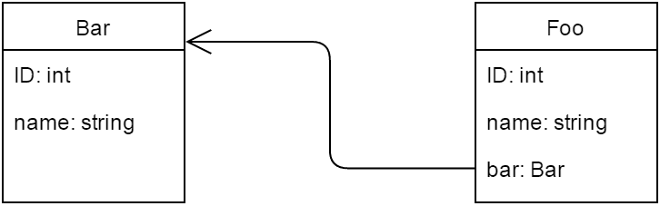

# 使用 JPA、Hibernate 和 Spring 数据进行审计

> 原文：<https://web.archive.org/web/20220930061024/https://www.baeldung.com/database-auditing-jpa>

## 1。概述

在 ORM 的上下文中，数据库审计意味着跟踪和记录与持久实体相关的事件，或者简单地说是实体版本控制。受 SQL 触发器的启发，这些事件是对实体的插入、更新和删除操作。数据库审计的好处类似于源代码版本控制提供的好处。

在本教程中，我们将演示在应用程序中引入审计的三种方法。首先，我们将使用标准 JPA 实现它。接下来，我们将看看两个 JPA 扩展，它们提供了自己的审计功能，一个由 Hibernate 提供，另一个由 Spring Data 提供。

以下是我们将在本例中使用的示例相关实体，`Bar`和`Foo,`:

[](/web/20221020172723/https://www.baeldung.com/wp-content/uploads/2016/07/Screenshot_4.png)

## 2。用 JPA 审计

JPA 没有明确包含审计 API，但是我们可以通过使用实体生命周期事件来实现这个功能。

### 2.1。`@PrePersist,` `@PreUpdate`和`@PreRemove`

在 JPA `Entity`类中，我们可以指定一个方法作为回调，我们可以在特定的实体生命周期事件中调用它。由于我们对在相应的 DML 操作之前执行的回调感兴趣，因此`@PrePersist`、`@PreUpdate`和`@PreRemove`回调注释可用于我们的目的:

```
@Entity
public class Bar {

    @PrePersist
    public void onPrePersist() { ... }

    @PreUpdate
    public void onPreUpdate() { ... }

    @PreRemove
    public void onPreRemove() { ... }

}
```

内部回调方法应该总是返回 void，并且不带参数。他们可以有任何名字和任何访问级别，但不应该是静态。

请注意，JPA 中的`@Version`注释与我们的主题并不完全相关；与审计数据相比，它与乐观锁定关系更大。

### 2.2。实现回调方法

但是这种方法有一个很大的限制。如 JPA 2 规范(JSR 317)所述:

> 一般来说，可移植应用程序的生命周期方法不应该调用`EntityManager`或`Query`操作，访问其他实体实例，或者修改同一持久性上下文中的关系。生命周期回调方法可以修改调用它的实体的非关系状态。

在没有审计框架的情况下，我们必须手动维护数据库模式和域模型。对于我们的简单用例，让我们向实体添加两个新属性，因为我们只能管理“实体的非关系状态”一个`operation` 属性将存储所执行操作的名称，一个`timestamp`属性用于操作的时间戳:

```
@Entity
public class Bar {

    //...

    @Column(name = "operation")
    private String operation;

    @Column(name = "timestamp")
    private long timestamp;

    //...

    // standard setters and getters for the new properties

    //...

    @PrePersist
    public void onPrePersist() {
        audit("INSERT");
    }

    @PreUpdate
    public void onPreUpdate() {
        audit("UPDATE");
    }

    @PreRemove
    public void onPreRemove() {
        audit("DELETE");
    }

    private void audit(String operation) {
        setOperation(operation);
        setTimestamp((new Date()).getTime());
    }

}
```

如果我们需要将这样的审计添加到多个类中，我们可以使用`@EntityListeners`来集中代码:

```
@EntityListeners(AuditListener.class)
@Entity
public class Bar { ... }
```

```
public class AuditListener {

    @PrePersist
    @PreUpdate
    @PreRemove
    private void beforeAnyOperation(Object object) { ... }

}
```

## 3 .冬眠对〔t1〕

使用 Hibernate，我们可以利用`Interceptors`和`EventListeners,`以及数据库触发器来完成审计。但是 ORM 框架提供了 Envers，一个实现持久类的审计和版本控制的模块。

### 3.1。Envers 入门

要设置 Envers，我们需要将`hibernate-envers` JAR 添加到我们的类路径中:

```
<dependency>
    <groupId>org.hibernate</groupId>
    <artifactId>hibernate-envers</artifactId>
    <version>${hibernate.version}</version>
</dependency>
```

然后我们在一个`@Entity`(审计整个实体)或特定的`@Column`(如果我们只需要审计特定的属性)上添加`@Audited`注释:

```
@Entity
@Audited
public class Bar { ... }
```

注意`Bar`和`Foo`是一对多的关系。在这种情况下，我们或者需要通过在`Foo,`上添加`@Audited`来审计`Foo`，或者在`Bar`中的关系属性上设置`@NotAudited`:

```
@OneToMany(mappedBy = "bar")
@NotAudited
private Set<Foo> fooSet;
```

### 3.2。创建审计日志表

有几种方法可以创建审计表:

*   将`hibernate.hbm2ddl.auto`设置为`create`、 `create-drop,`或`update`，以便 Envers 可以自动创建它们
*   使用 o `rg.hibernate.tool.EnversSchemaGenerator`以编程方式导出完整的数据库模式
*   设置一个 Ant 任务来生成适当的 DDL 语句
*   使用 Maven 插件从我们的映射生成数据库模式(如 Juplo ),以导出 Envers 模式(适用于 Hibernate 4 和更高版本)

我们将走第一条路，因为它是最简单的，但是要知道在生产中使用`hibernate.hbm2ddl.auto`是不安全的。

在我们的例子中，`bar_AUD`和`foo_AUD`(如果我们已经将`Foo`设置为`@Audited`)表应该是自动生成的。审计表从实体的表中复制所有被审计的字段，该表有两个字段，`REVTYPE` (值为:“0”表示添加，“1”表示更新，“2”表示删除实体)和`REV`。

除此之外，默认情况下还会生成一个名为`REVINFO`的额外表格。它包括两个重要的字段，`REV`和`REVTSTMP,`，并记录每次修改的时间戳。我们可以猜测，`bar_AUD.REV`和`foo_AUD.REV`实际上是`REVINFO.REV.`的外键

### 3.3。配置环境

我们可以像配置任何其他 Hibernate 属性一样配置 Envers 属性。

例如，让我们将审计表后缀(默认为“`_AUD`”)更改为“`_AUDIT_LOG.`”，下面是我们如何设置相应属性`org.hibernate.envers.audit_table_suffix`的值:

```
Properties hibernateProperties = new Properties(); 
hibernateProperties.setProperty(
  "org.hibernate.envers.audit_table_suffix", "_AUDIT_LOG"); 
sessionFactory.setHibernateProperties(hibernateProperties);
```

可用属性的完整列表可在 Envers 文档中找到[。](https://web.archive.org/web/20221020172723/http://docs.jboss.org/envers/docs/#configuration)

### 3.4。访问实体历史

我们可以像通过 Hibernate Criteria API 查询数据一样查询历史数据。我们可以使用`AuditReader`接口访问一个实体的审计历史，这可以通过打开`EntityManager`或者通过`AuditReaderFactory`使用`Session`来获得:

```
AuditReader reader = AuditReaderFactory.get(session);
```

Envers 提供了`AuditQueryCreator`(由`AuditReader.createQuery()`返回)以便创建特定于审计的查询。下面的行将返回在修订#2 中修改的所有`Bar`实例(其中`bar_AUDIT_LOG.REV = 2`):

```
AuditQuery query = reader.createQuery()
  .forEntitiesAtRevision(Bar.class, 2)
```

下面是我们如何查询`Bar`的修订。这将导致获得所有被审计的`Bar`实例在其所有状态下的列表:

```
AuditQuery query = reader.createQuery()
  .forRevisionsOfEntity(Bar.class, true, true);
```

如果第二个参数为假，则结果与`REVINFO`表连接。否则，只返回实体实例。最后一个参数指定是否返回删除的`Bar`实例。

然后我们可以使用`AuditEntity`工厂类指定约束:

```
query.addOrder(AuditEntity.revisionNumber().desc());
```

## 4。春季数据 JPA

Spring Data JPA 是一个框架，它通过在 JPA 提供者之上添加一个额外的抽象层来扩展 JPA。该层通过扩展 Spring JPA 存储库接口来支持创建 JPA 存储库。

出于我们的目的，我们可以扩展通用 CRUD 操作的接口`CrudRepository<T, ID extends Serializable>`。一旦我们创建了存储库并将其注入到另一个组件中，Spring Data 将自动提供实现，我们就可以添加审计功能了。

### 4.1。启用 JPA 审计

首先，我们希望通过注释配置来启用审计。为了做到这一点，我们在我们的`@Configuration`类中添加了`@EnableJpaAuditing`:

```
@Configuration
@EnableTransactionManagement
@EnableJpaRepositories
@EnableJpaAuditing
public class PersistenceConfig { ... }
```

### 4.2。添加 Spring 的实体回调监听器

正如我们已经知道的，JPA 提供了`@EntityListeners`注释来指定回调监听器类。Spring Data 提供了自己的 JPA 实体监听器类，`AuditingEntityListener`。因此，让我们为`Bar`实体指定监听器:

```
@Entity
@EntityListeners(AuditingEntityListener.class)
public class Bar { ... }
```

现在，我们可以通过侦听器在持久化和更新`Bar`实体时捕获审计信息。

### 4.3。跟踪创建和最后修改日期

接下来，我们将向我们的`Bar`实体添加两个新属性，用于存储创建日期和最后修改日期。属性由`@CreatedDate`和`@LastModifiedDate`注释相应地进行注释，并且它们的值被自动设置:

```
@Entity
@EntityListeners(AuditingEntityListener.class)
public class Bar {

    //...

    @Column(name = "created_date", nullable = false, updatable = false)
    @CreatedDate
    private long createdDate;

    @Column(name = "modified_date")
    @LastModifiedDate
    private long modifiedDate;

    //...

}
```

通常，我们将属性移动到一个基类(用`@MappedSuperClass`标注)，我们所有被审计的实体都将扩展这个基类。在我们的例子中，为了简单起见，我们将它们直接添加到`Bar`中。

### 4.4。用 Spring Security 审核修改的作者

如果我们的应用程序使用了 Spring Security，我们就可以跟踪更改的时间和人员:

```
@Entity
@EntityListeners(AuditingEntityListener.class)
public class Bar {

    //...

    @Column(name = "created_by")
    @CreatedBy
    private String createdBy;

    @Column(name = "modified_by")
    @LastModifiedBy
    private String modifiedBy;

    //...

}
```

用 `@CreatedBy`和`@LastModifiedBy`标注的列由创建或最后修改实体的主体的名称填充。信息来自`SecurityContext`的`Authentication`实例。如果我们想要定制被设置到注释字段的值，我们可以实现`AuditorAware<T>`接口:

```
public class AuditorAwareImpl implements AuditorAware<String> {

    @Override
    public String getCurrentAuditor() {
        // your custom logic
    }

}
```

为了配置应用程序使用`AuditorAwareImpl`来查找当前主体，我们声明了一个`AuditorAware`类型的 bean，用一个`AuditorAwareImpl,`实例初始化，并将 bean 的名称指定为`@EnableJpaAuditing` : 中的 `auditorAwareRef`参数值

```
@EnableJpaAuditing(auditorAwareRef="auditorProvider")
public class PersistenceConfig {

    //...

    @Bean
    AuditorAware<String> auditorProvider() {
        return new AuditorAwareImpl();
    }

    //...

}
```

## 5。结论

在本文中，我们考虑了实现审计功能的三种方法:

*   纯 JPA 方法是最基本的，包括使用生命周期回调。但是，我们只允许修改实体的非关系状态。这使得`@PreRemove`回调对我们来说毫无用处，因为我们在方法中所做的任何设置都将随实体一起被删除。
*   Envers 是 Hibernate 提供的一个成熟的审计模块。它是高度可配置的，并且没有纯 JPA 实现的缺陷。因此，它允许我们审计删除操作，因为它记录到实体表之外的表中。
*   Spring Data JPA 方法抽象了 JPA 回调的工作，并为审计属性提供了方便的注释。它还可以与 Spring Security 集成。缺点是它继承了 JPA 方法的缺陷，所以删除操作不能被审计。

本文的例子可以在 GitHub 库中找到。