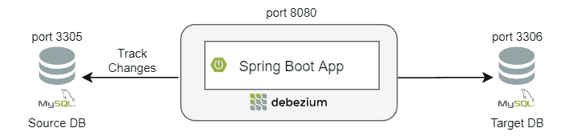

# Debezium 简介

> 原文：<https://web.archive.org/web/20220930061024/https://www.baeldung.com/debezium-intro>

## 1.介绍

今天的应用程序有时需要一个副本数据库、一个执行搜索操作的搜索索引、一个加速数据读取的缓存存储，以及一个用于复杂数据分析的数据仓库。

支持不同数据模型和数据访问模式的需求是大多数软件 web 开发人员需要解决的一个常见问题，这正是变更数据捕获(CDC)的用武之地！

在本文中，我们将从 CDC 的简要概述开始，我们将重点关注 **Debezium，一个常用于 CDC** 的平台。

## 2.什么是疾病控制中心？

在这一部分，我们将了解什么是 CDC，使用它的主要好处，以及一些常见的使用案例。

### 2.1.变更数据捕获

变更数据捕获(CDC)是一种技术，也是一种设计模式。我们经常用它在数据库之间实时复制数据。

我们还可以跟踪写入源数据库的数据更改，并自动同步目标数据库。 **CDC 支持增量加载，无需批量加载更新**。

### 2.2.CDC 的优势

如今，大多数公司仍然使用批处理来同步系统间的数据。使用批处理:

*   数据不会立即同步
*   更多分配的资源用于同步数据库
*   数据复制仅在指定的批处理期间发生

但是，变更数据捕获提供了一些优势:

*   不断跟踪源数据库中的变化
*   即时更新目标数据库
*   使用流处理来保证即时更改

有了 CDC，**个不同的数据库持续同步**，批量选择已经成为过去。此外，**传输数据的成本降低了**，因为 CDC 只传输增量更改。

### 2.3.常见的 CDC 使用案例

CDC 可以帮助我们解决各种用例，例如通过保持不同数据源同步进行数据复制、更新缓存或使缓存失效、更新搜索索引、微服务中的数据同步等等。

现在我们对 CDC 的功能有了一点了解，让我们看看它是如何在一个著名的开源工具中实现的。

## 3.Debezium 平台

在这一节中，我们将介绍 [Debezium](https://web.archive.org/web/20221225105857/https://debezium.io/) ，详细了解它的架构，并查看部署它的不同方式。

### 3.1.什么是 Debezium？

Debezium 是一个基于 Apache Kafka 的开源 CDC 平台。它的主要用途是**在事务日志中记录提交给每个源数据库**表的所有行级更改。侦听这些事件的每个应用程序都可以基于增量数据更改执行所需的操作。

Debezium 提供了一个连接器库，支持多种数据库，如 MySQL、MongoDB、PostgreSQL 等。

这些连接器可以监控和记录数据库的变化，并将它们发布到 Kafka 这样的流媒体服务上。

此外， **Debezium 即使在我们的应用程序宕机时也会进行监控**。重新启动后，它将从停止的地方开始使用事件，因此不会错过任何东西。

### 3.2.Debezium 建筑

部署 Debezium 取决于我们拥有的基础设施，但更常见的是，我们经常使用 Apache Kafka Connect。

Kafka Connect 是一个框架，与 Kafka broker 一起作为独立的服务运行。我们用它在 Apache Kafka 和其他系统之间传输数据。

我们还可以定义连接器来将数据传入和传出 Kafka。

下图显示了基于 Debezium 的变更数据捕获管道的不同部分:

[](/web/20221225105857/https://www.baeldung.com/wp-content/uploads/2021/04/simple-app-debezium-embedded-arch-1.png)

首先，在左侧，我们有一个 MySQL 源数据库，我们希望复制它的数据，并在 PostgreSQL 或任何分析数据库等目标数据库中使用。

其次， [Kafka Connect 连接器](/web/20221225105857/https://www.baeldung.com/kafka-connectors-guide)解析并解释事务日志，并将其写入 Kafka 主题。

接下来，Kafka 充当消息代理，将变更集可靠地传输到目标系统。

然后，在右边，我们有 Kafka 连接器轮询 Kafka 并将更改推送到目标数据库。

Debezium 在其架构中使用 Kafka，但它也提供其他部署方法来满足我们的基础设施需求。

我们可以将它作为一个独立的服务器与 Debezium 服务器一起使用，或者我们可以将它作为一个库嵌入到我们的应用程序代码中。

我们将在下面的章节中看到这些方法。

### 3.3.Debezium 服务器

**Debezium 提供了一个独立的服务器**来捕获源数据库的变化。它被配置为使用 Debezium 源连接器之一。

此外，这些连接器将变更事件发送到各种消息传递基础设施，如 Amazon Kinesis 或 Google Cloud Pub/Sub。

### 3.4.嵌入式 Debezium

Kafka Connect 在用于部署 Debezium 时提供了容错和可伸缩性。然而，有时我们的应用不需要这种级别的可靠性，我们希望最大限度地降低基础设施的成本。

谢天谢地，**我们可以通过在我们的应用程序**中嵌入 Debezium 引擎来做到这一点。完成此操作后，我们必须配置连接器。

## 4.设置

在这一节中，我们将首先从应用程序的架构开始。然后，我们将看到如何设置我们的环境，并遵循一些基本步骤来集成 Debezium。

让我们从介绍我们的应用程序开始。

### 4.1.示例应用程序的架构

为了使我们的应用程序简单，我们将为客户管理创建一个 Spring Boot 应用程序。

我们的客户模型有`ID`、`fullname,`和`email `字段。对于数据访问层，我们将使用 [Spring Data JPA](/web/20221225105857/https://www.baeldung.com/the-persistence-layer-with-spring-data-jpa) 。

最重要的是，我们的应用程序将运行 Debezium 的嵌入式版本。让我们想象一下这个应用程序架构:

[](/web/20221225105857/https://www.baeldung.com/wp-content/uploads/2021/04/simple-app-debezium-embedded-arch-1.png)

首先，Debezium 引擎将跟踪一个源 MySQL 数据库上的`customer`表的事务日志(来自另一个系统或应用程序)。

其次，每当我们在`customer`表上执行插入/更新/删除这样的数据库操作时，Debezium 连接器都会调用一个服务方法。

最后，基于这些事件，该方法将 c `ustomer`表的数据同步到目标 MySQL 数据库(我们应用程序的主数据库)。

### 4.2.Maven 依赖性

让我们首先将[所需的依赖项](https://web.archive.org/web/20221225105857/https://search.maven.org/classic/#search%7Cga%7C1%7Cg%3A%22io.debezium%22%20AND%20(a%3A%22debezium-api%22%20OR%20a%3A%22debezium-embedded%22))添加到我们的`pom.xml`中:

```java
<dependency>
    <groupId>io.debezium</groupId>
    <artifactId>debezium-api</artifactId>
    <version>1.4.2.Final</version>
</dependency>
<dependency>
    <groupId>io.debezium</groupId>
    <artifactId>debezium-embedded</artifactId>
    <version>1.4.2.Final</version>
</dependency>
```

同样，我们为我们的应用程序将使用的每个 Debezium 连接器添加依赖项。

在我们的例子中，我们将使用 [MySQL 连接器](https://web.archive.org/web/20221225105857/https://search.maven.org/classic/#search%7Cga%7C1%7Cg%3A%22io.debezium%22%20%20AND%20a%3A%22debezium-connector-mysql%22):

```java
<dependency>
    <groupId>io.debezium</groupId>
    <artifactId>debezium-connector-mysql</artifactId>
    <version>1.4.2.Final</version>
</dependency>
```

### 4.3.安装数据库

我们可以手动安装和配置我们的数据库。但是，为了加快速度，我们将使用一个 [`docker-compose`](/web/20221225105857/https://www.baeldung.com/docker-compose) 文件:

```java
version: "3.9"
services:
  # Install Source MySQL DB and setup the Customer database
  mysql-1:
    container_name: source-database
    image: mysql
    ports:
      - 3305:3306
    environment:
      MYSQL_ROOT_PASSWORD: root
      MYSQL_USER: user
      MYSQL_PASSWORD: password
      MYSQL_DATABASE: customerdb

  # Install Target MySQL DB and setup the Customer database
  mysql-2:
    container_name: target-database
    image: mysql
    ports:
      - 3306:3306
    environment:
      MYSQL_ROOT_PASSWORD: root
      MYSQL_USER: user
      MYSQL_PASSWORD: password
      MYSQL_DATABASE: customerdb
```

该文件将在不同的端口上运行两个数据库实例。

我们可以使用命令`docker-compose up -d`运行这个文件。

现在，让我们通过运行 SQL 脚本来创建 c `ustomer`表:

```java
CREATE TABLE customer
(
    id integer NOT NULL,
    fullname character varying(255),
    email character varying(255),
    CONSTRAINT customer_pkey PRIMARY KEY (id)
);
```

## 5.配置

在这一节中，我们将配置 Debezium MySQL 连接器，并了解如何运行嵌入式 Debezium 引擎。

### 5.1.配置 Debezium 连接器

为了配置我们的 Debezium MySQL 连接器，我们将创建一个 Debezium 配置 bean:

```java
@Bean
public io.debezium.config.Configuration customerConnector() {
    return io.debezium.config.Configuration.create()
        .with("name", "customer-mysql-connector")
        .with("connector.class", "io.debezium.connector.mysql.MySqlConnector")
        .with("offset.storage", "org.apache.kafka.connect.storage.FileOffsetBackingStore")
        .with("offset.storage.file.filename", "/tmp/offsets.dat")
        .with("offset.flush.interval.ms", "60000")
        .with("database.hostname", customerDbHost)
        .with("database.port", customerDbPort)
        .with("database.user", customerDbUsername)
        .with("database.password", customerDbPassword)
        .with("database.dbname", customerDbName)
        .with("database.include.list", customerDbName)
        .with("include.schema.changes", "false")
        .with("database.server.id", "10181")
        .with("database.server.name", "customer-mysql-db-server")
        .with("database.history", "io.debezium.relational.history.FileDatabaseHistory")
        .with("database.history.file.filename", "/tmp/dbhistory.dat")
        .build();
}
```

让我们更详细地检查一下这个配置。

这个 bean 的**中的`create`方法使用构建器创建一个`Properties`对象**。

这个构建器设置了引擎所需的几个[属性，而不考虑首选的连接器。为了跟踪源 MySQL 数据库，我们使用了类`MySqlConnector`。](https://web.archive.org/web/20221225105857/https://debezium.io/documentation/reference/1.4/development/engine.html#engine-properties)

当这个连接器运行时，它开始跟踪来自源的更改，并记录“偏移量”以确定它已经从事务日志处理了多少数据。

有几种方法可以保存这些偏移量，但是在这个例子中，我们将使用类`FileOffsetBackingStore`来存储本地文件系统上的偏移量。

连接器的最后几个参数是 MySQL 数据库属性。

现在我们有了一个配置，我们可以创建我们的引擎。

### 5.2.运行 Debezium 引擎

`DebeziumEngine`充当我们的 MySQL 连接器的包装器。让我们使用连接器配置创建引擎:

```java
private DebeziumEngine<RecordChangeEvent<SourceRecord>> debeziumEngine;

public DebeziumListener(Configuration customerConnectorConfiguration, CustomerService customerService) {

    this.debeziumEngine = DebeziumEngine.create(ChangeEventFormat.of(Connect.class))
      .using(customerConnectorConfiguration.asProperties())
      .notifying(this::handleEvent)
      .build();

    this.customerService = customerService;
}
```

除此之外，引擎将为每一次数据更改调用一个方法——在我们的例子中是`handleChangeEvent`。

在这个方法中，首先，**我们将在调用`create().`时基于指定的格式**解析每个事件

然后，我们找到我们的操作，并调用`CustomerService`在我们的目标数据库上执行创建/更新/删除功能:

```java
private void handleChangeEvent(RecordChangeEvent<SourceRecord> sourceRecordRecordChangeEvent) {
    SourceRecord sourceRecord = sourceRecordRecordChangeEvent.record();
    Struct sourceRecordChangeValue= (Struct) sourceRecord.value();

    if (sourceRecordChangeValue != null) {
        Operation operation = Operation.forCode((String) sourceRecordChangeValue.get(OPERATION));

        if(operation != Operation.READ) {
            String record = operation == Operation.DELETE ? BEFORE : AFTER;
            Struct struct = (Struct) sourceRecordChangeValue.get(record);
            Map<String, Object> payload = struct.schema().fields().stream()
              .map(Field::name)
              .filter(fieldName -> struct.get(fieldName) != null)
              .map(fieldName -> Pair.of(fieldName, struct.get(fieldName)))
              .collect(toMap(Pair::getKey, Pair::getValue));

            this.customerService.replicateData(payload, operation);
        }
    }
}
```

现在我们已经配置了一个`DebeziumEngine` 对象，让我们使用服务执行器异步启动它:

```java
private final Executor executor = Executors.newSingleThreadExecutor();

@PostConstruct
private void start() {
    this.executor.execute(debeziumEngine);
}

@PreDestroy
private void stop() throws IOException {
    if (this.debeziumEngine != null) {
        this.debeziumEngine.close();
    }
}
```

## 6.Debezium 在行动

为了查看我们的代码，让我们对源数据库的`customer`表进行一些数据更改。

### 6.1.插入记录

要向`customer`表添加新记录，我们将进入 MySQL shell 并运行:

```java
INSERT INTO customerdb.customer (id, fullname, email) VALUES (1, 'John Doe', '[[email protected]](/web/20221225105857/https://www.baeldung.com/cdn-cgi/l/email-protection)')
```

运行该查询后，我们将看到应用程序的相应输出:

```java
23:57:57.897 [pool-1-thread-1] INFO  c.b.l.d.listener.DebeziumListener - Key = 'Struct{id=1}' value = 'Struct{after=Struct{id=1,fullname=John Doe,[[email protected]](/web/20221225105857/https://www.baeldung.com/cdn-cgi/l/email-protection)},source=Struct{version=1.4.2.Final,connector=mysql,name=customer-mysql-db-server,ts_ms=1617746277000,db=customerdb,table=customer,server_id=1,file=binlog.000007,pos=703,row=0,thread=19},op=c,ts_ms=1617746277422}'
Hibernate: insert into customer (email, fullname, id) values (?, ?, ?)
23:57:58.095 [pool-1-thread-1] INFO  c.b.l.d.listener.DebeziumListener - Updated Data: {fullname=John Doe, id=1, [[email protected]](/web/20221225105857/https://www.baeldung.com/cdn-cgi/l/email-protection)} with Operation: CREATE
```

最后，我们检查目标数据库中是否插入了新记录:

```java
id  fullname   email
1  John Doe   [[email protected]](/web/20221225105857/https://www.baeldung.com/cdn-cgi/l/email-protection)
```

### 6.2.更新记录

现在，让我们尝试更新最后插入的客户，并检查发生了什么:

```java
UPDATE customerdb.customer t SET t.email = '[[email protected]](/web/20221225105857/https://www.baeldung.com/cdn-cgi/l/email-protection)' WHERE t.id = 1
```

之后，我们将获得与 insert 相同的输出，除了操作类型更改为“update ”,当然，Hibernate 使用的查询是一个“UPDATE”查询:

```java
00:08:57.893 [pool-1-thread-1] INFO  c.b.l.d.listener.DebeziumListener - Key = 'Struct{id=1}' value = 'Struct{before=Struct{id=1,fullname=John Doe,[[email protected]](/web/20221225105857/https://www.baeldung.com/cdn-cgi/l/email-protection)},after=Struct{id=1,fullname=John Doe,[[email protected]](/web/20221225105857/https://www.baeldung.com/cdn-cgi/l/email-protection)},source=Struct{version=1.4.2.Final,connector=mysql,name=customer-mysql-db-server,ts_ms=1617746937000,db=customerdb,table=customer,server_id=1,file=binlog.000007,pos=1040,row=0,thread=19},op=u,ts_ms=1617746937703}'
Hibernate: update customer set email=?, fullname=? where id=?
00:08:57.938 [pool-1-thread-1] INFO  c.b.l.d.listener.DebeziumListener - Updated Data: {fullname=John Doe, id=1, [[email protected]](/web/20221225105857/https://www.baeldung.com/cdn-cgi/l/email-protection)} with Operation: UPDATE
```

我们可以验证 John 的电子邮件在我们的目标数据库中已被更改:

```java
id  fullname   email
1  John Doe   [[email protected]](/web/20221225105857/https://www.baeldung.com/cdn-cgi/l/email-protection)
```

### 6.3.删除记录

现在，我们可以通过执行以下命令删除`customer`表中的一个条目:

```java
DELETE FROM customerdb.customer WHERE id = 1
```

同样，这里我们有一个操作和查询的变化:

```java
00:12:16.892 [pool-1-thread-1] INFO  c.b.l.d.listener.DebeziumListener - Key = 'Struct{id=1}' value = 'Struct{before=Struct{id=1,fullname=John Doe,[[email protected]](/web/20221225105857/https://www.baeldung.com/cdn-cgi/l/email-protection)},source=Struct{version=1.4.2.Final,connector=mysql,name=customer-mysql-db-server,ts_ms=1617747136000,db=customerdb,table=customer,server_id=1,file=binlog.000007,pos=1406,row=0,thread=19},op=d,ts_ms=1617747136640}'
Hibernate: delete from customer where id=?
00:12:16.951 [pool-1-thread-1] INFO  c.b.l.d.listener.DebeziumListener - Updated Data: {fullname=John Doe, id=1, [[email protected]](/web/20221225105857/https://www.baeldung.com/cdn-cgi/l/email-protection)} with Operation: DELETE
```

我们可以验证目标数据库中的数据是否已被删除:

```java
select * from customerdb.customer where id= 1
0 rows retrieved
```

## 7.结论

在本文中，我们看到了 CDC 的优势以及它可以解决的问题。我们还了解到，如果没有它，我们只能大量加载数据，这既耗时又费钱。

我们还看到了 Debezium，这是一个优秀的开源平台，可以帮助我们轻松解决 CDC 用例。

和往常一样，GitHub 上的[提供了这篇文章的完整源代码。](https://web.archive.org/web/20221225105857/https://github.com/eugenp/tutorials/tree/master/libraries-data-db)