# 调试 WebSockets

> 原文：<https://web.archive.org/web/20220930061024/https://www.baeldung.com/debug-websockets>

## 1.概观

一个 [WebSocket](https://web.archive.org/web/20220801150137/https://datatracker.ietf.org/doc/html/rfc6455) 在客户端和服务器之间提供了一个事件驱动的双向全双工连接。WebSocket 通信包括握手、消息传递(发送和接收消息)和关闭连接。

在本教程中，我们将学习使用[浏览器](https://web.archive.org/web/20220801150137/https://caniuse.com/?search=websocket)和其他流行工具调试 WebSockets。

## 2.构建 WebSocket

让我们从[构建一个 WebSocket](/web/20220801150137/https://www.baeldung.com/websockets-spring) 服务器开始，它将股票行情更新推送给客户端。

### 2.1.Maven 依赖性

首先，让我们声明一下 [Spring WebSocket](https://web.archive.org/web/20220801150137/https://search.maven.org/search?q=g:org.springframework.boot%20a:spring-boot-starter-websocket) 的依赖关系:

```
<dependency>
    <groupId>org.springframework.boot</groupId>
    <artifactId>spring-boot-starter-websocket</artifactId>
    <version>2.5.4</version>
</dependency>
```

### 2.2.Spring Boot 构型

接下来，让我们定义启用 WebSocket 支持所需的`@Configuration`:

```
@Configuration
@EnableWebSocketMessageBroker
public class WebsocketConfiguration implements WebSocketMessageBrokerConfigurer {
    @Override
    public void configureMessageBroker(MessageBrokerRegistry config) {
        config.enableSimpleBroker("/topic");
        config.setApplicationDestinationPrefixes("/app");
    }
    @Override
    public void registerStompEndpoints(StompEndpointRegistry registry) {
        registry.addEndpoint("/stock-ticks").withSockJS();
    }
}
```

**注意，这个配置提供了一个基于消息代理的 WebSocket 并注册了 STOMP 端点。**

此外，让我们创建一个向订阅者发送模拟股票更新的控制器:

```
private SimpMessagingTemplate simpMessagingTemplate;

public void sendTicks() { 
    simpMessagingTemplate.convertAndSend("/topic/ticks", getStockTicks());
}
```

### 2.3.客户端——用户界面

让我们构建一个显示来自服务器的更新的 [HTML5](https://web.archive.org/web/20220801150137/https://html.spec.whatwg.org/) 页面:

```
<div class="spinner-border text-primary" role="status">
    <span class="visually-hidden">Loading ...</span>
</div> 
```

接下来，让我们使用 [SockJS](https://web.archive.org/web/20220801150137/https://github.com/sockjs/sockjs-client) 连接到 WebSocket 服务器:

```
function connect() {
    let socket = new SockJS('/stock-ticks');
    stompClient = Stomp.over(socket);
    stompClient.connect({}, function (frame) {
        stompClient.subscribe('/topic/ticks', function (ticks) {
            ...
        });
    });
}
```

**在这里，我们使用 SockJS 打开一个 WebSocket，然后订阅主题** `**/topic/ticks**.`最后，当服务器产生消息时，客户端消费并在用户界面上显示消息。

### 2.4.示范

让我们启动服务器并在浏览器中打开应用程序:

```
mvn spring-boot:run
```

因此，我们看到股票价格每三秒钟变化一次，无需页面刷新或服务器轮询:

<https://web.archive.org/web/20220801150137im_/https://www.baeldung.com/wp-content/uploads/2021/11/Websocket-2.mp4?_=1>

到目前为止，我们已经构建了一个在 WebSocket 上接收股票报价的应用程序。接下来，让我们学习如何调试这个应用程序。

## 3.Mozilla Firefox

**[Mozilla Firefox](https://web.archive.org/web/20220801150137/https://www.mozilla.org/en-US/firefox/new/) 有一个 WebSocket inspector 以及其他 web 开发工具**。在 Firefox 中，我们可以通过几种方式启用开发人员工具:

*   **Windows 和 Linux:** `Ctrl` + `Shift` + `I`或`F12` 或`Application Menu` → `More Tools` → `Web Developer Tools`
*   **macOS:** `Cmd` + `Opt` + `I`

接下来，点击`Network Monitor →` `WS`打开 WebSockets 面板:

[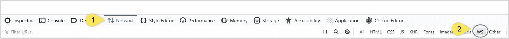](/web/20220801150137/https://www.baeldung.com/wp-content/uploads/2021/11/firefox1-2.jpg)

在 WebSocket inspector 处于活动状态的情况下，让我们进一步探索它。

### 3.1.握手

在 Firefox 中打开网址`http://localhost:8080` 。随着开发者工具的打开，我们现在看到了一个 HTTP 握手。点击请求分析握手:

[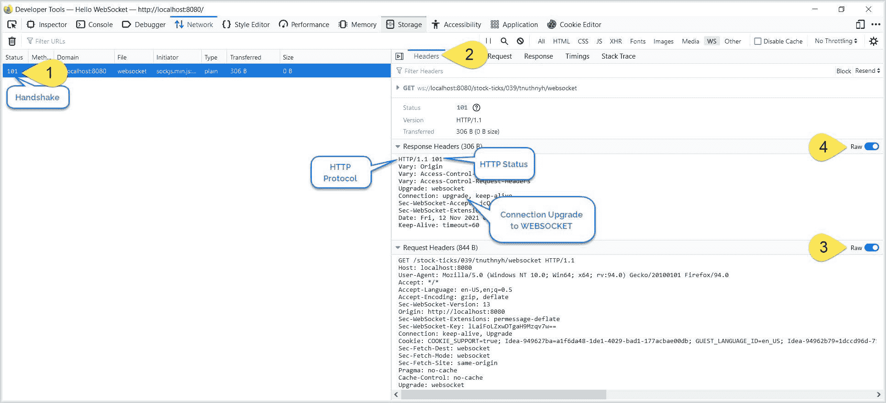](/web/20220801150137/https://www.baeldung.com/wp-content/uploads/2021/11/firefox2-1.jpg)

在`Headers` 选项卡下，我们看到带有协议升级的请求和响应头以及其他 WebSocket 头。

### 3.2.信息交换

随后，**握手结束后，消息交换开始**。点击`Response `选项卡查看消息交换:

[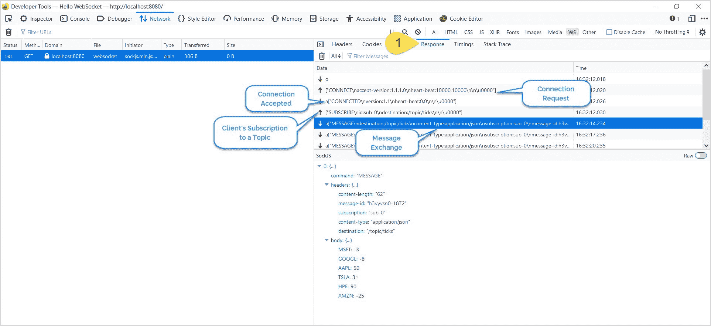](/web/20220801150137/https://www.baeldung.com/wp-content/uploads/2021/11/firefox3-2.jpg)

在`Response`窗格中，一个 [](/web/20220801150137/https://www.baeldung.com/wp-content/uploads/2021/11/uparrow-1.jpg) 表示客户端请求，一个 [](/web/20220801150137/https://www.baeldung.com/wp-content/uploads/2021/11/arrow-1.jpg) [](/web/20220801150137/https://www.baeldung.com/wp-content/uploads/2021/11/arrow.jpg) 表示服务器响应。

### 3.3.连接终止

在 WebSockets 中，客户端或服务器都可以关闭连接。

首先，让我们模拟客户端连接终止。点击 HTML 页面上的`Disconnect` 按钮，查看`Response`选项卡:

[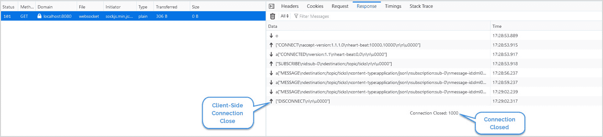](/web/20220801150137/https://www.baeldung.com/wp-content/uploads/2021/11/firefox4-1.jpg)

这里，我们将看到来自客户端的连接终止请求。

接下来，让我们关闭服务器来模拟服务器端连接关闭。由于无法访问服务器，连接关闭:

[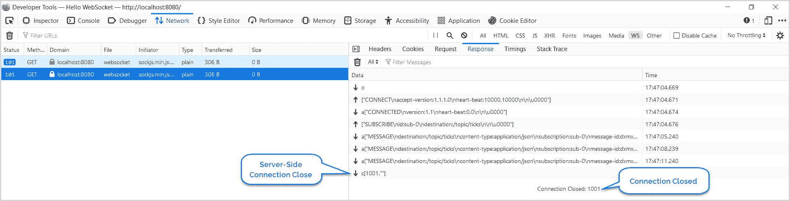](/web/20220801150137/https://www.baeldung.com/wp-content/uploads/2021/11/firefox5-1.jpg)

**[RFC 6455–web socket 协议](https://web.archive.org/web/20220801150137/https://datatracker.ietf.org/doc/html/rfc6455#section-7.4)规定:**

*   **`1000`–正常关闭**
*   **`1001`–服务器关闭，或者用户已经离开页面**

## 4.谷歌浏览器

**[谷歌 Chrome](https://web.archive.org/web/20220801150137/https://www.google.com/intl/en_in/chrome/)** 有一个 WebSocket inspector，是开发者工具的一部分，也就是类似于 Firefox。我们可以通过几种方式激活 WebSocket inspector:

*   **Windows 和 Linux:** `Ctrl` + `Shift` + `I`或`Ctrl` + `Shift` + `J` 或`F12` 或`Application Menu` → `More Tools` → `Developer Tools`
*   **macOS:** `Cmd` + `Opt` + `I`

接下来，点击`Network →` `WS`面板打开 WebSocket 面板:

[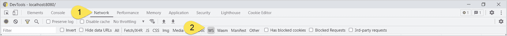](/web/20220801150137/https://www.baeldung.com/wp-content/uploads/2021/11/chrome1-6.jpg)

### 4.1.握手

现在，在 Chrome 中打开 URL `http://localhost:8080` ，在开发者工具中点击请求:

[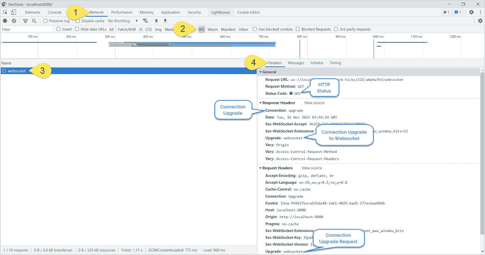](/web/20220801150137/https://www.baeldung.com/wp-content/uploads/2021/11/chrome1.5.jpg)

在`Headers` 选项卡下，我们注意到所有的 WebSocket 头，包括握手。

### 4.2.信息交换

接下来，让我们检查客户机和服务器之间的消息交换。在开发者工具上，点击 `Messages` 选项卡:

[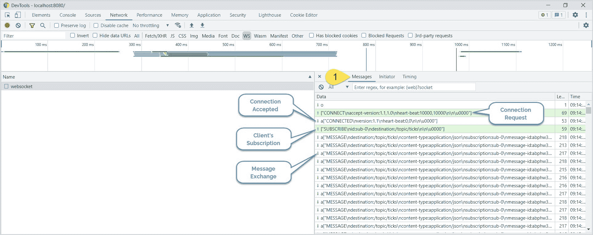](/web/20220801150137/https://www.baeldung.com/wp-content/uploads/2021/11/chrome2-2.jpg)

像在 Firefox 中一样，我们可以查看消息交换，包括`CONNECT` 请求、`SUBSCRIBE` 请求和`MESSAGE` 交换。

### 4.3.连接终止

最后，我们将调试客户端和服务器端的连接终止。但是，首先，让我们关闭客户端连接:

[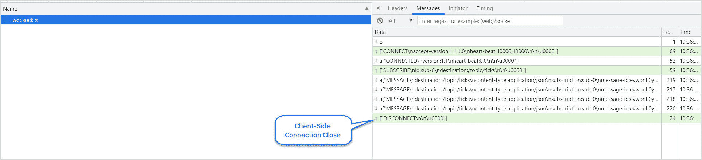](/web/20220801150137/https://www.baeldung.com/wp-content/uploads/2021/11/chrome3-1.jpg)

我们可以看到客户端和服务器之间的连接被优雅地终止。接下来，让我们模拟一个终止连接的服务器:

[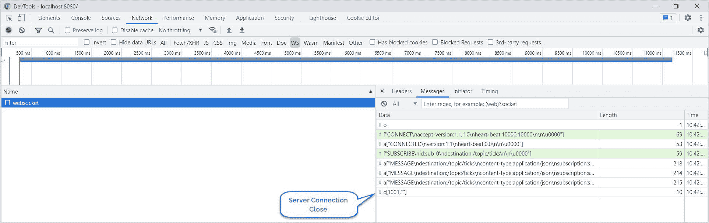](/web/20220801150137/https://www.baeldung.com/wp-content/uploads/2021/11/chrome4-2.jpg)

成功的连接终止结束了客户端和服务器之间的消息交换。

## 5.Wireshark

Wireshark 是最流行、最广泛、使用最广泛的网络协议嗅探工具。接下来，让我们看看如何使用 Wireshark 来嗅探和分析 WebSocket 流量。

### 5.1.捕捉流量

与其他工具不同，我们必须为 Wireshark 捕获流量，然后进行分析。所以，让我们从获取流量开始。

在 Windows 中，当我们打开 Wireshark 时，它会显示所有可用的网络接口以及实时网络流量。因此，选择正确的网络接口来捕获网络数据包至关重要。

**通常，如果 WebSocket 服务器作为`localhost (127.0.0.1)`** 运行，则网络接口将是环回适配器:

[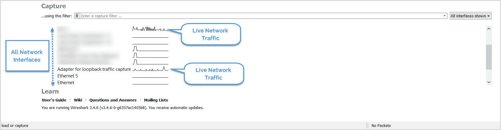](/web/20220801150137/https://www.baeldung.com/wp-content/uploads/2021/11/wireshark1.jpg)

接下来，要开始捕获数据包，请双击接口。一旦选择了正确的接口，我们就可以根据协议进一步过滤数据包。

**在 Linux** **中，使用 [`tcpdump`](/web/20220801150137/https://www.baeldung.com/linux/sniffing-packet-tcpdump) 命令捕获网络流量**。例如，打开一个 shell 终端，使用此命令生成一个数据包捕获文件，`websocket.pcap`:

```
tcpdump -w websocket.pcap -s 2500 -vv -i lo
```

然后，使用 Wireshark 打开`websocket.pcap` 文件。

### 5.2.握手

我们来试着分析一下目前捕获的网络数据包。**首先，由于初始握手是基于 HTTP 协议的，所以让我们根据`http` 协议**过滤数据包:

[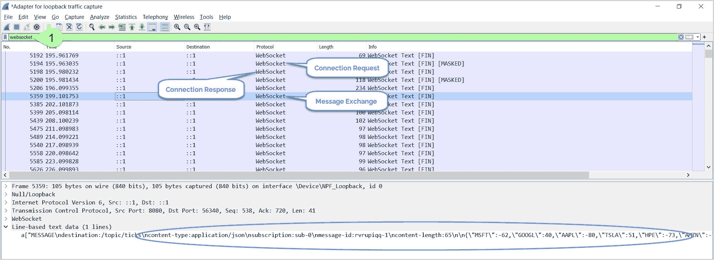](/web/20220801150137/https://www.baeldung.com/wp-content/uploads/2021/11/wireshark5-1.jpg)

接下来，要获得握手的详细视图，右键单击数据包→ `Follow` → `TCP Stream`:

[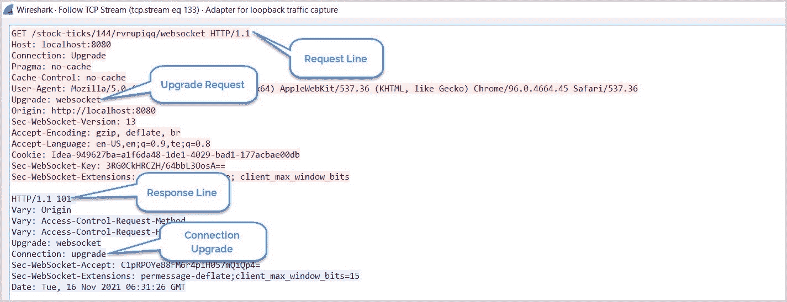](/web/20220801150137/https://www.baeldung.com/wp-content/uploads/2021/11/wireshark4.jpg)

### 5.3.信息交换

回想一下，在初始握手之后，客户机和服务器通过`websocket` 协议进行通信。所以，让我们为`websocket`过滤数据包。显示的其余数据包揭示了连接和消息交换:

[](/web/20220801150137/https://www.baeldung.com/wp-content/uploads/2021/11/wireshark5-1.jpg)

### 5.4.连接终止

首先，让我们调试客户端连接终止。启动 Wireshark 捕获，单击 HTML 页面上的`Disconnect` 按钮，检查网络数据包:

[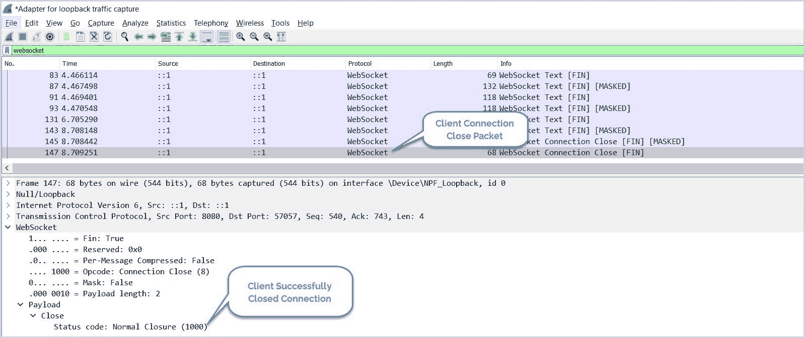](/web/20220801150137/https://www.baeldung.com/wp-content/uploads/2021/11/wireshark6.jpg)

类似地，让我们模拟服务器端连接终止。首先，启动数据包捕获，然后关闭 WebSocket 服务器:

[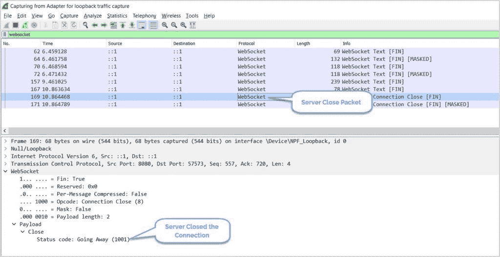](/web/20220801150137/https://www.baeldung.com/wp-content/uploads/2021/11/wireshark7.jpg)

## 6.邮递员

**截至目前，[邮递员](https://web.archive.org/web/20220801150137/https://www.postman.com/)对 WebSockets 的支持仍处于测试阶段**。然而，我们仍然可以使用它来调试我们的 WebSockets:

打开邮递员，按下`Ctrl + N` 或`New` → `WebSocket Request` :

[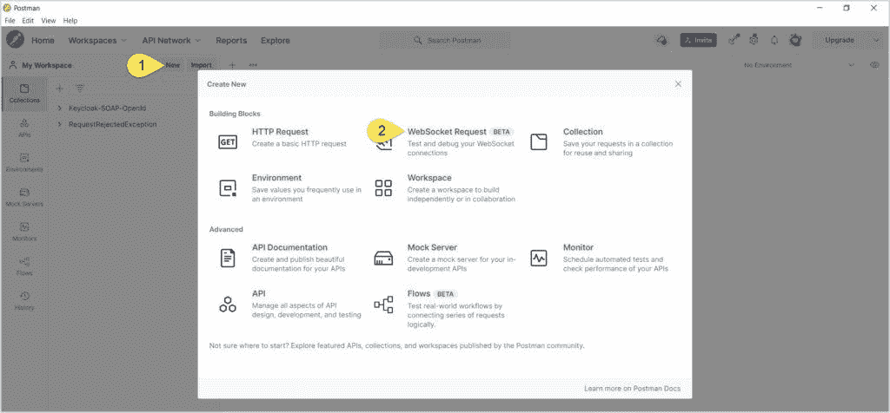](/web/20220801150137/https://www.baeldung.com/wp-content/uploads/2021/11/postman1.jpg)

接下来，在`Enter Server URL` 文本框中，输入 WebSocket URL 并点击`Connect`:

[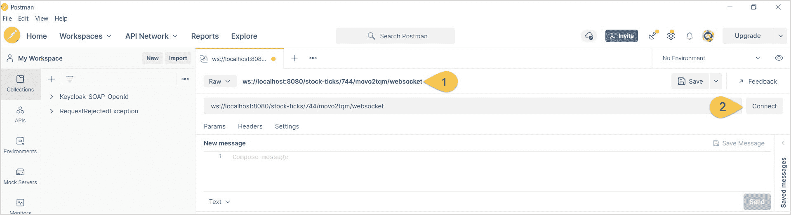](/web/20220801150137/https://www.baeldung.com/wp-content/uploads/2021/11/postman2-2.jpg)

### 6.1.握手

一旦连接成功，在`Messages` 部分，点击连接请求查看握手详情:

[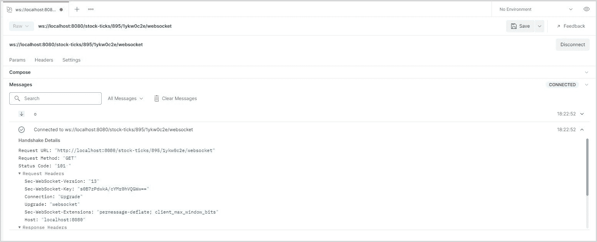](/web/20220801150137/https://www.baeldung.com/wp-content/uploads/2021/11/postman3-1.jpg)

### 6.2.信息交换

现在，让我们检查客户端和服务器之间的消息交换:

[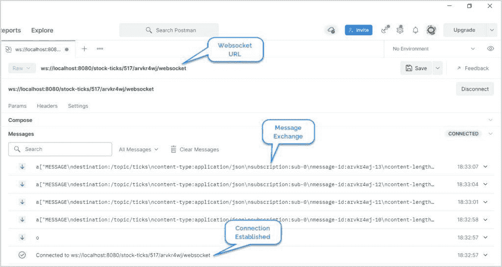](/web/20220801150137/https://www.baeldung.com/wp-content/uploads/2021/11/postman4.jpg)

一旦客户机订阅了主题，我们就可以看到客户机和服务器之间的消息流。

### 6.3.连接终止

此外，让我们看看如何调试客户端和服务器的连接终止。首先，点击 Postman 中的`Disconnect` 按钮，关闭客户端的连接:

[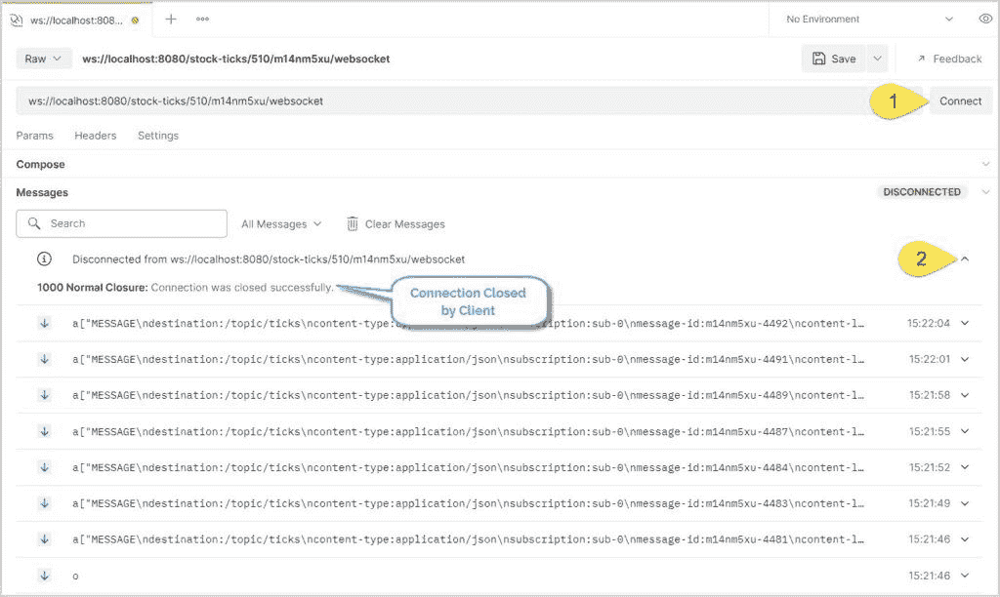](/web/20220801150137/https://www.baeldung.com/wp-content/uploads/2021/11/postman5-1.jpg)

同样，要检查服务器连接的终止，请关闭服务器:

[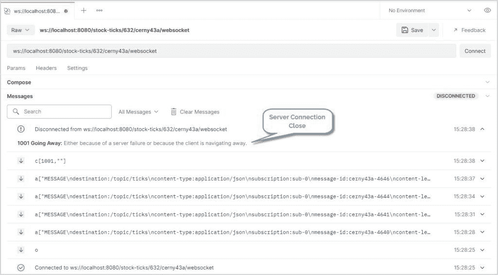](/web/20220801150137/https://www.baeldung.com/wp-content/uploads/2021/11/postman6.jpg)

### 7.Spring WebSocket 客户端

最后，**让我们使用一个[基于 Spring 的 Java 客户端](/web/20220801150137/https://www.baeldung.com/websockets-api-java-spring-client)** 来调试 WebSockets:

```
WebSocketClient client = new StandardWebSocketClient();
WebSocketStompClient stompClient = new WebSocketStompClient(client);
stompClient.setMessageConverter(new MappingJackson2MessageConverter());
StompSessionHandler sessionHandler = new StompClientSessionHandler();
stompClient.connect(URL, sessionHandler);
```

这将创建一个 WebSocket 客户端，然后注册一个 STOMP 客户端会话处理程序。

接下来，**让我们定义一个扩展了 [`StompSessionHandlerAdapter`](https://web.archive.org/web/20220801150137/https://docs.spring.io/spring-framework/docs/current/javadoc-api/org/springframework/messaging/simp/stomp/StompSessionHandlerAdapter.html)** 的处理程序。有意地，`StompSessionHandlerAdapter`类不提供除了方法`getPayloadType`之外的实现。因此，让我们给这些方法一个有意义的实现:

```
public class StompClientSessionHandler extends StompSessionHandlerAdapter {

    @Override
    public void afterConnected(StompSession session, StompHeaders connectedHeaders) {
        session.subscribe("/topic/ticks", this);
    }

    // other methods ...
}
```

接下来，当我们运行这个客户端时，我们会得到类似如下的日志:

```
16:35:49.135 [WebSocketClient-AsyncIO-8] INFO StompClientSessionHandler - Subscribed to topic: /topic/ticks
16:35:50.291 [WebSocketClient-AsyncIO-8] INFO StompClientSessionHandler - Payload -> {MSFT=17, GOOGL=48, AAPL=54, TSLA=73, HPE=89, AMZN=-5} 
```

在日志中，我们可以看到连接和消息交换。此外，**当客户端启动并运行时，我们可以使用 Wireshark 来嗅探 WebSocket 数据包**:

[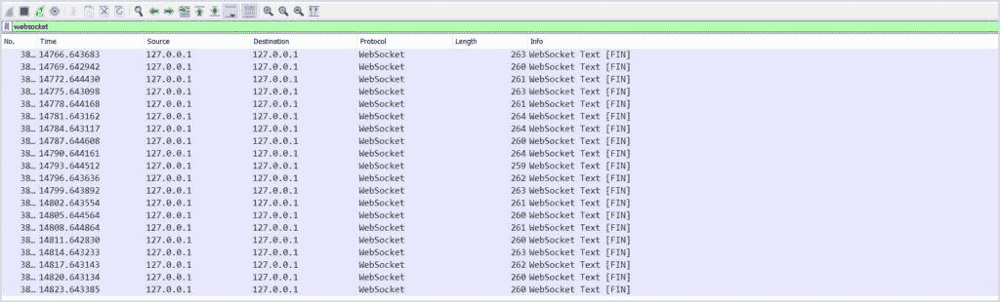](/web/20220801150137/https://www.baeldung.com/wp-content/uploads/2021/11/java1.jpg)

## 8.结论

在本教程中，我们学习了如何使用一些最流行和广泛使用的工具来调试 WebSockets。随着 WebSockets 的使用和流行程度与日俱增，我们可以预期调试工具的数量会增加，并且变得更加先进。

和往常一样，完整的源代码可以在 GitHub 上找到[。](https://web.archive.org/web/20220801150137/https://github.com/eugenp/tutorials/tree/master/spring-websockets)