# 分布式系统中的可观测性

> 原文：<https://web.archive.org/web/20220930061024/https://www.baeldung.com/distributed-systems-observability>

## 1.介绍

在本教程中，我们将讨论可观测性以及为什么它在分布式系统中起着重要作用。我们将讨论构成可观察性的数据类型。这将有助于我们理解从分布式系统收集、存储和分析遥测数据的挑战。

最后，我们将介绍可观察性领域的一些行业标准和流行工具。

## 2.什么是可观测性？

让我们切入正题，首先给出正式的定义！可观察性是仅通过外部输出来测量系统内部状态的能力。

对于微服务这样的[分布式系统](/web/20220526050747/https://www.baeldung.com/cs/distributed-system-vs-distributed-computing)来说，这些外部输出基本上就是所谓的遥测数据。它包括机器的资源消耗、机器上运行的应用程序生成的日志等信息。

### 2.1.遥测数据的类型

我们可以将遥测数据组织成三个类别，我们称之为**可观测性的三个支柱:**日志、度量和轨迹。让我们更详细地了解它们。

**日志是应用程序在代码执行期间在离散点**生成的文本行。通常，这些是结构化的，并且通常以不同的严重程度生成。这些很容易生成，但通常会带来性能成本。此外，我们可能需要像 Logstash 这样的附加工具来有效地收集、存储和分析日志。

简而言之，**指标是我们在一段时间内计算或聚合**的计数或度量值。这些值表达了关于像虚拟机这样的系统的一些数据，例如，虚拟机每秒的内存消耗。这些可能来自各种来源，如主机、应用程序和云平台。

对于单个请求可以流经多个应用程序的分布式系统，跟踪非常重要。当请求流过分布式系统时，跟踪是分布式事件的表示。这对于定位分布式系统中的瓶颈、缺陷或其他问题非常有帮助。

### 2.2.可观察性的好处

首先，我们需要理解为什么我们需要系统的可观测性。我们大多数人可能都面临着在生产系统中排除难以理解的行为的挑战。不难理解，我们中断生产环境的选择是有限的。这让我们不得不分析系统生成的数据。

对于调查系统开始偏离其预期状态的情况来说，可观察性**是非常宝贵的。完全防止这些情况也是相当有用的！根据系统生成的可观察数据仔细设置警报可以帮助我们在系统完全崩溃之前采取补救措施。此外，这些数据为我们提供了重要的分析见解，以调整系统来获得更好的体验。**

对可观测性的需求，虽然对任何系统都很重要，但对分布式系统来说更是如此。此外，我们的系统可以跨越公共云和私有云以及内部环境。此外，它的规模和复杂性随着时间不断变化。这经常会出现以前从未预料到的问题。一个高度可观察的系统可以极大地帮助我们处理这种情况。

## 3.可观察性与监控

在 DevOps 的实践中，我们经常听到与可观察性相关的监控。那么，这两个术语有什么区别呢？嗯，它们都有相似的功能，使我们能够保持系统的可靠性。但是它们有细微的区别，事实上，它们之间有联系。我们只能有效地监控一个系统，如果它是可观察的！

监控基本上是指**通过一组预定义的指标和日志来观察系统状态的实践**。这本质上意味着我们在观察一组已知的故障。然而，在一个分布式系统中，有许多动态变化不断发生。这导致了我们从未想过的问题。因此，我们的监测系统可能会错过他们。

另一方面，可观察性有助于我们理解系统的内部状态。这可以让我们提出关于系统行为的任意问题。例如，我们可以问一些复杂的问题，比如在出现问题时每个服务是如何处理请求的。随着时间的推移，它可以帮助建立关于系统动态行为的知识。

为了理解为什么会这样，我们需要理解基数的概念。**基数是指集合中唯一项目的数量**。例如，用户的社会安全号码集将具有比性别更高的基数。为了回答关于系统行为的任意问题，我们需要高基数数据。然而，监视通常只处理低基数数据。

## 4.分布式系统中的可观测性

正如我们前面看到的，可观察性对于复杂的分布式系统特别有用。但是，究竟是什么使得分布式系统变得复杂，在这样的系统中，可观测性的挑战是什么？理解这个问题对于理解过去几年中围绕这个主题发展起来的工具和平台的生态系统是很重要的。

在分布式系统中，**有许多移动的组件动态地改变着系统的面貌**。此外，动态可伸缩性意味着在任何时间点都会有不确定数量的实例为一个服务运行。这使得收集、管理和存储系统输出(如日志和指标)的工作变得困难:

[](/web/20220526050747/https://www.baeldung.com/wp-content/uploads/2021/06/Observability-Typical-Architecture.jpg)

此外，仅仅理解系统应用程序中发生的事情是不够的。例如，问题可能出在网络层或负载平衡器上。然后是数据库、消息平台，这样的例子不胜枚举。所有这些组件在任何时候都是可见的，这一点很重要。我们必须能够从系统的所有部分收集和集中有意义的数据。

此外，由于几个组件在一起工作，无论是同步还是异步，要查明异常的来源并不容易。例如，很难说系统中的哪个服务导致瓶颈随着性能下降而升级。正如我们以前看到的，痕迹在研究这类问题时非常有用。

## 5.可观测性的演变

可观察性源于**控制理论，这是应用数学的一个分支，研究如何利用反馈来影响系统的行为，以实现预期目标**。我们可以将这一原则应用于几个行业，从工厂到飞机操作。对于软件系统来说，自从像 [Twitter 这样的社交网站开始大规模运作以来，这已经变得很流行了。](https://web.archive.org/web/20220526050747/https://blog.twitter.com/engineering/en_us/a/2013/observability-at-twitter.html)

直到最近几年，大多数软件系统都是单一的，这使得在发生事故时对它们进行推理变得相当容易。监控在指示典型故障场景方面非常有效。此外，调试代码以识别问题是很直观的。但是，随着微服务架构和云计算的出现，这很快成为一项艰巨的任务。

随着这种演变的继续，软件系统不再是静态的——它们有许多动态变化的组件。这导致了以前从未预料到的问题。这**催生了应用性能管理(APM)** 旗下的许多工具，如 [AppDynamics](https://web.archive.org/web/20220526050747/https://www.appdynamics.com/) 和 [Dynatrace](https://web.archive.org/web/20220526050747/https://www.dynatrace.com/) 。这些工具为理解应用程序代码和系统行为提供了更好的方法。

尽管这些工具在发展中已经走过了漫长的道路，但它们在当时还是相当基于度量的。这使得他们无法提供我们所需要的关于系统状态的观点。然而，它们是向前迈出的一大步。今天，我们已经有了一个工具组合来解决可观察性的三个支柱。当然，底层组件也需要是可观察的！

## 6.具有可观察性的实践

现在我们已经讨论了足够多的关于可观测性的理论，让我们看看如何将它付诸实践。我们将使用一个简单的基于微服务的分布式系统，在这个系统中，我们将使用 Java 中的 [Spring Boot 来开发单独的服务。这些服务将使用 REST APIs 彼此同步通信。](/web/20220526050747/https://www.baeldung.com/spring-boot)

让我们看看我们的系统服务:

[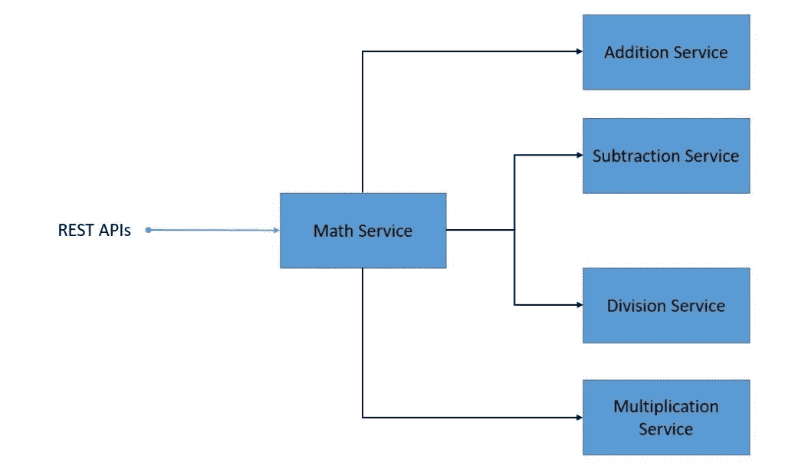](/web/20220526050747/https://www.baeldung.com/wp-content/uploads/2021/06/Observability-Distributed-System-1.jpg)

这是一个相当简单的分布式系统，其中`math-service`使用由`addition-service`、`multiplication-service`和其他人提供的 API。此外，`math-service`公开了计算各种公式的 API。我们将跳过创建这些微服务的细节，因为这非常简单。

这个练习的重点是在可观察性的背景下，识别当前可用的最常见的标准和流行的工具。我们对于这个具有可观测性的系统的目标架构看起来将类似于下图:

[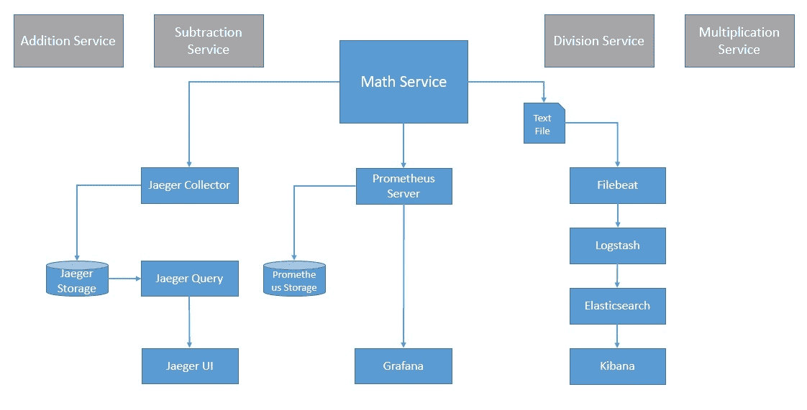](/web/20220526050747/https://www.baeldung.com/wp-content/uploads/2021/06/Observability-Target-Architecture.jpg)

其中许多还处于不同的认可阶段，得到了促进容器技术进步的组织[云本地计算基金会(CNCF)](https://web.archive.org/web/20220526050747/https://www.cncf.io/) 的认可。我们将看到如何在我们的分布式系统中使用其中的一些。

## 7.使用 OpenTracing 进行跟踪

我们已经看到了跟踪如何为理解单个请求如何在分布式系统中传播提供宝贵的见解。OpenTracing 是 CNCF 旗下的一个孵化项目。它为分布式跟踪提供了**供应商中立的 API 和工具**。这有助于我们向代码中添加不特定于任何供应商的工具。

符合 OpenTracing 的可用跟踪器列表正在快速增长。最受欢迎的追踪器之一是 Jaeger，这也是 CNCF 的毕业项目。

让我们看看如何在应用程序中使用 Jaeger 和 OpenTracing:

[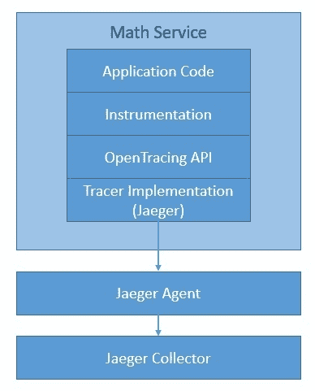](/web/20220526050747/https://www.baeldung.com/wp-content/uploads/2021/06/Observability-With-OpenTracing.jpg)

我们稍后再讨论细节。注意，还有其他几个选项，如 [LightStep](https://web.archive.org/web/20220526050747/https://lightstep.com/observability/) 、 [Instana](https://web.archive.org/web/20220526050747/https://www.instana.com/) 、 [SkyWalking](https://web.archive.org/web/20220526050747/https://skywalking.apache.org/) 和 [Datadog](https://web.archive.org/web/20220526050747/https://www.datadoghq.com/) 。我们可以轻松地在这些跟踪器之间切换，而无需改变我们在代码中添加检测的方式。

### 7.1.概念和术语

OpenTracing 中的跟踪由跨度组成。一个**跨度是在一个分布式系统**中完成的一个单独的工作单元。基本上，一个轨迹可以被看作是一个有向无环图(DAG)。我们称跨度之间的边为参考。分布式系统中的每个组件都会增加跟踪的跨度。跨度包含对其他跨度的引用，这有助于跟踪重新创建请求的生命周期。

我们可以用时间轴或图形来显示轨迹跨度之间的因果关系:

[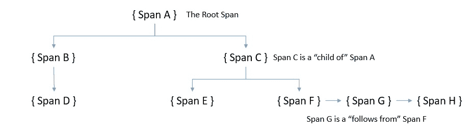](/web/20220526050747/https://www.baeldung.com/wp-content/uploads/2021/06/OpenTracing-Trace.jpg)

这里我们可以看到【OpenTracing 定义的两类引用，“ChildOf”和“FollowsFrom”。这些建立了子跨度和父跨度之间的关系。

OpenTracing 规范定义了 span 捕获的状态:

*   行动名称
*   开始时间戳和结束时间戳
*   一组键值范围标记
*   一组键值范围日志
*   soap 上下文

**标签允许用户定义的注释成为我们用来查询和过滤跟踪数据的 span** 的一部分。跨度标签适用于整个跨度。类似地，日志允许 span 从应用程序中捕获日志消息和其他调试或信息输出。范围日志可以应用于范围内的特定时刻或事件。

最后， **SpanContext 是将跨度联系在一起的东西**。它跨越流程边界传送数据。让我们快速浏览一下典型的 SpanContext:

[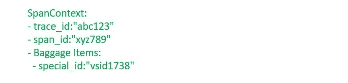](/web/20220526050747/https://www.baeldung.com/wp-content/uploads/2021/06/OpenTracing-SpanContext.jpg) 
我们可以看到，它主要由:

*   依赖于实现的状态，如`spanId`和`traceId`
*   任何行李项，它们是跨越流程边界的键值对

### 7.2.设置和仪表

我们将从安装 [Jaeger](https://web.archive.org/web/20220526050747/https://www.jaegertracing.io/) 开始，这是我们将使用的 OpenTracing 兼容追踪器。虽然它有几个组件，但我们可以用一个简单的 Docker 命令安装它们:

```java
docker run -d -p 5775:5775/udp -p 16686:16686 jaegertracing/all-in-one:latest
```

接下来，我们需要在应用程序中导入必要的依赖项。对于基于 Maven 的应用程序，这就像[添加依赖关系](https://web.archive.org/web/20220526050747/https://search.maven.org/artifact/io.opentracing.contrib/opentracing-spring-jaeger-web-starter/3.3.1/jar)一样简单:

```java
<dependency>
    <groupId>io.opentracing.contrib</groupId>
    <artifactId>opentracing-spring-jaeger-web-starter</artifactId>
    <version>3.3.1</version>
</dependency>
```

对于基于 Spring Boot 的应用程序，我们可以利用第三方提供的这个库。这包括所有必要的依赖项，并提供必要的默认配置，以检测 web 请求/响应并向 Jaeger 发送跟踪信息。

在应用程序方面，我们需要创建一个`Tracer`:

```java
@Bean
public Tracer getTracer() {
    Configuration.SamplerConfiguration samplerConfig = Configuration
      .SamplerConfiguration.fromEnv()
      .withType("const").withParam(1);
    Configuration.ReporterConfiguration reporterConfig = Configuration
      .ReporterConfiguration.fromEnv()
      .withLogSpans(true);
    Configuration config = new Configuration("math-service")
      .withSampler(samplerConfig)
      .withReporter(reporterConfig);
    return config.getTracer();
}
```

这足以为请求所经过的服务生成跨度。如有必要，我们还可以在服务中生成子跨度:

```java
Span span = tracer.buildSpan("my-span").start();
// Some code for which which the span needs to be reported
span.finish();
```

这是非常简单和直观的，但是当我们为一个复杂的分布式系统分析它们时，这是非常强大的。

### 7.3.痕迹分析

**Jaeger 配备了一个用户界面**，默认情况下可通过端口 16686 访问。它提供了一种简单的方法来查询、过滤和分析可视化的跟踪数据。让我们来看一个分布式系统的样本跟踪:

[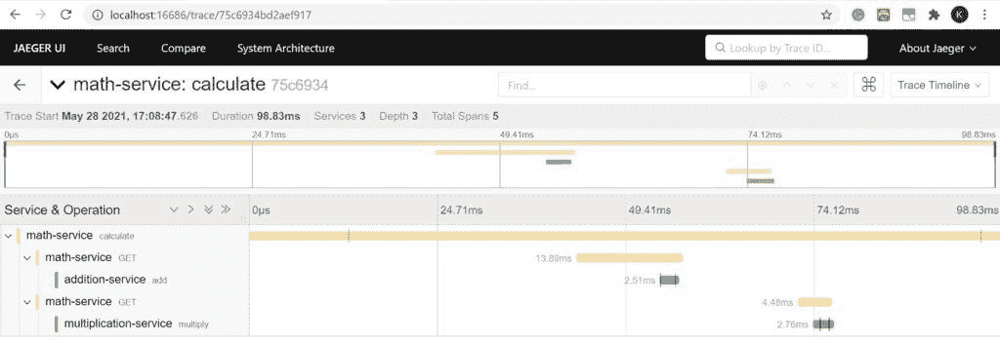](/web/20220526050747/https://www.baeldung.com/wp-content/uploads/2021/06/Jaeger-Tracing-UI.jpg)

正如我们所看到的，这是一个由`traceId.`标识的特定跟踪的可视化，它清楚地显示了该跟踪内的所有跨度，以及它属于哪个服务和完成它所花费的时间等细节。这可以帮助我们理解在非典型行为的情况下问题可能出在哪里。

## 8.OpenCensus 的指标

OpenCensus 为各种语言提供了**库，允许我们从应用程序中收集指标和分布式跟踪**。它起源于 Google，但从那时起，它就被一个不断壮大的社区发展成了一个开源项目。OpenCensus 的好处是它可以将数据发送到任何后端进行分析。这允许我们抽象我们的检测代码，而不是把它耦合到特定的后端。

尽管 OpenCensus 可以支持跟踪和度量，但我们将在示例应用程序中仅将其用于度量。有**几个后端我们可以用**。最流行的度量工具之一是 [Prometheus](https://web.archive.org/web/20220526050747/https://prometheus.io/) ，这是一个开源监控解决方案，也是 CNCF 的毕业项目。让我们看看 Jaeger 与 OpenCensus 如何集成到我们的应用程序中:

[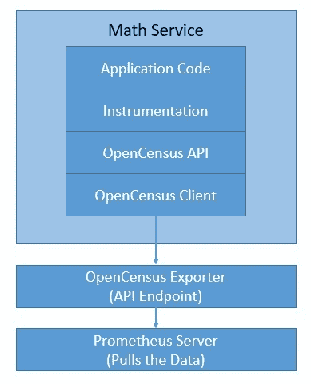](/web/20220526050747/https://www.baeldung.com/wp-content/uploads/2021/06/Observability-With-OpenCensus.jpg)

虽然 Prometheus 自带用户界面，但我们可以使用像 Grafana 这样的可视化工具，它可以很好地与 Prometheus 集成。

### 8.1.概念和术语

在 OpenCensus 中，**度量代表要记录的度量类型**。例如，请求负载的大小可以是要收集的一个度量。**测量是通过测量**记录一个量后产生的数据点。例如，80 kb 可以是请求有效负载大小的度量值。所有度量都由名称、描述和单位来标识。

为了分析统计数据，我们需要用视图聚集数据。**视图基本上是应用于度量**和可选标签的聚合的耦合。OpenCensus 支持计数、分布、总和以及最后值等聚合方法。视图由名称、描述、度量、标记键和聚合组成。多个视图可以对不同的聚合使用相同的度量。

**标签是与记录的测量值相关联的数据的键值对**，用于提供上下文信息，并在分析过程中区分和分组指标。当我们聚集度量来创建度量时，我们可以使用标记作为标签来分解度量。在分布式系统中，标签也可以作为请求头进行传播。

最后，**导出器可以将指标发送到任何能够使用它们的后端**。导出器可以根据后端进行更改，而不会对客户端代码产生任何影响。这使得 OpenCensus 在指标收集方面与供应商无关。对于像 Prometheus 这样的大多数流行的后端，有相当多的多种语言的导出器。

### 8.2.设置和仪表

因为我们将使用 Prometheus 作为我们的后端，我们应该从安装它开始。这是快速和简单的使用官方 Docker 图像。Prometheus 通过收集受监控目标上的指标端点来收集这些目标的指标。所以，我们需要提供普罗米修斯配置 YAML 文件中的细节，`prometheus.yml`:

```java
scrape_configs:
  - job_name: 'spring_opencensus'
    scrape_interval: 10s
    static_configs:
      - targets: ['localhost:8887', 'localhost:8888', 'localhost:8889']
```

这是一个基本配置，它告诉 Prometheus 从哪个目标获取度量。现在，**我们可以用一个简单的命令启动普罗米修斯**:

```java
docker run -d -p 9090:9090 -v \
  ./prometheus.yml:/etc/prometheus/prometheus.yml prom/prometheus
```

为了定义自定义指标，我们从**定义度量**开始:

```java
MeasureDouble M_LATENCY_MS = MeasureDouble
  .create("math-service/latency", "The latency in milliseconds", "ms");
```

接下来，我们需要**记录我们刚刚定义的度量**的度量:

```java
StatsRecorder STATS_RECORDER = Stats.getStatsRecorder();
STATS_RECORDER.newMeasureMap()
  .put(M_LATENCY_MS, 17.0)
  .record();
```

然后，我们需要**为我们的度量定义一个聚合和视图，这将使我们能够将其导出为指标**:

```java
Aggregation latencyDistribution = Distribution.create(BucketBoundaries.create(
  Arrays.asList(0.0, 25.0, 100.0, 200.0, 400.0, 800.0, 10000.0)));
View view = View.create(
  Name.create("math-service/latency"),
  "The distribution of the latencies",
  M_LATENCY_MS,
  latencyDistribution,
  Collections.singletonList(KEY_METHOD)),
};
ViewManager manager = Stats.getViewManager();
manager.registerView(view);
```

最后，为了将视图导出到 Prometheus，我们需要创建并注册收集器，并运行一个 HTTP 服务器作为守护进程:

```java
PrometheusStatsCollector.createAndRegister();
HTTPServer server = new HTTPServer("localhost", 8887, true);
```

这是一个简单的例子，说明了我们如何记录应用程序的延迟度量，并将其作为视图导出到 Prometheus 进行存储和分析。

### 8.3.度量分析

OpenCensus 提供了名为 zPages 的进程内网页，显示从它们所连接的进程中收集的数据。此外，Prometheus 提供了表达式浏览器，允许我们输入任何表达式并查看其结果。然而，像 [Grafana](https://web.archive.org/web/20220526050747/https://grafana.com/) 这样的工具提供了一个更加优雅和有效的可视化。

使用官方 Docker 镜像安装 Grafana 非常简单:

```java
docker run -d --name=grafana -p 3000:3000 grafana/grafana
```

Grafana 支持查询 Prometheus——我们只需[在 Grafana](https://web.archive.org/web/20220526050747/https://prometheus.io/docs/visualization/grafana/) 中添加 Prometheus 作为数据源。然后，我们可以用一个常规的 Prometheus 查询表达式为指标创建一个图:

[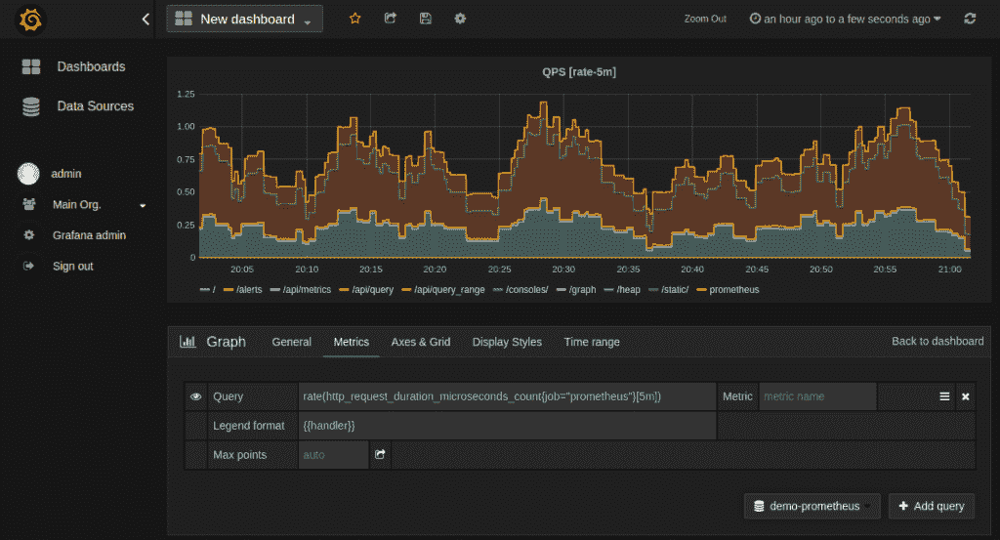](/web/20220526050747/https://www.baeldung.com/wp-content/uploads/2021/06/grafana_qps_graph.png)

我们可以使用几个图形设置来调整我们的图形。此外，我们可能会发现 Prometheus 有几个预建的 Grafana 仪表盘很有用。

## 9.具有弹性堆叠的原木

日志可以为应用程序对事件的反应方式提供宝贵的见解。不幸的是，在分布式系统中，这被分割到多个组件中。因此，从所有组件收集日志并将它们存储在一个地方以便进行有效的分析变得非常重要。此外，我们需要一个直观的用户界面来高效地查询、过滤和引用日志。

[Elastic Stack](https://web.archive.org/web/20220526050747/https://www.elastic.co/elastic-stack) 基本上是一个日志管理平台**，直到最近，它还是三个产品的集合**——Elastic search、Logstash 和 Kibana (ELK)。

然而，从那时起，**节拍被添加到这个堆栈中，以便有效地收集数据**。

让我们看看如何在我们的应用中使用这些产品:

[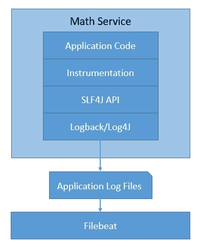](/web/20220526050747/https://www.baeldung.com/wp-content/uploads/2021/06/Observability-With-Elastic-Stack.jpg)

正如我们所见，在 Java 中，我们可以用像 SLF4J 一样的简单抽象和像 T2 一样的日志记录器来生成日志。我们将在这里跳过这些细节。

弹性栈产品是开源的，由 [Elastic](https://web.archive.org/web/20220526050747/https://www.elastic.co/) 维护。总之，这些为分布式系统中的日志分析提供了一个令人信服的平台。

### 9.1.概念和术语

正如我们所见，弹性堆栈是多种产品的集合。这些产品中最早的是 [Elasticseach](https://web.archive.org/web/20220526050747/https://www.elastic.co/enterprise-search) ，它是**一个分布式的、RESTful 的、基于 JSON 的搜索引擎**。由于其灵活性和可伸缩性，它非常受欢迎。这是导致弹性的基础的产品。它基本上基于 Apache Lucene 搜索引擎。

Elasticsearch **将索引存储为文档，文档是存储的基本单位**。这些是简单的 JSON 对象。我们可以使用类型来细分文档中相似类型的数据。索引是文档的逻辑分区。通常，为了可伸缩性，我们可以将索引水平分割成碎片。此外，我们还可以复制碎片以实现容错:

[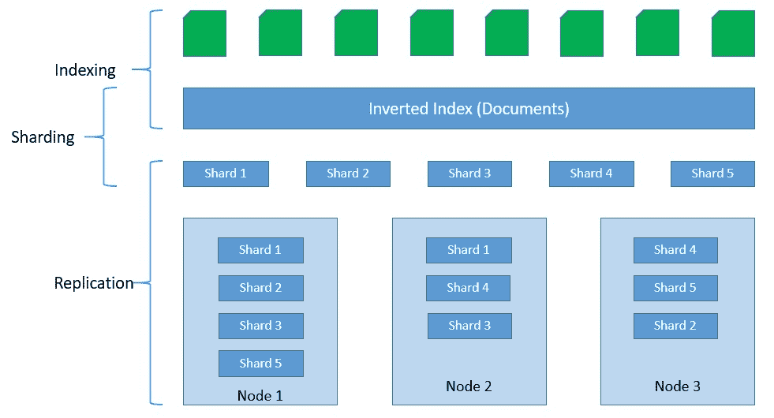](/web/20220526050747/https://www.baeldung.com/wp-content/uploads/2021/06/Elasticsearch-Indexing-Process.jpg)

[Logstash](https://web.archive.org/web/20220526050747/https://www.elastic.co/logstash) 是**一个从各种输入源收集数据的日志聚合器**它还执行不同的转换和增强，并将其发送到输出目的地。由于 Logstash 的内存更大，我们有了 [Beats](https://web.archive.org/web/20220526050747/https://www.elastic.co/beats/) ，它们是轻量级的数据传送器，我们可以将它们作为代理安装在我们的服务器上。最后， [Kibana](https://web.archive.org/web/20220526050747/https://www.elastic.co/kibana) 是**一个可视化层，工作在 Elasticsearch** 之上。

这些产品共同提供了一套完整的套件来执行日志数据的聚合、处理、存储和分析:

[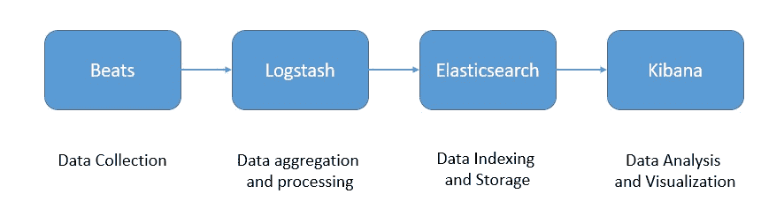](/web/20220526050747/https://www.baeldung.com/wp-content/uploads/2021/06/ELK-Stack-Data-Pipeline.jpg)

有了这些产品，我们可以为日志数据创建生产级的数据管道。然而，扩展这个架构来处理大量的日志数据是完全可能的，在某些情况下也是必要的。我们可以在 Logstash 前面放置一个类似于 [Kafka](/web/20220526050747/https://www.baeldung.com/spring-kafka) 的缓冲区，以防止下游组件淹没它。弹性堆栈在这方面非常灵活。

### 9.2.设置和仪表

正如我们前面看到的，弹性堆栈由几个产品组成。当然，我们可以独立安装它们。然而，这很费时间。幸运的是，Elastic 提供了官方 Docker 图片来简化这一过程。

启动单节点 Elasticsearch 集群就像运行 Docker 命令一样简单:

```java
docker run -p 9200:9200 -p 9300:9300 \
  -e "discovery.type=single-node" \
  docker.elastic.co/elasticsearch/elasticsearch:7.13.0
```

同样，安装 Kibana 并将其连接到 Elasticsearch 集群也很容易:

```java
docker run -p 5601:5601 \
  -e "ELASTICSEARCH_HOSTS=http://localhost:9200" \
  docker.elastic.co/kibana/kibana:7.13.0
```

安装和配置 Logstash 稍微复杂一些，因为我们必须为数据处理提供必要的设置和管道。实现这一点的一个简单方法是在官方图像上创建一个自定义图像:

```java
FROM docker.elastic.co/logstash/logstash:7.13.0
RUN rm -f /usr/share/logstash/pipeline/logstash.conf
ADD pipeline/ /usr/share/logstash/pipeline/
ADD config/ /usr/share/logstash/config/
```

让我们来看一个集成了 Elasticsearch 和 Beats 的 Logstash 的配置文件示例:

```java
input {
  tcp {
  port => 4560
  codec => json_lines
  }
  beats {
    host => "127.0.0.1"
    port => "5044"
  }
}
output{
  elasticsearch {
  hosts => ["localhost:9200"]
  index => "app-%{+YYYY.MM.dd}"
  document_type => "%{[@metadata][type]}"
  }
  stdout { codec => rubydebug }
}
```

根据数据源的不同，有几种可用的节拍类型。对于我们的例子，我们将使用 Filebeat。安装和配置 Beats 最好借助自定义映像来完成:

```java
FROM docker.elastic.co/beats/filebeat:7.13.0
COPY filebeat.yml /usr/share/filebeat/filebeat.yml
USER root
RUN chown root:filebeat /usr/share/filebeat/filebeat.yml
USER filebeat
```

让我们看一个 Spring Boot 应用程序的示例`filebeat.yml`:

```java
filebeat.inputs:
- type: log
enabled: true
paths:
  - /tmp/math-service.log
output.logstash:
hosts: ["localhost:5044"]
```

这是对弹性堆栈的安装和配置的非常粗略但完整的解释。深入讨论所有细节已经超出了本教程的范围。

### 9.3.日志分析

Kibana 为我们的日志提供了一个非常直观和强大的可视化工具。我们可以通过其默认 URL http://localhost:5601 访问 Kibana 接口。我们可以选择一个可视化，并为我们的应用程序创建一个仪表板。

让我们来看一个仪表板示例:

[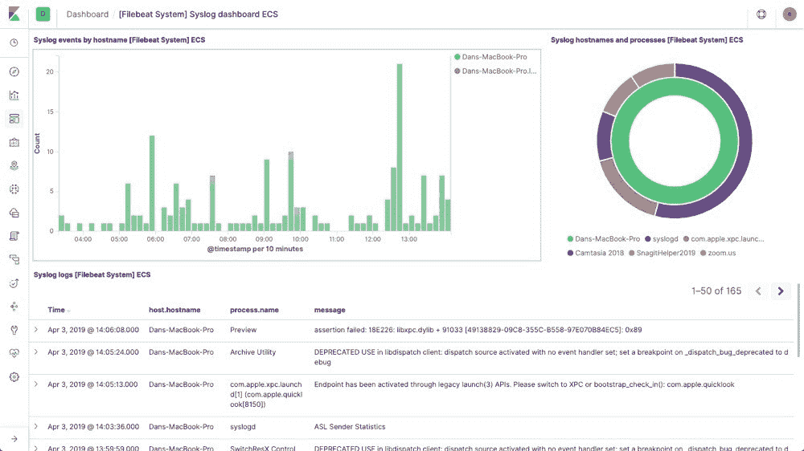](/web/20220526050747/https://www.baeldung.com/wp-content/uploads/2021/06/filebeat-modules-system.jpg)

Kibana 提供了非常广泛的查询和过滤日志数据的能力。这些超出了本教程的范围。

## 10.可观测性的未来

现在，我们已经看到了为什么可观测性是分布式系统的一个关键问题。我们还讨论了一些处理不同类型遥测数据的流行选项，这些选项可以帮助我们实现可观测性。然而，事实仍然是，**组装所有部件仍然非常复杂和耗时**。我们必须经营许多不同的产品。

这一领域的关键进展之一是 CNCF 的一个沙盒项目 [OpenTelemetry](https://web.archive.org/web/20220526050747/https://opentelemetry.io/) 。基本上， **OpenTelemetry 已经通过 OpenTracing 和 OpenCensus** 项目的仔细合并而形成。显然，这是有意义的，因为我们只需要处理一个单一的跟踪和度量的抽象。

更重要的是，OpenTelemetry **有一个计划来支持日志，并使它们成为分布式系统的一个完整的可观察性框架**。此外，OpenTelemetry 支持多种语言，并能与流行的框架和库很好地集成。此外，OpenTelemetry 通过软件桥向后兼容 OpenTracing 和 OpenCensus。

OpenTelemetry 仍在进行中，我们可以期待它在未来几天内成熟。与此同时，为了减轻我们的痛苦，**几个可观察性平台结合了前面讨论的许多产品，以提供无缝体验**。例如， [Logz.io](https://web.archive.org/web/20220526050747/https://logz.io/) 结合了 ELK、Prometheus 和 Jaeger 的力量来提供一个可扩展的平台即服务。

随着**新产品带着创新解决方案**进入市场，可观察性领域正在快速成熟。例如，[千分尺](https://web.archive.org/web/20220526050747/https://micrometer.io/)为几个监控系统的仪器客户端提供了一个厂商中立的门面。最近， [OpenMetrics](https://web.archive.org/web/20220526050747/https://openmetrics.io/) 发布了其规范，为大规模传输云原生指标创建了事实上的标准。

## 11.结论

在本教程中，我们学习了可观测性的基础知识及其在分布式系统中的含义。为了在一个简单的分布式系统中实现可观测性，我们还实现了一些流行的选项。

这让我们理解了 OpenTracing、OpenCensus 和 ELK 如何帮助我们构建一个可观察的软件系统。最后，我们讨论了该领域的一些新进展，以及我们如何期待可观测性在未来的发展和成熟。