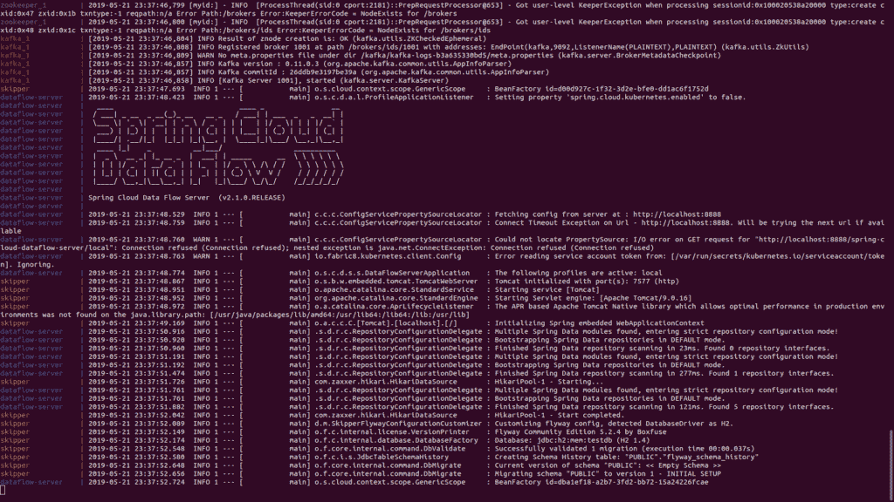
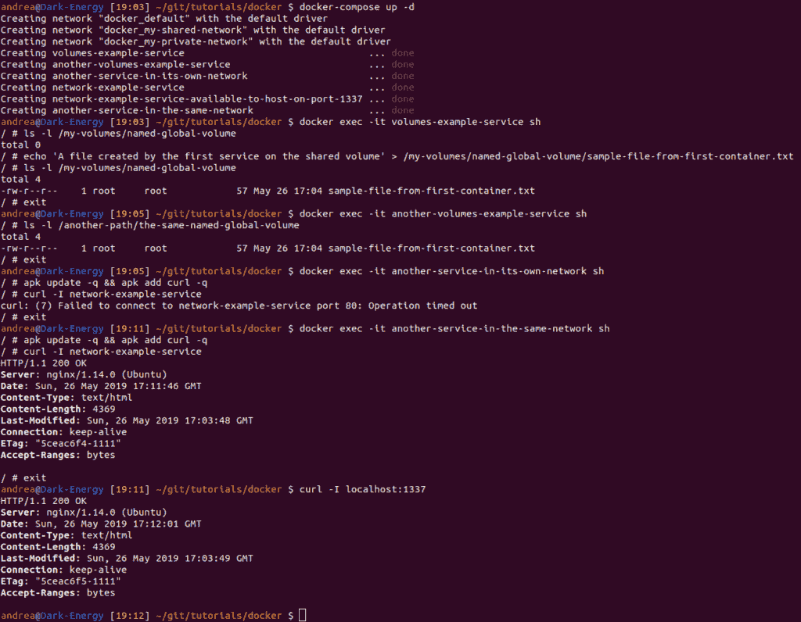

# Docker 撰写简介

> 原文::1230]https://web . archive . org/web/202209930061024/https://www . BAE message . com/ops/docker-compose

## 1。概述

当大量使用 Docker 时，管理几个不同的容器很快变得很麻烦。

Docker Compose 是一个帮助我们克服这个问题的工具，并且可以一次轻松处理多个容器。

在本教程中，我们将看看它的主要特点和强大的机制。

## 2。YAML 配置解释

简而言之，Docker Compose 通过应用在单个`docker-compose.yml`配置文件中声明的许多规则来工作。

这些 [YAML](https://web.archive.org/web/20220926111035/https://en.wikipedia.org/wiki/YAML) 规则，无论是人类可读的还是机器优化的，都为我们提供了一种有效的方式，用几行代码从一万英尺的高空拍摄整个项目。

几乎每个规则都替换了一个特定的 Docker 命令，所以最后我们只需要运行:

```java
docker-compose up
```

我们可以得到许多由 Compose 应用的配置。这将省去我们用 Bash 或其他东西编写脚本的麻烦。

在这个文件中，我们需要指定合成文件格式的`version`，至少一个`service`，可选`volumes`和`networks`:

```java
version: "3.7"
services:
  ...
volumes:
  ...
networks:
  ... 
```

让我们看看这些元素实际上是什么。

### 2.1。服务

首先， **`services`是指集装箱的配置**。

例如，让我们看一个由前端、后端和数据库组成的 dockerized web 应用程序:我们可能会将这些组件分成三个映像，并在配置中将它们定义为三个不同的服务:

```java
services:
  frontend:
    image: my-vue-app
    ...
  backend:
    image: my-springboot-app
    ...
  db:
    image: postgres
    ... 
```

我们可以对服务应用多种设置，稍后我们将深入探讨这些设置。

### 2.2。卷&网络

另一方面，`Volumes`是主机和容器之间，甚至是容器之间共享的磁盘空间的物理区域。换句话说，**卷是主机**中的一个共享目录，从一些或所有容器中可见。

同样， **`networks`定义了容器之间的通信规则，以及容器与主机**之间的通信规则。公共网络区域将使容器的服务可被彼此发现，而私有区域将它们隔离在虚拟沙箱中。

同样，我们将在下一节了解更多。

## 3。剖析服务

现在让我们开始检查服务的主要设置。

### 3.1。拉动图像

有时，我们服务所需的图像已经在 [Docker Hub](https://web.archive.org/web/20220926111035/https://hub.docker.com/) 或另一个 Docker 注册表中发布(由我们或其他人发布)。

如果是这种情况，那么我们通过指定图像名称和标签，用`image`属性来引用它:

```java
services: 
  my-service:
    image: ubuntu:latest
    ... 
```

### 3.2。建立形象

相反，我们可能需要[通过读取源代码的`Dockerfile`来从源代码构建](https://web.archive.org/web/20220926111035/https://docs.docker.com/compose/compose-file/#build)图像。

这一次，我们将使用`build`关键字，将 Dockerfile 的路径作为值传递:

```java
services: 
  my-custom-app:
    build: /path/to/dockerfile/
    ... 
```

我们也可以[使用 URL](https://web.archive.org/web/20220926111035/https://gist.github.com/derianpt/420617ffa5d2409f9d2a4a1a60cfa9ae#file-build-contexts-yml) 来代替路径:

```java
services: 
  my-custom-app:
    build: https://github.com/my-company/my-project.git
    ... 
```

此外，我们可以指定一个与`build`属性相结合的`image`名称，该属性将在图像创建后对其进行命名，[，使其可供其他服务使用](https://web.archive.org/web/20220926111035/https://stackoverflow.com/a/35662191/1654265):

```java
services: 
  my-custom-app:
    build: https://github.com/my-company/my-project.git
    image: my-project-image
    ... 
```

### 3.3。配置网络

**Docker 容器在由 Docker Compose 创建的网络中相互通信，无论是隐式的还是通过配置实现的**。一个服务可以通过简单地引用容器名和端口(例如`network-example-service:80`)与同一网络上的另一个服务通信，前提是我们已经通过`expose`关键字使端口可访问:

```java
services:
  network-example-service:
    image: karthequian/helloworld:latest
    expose:
      - "80" 
```

顺便说一句，在这种情况下，不暴露它也能工作，因为`expose`指令已经在[图像文件](https://web.archive.org/web/20220926111035/https://github.com/karthequian/docker-helloworld/blob/master/Dockerfile#L45)中了。

**要从主机**、**到达容器，端口必须通过`ports`关键字**以声明方式公开，这也允许我们选择是否在主机中以不同方式公开端口:

```java
services:
  network-example-service:
    image: karthequian/helloworld:latest
    ports:
      - "80:80"
    ...
  my-custom-app:
    image: myapp:latest
    ports:
      - "8080:3000"
    ...
  my-custom-app-replica:
    image: myapp:latest
    ports:
      - "8081:3000"
    ... 
```

端口 80 现在将从主机上可见，而其他两个容器的端口 3000 将在主机的端口 8080 和 8081 上可用。这个强大的机制允许我们运行暴露相同端口的不同容器，而不会发生冲突。

最后，我们可以定义附加的虚拟网络来隔离我们的容器:

```java
services:
  network-example-service:
    image: karthequian/helloworld:latest
    networks: 
      - my-shared-network
    ...
  another-service-in-the-same-network:
    image: alpine:latest
    networks: 
      - my-shared-network
    ...
  another-service-in-its-own-network:
    image: alpine:latest
    networks: 
      - my-private-network
    ...
networks:
  my-shared-network: {}
  my-private-network: {} 
```

在最后一个例子中，我们可以看到`another-service-in-the-same-network`能够 ping 通并到达`network-example-service`的 80 端口，而`another-service-in-its-own-network`则不能。

### 3.4。设置音量

卷有三种:[`anonymous``named``host`](https://web.archive.org/web/20220926111035/https://success.docker.com/article/different-types-of-volumes)卷。

**Docker 管理匿名卷和命名卷**，自动将它们挂载到主机中自己生成的目录中。虽然匿名卷在旧版本的 Docker(1.9 之前)中很有用，但是现在推荐使用命名卷。**主机卷也允许我们在主机中指定一个现有的文件夹。**

我们可以在服务级别配置主机卷，在配置的外部级别配置命名卷，以使后者对其他容器可见，而不仅仅是对它们所属的容器可见:

```java
services:
  volumes-example-service:
    image: alpine:latest
    volumes: 
      - my-named-global-volume:/my-volumes/named-global-volume
      - /tmp:/my-volumes/host-volume
      - /home:/my-volumes/readonly-host-volume:ro
    ...
  another-volumes-example-service:
    image: alpine:latest
    volumes:
      - my-named-global-volume:/another-path/the-same-named-global-volume
    ...
volumes:
  my-named-global-volume: 
```

在这里，两个容器都将拥有对`my-named-global-volume`共享文件夹的读/写访问权限，不管它们将它映射到不同的路径。相反，这两个主机卷将只对`volumes-example-service`可用。

主机文件系统的`/tmp`文件夹映射到容器的`/my-volumes/host-volume`文件夹。
文件系统的这一部分是可写的，这意味着容器不仅可以读取，还可以写入(和删除)主机中的文件。

**我们可以通过将`:ro`** 附加到规则来以只读模式挂载一个卷，就像对`/home`文件夹一样(我们不希望 Docker 容器错误地删除我们的用户)。

### 3.5。声明依赖关系

通常，我们需要在我们的服务之间创建一个依赖链，以便一些服务在其他服务之前加载(之后卸载)。我们可以通过`depends_on`关键字达到这个结果:

```java
services:
  kafka:
    image: wurstmeister/kafka:2.11-0.11.0.3
    depends_on:
      - zookeeper
    ...
  zookeeper:
    image: wurstmeister/zookeeper
    ... 
```

但是，我们应该知道，Compose 不会在启动`kafka`服务之前等待`zookeeper`服务完成加载:它只是等待它启动。如果我们需要在启动另一个服务之前完全加载一个服务，我们需要在 Compose 中获得[对启动和关闭顺序的更深层次的控制。](https://web.archive.org/web/20220926111035/https://docs.docker.com/compose/startup-order/)

## 4。管理环境变量

在 Compose 中使用环境变量很容易。我们可以定义静态环境变量，也可以用`${}`符号定义动态变量:

```java
services:
  database: 
    image: "postgres:${POSTGRES_VERSION}"
    environment:
      DB: mydb
      USER: "${USER}" 
```

有不同的方法来提供这些值进行组合。

例如，将它们设置在同一目录下的`.env`文件中，结构类似于`.properties`文件、`key=value`:

```java
POSTGRES_VERSION=alpine
USER=foo
```

否则，我们可以在调用命令之前在操作系统中设置它们:

```java
export POSTGRES_VERSION=alpine
export USER=foo
docker-compose up 
```

最后，我们可能会发现在 shell 中使用简单的一行程序很方便:

```java
POSTGRES_VERSION=alpine USER=foo docker-compose up 
```

我们可以混合使用这些方法，但是请记住，Compose 使用下面的优先级顺序，用较高的优先级覆盖不太重要的优先级:

1.  撰写文件
2.  Shell 环境变量
3.  环境文件
4.  Dockerfile
5.  变量未定义

## 5。缩放&副本

在旧的编写版本中，我们可以通过 [`docker-compose scale`](https://web.archive.org/web/20220926111035/https://docs.docker.com/compose/reference/scale/) 命令缩放容器的实例。较新的版本弃用了它，代之以`–` `–` `scale`选项。

另一方面，我们可以利用[Docker Swarm](https://web.archive.org/web/20220926111035/https://docs.docker.com/engine/swarm/)——一个 Docker 引擎集群——并通过`deploy`部分的`replicas`属性声明性地自动缩放我们的容器:

```java
services:
  worker:
    image: dockersamples/examplevotingapp_worker
    networks:
      - frontend
      - backend
    deploy:
      mode: replicated
      replicas: 6
      resources:
        limits:
          cpus: '0.50'
          memory: 50M
        reservations:
          cpus: '0.25'
          memory: 20M
      ... 
```

在`deploy,`下，我们还可以指定许多其他选项，比如资源阈值。然而，**只在部署到蜂群**时考虑整个`deploy`部分，否则忽略它。

## 6。一个真实世界的例子:Spring Cloud 数据流

虽然小实验有助于我们理解单齿轮，但看到真实世界的代码运行肯定会揭开大画面。

Spring Cloud 数据流是一个复杂的项目，但是简单到可以理解。让我们[下载它的 YAML 文件](https://web.archive.org/web/20220926111035/https://dataflow.spring.io/docs/installation/local/docker/)并运行:

```java
DATAFLOW_VERSION=2.1.0.RELEASE SKIPPER_VERSION=2.0.2.RELEASE docker-compose up 
```

Compose 将下载、配置和启动每个组件，然后**将容器的日志在当前终端**中相交成一个单独的流。

它还会为每一个应用独特的颜色，以获得出色的用户体验:

[](/web/20220926111035/https://www.baeldung.com/wp-content/uploads/2019/06/Screenshot-from-2019-05-22-01-37-52.png)

运行全新的 Docker Compose 安装时，我们可能会收到以下错误:

```java
lookup registry-1.docker.io: no such host
```

虽然这个常见的陷阱有不同的解决方案，但是使用`8.8.8.8`作为 DNS 可能是最简单的。

## 7。生命周期管理

让我们最后仔细看看 Docker Compose 的语法:

```java
docker-compose [-f <arg>...] [options] [COMMAND] [ARGS...] 
```

虽然有[许多选项和命令可用](https://web.archive.org/web/20220926111035/https://docs.docker.com/compose/reference/overview/)，但我们至少需要知道正确激活和停用整个系统的选项和命令。

### 7.1。启动

我们已经看到，我们可以使用`up`创建和启动配置中定义的容器、网络和卷:

```java
docker-compose up
```

然而，在第一次之后，我们可以简单地使用`start`来启动服务:

```java
docker-compose start
```

如果我们的文件与默认文件名(`docker-compose.yml`)不同，我们可以利用`-f`和`–` `–` `file`标志来指定一个替代文件名:

```java
docker-compose -f custom-compose-file.yml start
```

使用`-d`选项启动时，Compose 也可以作为守护进程在后台运行:

```java
docker-compose up -d
```

### 7.2。关机

为了安全地停止活动的服务，我们可以使用`stop`，它将保留容器、卷和网络，以及对它们进行的每一次修改:

```java
docker-compose stop
```

相反，为了重置我们项目的状态，我们只需运行`down`、**，这将销毁除外部卷**之外的所有内容:

```java
docker-compose down
```

## 8。结论

在本教程中，我们学习了 Docker Compose 及其工作原理。

像往常一样，我们可以在 GitHub 上找到源文件`docker-compose.yml`和一组有用的测试，如下图所示:

[](/web/20220926111035/https://www.baeldung.com/wp-content/uploads/2019/06/Tests.png)