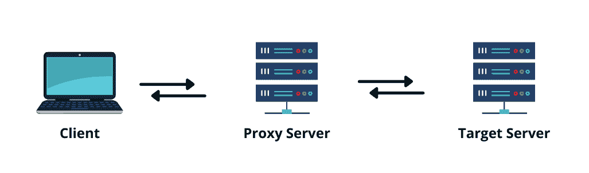

# 在 Docker 中配置代理

> 原文：<https://web.archive.org/web/20220930061024/https://www.baeldung.com/ops/docker-setting-proxy>

## 1.概观

我们将为 Docker 引擎和 Docker 客户端提供代理设置，以便在使用 Docker 时不允许直接访问互联网时，它们可以连接到互联网。当我们在公司网络或私有云中使用 Docker 时，我们可能通常需要通过代理服务器连接到互联网。在这些情况下，我们需要使用代理。

在本教程中，我们将学习如何解决使用 Docker 配置代理时可能遇到的问题。

## 2.什么是代理

代理服务器**控制并路由请求用户和网站**之间的流量。代理旨在保护用户，维护网络安全和隐私政策。在没有代理的情况下，用户直接向目标服务器发送请求并接收响应:

[](/web/20220727020745/https://www.baeldung.com/wp-content/uploads/2022/05/docker-proxy-2.png)

当我们使用代理时，**我们的请求首先到达代理服务器，然后代理访问目标服务器**。如下图所示，代理位于客户端和目标服务器之间，来自客户端的每个请求首先到达代理，然后，代理提供对目标服务器的访问:

[](/web/20220727020745/https://www.baeldung.com/wp-content/uploads/2022/05/docker-proxy-1.png)

## 3.配置 Docker 代理

在 Docker 17.07 和更高版本中，我们可以配置 Docker 客户机自动向容器传递代理信息。在 Docker 17.06 和更早的版本中，我们可以通过环境变量来设置 Docker 客户端代理设置。

让我们将下面的 JSON 示例添加到`~/.docker/config.json`文件中，并完成我们的代理设置。支持使用*字符作为主机的通配符，以及使用 CIDR 表示法作为 IP 地址:

```
{ 
  "proxies":
    { 
      "default": 
        { 
          "httpProxy": "http://<ip-address>:<port>", 
          "httpsProxy": "https://<ip-address>:<port>", 
          "noProxy": "*.<domain>,127.0.0.0/8" 
        } 
    } 
} 
```

当我们保存更改时，每个 Docker 容器将使用在`config.json`文件中指定的环境变量创建，并且我们的代理设置将有效。

## 4.代理服务器设置

我们应该使用`HTTP_PROXY`、`HTTPS_PROXY`、`FTP_PROXY`和`NO_PROXY`环境变量来为 Docker 守护进程配置代理服务。让我们详细看看这些变量:

*   `HTTP_PROXY`是一种代理，充当客户端和 web 服务器之间的中介服务器。使用 HTTP 代理服务器，请求不会发送到网站；它以纯文本的形式发送给代理。代理对此进行分析，然后通过(可选)使用请求中提供的数据更改我们的 IP 地址，向网站发送新的请求。网站接收它并向代理发送响应。然后，代理将响应转发给我们。
*   比 HTTP 代理更安全，更匿名。HTTPS 协议不以纯文本格式传输数据。SSL 层对数据进行加密，这样第三方就永远看不到数据。
*   `FTP_PROXY` 管理主动和被动 FTP 会话。它还保护 FTP 服务器，并限制客户端和服务器之间的 FTP 协议命令。
*   `NO_PROXY`设置用于指定不应该使用代理的地址。

## 5.手动配置代理设置

**在 Docker 17.07 和更早的版本中，我们必须用`–env`标志**来设置我们的代理设置:

```
docker run [docker_image] --env FTP_PROXY="ftp://<ip-address>:<port>"
```

```
docker run [docker_image] --env HTTP_PROXY="http://<ip-address>:<port>"
```

```
docker run [docker_image] --env HTTPS_PROXY="https://<ip-address>:<port>"
```

```
docker run [docker_image] --env NO_PROXY="*.<domain>,127.0.0.0/8"
```

或者，我们必须将它们添加到我们的`Dockerfile`:

```
ENV FTP_PROXY="ftp://<ip-address>:<port>"
```

```
ENV HTTP_PROXY="http://<ip-address>:<port>"
```

```
ENV HTTPS_PROXY="https://<ip-address>:<port>"
```

```
ENV NO_PROXY="*.<domain>,127.0.0.0/8"
```

有了这些操作，我们现在可以执行 Docker 代理操作了。

## 6。结论

在本教程中，我们学习了什么是代理以及如何在不同版本的 Docker 中设置代理。