# 用 Eclipse 调试

> 原文：<https://web.archive.org/web/20220930061024/https://www.baeldung.com/eclipse-debugging>

## 1.概观

在这个快速指南中，我们将看到如何使用 Eclipse IDE 调试 Java 程序。

## 2.基本概念

Eclipse 为调试应用程序提供了强大的支持。它将一步一步的执行可视化，并帮助我们发现错误。

为了演示 Eclipse 中的调试特性，我们将使用一个示例程序`PerfectSquareCounter`。这个程序计算所有的完美正方形，甚至是给定数字下的完美正方形:

```java
public class PerfectSquareCounter {

    static int evenPerfectSquareNumbers = 0;

    public static void main(String[] args) {
        int i = 100;
        System.out.println("Total Perfect Squares: " + calculateCount(i));
        System.out.println("Even Perfect Squares : " + evenPerfectSquareNumbers);
    }

    public static int calculateCount(int i) {
        int perfectSquaresCount = 0;
        for (int number = 1; number <= i; number++) {
            if (isPerfectSquare(number)) {
                perfectSquaresCount++;
                if (number % 2 == 0) {
                    evenPerfectSquareNumbers++;
                }
            }
        }
        return perfectSquaresCount;
    }

    private static boolean isPerfectSquare(int number) {
        double sqrt = Math.sqrt(number);
        return sqrt - Math.floor(sqrt) == 0;
    }
}
```

### 2.1.调试方式

首先，我们需要在调试模式下在 Eclipse 中启动 Java 程序。这可以通过两种方式实现:

*   右键单击编辑器并选择`Debug As -> Java Application` (如下图所示)
*   `Debug`工具栏中的程序(在下面的截图中高亮显示)

[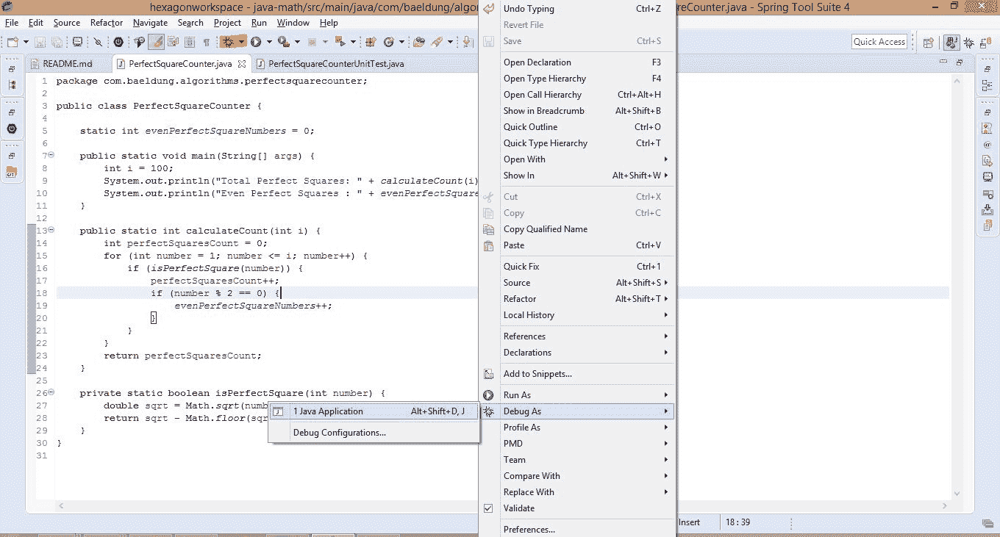](/web/20220625223311/https://www.baeldung.com/wp-content/uploads/2019/08/debugeclipse1.jpg)

### 2.2.断点

我们需要**定义程序执行应该暂停**进行调查的点。**这些被称为断点，适用于方法。**它们也可以在执行前或执行过程中的任何时候定义。

基本上，有 3 种方法可以在程序中添加断点:

*   右键单击对应于该行的标记栏(垂直标尺),并选择切换断点(如下图所示)
*   在编辑器中，在必要的行上按`Ctrl+Shift+B`
*   双击与所需行相对应的标记栏(垂直标尺)

[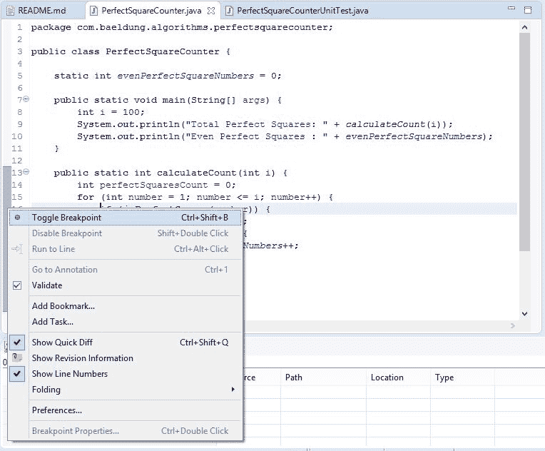](/web/20220625223311/https://www.baeldung.com/wp-content/uploads/2019/08/debug_eclipse2.jpg)

### 2.3.代码流控件

现在调试器在给定的断点处停止，我们可以继续进一步执行。

让我们假设调试器当前的位置如下图所示，位于第 16 行:

[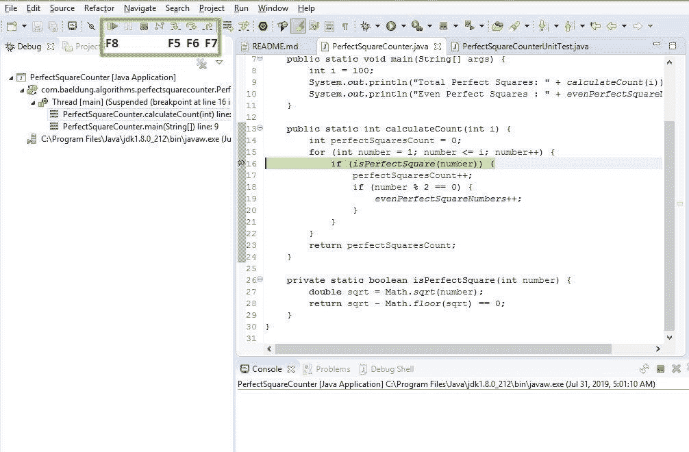](/web/20220625223311/https://www.baeldung.com/wp-content/uploads/2019/08/debug_eclipse3.jpg)

最常用的调试选项有:

*   **`Step Into (F5) –` 该操作在当前行使用的方法**内进行(如果有的话)；否则，它前进到下一行。在这个例子中，它将使用方法`isPerfectSquare()`中的调试器
*   **`Step Over (F6) –` 该操作处理当前行并进入下一行。**在本例中，这将执行方法`isPerfectSquare()`并前进到下一行
*   **`Step Return (F7) –` 该操作结束当前方法，并带我们回到调用方法。**因为在这种情况下，我们在循环中有一个断点，它将仍然在方法中，否则它将返回到主方法
*   **`Resume (F8) –` 该操作将简单地继续执行，直到程序结束**，除非我们遇到任何进一步的断点

### 2.4.调试视角

当我们在调试模式下启动程序时，Eclipse 将提示切换到调试透视图的选项。**Debug 透视图是一些有用视图的集合，帮助我们可视化调试器并与之交互。**

我们还可以随时手动切换到 Debug 透视图。

以下是其中包含的一些最有用的视图:

*   **调试视图**–显示不同的线程和调用堆栈跟踪
*   **变量视图**–显示任意给定点的变量值。如果我们需要看到静态变量，我们需要显式地指定
*   **断点**–这显示了不同的断点和观察点(我们将在下面看到)
*   **Debug Shell**——这允许我们在调试时编写和评估定制代码(稍后会有一个例子)

[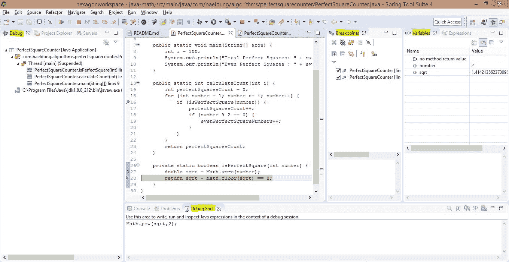](/web/20220625223311/https://www.baeldung.com/wp-content/uploads/2019/08/debug_eclipse4.jpg)

## 3.技术

在这一节中，我们将介绍一些重要的技术，它们将帮助我们掌握 Eclipse 中的调试。

### 3.1.变量

我们可以在 variables 视图下看到执行过程中变量的值。为了看到静态变量，我们可以选择下拉选项`Java -> Show Static Variables`。

**使用变量视图，可以在执行过程中将任何值更改为期望值。**

例如，如果我们需要跳过几个数字，直接从数字 80 开始，我们可以通过改变变量`number`的值来实现:

[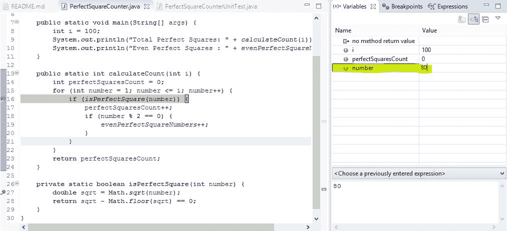](/web/20220625223311/https://www.baeldung.com/wp-content/uploads/2019/08/debug_eclipse5.jpg)

### 3.2.检查值

如果我们需要检查 Java 表达式或语句的值，我们可以在编辑器中选择特定的表达式，右键单击，然后检查，如下所示。一个方便的快捷方式是在表达式上点击**来查看值:**

[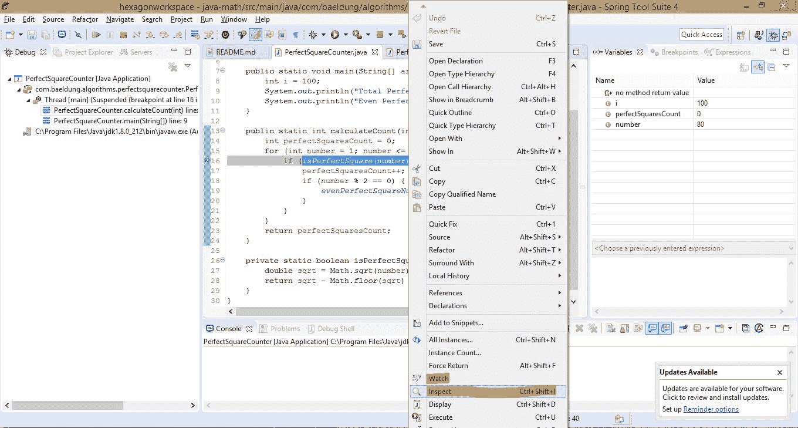](/web/20220625223311/https://www.baeldung.com/wp-content/uploads/2019/08/debug_eclipse6.jpg)

[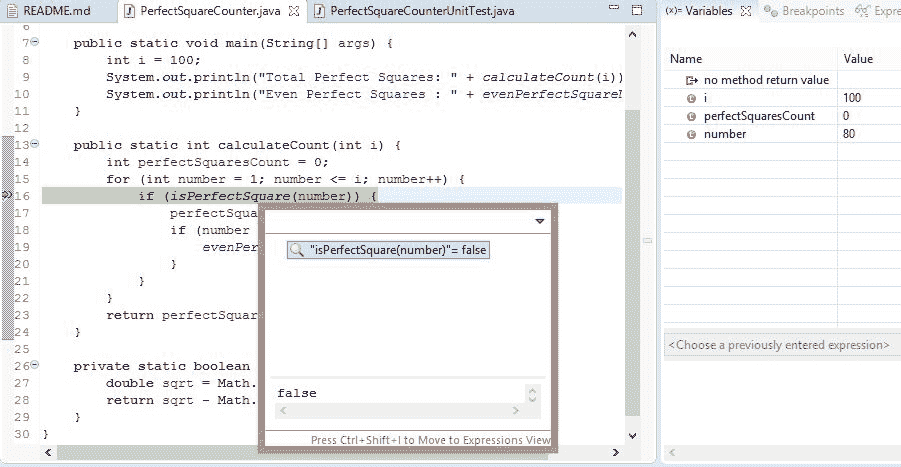](/web/20220625223311/https://www.baeldung.com/wp-content/uploads/2019/08/debug_eclipse7.jpg)

万一我们需要**永久检查这个表达式，可以右键点击观看。**现在，它被添加到表达式视图中，可以在不同的运行中看到该表达式的值。

### 3.3.调试外壳

在调试会话的上下文中，我们可以编写并运行定制代码来评估可能性。这在调试 Shell 中完成。

例如，如果我们需要交叉检查`sqrt`功能的正确性，我们可以在调试 Shell 中完成。在代码上，`Right-click -> Inspect`查看值:

[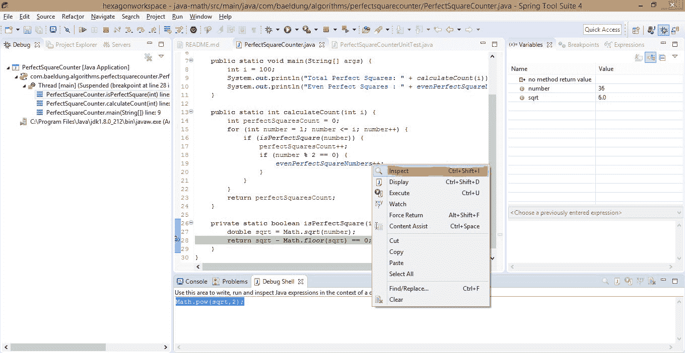](/web/20220625223311/https://www.baeldung.com/wp-content/uploads/2019/08/debug_eclipse8.jpg)

### [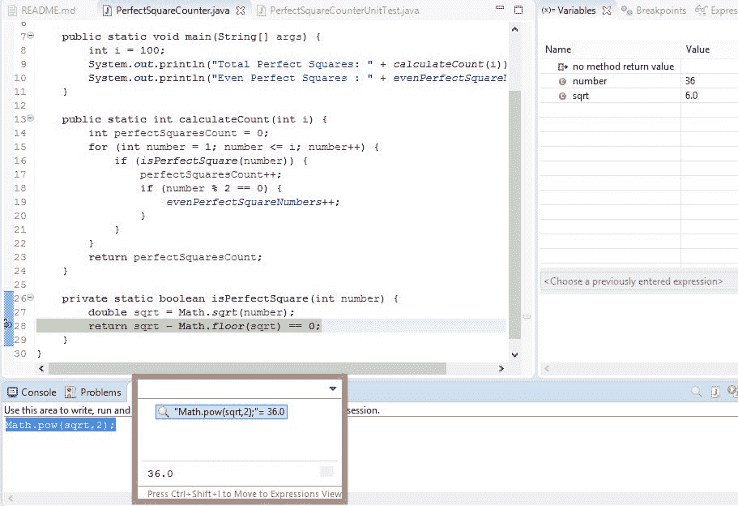](/web/20220625223311/https://www.baeldung.com/wp-content/uploads/2019/08/debug_eclipse9.jpg)

### 3.4.条件断点

有些情况下，我们只想针对特定条件进行调试。**我们可以通过以下两种方式之一向断点**添加条件来实现这一点:

*   右击断点并选择断点属性
*   在断点视图中，选择断点并指定条件

例如，只有当`number`等于 10:

[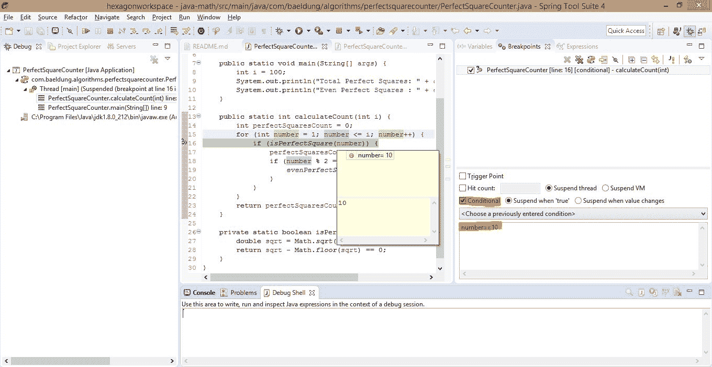](/web/20220625223311/https://www.baeldung.com/wp-content/uploads/2019/08/debug_eclipse10.jpg)

### 3.5.观察点

**什么** **断点是针对方法的，观察点是针对类级变量的**。在当前的例子中，`evenPerfectSquareNumbers`声明上的断点被称为观察点。现在，每次在观察点访问或修改字段时，调试器都会暂停执行。

这是默认行为，可以在观察点的属性中进行更改。

在本例中，每当完美平方是偶数时，调试器将停止执行:

[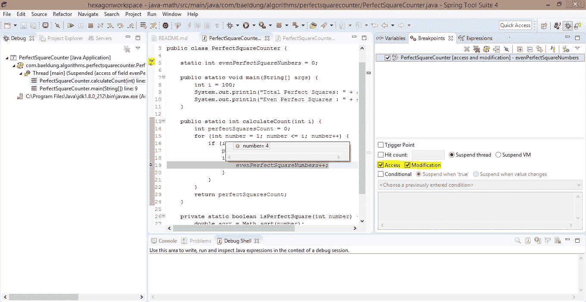](/web/20220625223311/https://www.baeldung.com/wp-content/uploads/2019/08/debug_eclipse11.jpg)

### 3.6.扳机点

让我们假设我们正在调试一个有大量源代码的应用程序中的复杂问题。由于分散的断点，调试器将继续挂起流。

**当一个断点被标记为触发点时，意味着只有当这个断点被命中时，其余的断点才会被启用。**

例如，在下面的截图中，`isPerfectSquare()`上的断点应该在循环的每次迭代中都被命中。然而，我们已经指定了`calculateCount()`方法上的断点作为触发点，以及一个条件。

因此，当迭代计数达到 10 时，这将触发其余的断点。因此，从现在开始，如果命中了`isPerfectSquare()`上的断点，执行将被暂停:

[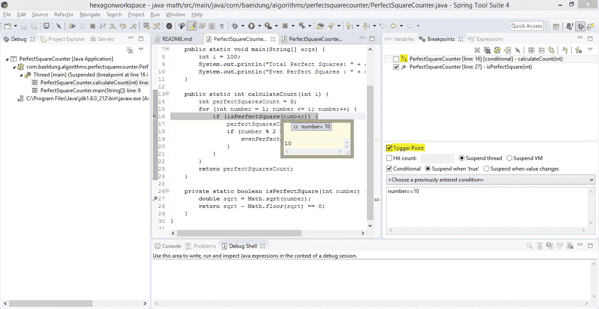](/web/20220625223311/https://www.baeldung.com/wp-content/uploads/2019/08/debug_eclipse12.jpg)

### 3.7.远程调试

最后，如果应用程序运行在 Eclipse 之外，只要远程应用程序允许调试，我们仍然可以使用上述所有功能。从 Eclipse 中，我们将选择 **[Debug 作为远程 Java 应用程序](/web/20220625223311/https://www.baeldung.com/spring-debugging)** 。

## 4.结论

在这个快速指南中，我们已经看到了在 Eclipse IDE 中调试程序的基础知识和不同的技术。

和往常一样，本练习中使用的源代码可以从 GitHub 上的[处获得。](https://web.archive.org/web/20220625223311/https://github.com/eugenp/tutorials/tree/master/core-java-modules/core-java-lang-math-2)