# Eclipse 中的常见快捷方式

> 原文：<https://web.archive.org/web/20220930061024/https://www.baeldung.com/eclipse-shortcuts>

## 1.概观

许多开发人员严重依赖键盘快捷键来在他们选择的 IDE 中高效工作。

在本教程中，我们将学习流行的 Eclipse IDE 中的一些常见快捷方式。

我们将快捷方式分为四大类:

*   搜索和导航
*   编辑我们的代码
*   重构代码
*   运行和调试

因为 Mac 和 Windows 操作系统之间的密钥标记有些不同，所以在本文中，我们将首先列出 Mac 命令，然后是 Windows 命令。我们还应该注意，在某些键盘配置上，我们可能需要使用功能键(`fn`)来激活功能键。

## 2.搜索和导航

在这一节中，我们将讨论如何在我们的代码库中找到并打开资源，以及如何在单个文件中找到并跳转到特定的项目。

### 2.1.快速访问搜索

为了打开一个通用搜索窗口，我们可以使用它来快速搜索和打开我们需要的内容，**让我们使用 ⌘ + 3 或 Ctrl + 3 来打开快速访问搜索窗口:**

[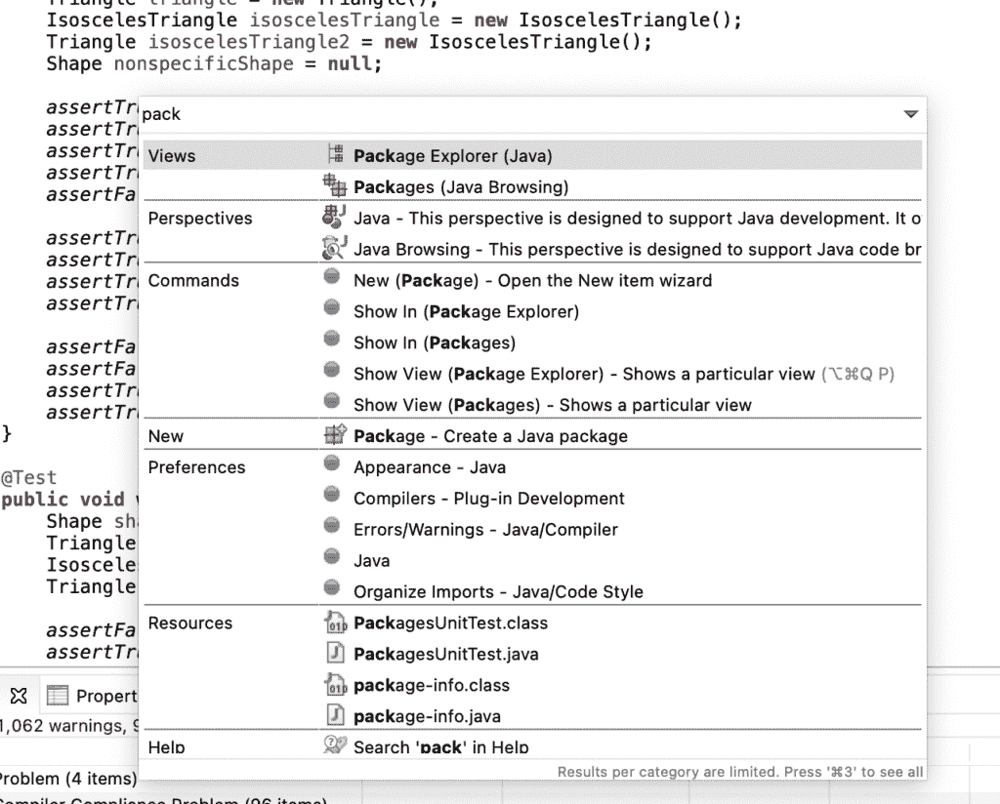](/web/20220526041639/https://www.baeldung.com/wp-content/uploads/2021/06/Cmd3.png)

### 2.2.整体搜索

**要打开整个搜索窗口，让我们使用 Ctrl + H** 。在此窗口中，我们可以根据选择的选项找到整个项目或整个工作区的特定值:

[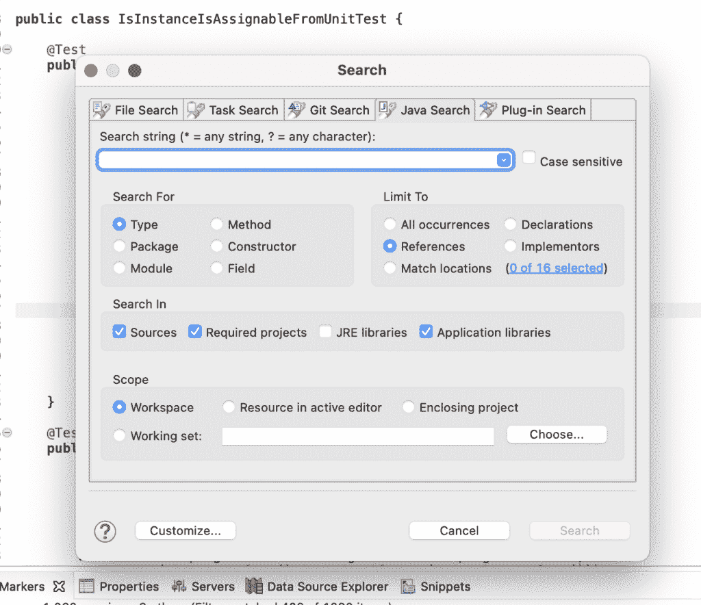](/web/20220526041639/https://www.baeldung.com/wp-content/uploads/2021/06/CtrlH.png)

### 2.3.开放资源

如果我们知道想要打开的文件的名称，**我们可以使用 ⌘ + Shift + R 或 Ctrl + Shift + R 调出打开的资源窗口**。从那里，我们可以开始输入工作区中任何资源的名称:

[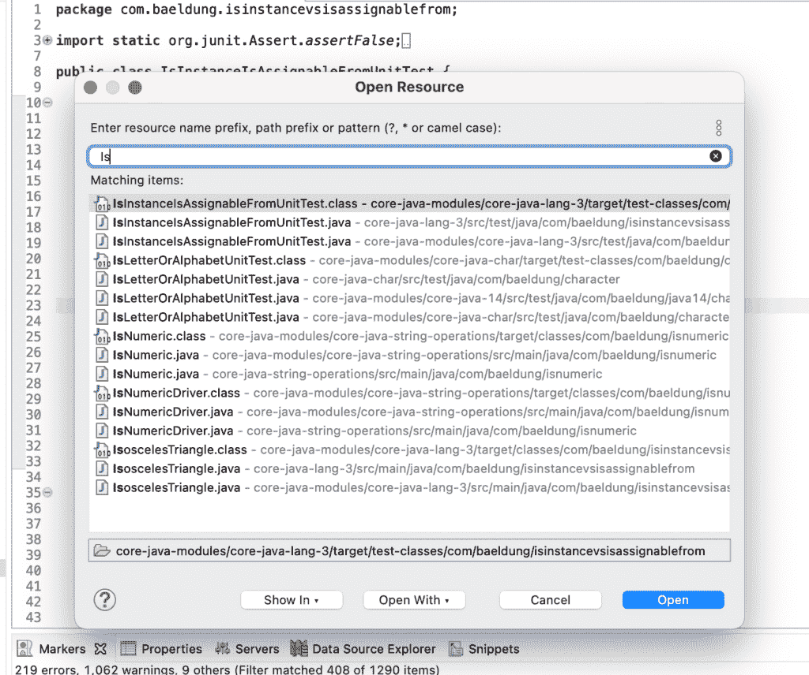](/web/20220526041639/https://www.baeldung.com/wp-content/uploads/2021/06/CmdShiftR.png)

### 2.4.开式

类似于打开的资源窗口，**我们可以使用 ⌘ + Shift + T 或 Ctrl + Shift + T 来获得打开的类型窗口。**在该窗口中，我们可以开始键入工作区中任何类或接口的名称:

[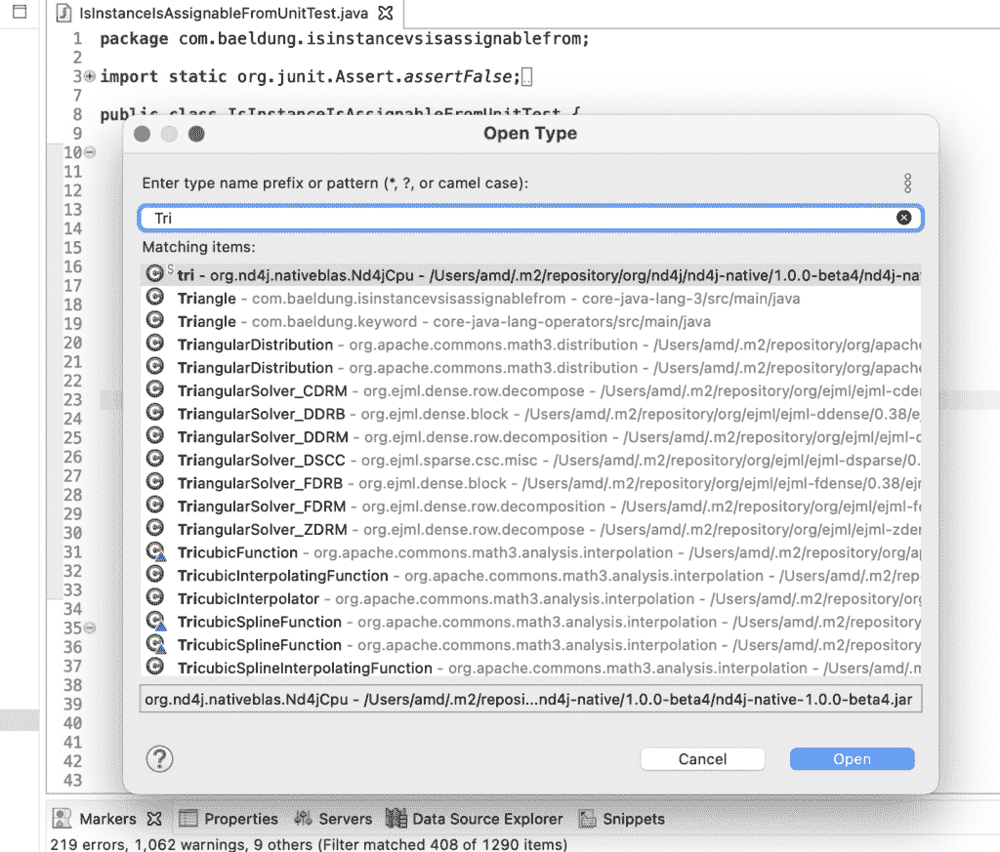](/web/20220526041639/https://www.baeldung.com/wp-content/uploads/2021/06/CmdShiftT.png)

### 2.5.查找对某个类型的所有引用

有时我们需要在项目中找到使用类或接口的地方。一旦我们突出显示了我们的类型名称，**我们就可以使用****【⌘】+shift+g 或者 Ctrl + Shift + G 来查找该类型的所有引用:**

[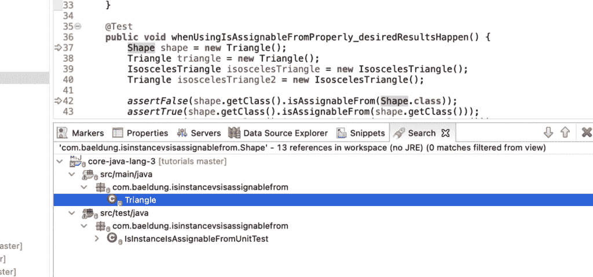](/web/20220526041639/https://www.baeldung.com/wp-content/uploads/2021/06/CmdShiftG-1536x720-1.png)

### 2.6.搜索/搜索并替换

我们已经学会了如何在我们的工作空间中搜索，但是我们经常想要在我们当前编辑的文件中查找和替换文本。**我们可以使用 ⌘ + F 或 Cmd + F 打开查找/替换窗口:**

### 2.7.转到线

当调试我们的 Java 代码时，我们可能会有一个来自堆栈跟踪的行号，或者我们想要跳转到的一些其他来源。**我们可以通过使用 ⌘ + L 或 Ctrl 打开“转到线路”窗口来轻松实现。**在该窗口中，我们只需键入我们的行号，然后进入该窗口:

[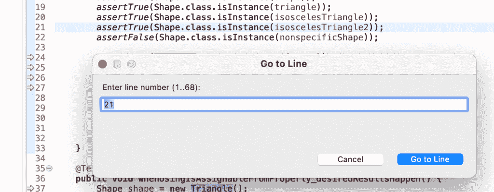](/web/20220526041639/https://www.baeldung.com/wp-content/uploads/2021/06/CmdL.png)

## 3.编辑

现在我们可以找到我们的代码了，让我们看看可以用来更有效地编辑的快捷方式。

### 3.1.向上或向下移动代码

要移动一行代码，我们只需要将光标放在那一行上。然后我们可以使用 Opt +向上或向下箭头键或者 Alt +向上或向下来向上或向下移动那一行。

首先，让我们选择第 24 行:

[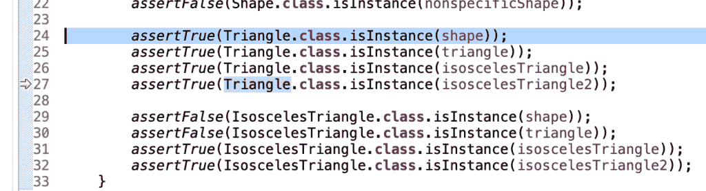](/web/20220526041639/https://www.baeldung.com/wp-content/uploads/2021/06/OptDown1.png)

然后，我们可以使用 Opt +向下箭头将整行向下移动一行:

[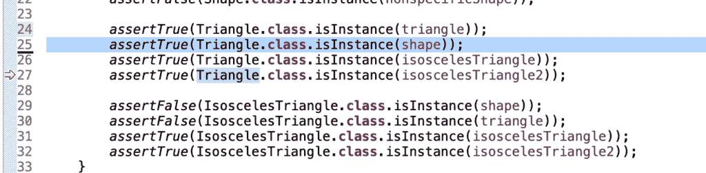](/web/20220526041639/https://www.baeldung.com/wp-content/uploads/2021/06/OptDown2.png)

### 3.2.内容辅助

有时，我们希望在记住变量或类名时得到一些帮助。在 Eclipse 中，**我们可以使用 Ctrl + Space 来获得建议，甚至让我们的变量名自动完成:**

### 3.3.解决问题的建议

类似于 Content Assist，我们也可以要求 Eclipse 提出解决问题的建议。我们可以使用 ⌘ + 1 或 Ctrl + 1: 来征求这些建议

[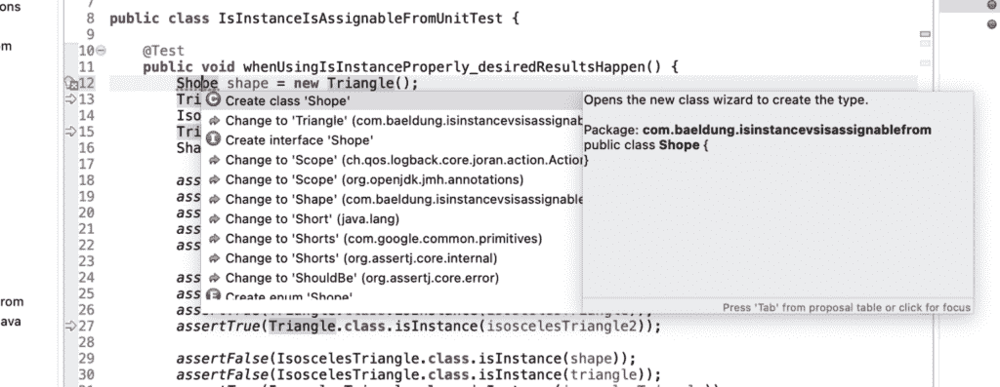](/web/20220526041639/https://www.baeldung.com/wp-content/uploads/2021/06/Cmd1-1536x596-1.png)

### 3.4.评论

在 Java 中，我们可以用//注释单独的代码行，用/* */注释代码块。在 Eclipse 中，对于这两种类型的注释，我们都有自己的快捷方式。

**我们可以使用 ⌘ + /或 Ctrl + /:** 来注释和取消注释单独的代码行

[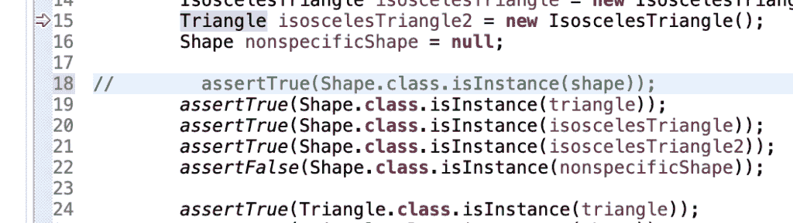](/web/20220526041639/https://www.baeldung.com/wp-content/uploads/2021/06/CmdSlash.png)

为了创建代码的注释块，让我们使用 ⌘ + Opt + /或者 Ctrl + Alt + /。我们可以用 ⌘ + Opt + \或者 Ctrl + Alt + \: 来撤销块注释

[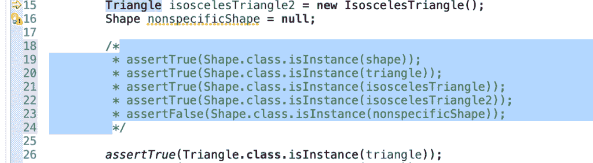](/web/20220526041639/https://www.baeldung.com/wp-content/uploads/2021/06/CmdShiftSlash.png)

### 3.5.高级编辑选项

接下来，让我们使用 Opt + ⌘ + S 或 Alt + Shift + S: 打开高级编辑选项窗口

[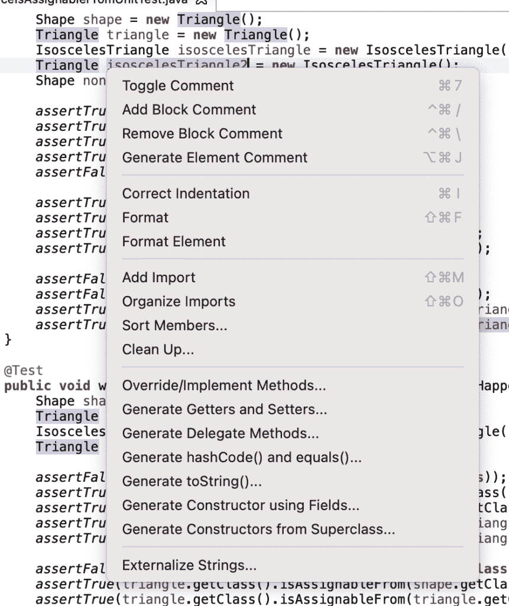](/web/20220526041639/https://www.baeldung.com/wp-content/uploads/2021/06/OptCmdS.png)

## 4.重构

接下来，让我们看看一些快捷方式，我们可以用它们来更容易地重构代码。

### 4.1.重命名变量

让我们突出显示我们的变量，并使用 Opt + ⌘ + R 或 Ctrl + Shift + R 来重命名它。我们只需键入一个新名称并按回车键就足够了，但我们也可以选择打开一个更高级的重构窗口:

### 4.2.重构选项

如果我们想要重构选项，**我们可以突出显示一个变量、类型，甚至一个包，并使用** **Opt + ⌘ + T 或 Ctrl + Shift + T 来打开重构选项列表。**根据我们突出显示的内容，显示的选项会有所不同:

[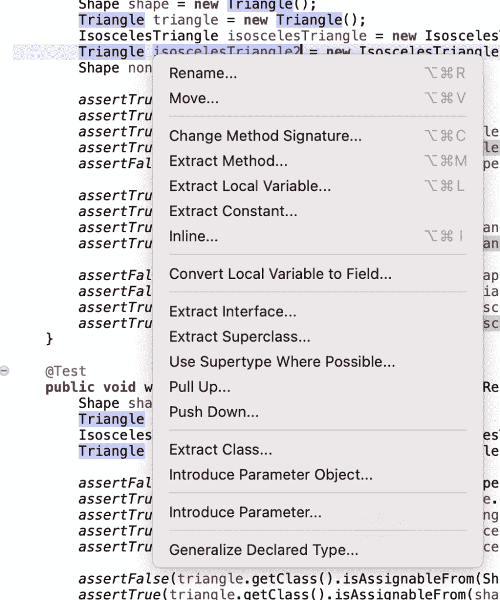](/web/20220526041639/https://www.baeldung.com/wp-content/uploads/2021/06/OptCmdT.png)

## 5.运行和调试

使用 IDE 的一个主要优势是在调试模式下运行应用程序。记住这一点，最后让我们看看可以用来运行和调试应用程序的命令。

### 5.1.运行/调试应用程序

**让我们使用 ⌘ + F11 或 F11 在调试模式下运行我们的应用程序:**

[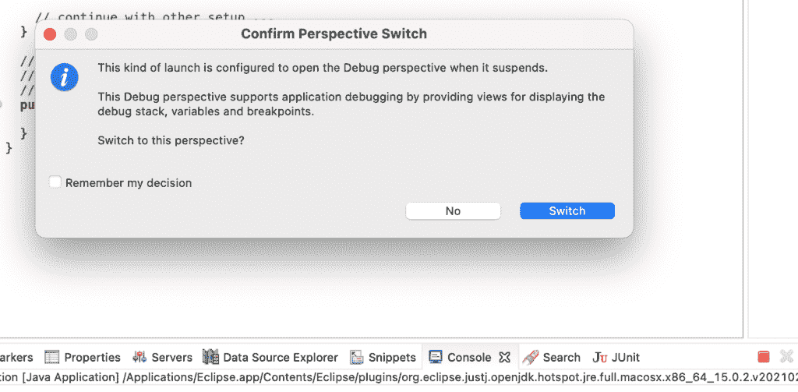](/web/20220526041639/https://www.baeldung.com/wp-content/uploads/2021/06/CmdF11.png)

**如果我们不需要调试器，我们将使用⌘ + Shift + F11 或 Ctrl + Shift + F11 来运行我们上次运行的应用程序。**

### 5.2.排除故障

一旦我们在代码中遇到一个断点，我们需要决定如何从那里开始遍历代码。常见操作有简单的快捷方式。

让我们从使用 F6 跳过一行代码开始。

让我们想象一下，我们在这里遇到了断点:

[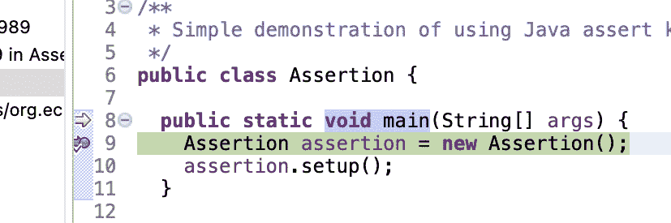](/web/20220526041639/https://www.baeldung.com/wp-content/uploads/2021/06/debugf6Before.png)

在我们利用 F6 跨越之后:

[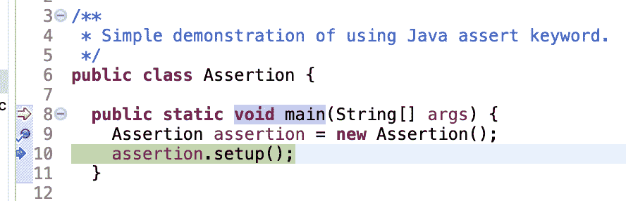](/web/20220526041639/https://www.baeldung.com/wp-content/uploads/2021/06/debugf6After.png)

现在，如果我们需要进入一个方法，**我们使用 F5 进入这个方法。**

让我们使用 F5 单步执行上一个示例中的方法:

[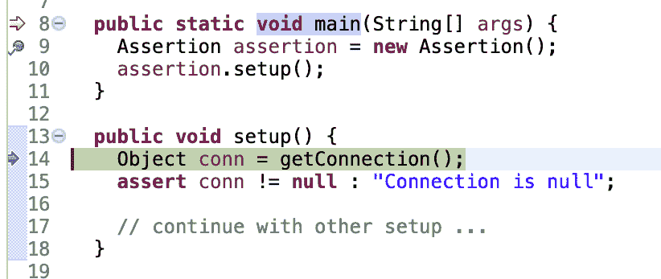](/web/20220526041639/https://www.baeldung.com/wp-content/uploads/2021/06/debug5fAfter.png)

假设我们进入了`setup()`方法，并决定那不是我们需要的地方。**我们将使用 F7 快捷方式转到方法 return。**

[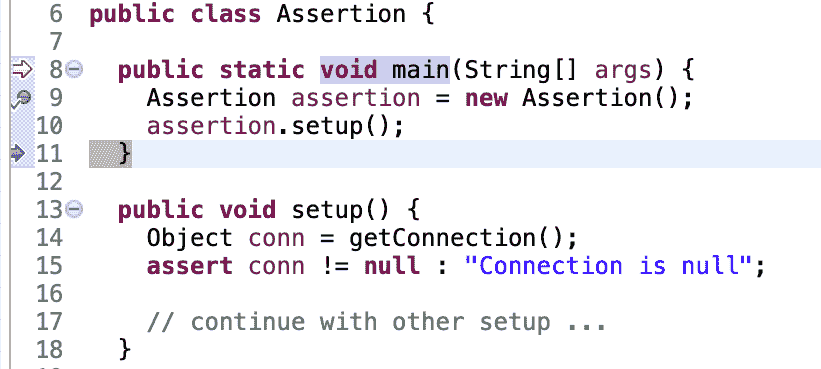](/web/20220526041639/https://www.baeldung.com/wp-content/uploads/2021/06/debugF7After.png)

当我们准备好让我们的应用程序运行完成时，**让我们使用 F8 让我们的应用程序继续执行。**

## 6.结论

在本文中，我们已经了解了 Eclipse IDE 中一些常见的键盘快捷键。我们讨论了四个方面的常见快捷方式:搜索/查找、编辑、重构和运行/调试。