# 运用远见了解我们的 CI 渠道

> 原文：<https://web.archive.org/web/20220930061024/https://www.baeldung.com/ops/foresight-understanding-ci-pipelines>

## 1。简介

**在本文中，我们将研究 [Foresight](/web/20221109113153/https://www.baeldung.com/foresight)** ，这是一款来自[桑德拉](/web/20221109113153/https://www.baeldung.com/thundra)的新监控工具，旨在允许我们监控我们软件仓库中的 CI 管道。

## 2.什么是远见？

Foresight 是一种工具，它能让我们更深入地了解我们的 CI 渠道和软件测试。具体来说，它允许我们查看 CI 管道的性能以及管道内运行的测试的测试结果和覆盖级别。这包括对变更影响分析的支持，在这里我们可以看到。拉请求中的更改，并将它们与测试运行和测试相关联。覆盖率来展示它们如何影响我们的构建。

目前，它只支持 GitHub 动作作为 CI 工具。这意味着我们需要使用 GitHub 来存储我们的代码。但是，将来可能会支持其他服务。此外，它支持一组特定的测试工具输出格式，包括但不限于 [JUnit](/web/20221109113153/https://www.baeldung.com/junit) 和 [JaCoCo](/web/20221109113153/https://www.baeldung.com/jacoco) 。

## 3.为我们的项目增添远见。

在将 Foresight 引入我们的项目之前，我们需要已经建立的 GitHub 库。此外，还需要一个已经配置好的 GitHub 动作管道。

首先，我们需要创建一个帐户。为此，我们拜访了[https://app.runforesight.com/signup](/web/20221109113153/https://www.baeldung.com/foresight-signup)，并填写了表格:

**[](/web/20221109113153/https://www.baeldung.com/wp-content/uploads/2022/11/Screenshot-2022-09-28-at-07.40.14.png)**

登录后，我们就可以开始构建我们的第一个构建了。这可以通过按下“连接管道”按钮来完成:

**[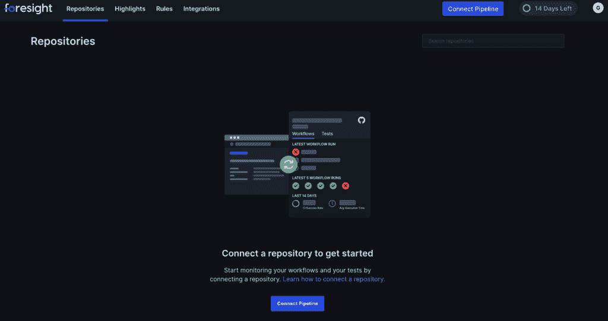](/web/20221109113153/https://www.baeldung.com/wp-content/uploads/2022/11/Screenshot-2022-09-28-at-07.42.32.png)**

如果我们还没有这样做，我们现在会看到一个在我们的帐户中设置 Foresight GitHub 应用程序的提示。只需按下以下屏幕上的“安装”按钮，并按照提示进行操作:

**[](/web/20221109113153/https://www.baeldung.com/wp-content/uploads/2022/11/Screenshot-2022-09-28-at-07.44.03.png)**

一旦我们从 GitHub 返回 Foresight 页面，我们将得到一个提示，以决定我们是希望 Foresight 监控所有的存储库，还是希望选择具体监控哪些存储库:

**[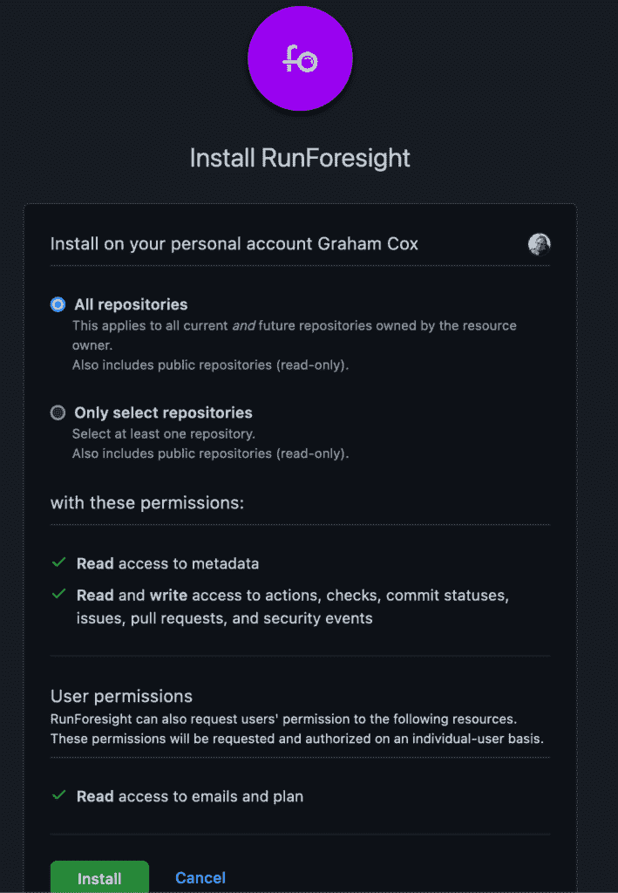](/web/20221109113153/https://www.baeldung.com/wp-content/uploads/2022/11/Screenshot-2022-09-28-at-07.49.10.png)**

最后，我们将在某一点上，我们可以创建我们的第一个预见项目。在这个屏幕上，我们需要为项目命名，并选择它包含哪些存储库。这至少需要一个存储库，但可以根据需要任意多个:

**[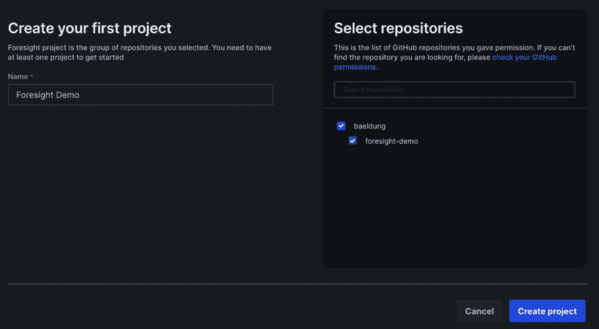](/web/20221109113153/https://www.baeldung.com/wp-content/uploads/2022/11/Screenshot-2022-09-28-at-07.51.01.png)**

接下来，Foresight 将提示我们在 GitHub 操作中配置适当的步骤。我们暂时跳过这一步，稍后再回到这个话题。

现在我们已经配置了 Foresight 来监控我们的项目。Foresight 将为我们提供一个简单的仪表板，一目了然地显示存储库的状态:

[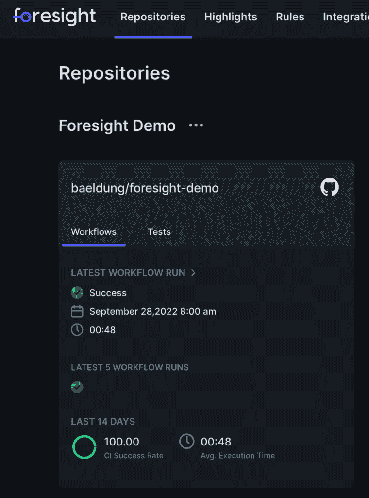](/web/20221109113153/https://www.baeldung.com/wp-content/uploads/2022/11/Screenshot-2022-09-28-at-11.42.24.png)

这给了我们一个项目状态的快速概览，向我们展示了作为项目一部分的存储库以及这些存储库的当前状态。在这一点上，我们没有从 GitHub 本身获得更多的信息，但它将细节收集在一个地方，以便快速轻松地查看。如果我们有许多跨越不同项目的存储库，这尤其有用。

## 4.将预见融入 CI 渠道。

到目前为止，我们已经将 Foresight 连接到 GitHub，允许它报告我们的存储库的状态。但这只是我们所能取得的成就的皮毛。预见可以更深入地整合到我们的 CI 渠道中，从而报告比我们看到的更多的信息。

这样做可以让我们看到整个工作流的运行和测试的结果，并看到它们是如何随时间变化的。

首先，我们需要访问“集成您的测试”的预见页面:

[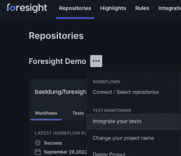](/web/20221109113153/https://www.baeldung.com/wp-content/uploads/2022/11/Screenshot-2022-09-30-at-07.36.54.png)

在这里，我们将看到本项目所需的 API 密钥:

[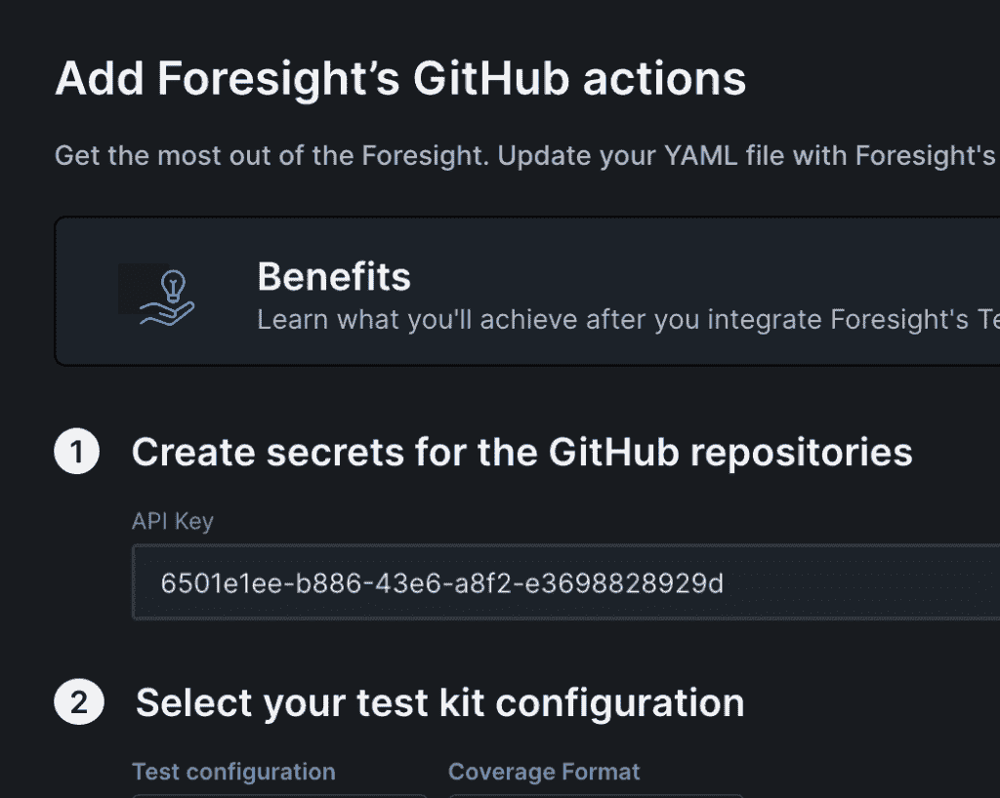](/web/20221109113153/https://www.baeldung.com/wp-content/uploads/2022/11/Screenshot-2022-09-30-at-07.39.57.png)

我们要把它用在我们的仓库里。首先，我们需要在我们的存储库设置中的机密页面上创建一个存储库机密:

[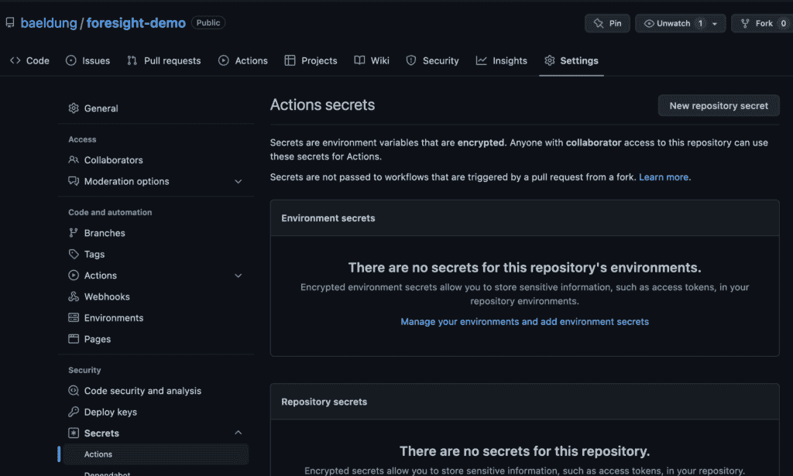](/web/20221109113153/https://www.baeldung.com/wp-content/uploads/2022/11/Screenshot-2022-09-30-at-07.42.56.png)

在这里，我们可以单击“新建存储库密码”按钮，并使用 FORESIGHT_API_KEY 和 FORESIGHT 页面中的值创建一个新密码:

[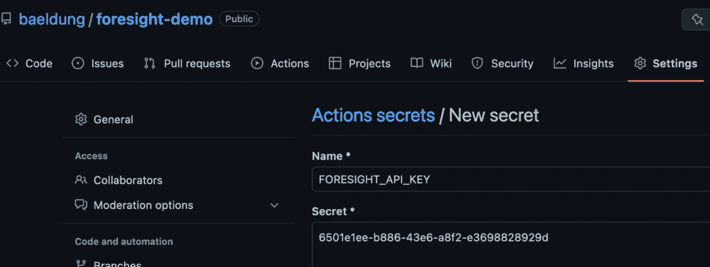](/web/20221109113153/https://www.baeldung.com/wp-content/uploads/2022/11/Screenshot-2022-09-30-at-07.45.15.png)

至此，我们已经准备好向 GitHub 动作管道添加适当的步骤。有两个这样的要补充。

第一步发生在存储库中每个作业的最开始:

```java
- name: Collect Workflow Telemetry
  uses: runforesight/[[email protected]](/web/20221109113153/https://www.baeldung.com/cdn-cgi/l/email-protection)
  if: success() || failure()
  with:
    api_key: ${{secrets.FORESIGHT_API_KEY}}
```

这将记录有关工作流运行的遥测数据，使我们能够看到资源使用情况和每一步需要多长时间。

第二步是在执行测试运行的每个作业中运行所有测试之后:

```java
- name: Analyze Test and/or Coverage Results
  uses: runforesight/[[email protected]](/web/20221109113153/https://www.baeldung.com/cdn-cgi/l/email-protection)
  if: success() || failure()
  with:
    api_key: ${{secrets.FORESIGHT_API_KEY}}
    test_format: JUNIT
    test_framework: JUNIT
    test_path: target/surefire-reports
    coverage_format: JACOCO/XML
    coverage_path: target
```

这里的确切值取决于我们的测试运行器和代码覆盖工具。在单个模块构建中，这些值对于 JUnit 和 JaCoCo 是正确的。

这将使我们能够看到我们的测试。我们现在可以看到测试运行的结果，哪些是成功的，哪些是失败的，哪些是运行时间最长的。此时，我们的仪表板将显示上次工作流运行的测试状态:

[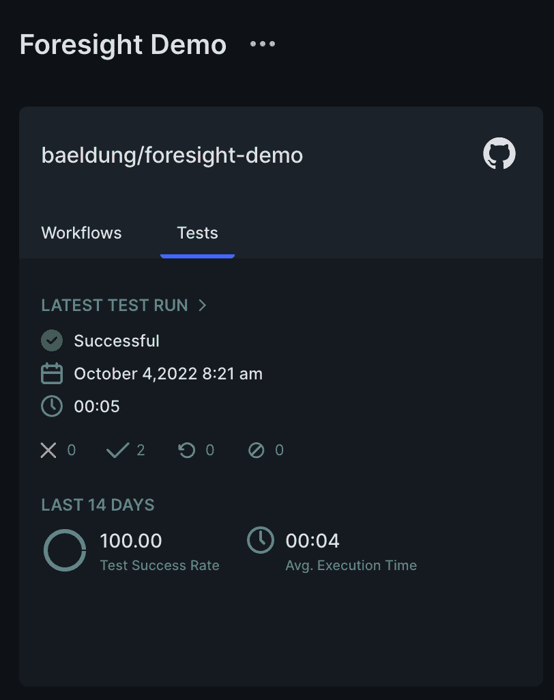](/web/20221109113153/https://www.baeldung.com/wp-content/uploads/2022/11/Screenshot-2022-10-05-at-07.33.12.png)

我们还可以访问有关我们工作流程的更深入的详细信息。这使我们能够准确地看到在这次运行和最近的运行中执行了哪些步骤以及它们花费了多长时间，从而了解哪些步骤花费的时间最多:

[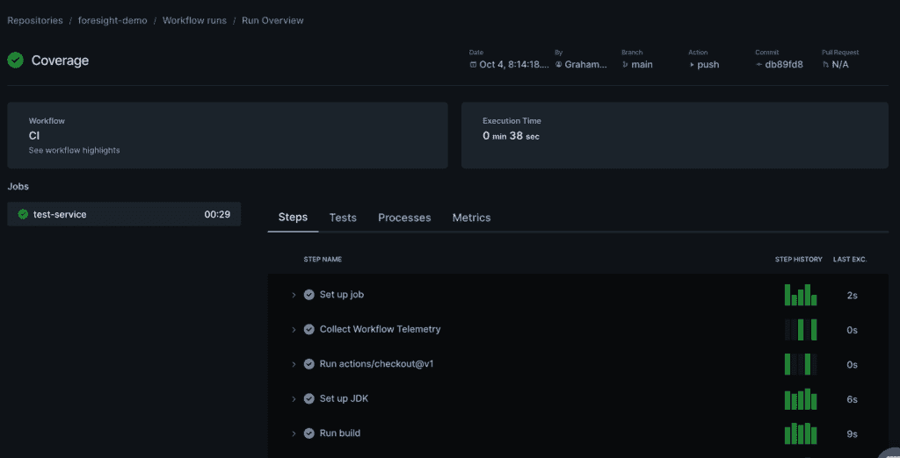](/web/20221109113153/https://www.baeldung.com/wp-content/uploads/2022/11/Screenshot-2022-10-06-at-07.52.41.png)

## 5.麻烦的构建

有时，我们会遇到测试缓慢和/或失败的麻烦构建。预见有助于我们准确地看到事情发生的地方，这样我们就可以更容易地改进事情。

任何给定测试运行的测试运行概述页不仅会向我们显示整个测试运行的概述，还会显示一些关于此类问题可能出现的位置的详细信息:

[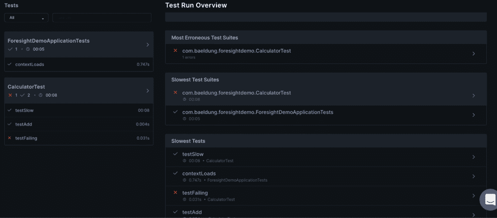](/web/20221109113153/https://www.baeldung.com/wp-content/uploads/2022/11/Screenshot-2022-10-11-at-07.52.52.png)

**这向我们展示了在这次测试运行**中最有问题的测试套件——失败最多、运行时间最长的测试套件。它还向我们展示了那些套件中运行时间最长的单个测试。这里我们可以看到`CalculatorTest`出现了测试失败，并且运行了很长时间。在这个范围内，我们可以看到`testSlow`用了 8 秒完成。这立即给了我们改进的空间。

单击单个测试套件，我们可以看到相同的摘要，但只是针对这一个套件，而不是整个项目:

[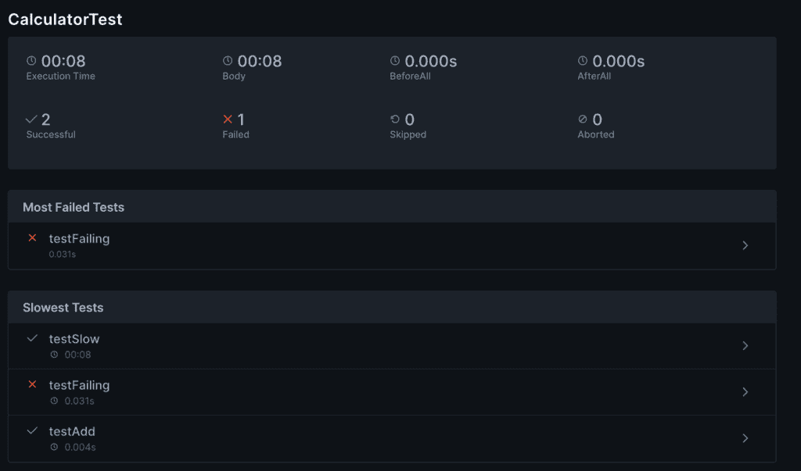](/web/20221109113153/https://www.baeldung.com/wp-content/uploads/2022/11/Screenshot-2022-10-11-at-07.58.23.png)

这让我们将注意力集中在一个测试套件上，并确定在这个套件中，我们可以在哪里做最好的改进。

此外，单击其中一个测试本身会向我们显示更多信息。如果测试运行失败，它会向我们显示失败的原因:

[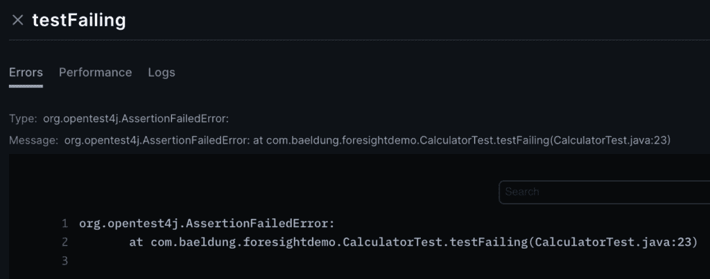](/web/20221109113153/https://www.baeldung.com/wp-content/uploads/2022/11/Screenshot-2022-10-11-at-08.00.50.png)

这与我们自己在 IDE 中运行测试时所看到的没有什么不同，但是能够预见到这一点会非常方便，尤其是当我们在一个地方调查许多错误的时候。

然而，真正有趣的地方是测试的过去表现。此屏幕上的“Performance ”(性能)选项卡向我们显示了此精确测试过去运行的摘要。这向我们显示了哪些运行是成功的或失败的，以及每个测试运行花费了多长时间:

[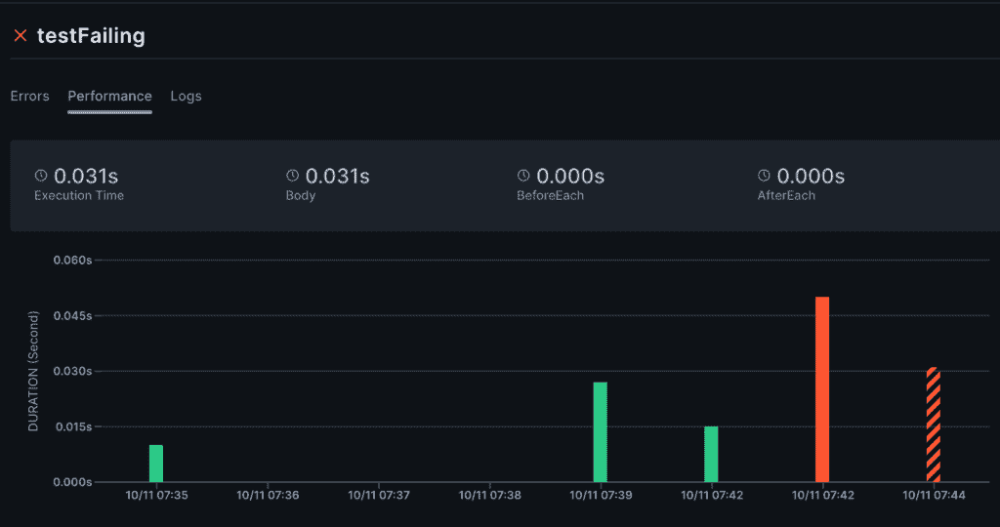](/web/20221109113153/https://www.baeldung.com/wp-content/uploads/2022/11/Screenshot-2022-10-11-at-08.03.05.png)

这将让我们快速确定测试何时开始出现问题。这反过来将使我们能够缩小导致问题的原因——否则可能需要付出巨大努力。

## 6.麻烦的工作流程

同样，我们可以检查单独的测试运行，以确定问题所在，并更容易地修复它们，我们也有能力对整个工作流这样做。这让我们看到问题出在哪里，整个工作流程中的时间花在哪里，而不仅仅是在测试中:

[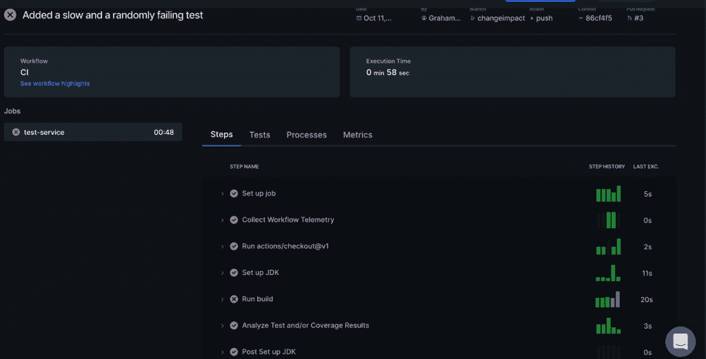](/web/20221109113153/https://www.baeldung.com/wp-content/uploads/2022/11/Screenshot-2022-10-11-at-08.14.43.png)

在这里，我们可以看到该工作流运行组成它的单个作业，以及每个作业的组成步骤。我们还可以快速查看这次运行和前几次运行的每一步所用的时间。最后，我们可以看到哪些步骤是成功的，哪些是失败的。这让我们迅速缩小问题所在的范围，以便改进。

如果我们试图提高 CI 构建的速度，我们可以进一步单击“Processes”选项卡，以查看每个步骤正在做什么以及时间在哪里流逝:

[](/web/20221109113153/https://www.baeldung.com/wp-content/uploads/2022/11/Screenshot-2022-10-11-at-08.18.44.png)

这里我们可以看到“setup-java”和“bash”操作花费的时间最长。此外，在“bash”动作之下，我们可以看到实际上是运行“java”花费了时间。在此范围内，我们可以看到“万无一失”占据了大部分时间。

最后，我们可以点击“Metrics”选项卡，查看运行测试的服务器的资源使用情况:

[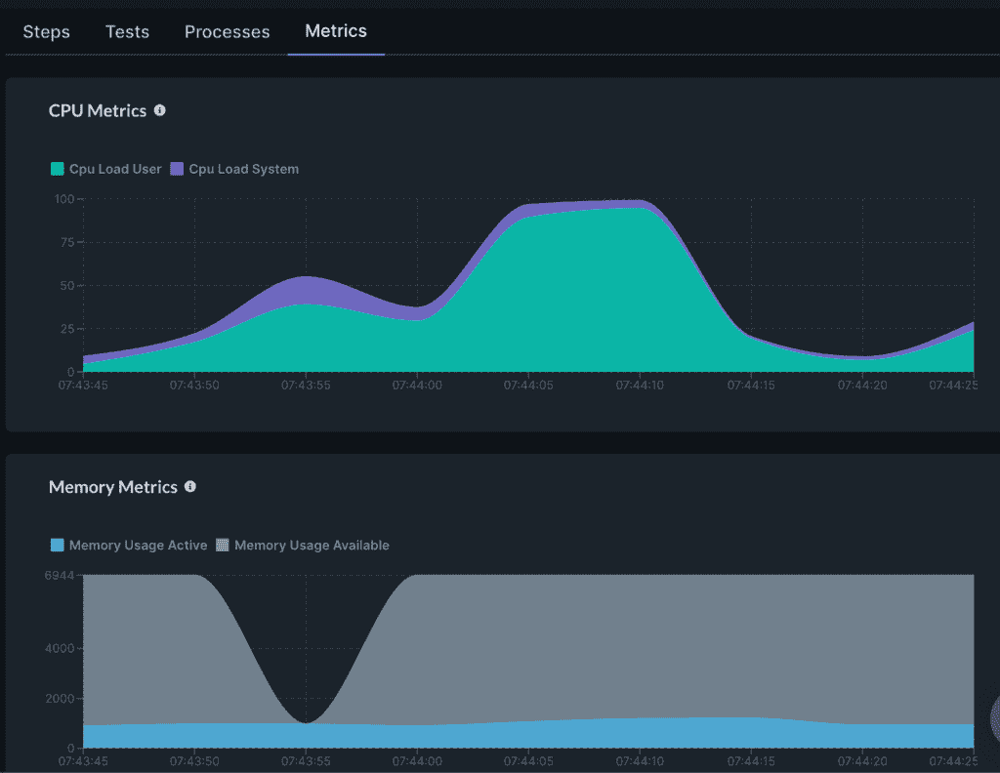](/web/20221109113153/https://www.baeldung.com/wp-content/uploads/2022/11/Screenshot-2022-10-11-at-08.22.37.png)

这让我们可以看到整个工作流运行过程中 CPU、内存、网络和磁盘的使用情况。这有助于了解为什么它的运行速度比我们希望的要慢。在这里，我们可以看到 CPU 使用率达到高峰，这与 Java 构建运行的时间相关。由此，我们可以确定我们可能受到 CPU 的限制——也就是说，构建忙于做一些事情，而不是等待其他资源。

## 7 .**。变更影响分析**

Foresight 提供的更强大的功能之一是变更影响分析。这让我们能够洞察拉取请求中的变更质量。具体地说，它让我们将所做的变更与测试覆盖相关联，以查看我们的变更在哪里得到了彻底的测试，以及它们在哪里可以从额外的覆盖中受益。

要做到这一点，很重要的一点是，我们已经将 GitHub 动作配置为既可以运行 pull 请求，也可以运行 push 请求。我们可以通过更新`on`部分来做到这一点:

```java
on:
  push:
  pull_request:
    types:
      - opened
      - edited
      - reopened
      - synchronize
```

这样做的效果是，每次我们打开或更新一个拉取请求时，我们都会运行这个工作流。这意味着我们将把工作流程数据上传到 Foresight。

这反过来意味着，当我们查看工作流运行的测试细节时，我们将获得一些额外的信息:

[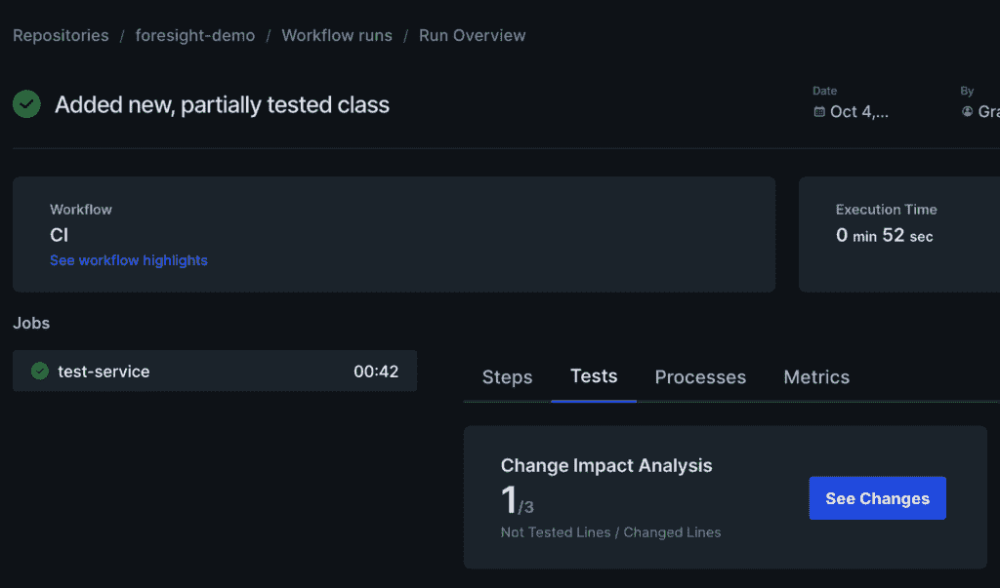](/web/20221109113153/https://www.baeldung.com/wp-content/uploads/2022/11/Screenshot-2022-10-06-at-08.21.26.png)

然后，我们可以点击查看该拉取请求中的实际变更，并在其上覆盖覆盖详细信息。这立即让我们洞察到测试充分覆盖了哪些变更:

[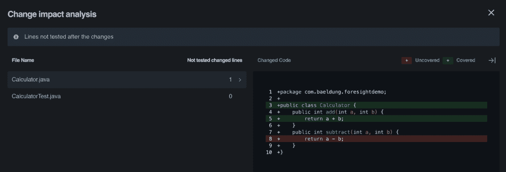](/web/20221109113153/https://www.baeldung.com/wp-content/uploads/2022/11/Screenshot-2022-10-06-at-08.23.09.png)

在这里，我们可以立即看到我们已经更改了两个类，其中一个添加了没有足够测试覆盖率的行。这告诉我们，要么`subtract` 方法将受益于额外的测试覆盖，要么它是不必要的，我们可以删除它。

## 8。总结

在这里，我们引入了预见作为一种工具，以提高 CI 渠道的可见性，让我们更好地了解正在发生的事情以及我们可以改进的地方。为什么不在您的项目中尝试一下，看看它能带来哪些见解？