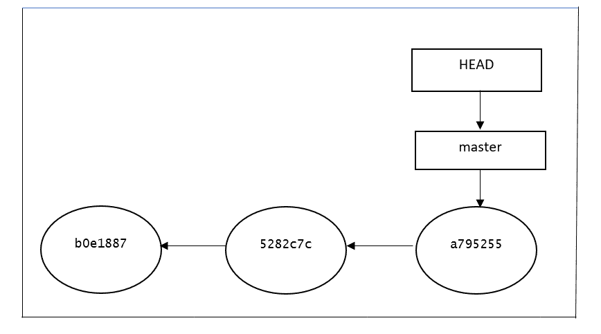
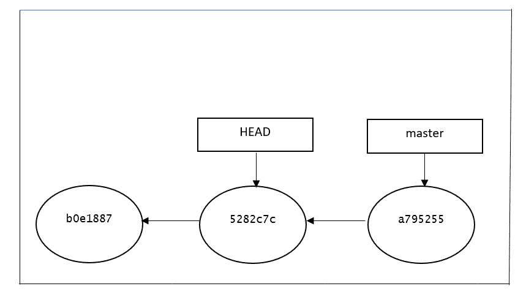
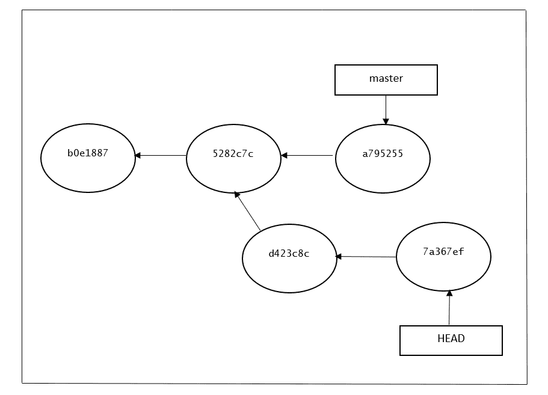

# 理解 Git 中分离的头

> 原文：<https://web.archive.org/web/20220930061024/https://www.baeldung.com/git-detached-head>

## 1.概观

在使用 git 时，遇到神秘状态并不罕见。但是，有一天最有可能看到“超脱头”。

在本教程中，我们将讨论什么是分离头，以及它是如何工作的。我们将介绍如何在 Git 中导航进出一个分离的头。

## 2。Git 中的 HEAD 是什么

当我们创建一个 commit 时，Git 存储了存储库中所有文件的状态记录。标题是另一种重要的参考类型。**HEAD 的目的是跟踪 Git repo 中的当前点**。换句话说，HEAD 回答了这个问题，“我现在在哪里？”：

```java
$git log --oneline
a795255 (HEAD -> master) create 2nd file
5282c7c appending more info
b0e1887 creating first file
```

例如，当我们使用 log 命令时，Git 如何知道应该从哪个提交开始显示结果呢？HEAD 提供了答案。当我们创建一个新的提交时，它的父代由 HEAD 当前指向的位置来指示。

因为 Git 具有如此高级的版本跟踪特性，所以我们可以回到存储库中的任何时间点来查看它的内容。

能够回顾过去的提交还让我们看到一个存储库或者一个特定的文件或者一组文件是如何随着时间的推移而发展的。当我们检查一个不是分支的提交时，我们将进入“分离头状态”。这是指当我们正在查看一个提交，而不是存储库中最近的提交时。

## 3.分离头部的示例

**大多数时候，头指向一个分支名称。当我们添加一个新的提交时，我们的分支引用被更新以指向它，但是 HEAD 保持不变。当我们改变分支时，HEAD 被更新以指向我们已经切换到的分支。所有这些意味着，在上面的场景中，HEAD 是“当前分支中最后一次提交”的同义词。这是头部连接到分支的正常状态:**

[](/web/20221023083938/https://www.baeldung.com/wp-content/uploads/2021/09/image-with-paints.png)

正如我们所看到的，HEAD 指向 master 分支，master 分支指向最后一次提交。一切看起来都很完美。但是，在运行以下命令后，repo 位于一个分离的头中:

```java
$ git checkout 5282c7c
Note: switching to '5282c7c'.

You are in 'detached HEAD' state. You can look around, make experimental
changes and commit them, and you can discard any commits you make in this
state without impacting any branches by switching back to a branch.

If you want to create a new branch to retain commits you create, you may
do so (now or later) by using -c with the switch command. Example:

  git switch -c <new-branch-name>

Or undo this operation with:

  git switch -

HEAD is now at 5282c7c appending more info

[[email protected]](/web/20221023083938/https://www.baeldung.com/cdn-cgi/l/email-protection): MINGW64 ~/git/detached-head-demo ((5282c7c...))
```

下面是当前 git 头的图形表示。由于我们已经签出到前一个提交，现在头指向`5282c7c` 提交，而主分支仍然指向同一个提交:

[](/web/20221023083938/https://www.baeldung.com/wp-content/uploads/2021/09/image-with-head-paints.png)

## 4.Git 分离头的好处

在通过检查一个特定的(`5282c7c)` 提交来分离头部之后，它允许我们回到项目历史中的前一点。

假设我们想检查一个给定的 bug 在上周二是否已经存在。我们可以使用 log 命令，按日期过滤，来启动相关的提交散列。然后，我们可以检查提交并测试应用程序，无论是手动还是通过运行我们的自动化测试套件。

如果我们不仅能回顾过去，还能改变它，那会怎么样？这就是分离的头允许我们做的。让我们回顾一下如何使用下面的命令来完成这项工作:

```java
echo "understanding git detached head scenarios" > sample-file.txt
git add .
git commit -m "Create new sample file"
echo "Another line" >> sample-file.txt
git commit -a -m "Add a new line to the file"
```

从第二次提交开始，我们现在有了两次额外的提交。让我们运行`git log –oneline`看看结果:

```java
$ git log --oneline
7a367ef (HEAD) Add a new line to the file
d423c8c create new sample file
5282c7c appending more info
b0e1887 creating first file
```

在 HEAD 指向`5282c7c` 提交之前，我们又添加了两个提交，下面的`d423c8c` 和`7a367ef**.**` 是在 HEAD 上完成的提交的图形表示。它显示现在 HEAD 指向最近提交的`7a367ef`:

[](/web/20221023083938/https://www.baeldung.com/wp-content/uploads/2021/09/image-with-final-head-commits.png)

如果想保留这些改动或者回到之前的，应该怎么做？我们将在下一点中看到。

## 5.情节

### 5.1。偶然

如果我们意外地达到了分离的 HEAD 状态——也就是说，我们并不想签出一个提交——那么返回就很容易了。在使用以下命令之前，只需检查我们所在的分支:

```java
git switch <branch-name> 
```

```java
git checkout <branch-name>
```

### 5.2。进行了实验性的更改，但需要放弃它们

在某些场景中，如果我们在分离 HEAD 后进行了更改，以测试某些功能或识别错误，但我们不想将这些更改合并到原始分支，那么我们可以使用与前一个场景相同的命令简单地放弃它，并返回到原始分支。

### 5.3。进行了实验性的更改，但需要保留它们

如果我们想保留用分离的头所做的更改，我们只需创建一个新的分支并切换到它。**我们可以在到达一个分离的头部之后或者在创建一个或多个提交之后立即创建它**。结果是一样的。唯一的限制是，我们应该在返回正常分支之前完成它。让我们在创建一个或多个提交后，使用以下命令在我们的演示报告中完成它:

```java
git branch experimental
git checkout experimental
```

**我们可以注意到`git log –oneline`的结果与之前完全相同，唯一的区别是最后一次提交中指出的分支名称:**

```java
$ git log --oneline
7a367ef (HEAD -> experimental) Add a new line to the file
d423c8c create new sample file
5282c7c appending more info
b0e1887 creating first file
```

## 6.结论

正如我们在这篇文章中看到的，分离的头部并不意味着我们的回购有问题。分离的头部只是我们的存储库可能处于的一种不太常见的状态。除了不是错误之外，它实际上非常有用，允许我们进行实验，然后我们可以选择保留或丢弃。