# git 合并和 rebase 的区别

> 原文：<https://web.archive.org/web/20220930061024/https://www.baeldung.com/git-merge-vs-rebase>

## 1。概述

当使用 git 作为我们的版本控制系统(VCS)时，我们可能会遵循任何分支策略，但是最终，我们可能需要将变更从一个特性分支集成到主分支。

在本教程中，我们将会看到两种不同的方法来整合从一个分支到另一个分支的变更。

## 2\. Git Rebase

简单来说，git rebase **将你的整个特性分支移到主分支**的顶端。它为原始特性分支中的每个提交创建全新的提交。

让我们创建一个新的存储库，并在存储库中创建一个特性分支，以了解如何重新构建工作:

```java
git clone <your_repository_here>
git branch testBranch1
git branch testBranch2
```

让我们在`testBranch1`特征分支中创建一个新文件，并提交更改:

```java
git add .
git commit -m "<Commit_Message_Here>"
git push --set-upstream origin testBranch1
git log
```

执行这些命令将得到下面的输出:

[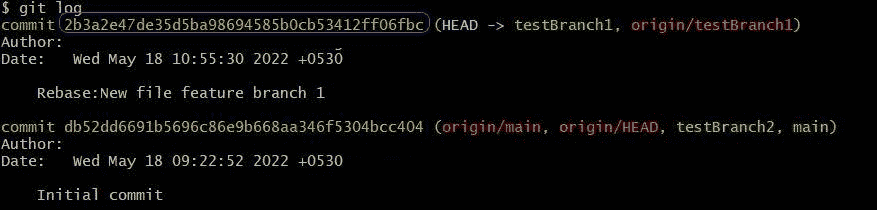](/web/20220810223629/https://www.baeldung.com/wp-content/uploads/2022/05/gitRebaseFeatureBranch1CommitLog.jpg)

现在，让我们试着在`main`分支上改变这个分支的基础:

```java
git rebase main
```

这将导致以下消息:

[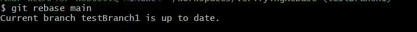](/web/20220810223629/https://www.baeldung.com/wp-content/uploads/2022/05/gitRebaseFeatureBranch1PostCommit.jpg)

由于在`main`分支中没有提交，我们不应该期望任何改变，如上所示。

现在，让我们将功能分支合并到主分支上:

```java
git checkout main
git merge testBranch1
git push
git log
```

这些命令将输出以下内容:

[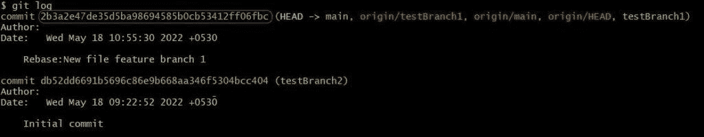](/web/20220810223629/https://www.baeldung.com/wp-content/uploads/2022/05/gitRebaseFeatureBranch1RebaseMergeCommitLog.jpg)

合并到主分支时，功能分支的提交 id 没有变化。这与快进合并的情况类似。

因为我们已经将`testBranch1`合并到了`main`分支中，`testBranch2`从它被剪切的地方丢失了提交。

我们来看看`testBranch2`是如何重基合并的。

让我们在`testBranch2`特征分支中创建一个新文件，并提交更改:

```java
git checkout testBranch2
git add .
git commit -m "<Commit_Message_Here>"
git push --set-upstream origin testBranch2
git log
```

在这些命令完成后，我们将看到:

[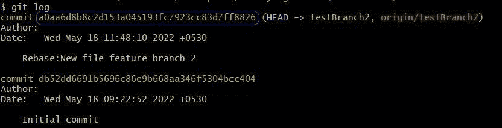](/web/20220810223629/https://www.baeldung.com/wp-content/uploads/2022/05/2_gitRebaseFeatureBranch2CommitLog.jpg)

现在让我们试着将这个分支基于`main`分支:

```java
git rebase main
```

这应该给我们一个不同于前一个案例的信息:

[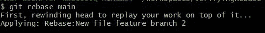](/web/20220810223629/https://www.baeldung.com/wp-content/uploads/2022/05/gitRebaseFeatureBranch2PostCommit.jpg)

由于在`main` 分支上有一些提交，特性分支是基于它的。现在让我们合并主分支上的 featureBranch2。我们应该**期望`featureBranch2`的提交 id 在 rebase:** 之前和之后是不同的

```java
git checkout main
git merge testBranch2
git push
git log
```

这些命令将输出以下内容:

[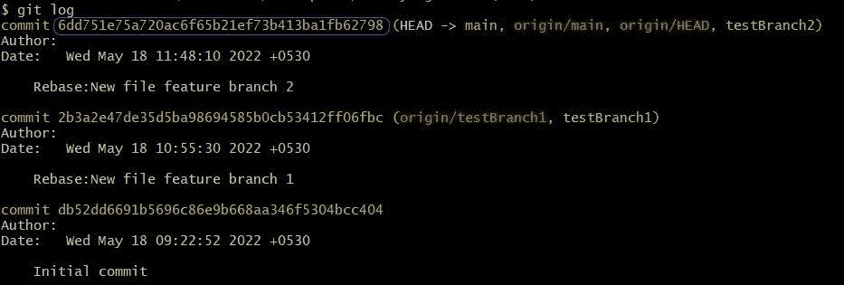](/web/20220810223629/https://www.baeldung.com/wp-content/uploads/2022/05/gitRebaseFeatureBranch2RebaseMergeCommitLog.jpg)

提交 id 与预期的不同，如果我们看一下 git 日志图，我们会看到回购具有线性历史:

```java
git log --graph --oneline
```

上面的命令显示了一个在单行中显示提交信息的图形结构:

[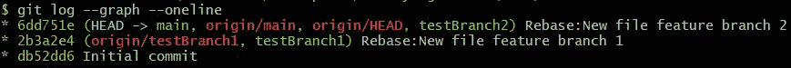](/web/20220810223629/https://www.baeldung.com/wp-content/uploads/2022/05/1_gitRebaseMergeBranchGraphFinal.jpg)

## 3\. Git Merge

Git merge 将获取我们正在合并的两个分支，**找到公共基础提交，然后在基础提交上播放来自两个分支的提交序列，以合并分支**。

让我们创建一个新的存储库和几个特性分支来理解 merge 是如何工作的:

在您的本地计算机中克隆存储库，并创建一个新的功能分支:

```java
git clone <your_repository_here>
git branch testBranch1
git branch testBranch2
```

让我们在`testBranch1`特征分支中创建一个新文件，并提交更改:

```java
git add .
git commit -m "<Commit_Message_Here>"
git push --set-upstream origin testBranch1
git log
```

执行这些命令将得到下面的输出:

[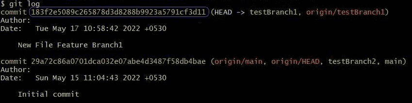](/web/20220810223629/https://www.baeldung.com/wp-content/uploads/2022/05/2_gitMergeFeatureBranch1CommitLog.jpg)

现在让我们使用合并命令将该特征分支合并到`main`分支上:

```java
git checkout main
git merge testBranch1
git push
git log
```

这些命令将输出以下内容:

[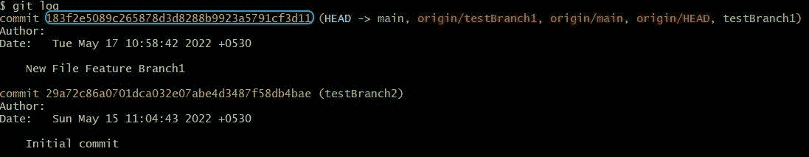](/web/20220810223629/https://www.baeldung.com/wp-content/uploads/2022/05/gitMergeFeatureBranch1MergeCommitLog.jpg)

我们可以注意到最新的提交 id 与之前的图像相同，但是头指针指向了`main`分支。

上面是一个简单的合并，当我们在处理我们的`feature`分支时，在`main`分支中没有变化。

让我们看看另一个场景，其中主分支和特性分支都有变化，以及 git 如何处理它们。

让我们在`testBranch2`特征分支中创建一个新文件，并提交更改:

```java
git checkout testBranch2
git add .
git commit -m "<Commit_Message_Here>"
git push --set-upstream origin testBranch2
git log
```

在这些命令完成后，我们将得到以下内容:

[](/web/20220810223629/https://www.baeldung.com/wp-content/uploads/2022/05/gitMergeFeatureBranch2CommitLog.jpg)

现在让我们使用合并命令将该特征分支合并到`main`分支上:

```java
git checkout main
git merge testBranch2
git log
```

然后我们可以在终端中看到它:

[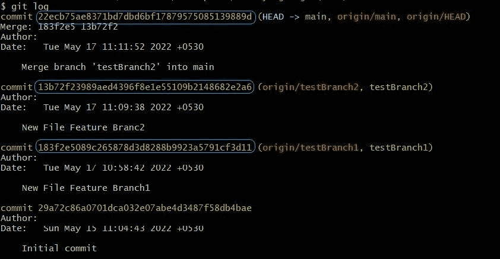](/web/20220810223629/https://www.baeldung.com/wp-content/uploads/2022/05/gitMergeFeatureBranch2MergeCommitLog.jpg)

有一个单独的合并提交，头部现在指向该合并提交，而原始提交对于两个特征分支都存在。最顶层的提交还有一个附加的信息键“Merge”，它有两个分支的提交 id。

我们还可以检查分支图并验证存储库的历史:

```java
git log --graph --oneline
```

上面的命令显示了一个在单行中显示提交信息的图形结构:

[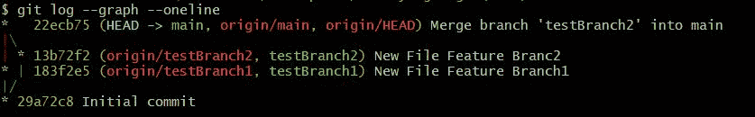](/web/20220810223629/https://www.baeldung.com/wp-content/uploads/2022/05/gitMergeBranchGraphFinal.jpg)

## 4。用例

每当我们要求我们的存储库历史是线性的，我们就应该重新建立基础。但是我们应该小心使用 rebase，而不是合并我们库之外的提交，因为其他合作者可能基于现有的提交有他们自己的工作。

对公共回购上已经推送的提交进行重新基础化将导致不同的提交 id，这可能会让 git 认为其他开发人员的主分支和您重新基础化的主分支已经发生了分歧。如果有多个合作者，这可能会给合并/同步造成潜在的困难。

## 5。结论

在本文中，我们讨论了 git merge 和 git rebase 之间的基本区别，每个开发人员在使用 git VCS 时都应该知道这一点。