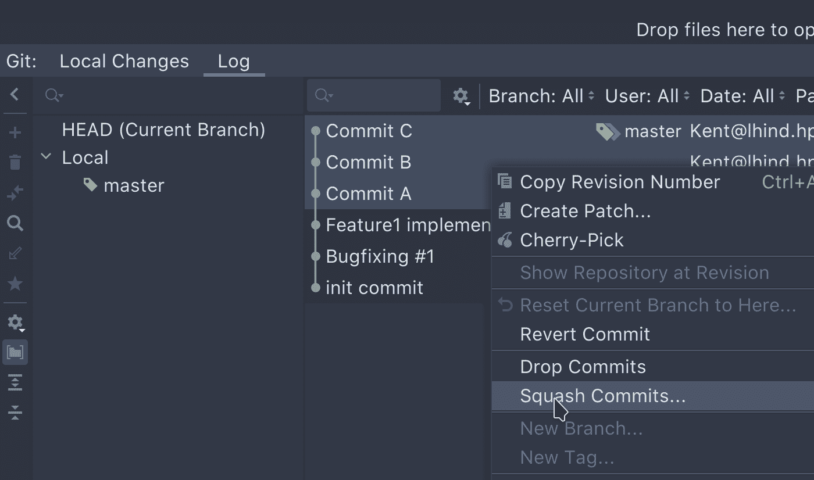
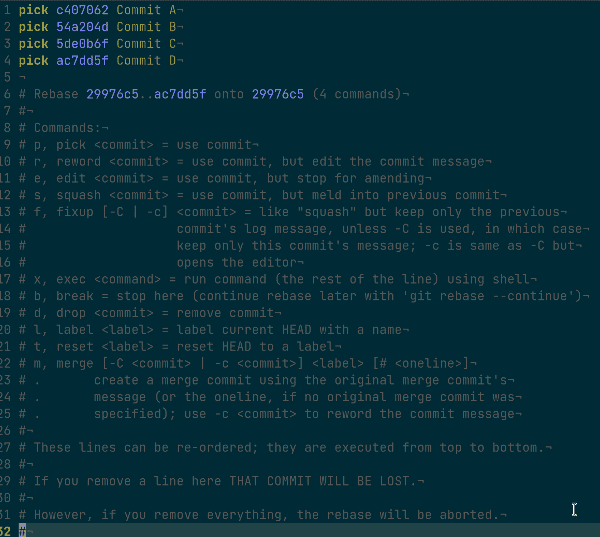
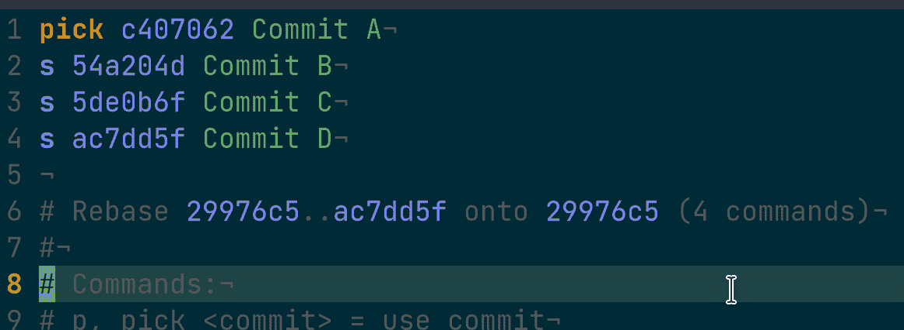

# 使用 Git 挤压最后的 X 次提交

> 原文：<https://web.archive.org/web/20220930061024/https://www.baeldung.com/ops/git-squash-commits>

## 1.概观

当我们谈论 [Git](https://web.archive.org/web/20221031205125/https://git-scm.com/) 工作流时，我们经常会听到“挤压”这个词。

在本教程中，我们将简要介绍什么是 Git 挤压。然后我们将讨论何时需要挤压提交。最后，我们将仔细看看如何挤压提交。

## 2。什么是 Git Squashing？

当我们在 Git 中说“挤压”时，意思是将多个连续的提交合并成一个。

让我们看一个例子:

```
 ┌───┐      ┌───┐     ┌───┐      ┌───┐
    ...   │ A │◄─────┤ B │◄────┤ C │◄─────┤ D │
          └───┘      └───┘     └───┘      └───┘

 After Squashing commits B, C, and D:

          ┌───┐      ┌───┐
    ...   │ A │◄─────┤ E │
          └───┘      └───┘

          ( The commit E includes the changes in B, C, and D.) 
```

在这个例子中，我们将提交 B、C 和 D 压缩成 e。

接下来，我们将讨论何时应该挤压提交。

## 3.何时粉碎提交？

简单地说，我们使用挤压来保持分支图的整洁。

让我们想象一下我们如何实现一个新特性。通常，在达到满意的结果之前，我们会提交多次，例如一些修复和测试。

然而，当我们实现了这个特性后，那些中间提交看起来是多余的。因此，我们可能希望将我们的提交压缩成一个。

另一个我们想要挤压提交的常见场景是合并分支。

很有可能，当我们开始开发一个新的特性时，我们会开始一个特性分支。假设我们已经在我们的特性分支中完成了 20 次提交。

因此，当我们将功能分支合并到主分支时，我们希望进行挤压，将 20 个提交合并为一个。这样，我们就能保持主枝的清洁。

## 4.如何压扁提交？

今天，一些现代的 ide，比如 IntelliJ T1 和 T2 Eclipse T3，已经集成了对通用 Git 操作的支持。这允许我们从 GUI 中挤压提交。

例如，在 IntelliJ 中，我们可以选择想要压缩的提交，然后在右键上下文菜单中选择“压缩提交”:

[](/web/20221031205125/https://www.baeldung.com/wp-content/uploads/2021/08/intellij_git.png)

然而，在本教程中，我们将重点关注使用 Git 命令挤压。

**我们应该注意，squash 不是 Git 命令，即使它是一个常见的 Git 操作。**也就是说，“`git squash …`”是无效的 Git 命令。

我们将提出两种不同的方法来压缩提交:

*   交互式 rebase: `[git rebase](https://web.archive.org/web/20221031205125/https://git-scm.com/docs/git-rebase) -i …`
*   与`–squash`选项合并: `[git merge](https://web.archive.org/web/20221031205125/https://git-scm.com/docs/git-merge) –squash`

接下来，让我们看看他们的行动。

## 5.通过交互式重置基础挤压

在我们开始之前，让我们创建一个 Git [别名](https://web.archive.org/web/20221031205125/https://git-scm.com/book/en/v2/Git-Basics-Git-Aliases) `slog`(代表短日志)来以简洁的视图显示 Git 提交日志:

```
git config --global alias.slog = log --graph --all --topo-order --pretty='format:%h %ai %s%d (%an)' 
```

我们准备了一个 Git 存储库作为示例:

```
$ git slog
* ac7dd5f 2021-08-23 23:29:15 +0200 Commit D (HEAD -> master) (Kai Yuan)
* 5de0b6f 2021-08-23 23:29:08 +0200 Commit C (Kai Yuan)
* 54a204d 2021-08-23 23:29:02 +0200 Commit B (Kai Yuan)
* c407062 2021-08-23 23:28:56 +0200 Commit A (Kai Yuan)
* 29976c5 2021-08-23 23:28:33 +0200 BugFix #1 (Kai Yuan)
* 34fbfeb 2021-08-23 23:28:19 +0200 Feature1 implemented (Kai Yuan)
* cbd350d 2021-08-23 23:26:19 +0200 Init commit (Kai Yuan)
```

Git 的交互式 rebase 将在默认编辑器中列出所有相关的提交。在这种情况下，这些是我们想要挤压的提交。

然后，我们可以根据需要控制每个提交和提交消息，并在编辑器中保存更改。

接下来，让我们挤压最后四个提交。

值得一提的是，**当我们说“最后的`X`提交”时，我们指的是来自`HEAD`的最后的`X`提交。**

因此，在这种情况下，这是最后四次提交:

```
* ac7dd5f ... Commit D (HEAD -> master)
* 5de0b6f ... Commit C 
* 54a204d ... Commit B 
* c407062 ... Commit A
```

此外，如果我们已经压缩了已经推送的提交，并且我们想要发布压缩的结果，我们必须进行强制推送。

值得一提的是，强制推送到公共存储库可能是一个危险的操作，因为它可能会覆盖其他人的提交。

此外，当我们真的想要进行强制推送时，我们应该确保只强制推送所需的分支。

例如，我们可以**将`push.default`属性设置为`current`** ，这样只有当前的分支会被推送到/强制推送到远程存储库。

或者，我们可以通过在要推送的`refspec`前添加一个“+”来强制推送至一个分支。例如，`git push origin +feature`会强制推送到`feature`分支。

### 5.1.压扁最后的`X`次提交

下面是使用交互式 rebase 压缩最后一次`X`提交的语法:

```
git rebase -i HEAD~[X]
```

所以，这是我们应该运行的:

```
git rebase -i HEAD~4
```

在我们执行命令之后，Git 将启动系统默认编辑器(本例中的 Vim 编辑器),其中包含我们想要压缩的提交和交互式 rebase 帮助信息:

[](/web/20221031205125/https://www.baeldung.com/wp-content/uploads/2021/08/rebase.png)

正如我们在上面的截图中看到的，我们想要压缩的所有四个提交都在编辑器中用`pick`命令列出。

在随后的注释行中有关于如何控制每个提交和提交消息的详细指南。

例如，我们可以将提交的`pick`命令改为`s`或`squash`来挤压它们:

[](/web/20221031205125/https://www.baeldung.com/wp-content/uploads/2021/08/rebase-1.png)

如果我们保存更改并退出编辑器，Git 将按照我们的指示进行重置:

```
$ git rebase -i HEAD~4
[detached HEAD f9a9cd5] Commit A
 Date: Mon Aug 23 23:28:56 2021 +0200
 1 file changed, 1 insertion(+), 1 deletion(-)
Successfully rebased and updated refs/heads/master.
```

现在，如果我们再次检查 Git 提交日志，我们将看到以下内容:

```
$ git slog
* f9a9cd5 2021-08-23 23:28:56 +0200 Commit A (HEAD -> master) (Kai Yuan)
* 29976c5 2021-08-23 23:28:33 +0200 BugFix #1 (Kai Yuan)
* 34fbfeb 2021-08-23 23:28:19 +0200 Feature1 implemented (Kai Yuan)
* cbd350d 2021-08-23 23:26:19 +0200 Init commit (Kai Yuan)
```

如`slog`输出所示，我们已经将最后四个提交压缩成一个新的提交，`f9a9cd5​`。

现在，如果我们看一下提交的完整日志，我们可以看到所有被压缩的提交的消息被组合在一起:

```
$ git log -1
commit f9a9cd50a0d11b6312ba4e6308698bea46e10cf1 (HEAD -> master)
Author: Kai Yuan
Date:   2021-08-23 23:28:56 +0200

    Commit A

    Commit B

    Commit C

    Commit D 
```

### 5.2.当`X`相对较大时

我们已经知道命令`git rebase -i HEAD~X `非常简单，可以终止最后的`X`提交。

然而，当我们的分支中有相当多的提交时，计算一个更大的`X`数可能是一件痛苦的事情。此外，它容易出错。

**当`X`不容易计数时，我们可以找到我们想要重新“归入”的提交散列，并运行命令`git rebase -i hash_onto`。**

让我们看看它是如何工作的:

```
$ git slog
e7cb693 2021-08-24 15:00:56 +0200 Commit F (HEAD -> master) (Kai Yuan)
2c1aa63 2021-08-24 15:00:45 +0200 Commit E (Kai Yuan)
ac7dd5f 2021-08-23 23:29:15 +0200 Commit D (Kai Yuan)
5de0b6f 2021-08-23 23:29:08 +0200 Commit C (Kai Yuan)
54a204d 2021-08-23 23:29:02 +0200 Commit B (Kai Yuan)
c407062 2021-08-23 23:28:56 +0200 Commit A (Kai Yuan)
29976c5 2021-08-23 23:28:33 +0200 BugFix #1 (Kai Yuan)
34fbfeb 2021-08-23 23:28:19 +0200 Feature1 implemented (Kai Yuan)
cbd350d 2021-08-23 23:26:19 +0200 Init commit (Kai Yuan)
```

如`git slog`所示，在这个分支中，我们有一些提交。

现在，假设我们想要压缩所有提交，并使用消息`BugFix #1`重新基于提交`29976c5` 。

因此，我们不必计算我们需要挤压多少个提交。相反，我们可以执行命令`git rebase -i 29976c5.`

我们已经知道，我们需要在编辑器中将`pick`命令改为`squash`，Git 将按照我们的预期进行压缩:

```
$ git rebase -i 29976c5
[detached HEAD aabf37e] Commit A
 Date: Mon Aug 23 23:28:56 2021 +0200
 1 file changed, 1 insertion(+), 1 deletion(-)
Successfully rebased and updated refs/heads/master.

$ git slog
* aabf37e 2021-08-23 23:28:56 +0200 Commit A (HEAD -> master) (Kai Yuan)
* 29976c5 2021-08-23 23:28:33 +0200 BugFix #1 (Kai Yuan)
* 34fbfeb 2021-08-23 23:28:19 +0200 Feature1 implemented (Kai Yuan)
* cbd350d 2021-08-23 23:26:19 +0200 Init commit (Kai Yuan)
```

## 6.通过与`–squash`选项合并挤压

我们已经看到了如何使用 Git 交互式 rebase 来挤压提交。这可以有效地清理分支中的提交图。

然而，我们有时会在处理特性分支时进行多次提交。在我们开发了特性之后，我们通常想要将特性分支合并到主分支，比如说“主”。

我们希望**保持主分支图的整洁，例如，一个特性，一个提交。**但是我们不关心在我们的特性分支中有多少提交。

在这种情况下，我们可以使用 commit `git merge –squash`命令来实现。

我们通过一个例子来了解一下:

```
$ git slog
* 0ff435a 2021-08-24 15:28:07 +0200 finally, it works. phew! (HEAD -> feature) (Kai Yuan)
* cb5fc72 2021-08-24 15:27:47 +0200 fix a typo (Kai Yuan)
* 251f01c 2021-08-24 15:27:38 +0200 fix a bug (Kai Yuan)
* e8e53d7 2021-08-24 15:27:13 +0200 implement Feature2 (Kai Yuan)
| * 204b03f 2021-08-24 15:30:29 +0200 Urgent HotFix2 (master) (Kai Yuan)
| * 8a58dd4 2021-08-24 15:30:15 +0200 Urgent HotFix1 (Kai Yuan)
|/  
* 172d2ed 2021-08-23 23:28:56 +0200 BugFix #2 (Kai Yuan)
* 29976c5 2021-08-23 23:28:33 +0200 BugFix #1 (Kai Yuan)
* 34fbfeb 2021-08-23 23:28:19 +0200 Feature1 implemented (Kai Yuan)
* cbd350d 2021-08-23 23:26:19 +0200 Init commit (Kai Yuan)
```

正如上面的输出所示，在这个 Git 存储库中，我们已经在`feature`分支中实现了“Feature2”。

在我们的`feature`分支中，我们已经提交了四次。

现在我们想通过一次提交将结果合并回`master`分支，以保持`master`分支干净:

```
$ git checkout master
Switched to branch 'master'

$ git merge --squash feature
Squash commit -- not updating HEAD
Automatic merge went well; stopped before committing as requested
```

与常规的合并不同，当我们使用`–squash`选项执行命令`git merge`时，Git 不会自动创建合并提交。

**相反，它将所有来自源分支(本场景中的`feature`分支)的变更转化为工作副本**中的本地变更:

```
$ git status
On branch master
Changes to be committed:
  (use "git restore --staged <file>..." to unstage)
	modified:   readme.md
```

在这个例子中,“特征 2”的所有改变都是关于`readme.md`文件的。

我们需要提交更改以完成合并:

```
$ git commit -am'Squashed and merged the Feature2 branch'
[master 565b254] Squashed and merged the Feature2 branch
 1 file changed, 4 insertions(+) 
```

现在让我们检查分支图:

```
$ git slog
* 565b254 2021-08-24 15:53:05 +0200 Squashed and merged the Feature2 branch (HEAD -> master) (Kai Yuan)
* 204b03f 2021-08-24 15:30:29 +0200 Urgent HotFix2 (Kai Yuan)
* 8a58dd4 2021-08-24 15:30:15 +0200 Urgent HotFix1 (Kai Yuan)
| * 0ff435a 2021-08-24 15:28:07 +0200 finally, it works. phew! (feature) (Kai Yuan)
| * cb5fc72 2021-08-24 15:27:47 +0200 fix a typo (Kai Yuan)
| * 251f01c 2021-08-24 15:27:38 +0200 fix a bug (Kai Yuan)
| * e8e53d7 2021-08-24 15:27:13 +0200 implement Feature2 (Kai Yuan)
|/  
* 172d2ed 2021-08-23 23:28:56 +0200 BugFix #2 (Kai Yuan)
* 29976c5 2021-08-23 23:28:33 +0200 BugFix #1 (Kai Yuan)
* 34fbfeb 2021-08-23 23:28:19 +0200 Feature1 implemented (Kai Yuan)
* cbd350d 2021-08-23 23:26:19 +0200 Init commit (Kai Yuan)
```

我们可以看到，我们已经将`feature`分支中的所有更改合并到了`master`分支中，并且在`master`分支中有一个单独的提交`565b254`。

另一方面，在`feature`分支中，我们仍然有四次提交。

## 7.结论

在本文中，我们讨论了什么是 Git squashing，以及何时应该考虑使用它。

我们还学习了如何在 Git 中挤压提交。