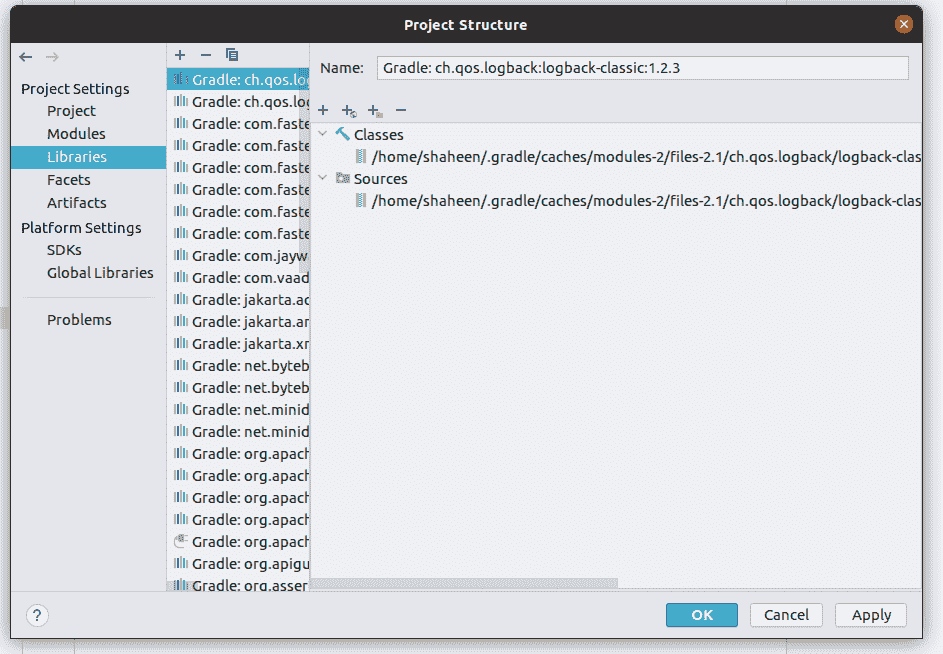

# 作为梯度依赖项的本地 JAR 文件

> 原文：<https://web.archive.org/web/20220930061024/https://www.baeldung.com/gradle-dependencies-local-jar>

## 1.概观

在本教程中，我们将关注如何将本地 JAR 文件添加到我们的 [Gradle](/web/20220926094700/https://www.baeldung.com/gradle) 依赖项中。

## 2.本地罐子

**在我们开始解释向 Gradle 添加本地 JAR 文件的过程之前，最好提一下，不建议手动添加公共存储库中可用的依赖项。**像 Gradle 这样的构建系统存在的最重要的原因之一就是自动完成这类事情。在 Gradle 之前，我们习惯于下载 JAR 文件，放在`libs`文件夹中。现在格雷尔为我们自动处理这些事情。

然而，Gradle 仍然支持这一过程用于特殊目的，如定制 JAR 文件。

## 3.平面目录

如果我们想使用一个平面文件系统目录作为我们的存储库，我们需要向我们的`build.gradle` 文件添加以下内容:

```java
repositories {
    flatDir {
        dirs 'lib1', 'lib2'
    }
}
```

这使得 Gradle 在`lib1` 和 `lib2` 中寻找依赖关系。一旦我们设置了平面目录，我们就可以使用来自`lib1` 或 `lib2`文件夹的本地 JAR 文件:

```java
dependencies { implementation name: 'sample-jar-0.8.7' } 
```

## 4.文件集合

平面目录的另一种方法是不使用`flatdir:`直接提及文件

```java
implementation files('libs/a.jar', 'libs/b.jar')
```

## 5.文件树

我们可以告诉 Gradle 在某个目录中查找所有 JAR 文件，而不用缩小名称范围。如果我们不能或者不想将某些文件放在存储库中，这可能是有用的。但是我们必须小心这一点，因为它也可能增加不必要的依赖:

```java
implementation fileTree(dir: 'libs', include: '*.jar')
```

## 6.使用 IntelliJ

还有另一种方法来利用本地 jar 文件。首先，我们去`Project Structure`:

[](/web/20220926094700/https://www.baeldung.com/wp-content/uploads/2021/06/1.png)

然后，我们单击列表顶部的加号按钮，并选择 Java:

[](/web/20220926094700/https://www.baeldung.com/wp-content/uploads/2021/06/3.jpg)

然后一个对话窗口要求我们定位 JAR 文件。选择它之后，我们可以点击 OK，我们的项目就可以访问存档中的方法和类了。

## 7.结论

在本文中，我们研究了使用 JAR 文件的各种方法，这些 JAR 文件并不存放在 Gradle 项目的标准存储库中。