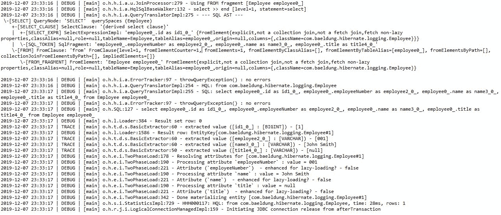

# Hibernate 中的各种日志级别

> 原文：<https://web.archive.org/web/20220930061024/https://www.baeldung.com/hibernate-logging-levels>

## 1。概述

因为 Hibernate 为我们处理与数据库的交互，所以我们能够快速开发与数据库相关的代码。但是，这可能会使调试与数据库相关的故障变得困难。

因此，查看 Hibernate 与数据库的交互会很有用。例如，Hibernate 生成的从表中读取数据的 SQL。

在本教程中，我们将看到 Hibernate 中不同级别的日志记录可以用来实现这个。

## 2。日志 SQL

在最基本的层面上，我们可以记录 Hibernate 生成的 SQL 语句，而不需要向它传递实际的参数值。

**Hibernate 使用类别`org.hibernate.SQL`来记录这些信息。**因此，我们要做的就是将该类别的日志记录级别设置为`DEBUG.`

在 Log4J 中，我们必须在配置 XML 中添加一个`logger`元素:

```java
<logger name="org.hibernate.SQL">
     <level value="debug"/>
</logger>
```

类似地，在 Log4J2 中，我们将添加一个`Logger`元素:

```java
<Logger name="org.hibernate.SQL" level="debug"/>
```

在 Logback 中，我们将添加一个`logger`元素:

```java
<logger name="org.hibernate.SQL" level="DEBUG" />
```

我们现在应该在日志中看到生成的 SQL:

```java
2019-12-07 23:04:23 | DEBUG | [main] o.h.SQL:127 - insert into Employee 
(employeeNumber, name, title, id) values (?, ?, ?, ?)
2019-12-07 23:04:23 | DEBUG | [main] o.h.SQL:127 - select employee0_.id as id1_0_, 
employee0_.employeeNumber as employee2_0_, employee0_.name as name3_0_, 
employee0_.title as title4_0_ from Employee employee0_
```

## 3。测井参数值

虽然通常生成的 SQL 足以识别问题，但有时我们可能还想查看传递给 SQL 语句的参数。

**Hibernate 使用日志级别为`TRACE`** 的`org.hibernate.type.descriptor.sql`类别记录输入参数和检索结果。现在，让我们将这个类别添加到我们的配置文件中。

在 Log4J 中，我们做到了:

```java
<logger name="org.hibernate.type.descriptor.sql"> 
    <level value="trace"/> 
</logger>
```

在 Log4J2 中:

```java
<Logger name="org.hibernate.type.descriptor.sql" level="trace"/>
```

最后，在 Logback 中:

```java
<logger name="org.hibernate.type.descriptor.sql" level="TRACE" />
```

因此，我们应该看到传递给 SQL 语句的参数值以及执行结果:

```java
2019-12-07 23:04:23 | DEBUG | [main] o.h.SQL:127 - insert into Employee (employeeNumber, name, title, id) 
values (?, ?, ?, ?)
2019-12-07 23:04:23 | TRACE | [main] o.h.t.d.s.BasicBinder:64 - binding parameter [1] 
as [VARCHAR] - [001]
2019-12-07 23:04:23 | TRACE | [main] o.h.t.d.s.BasicBinder:64 - binding parameter [2] 
as [VARCHAR] - [John Smith]
2019-12-07 23:04:23 | TRACE | [main] o.h.t.d.s.BasicBinder:52 - binding parameter [3] 
as [VARCHAR] - [null]
2019-12-07 23:04:23 | TRACE | [main] o.h.t.d.s.BasicBinder:64 - binding parameter [4] 
as [BIGINT] - [1]
2019-12-07 23:04:23 | DEBUG | [main] o.h.SQL:127 - select employee0_.id as id1_0_, 
employee0_.employeeNumber as employee2_0_, employee0_.name as name3_0_, 
employee0_.title as title4_0_ from Employee employee0_
2019-12-07 23:04:23 | TRACE | [main] o.h.t.d.s.BasicExtractor:60 - extracted value ([id1_0_] :
 [BIGINT]) - [1]
2019-12-07 23:04:23 | TRACE | [main] o.h.t.d.s.BasicExtractor:60 - extracted value ([employee2_0_] :
 [VARCHAR]) - [001]
2019-12-07 23:04:23 | TRACE | [main] o.h.t.d.s.BasicExtractor:60 - extracted value ([name3_0_] :
 [VARCHAR]) - [John Smith]
2019-12-07 23:04:23 | TRACE | [main] o.h.t.d.s.BasicExtractor:50 - extracted value ([title4_0_] :
 [VARCHAR]) - [null]
```

值得注意的是，我们不需要启用`org.hibernate.SQL`类别来查看以上信息。**我们可以独立启用和禁用这两个类别**。

但是，**启用`org.hibernate.SQL`是有意义的，这样我们就知道参数值与哪个 SQL 语句相关**。

## 4。激活休眠统计

除了 SQL 和 JDBC 参数值，Hibernate 还可以记录每个 SQL 语句的统计数据。这有助于识别潜在的性能问题。

Hibernate 使用类别`*org.hibernate.stat*`来记录这些信息。但是，Hibernate 并不总是生成这些统计信息，因为这会对性能产生不良影响。

首先，**我们必须通过将配置属性`*hibernate.generate_statistics*`设置为`*true*`** 来告诉 Hibernate 生成这些统计数据。

例如，我们可以在我们的`hibernate.cfg.xml`文件中设置这个属性:

```java
<property name="hibernate.generate_statistics">true</property>
```

除了这个属性，**将类别`*org.hibernate.stat*`设置为 DEBUG 将记录一个语句，其中包含执行的每个查询的统计信息**。它还会在会话结束时记录一个多行日志语句，其中包含汇总的统计信息:

```java
2019-12-07 23:25:18 | DEBUG | [main] o.h.s.i.StatisticsInitiator:101 - Statistics initialized 
[enabled=true]
2019-12-07 23:25:19 | DEBUG | [main] o.h.s.i.StatisticsImpl:729 - HHH000117: HQL: 
from com.baeldung.hibernate.logging.Employee, time: 22ms, rows: 1
2019-12-07 23:25:19 | INFO  | [main] o.h.e.i.StatisticalLoggingSessionEventListener:258 - 
Session Metrics {
    55600 nanoseconds spent acquiring 1 JDBC connections;
    178600 nanoseconds spent releasing 1 JDBC connections;
    2167200 nanoseconds spent preparing 2 JDBC statements;
    2426800 nanoseconds spent executing 2 JDBC statements;
    0 nanoseconds spent executing 0 JDBC batches;
    0 nanoseconds spent performing 0 L2C puts;
    0 nanoseconds spent performing 0 L2C hits;
    0 nanoseconds spent performing 0 L2C misses;
    47098900 nanoseconds spent executing 1 flushes (flushing a total of 1 entities 
    and 0 collections);
    0 nanoseconds spent executing 0 partial-flushes (flushing a total of 0 entities 
    and 0 collections)
}
```

请注意日志中的第一行，它表示统计信息已启用。

## 5。记录所有活动

**为了更深入地挖掘【Hibernate 与数据库的交互，**我们必须为类别`org.hibernate`** 启用日志记录。此类别包含 Hibernate 记录的所有消息。**

但是，我们必须小心使用这个类别，因为它可能会创建大量的日志输出:
[](/web/20221129004117/https://www.baeldung.com/wp-content/uploads/2019/12/hibernate-logs.jpg)

## 6。结论

在本教程中，我们看到了 Hibernate 中不同级别的日志记录。记录的信息在开发过程中非常有用。但是，在生产中实现这一点时，我们必须小心，因为它会对应用程序性能产生负面影响。

当然，伴随本教程的代码可以在 GitHub 上找到[。](https://web.archive.org/web/20221129004117/https://github.com/eugenp/tutorials/tree/master/persistence-modules/hibernate-enterprise)