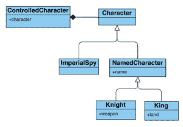

# jackson 2.12 中基于演绎的多态性

> 原文：<https://web.archive.org/web/20220930061024/https://www.baeldung.com/jackson-deduction-based-polymorphism>

## 1.概观

在本教程中，**我们将探索如何使用来自 [Jackson 库](/web/20220609194830/https://www.baeldung.com/jackson)的基于演绎的多态性特性。**

## 2.基于名称的多态性

让我们假设我们有一个类结构，如下图所示。

[](/web/20220609194830/https://www.baeldung.com/wp-content/uploads/2022/04/CharacterDiagram-1.png)

首先，`NamedCharacter`和`ImperialSpy` `classes`实现`the Character interface.`其次，`King and Knight classes`正在实现`NamedCharacter`类。最后，我们有一个`ControlledCharacter class,`，它包含一个玩家控制的角色的引用。

我们希望将 JSON 对象解析成 Java 对象，而不必修改接收到的 JSON 的结构。

所以让我们来看看类的定义。注意，对于基本接口，**,我们必须使用 Jackson 注释来声明我们想要使用哪个演绎。此外，我们还必须添加`@JsonSubTypes`注释来声明我们想要扣除的类。**

```java
@JsonTypeInfo(use = Id.NAME)
@JsonSubTypes({ @Type(ImperialSpy.class), @Type(King.class), @Type(Knight.class) })
public interface Character {
}
```

此外，我们还可以在接口`Character`、`King`和`Knight`类之间有一个中间类。因此，Jackson，我们也知道如何在这种情况下推导多态性:

```java
public class NamedCharacter implements Character {
    private String name;

    // standard setters and getters
}
```

随后，我们将实现字符`interface`的子类。在前面的代码示例中，我们已经将这些子类声明为子类型。因此，该实现不依赖于 Jackson 库:

```java
public class ImperialSpy implements Character {
}
```

```java
public class King extends NamedCharacter {
    private String land;

    // standard setters and getters
}
```

```java
public class Knight extends NamedCharacter {
    private String weapon;

    // standard setters and getters
}
```

我们想要映射的 JSON 示例如下:

```java
{
    "name": "Old King Allant",
    "land": "Boletaria",
}
```

首先，如果我们试图读取上面的 JSON 结构，Jackson 会抛出一个运行时异常，并显示消息`Could not resolve subtype of [simple type, class com.baeldung.jackson.deductionbasedpolymorphism.Character]: missing type id property ‘@type':`

```java
@Test
void givenAKingWithoutType_whenMapping_thenExpectAnError() {
    String kingJson = formatJson("{'name': 'Old King Allant', 'land':'Boletaria'}");
    assertThrows(InvalidTypeIdException.class, () -> objectMapper.readValue(kingJson, Character.class));
}
```

此外，`formatJson`实用程序方法通过将引号字符转换成双引号来帮助我们保持测试中的代码简单，正如`JSON `所要求的:

```java
public static String formatJson(String input) {
    return input.replaceAll("'", "\"");
}
```

因此，为了能够多态地推断出我们角色的类型，我们必须修改 JSON 结构并显式地添加对象的类型。因此，我们必须将多态行为与我们的 JSON 结构结合起来:

```java
{
    "@type": "King"
    "name": "Old King Allant",
    "land": "Boletaria",
}
```

```java
@Test
void givenAKing_whenMapping_thenExpectAKingType() throws Exception {
    String kingJson = formatJson("{'name': 'Old King Allant', 'land':'Boletaria', '@type':'King'}");

    Character character = objectMapper.readValue(kingJson, Character.class);
    assertTrue(character instanceof King);
    assertSame(character.getClass(), King.class);
    King king = (King) character;
    assertEquals("Boletaria", king.getLand());
}
```

## 3.基于演绎的多态性

为了激活基于演绎的多态性，我们唯一要做的改变就是使用`@JsonTypeInfo(use = Id.DEDUCTION):`

```java
@JsonTypeInfo(use = Id.DEDUCTION)
@JsonSubTypes({ @Type(ImperialSpy.class), @Type(King.class), @Type(Knight.class) })
public interface Character {
}
```

## 4.简单推理

让我们探索一下如何通过简单的推理以多态的方式读取 JSON。我们要读取的对象如下:

```java
{
    "name": "Ostrava, of Boletaria",
    "weapon": "Rune Sword",
}
```

首先，我们将读取一个`Character`对象中的值。然后，我们将测试`Jackson`是否正确地推导出了 JSON 的类型:

```java
@Test
void givenAKnight_whenMapping_thenExpectAKnightType() throws Exception {
    String knightJson = formatJson("{'name':'Ostrava, of Boletaria', 'weapon':'Rune Sword'}");

    Character character = objectMapper.readValue(knightJson, Character.class);

    assertTrue(character instanceof Knight);
    assertSame(character.getClass(), Knight.class);
    Knight king = (Knight) character;
    assertEquals("Ostrava, of Boletaria", king.getName());
    assertEquals("Rune Sword", king.getWeapon());
}
```

此外，如果 JSON 是一个空对象，Jackson 会将其解释为一个`ImperialSpy`，这是一个没有属性的类:

```java
@Test
void givenAnEmptyObject_whenMapping_thenExpectAnImperialSpy() throws Exception {
    String imperialSpyJson = "{}";

    Character character = objectMapper.readValue(imperialSpyJson, Character.class);

    assertTrue(character instanceof ImperialSpy);
}
```

同样，**空 JSON 对象也会被 Jackson** 推断为空对象:

```java
@Test
void givenANullObject_whenMapping_thenExpectANullObject() throws Exception {
    Character character = objectMapper.readValue("null", Character.class);

    assertNull(character);
}
```

## 5.不区分大小写的推理

**Jackson 也可以推导多态性，即使属性的大小写与**不匹配。首先，我们将实例化一个启用了`ACCEPT_CASE_INSENSITIVE_PROPERTIES `的对象映射器:

```java
ObjectMapper objectMapper = JsonMapper.builder().configure(MapperFeature.ACCEPT_CASE_INSENSITIVE_PROPERTIES, true).build();
```

然后，使用实例化的`objectMapper, `我们可以测试多态性是否被正确地推导出来:

```java
{
    "NaMe": "Ostrava, of Boletaria",
    "WeaPON": "Rune Sword",
}
```

```java
@Test
void givenACaseInsensitiveKnight_whenMapping_thenExpectKnight() throws Exception {
    String knightJson = formatJson("{'NaMe':'Ostrava, of Boletaria', 'WeaPON':'Rune Sword'}");

    Character character = objectMapper.readValue(knightJson, Character.class);

    assertTrue(character instanceof Knight);
    assertSame(character.getClass(), Knight.class);
    Knight knight = (Knight) character;
    assertEquals("Ostrava, of Boletaria", knight.getName());
    assertEquals("Rune Sword", knight.getWeapon());
}
```

## 6.包含推理

**我们还可以推导出包含在其他对象中的对象的多态性**。我们将使用`ControlledCharacter`类定义来演示以下 JSON 的映射:

```java
{
    "character": {
        "name": "Ostrava, of Boletaria",
        "weapon": "Rune Sword"
    }
}
```

```java
@Test
void givenAKnightControlledCharacter_whenMapping_thenExpectAControlledCharacterWithKnight() throws Exception {
    String controlledCharacterJson = formatJson("{'character': {'name': 'Ostrava, of Boletaria', 'weapon': 'Rune Sword'}}");

    ControlledCharacter controlledCharacter = objectMapper.readValue(controlledCharacterJson, ControlledCharacter.class);
    Character character = controlledCharacter.getCharacter();

    assertTrue(character instanceof Knight);
    assertSame(character.getClass(), Knight.class);
    Knight knight = (Knight) character;
    assertEquals("Ostrava, of Boletaria", knight.getName());
    assertEquals("Rune Sword", knight.getWeapon());
}
```

## 7.结论

在本教程中，**我们已经探索了如何使用 Jackson 库**来使用基于演绎的多态性。

本文附带的源代码可以在 GitHub 上找到。