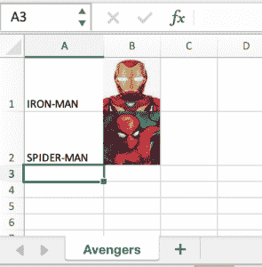

# 用 Java 将图像添加到 Excel 文件的单元格中

> 原文：<https://web.archive.org/web/20220930061024/https://www.baeldung.com/java-add-image-excel>

## 1.概观

在本教程中，我们将学习如何用 Java 向 Excel 文件中的单元格添加图像。

我们将动态创建一个 Excel 文件，并使用`[apache-poi](/web/20220627184359/https://www.baeldung.com/java-microsoft-excel).`向单元格添加一个图像

## 2.项目设置和相关性

Java 应用程序可以使用`apache-poi`动态地读取、写入和修改 Excel 电子表格的内容。它支持`.xls`和`.xlsx`两种 Excel 格式。

### 2.1.Apache Poi API 的 Maven 依赖性

首先，让我们将`[poi](https://web.archive.org/web/20220627184359/https://search.maven.org/classic/#search%7Cga%7C1%7Cg%3A%22org.apache.poi%22%20AND%20a%3A%22poi-ooxml%22)`依赖项添加到我们的项目中:

```java
<dependency>
    <groupId>org.apache.poi</groupId>
    <artifactId>poi</artifactId>
    <version>3.15</version>
</dependency>
```

### 2.2.Excel 工作簿创建

First, let's create a workbook and sheet to write in. We can choose either `XSSFWorkbook`, which works with `.xlsx` files, or `HSSFWorkbook`, which works with `.xls` files. Let's use `XSSFWorkbook`:

```java
Workbook workbook = new XSSFWorkbook();
Sheet sheet = workbook.createSheet("Avengers");
Row row1 = sheet.createRow(0);
row1.createCell(0).setCellValue("IRON-MAN");
Row row2 = sheet.createRow(1);
row2.createCell(0).setCellValue("SPIDER-MAN"); 
```

在这里，我们创建了一个`Avengers`表，并用两个名字填充了`A1`和`A2`单元格。接下来，我们将把复仇者的图像添加到单元格`B1`和`B2`。

## 3.在工作簿中插入图像

### 3.1.从本地文件读取图像

要添加图像，我们首先需要从我们的项目目录中读取它们。对于我们的项目，我们在`resources`目录中有两个图像:

*   `/src/main/resources/ironman.png`
*   `/src/main/resources/spiderman.png`

```java
InputStream inputStream1 = TestClass.class.getClassLoader()
    .getResourceAsStream("ironman.png");
InputStream inputStream2 = TestClass.class.getClassLoader()
    .getResourceAsStream("spiderman.png"); 
```

### 3.2.将图像`InputStream`转换成字节数组

接下来，让我们将图像转换成字节数组。这里，我们将使用来自`apache-poi`的`IOUtils`:

```java
byte[] inputImageBytes1 = IOUtils.toByteArray(inputStream1);
byte[] inputImageBytes2 = IOUtils.toByteArray(inputStream2); 
```

### 3.3.在工作簿中添加图片

现在，我们将使用字节数组向我们的`workbook.`添加一张图片。[支持的图片类型](https://web.archive.org/web/20220627184359/https://poi.apache.org/components/spreadsheet/quick-guide.html#Images)是 PNG、JPG 和 DIB。我们在这里使用 PNG:

```java
int inputImagePictureID1 = workbook.addPicture(inputImageBytes1, Workbook.PICTURE_TYPE_PNG);
int inputImagePictureID2 = workbook.addPicture(inputImageBytes2, Workbook.PICTURE_TYPE_PNG); 
```

作为这一步的结果，我们将获得用于创建`Drawing`对象的每张图片的索引。

### 3.4.创建一个`Drawing`容器

绘图家长是所有形状的顶级容器。这将返回一个`Drawing`接口——在我们的例子中是`XSSFDrawing`对象。我们将使用这个对象来创建图片，并将其放入我们定义的单元格中。

让我们创建绘图家长:

```java
XSSFDrawing drawing = (XSSFDrawing) sheet.createDrawingPatriarch();
```

## 4.在单元格中添加图像

现在，我们准备将图像添加到我们的单元格中。

### 4.1.创建锚点对象

首先，我们将创建一个客户端锚点对象，它附加到一个 Excel 工作表，用于设置图像在 Excel 工作表中的位置。它锚定在左上角和右下角的单元格上。

我们将创建两个锚点对象，每个图像一个:

```java
XSSFClientAnchor ironManAnchor = new XSSFClientAnchor();
XSSFClientAnchor spiderManAnchor = new XSSFClientAnchor();
```

接下来，我们需要指定图像与锚对象的相对位置。

让我们将第一张图片放入单元格`B1`:

```java
ironManAnchor.setCol1(1); // Sets the column (0 based) of the first cell.
ironManAnchor.setCol2(2); // Sets the column (0 based) of the Second cell.
ironManAnchor.setRow1(0); // Sets the row (0 based) of the first cell.
ironManAnchor.setRow2(1); // Sets the row (0 based) of the Second cell.
```

同样，我们将第二幅图像放在单元格`B2`中:

```java
spiderManAnchor.setCol1(1);
spiderManAnchor.setCol2(2);
spiderManAnchor.setRow1(1);
spiderManAnchor.setRow2(2);
```

### 4.2.将锚点对象和图片索引添加到绘图容器

Now, let's call `createPicture` on the drawing patriarch to add an image. **We'll use the previously created anchor object and picture index of our images:**

```java
drawing.createPicture(ironManAnchor, inputImagePictureID1);
drawing.createPicture(spiderManAnchor, inputImagePictureID2);
```

## 5.保存工作簿

在我们保存之前，让我们确保单元格足够宽，可以容纳我们使用`autoSizeColumn`添加的图片:

```java
for (int i = 0; i < 3; i++) {
    sheet.autoSizeColumn(i);
}
```

最后，让我们保存工作簿:

```java
try (FileOutputStream saveExcel = new FileOutputStream("target/baeldung-apachepoi.xlsx")) {
    workbook.write(saveExcel);
}
```

生成的 Excel 表应该如下所示:

[](/web/20220627184359/https://www.baeldung.com/wp-content/uploads/2021/12/xlavengers.png)

## 6.结论

在本文中，我们学习了如何使用`apache-poi`库在 Java 中将图像添加到 Excel 工作表的单元格中。

我们需要加载图像，将其转换为字节，将其附加到工作表中，然后使用绘图工具在正确的单元格中定位图像。最后，我们能够调整列的大小并保存我们的工作簿。

和往常一样，本文的示例代码可以在 GitHub 的[上找到。](https://web.archive.org/web/20220627184359/https://github.com/eugenp/tutorials/tree/master/apache-poi-2)