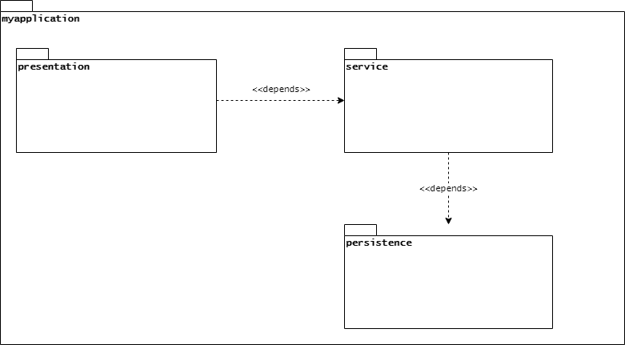

# archinet 简介

> 原文：<https://web.archive.org/web/20220930061024/https://www.baeldung.com/java-archunit-intro>

## 1.概观

在本文中，我们将展示如何使用`[ArchUnit](https://web.archive.org/web/20220701021100/https://www.archunit.org/)`来检查系统的架构。

## 2.什么是`ArchUnit?`

架构特征和可维护性之间的联系是软件行业中一个被充分研究的主题。然而，为我们的系统定义一个合理的架构是不够的。我们需要验证实现的代码符合它。

**简单地说，`ArchUnit`是一个测试库，它允许我们验证一个应用程序是否遵守一组给定的架构规则**。但是，什么是架构规则呢？更重要的是，在这个上下文中，我们所说的`architecture`是什么意思？

先说后者。**在这里，我们使用术语`architecture`来指代** **我们将应用程序中的不同类组织成包**的方式。

系统的架构还定义了包或包组(也称为`layers`)如何交互。用更实际的术语来说，它定义了给定包中的代码是否可以调用属于另一个类的类中的方法。例如，假设我们的应用程序架构包含三层:`presentation`、`service`和`persistence`。

可视化这些层如何交互的一种方法是使用 UML 包图，用一个包表示每一层:

[](/web/20220701021100/https://www.baeldung.com/wp-content/uploads/2020/08/figure1-1.png)

只要看看这个图表，我们就能找出一些规律:

*   演示类应该只依赖于服务类
*   服务类应该只依赖于持久性类
*   持久性类不应该依赖于其他任何人

看看这些规则，我们现在可以回过头来回答我们最初的问题。在这个上下文中，架构规则是关于我们的应用程序类相互交互的方式的断言。

那么现在，我们如何检查我们的实现遵守那些规则呢？这就是`ArchUnit`的用武之地。它允许我们使用一个`fluent API`来表达我们的架构约束，并在一个常规的构建过程中与其他测试一起验证它们。

## 3.`ArchUnit`项目设置

`ArchUnit`与`[JUnit](/web/20220701021100/https://www.baeldung.com/junit)`测试框架很好地集成，因此，它们通常一起使用。我们所要做的就是添加 [`archunit-junit4`](https://web.archive.org/web/20220701021100/https://search.maven.org/search?q=g:com.tngtech.archunit%20a:archunit-junit4) 依赖项来匹配我们的`JUnit`版本:

```java
<dependency>
    <groupId>com.tngtech.archunit</groupId>
    <artifactId>archunit-junit4</artifactId>
    <version>0.14.1</version>
    <scope>test</scope>
</dependency> 
```

正如它的`artifactId`所暗示的，这种依赖性是特定于`JUnit` 4 框架的。

如果我们使用`JUnit` 5，还有一个 [`archunit-junit5`](https://web.archive.org/web/20220701021100/https://search.maven.org/search?q=g:com.tngtech.archunit%20a:archunit-junit5) 依赖关系:

```java
<dependency>
    <groupId>com.tngtech.archunit</groupId>
    <artifactId>archunit-junit5</artifactId>
    <version>0.14.1</version>
    <scope>test</scope>
</dependency>
```

## 4.编写`ArchUnit`测试

一旦我们在项目中添加了适当的依赖项，就让我们开始编写架构测试吧。我们的测试应用程序将是一个简单的 SpringBoot REST 应用程序，它查询 [Smurfs](https://web.archive.org/web/20220701021100/https://www.smurf.com/) 。为了简单起见，这个测试应用程序只包含了`Controller`、`Service,` 和`Repository`类。

我们希望验证这个应用程序符合我们之前提到的规则。因此，让我们从一个简单的测试开始，测试“表示类应该只依赖于服务类”规则。

### 4.1.我们的第一个测试

**第一步是创建一组 Java 类，将检查它们是否违反了规则**。我们通过实例化`ClassFileImporter`类，然后使用它的`importXXX()`方法之一来实现这一点:

```java
JavaClasses jc = new ClassFileImporter()
  .importPackages("com.baeldung.archunit.smurfs");
```

在这种情况下，`JavaClasses`实例包含了我们的主应用程序包及其子包中的所有类。我们可以认为这个对象类似于常规单元测试中使用的典型测试主题，因为它将是规则评估的目标。

架构规则使用来自`ArchRuleDefinition`类的一个静态方法作为其`fluent API`调用的起点。让我们尝试使用这个 API 实现上面定义的第一个规则。我们将使用`classes()`方法作为我们的锚，并从那里添加额外的约束:

```java
ArchRule r1 = classes()
  .that().resideInAPackage("..presentation..")
  .should().onlyDependOnClassesThat()
  .resideInAPackage("..service..");
r1.check(jc);
```

注意，我们需要调用我们创建的规则的`check()`方法来运行检查。这个方法接受一个`JavaClasses` 对象，如果有违反将抛出一个异常。

这一切看起来都很好，但如果我们试图对我们的代码运行它，我们会得到一个错误列表:

```java
java.lang.AssertionError: Architecture Violation [Priority: MEDIUM] - 
  Rule 'classes that reside in a package '..presentation..' should only 
  depend on classes that reside in a package '..service..'' was violated (6 times):
... error list omitted 
```

为什么？**这条规则的主要问题是** `**onlyDependsOnClassesThat()**.`尽管我们已经在包图中做了说明，**我们的实际实现依赖于 JVM 和 Spring 框架类，因此会出现错误。**

### 4.2.重写我们的第一个测试

解决此错误的一个方法是添加一个考虑到这些附加依赖关系的子句:

```java
ArchRule r1 = classes()
  .that().resideInAPackage("..presentation..")
  .should().onlyDependOnClassesThat()
  .resideInAPackage("..service..", "java..", "javax..", "org.springframework.."); 
```

有了这个改变，我们的支票将不再失败。然而，这种方法存在可维护性问题，并且感觉有点笨拙。我们可以避免这些问题，使用`noClasses()`静态方法作为我们的起点重写我们的规则:

```java
ArchRule r1 = noClasses()
  .that().resideInAPackage("..presentation..")
  .should().dependOnClassesThat()
  .resideInAPackage("..persistence.."); 
```

当然，我们也可以指出这个方法是`deny-based`而不是我们之前的`allow-based`方法。**关键的一点是，无论我们选择哪种方式，`ArchUnit`通常会足够灵活地表达我们的规则**。

## 5.使用`Library` `API`

由于其内置的规则，使得创建复杂的架构规则变得容易。反过来，这些也可以组合起来，允许我们使用更高层次的抽象来创建规则。**开箱即用，`ArchUnit`提供了`Library API`，一组预先打包的规则，解决了常见的架构问题**:

*   `Architectures`:支持分层和洋葱(又名六角形或“端口和适配器”)架构规则检查
*   `Slices`:用于检测循环依赖或“循环”
*   `General`:与最佳编码实践相关的规则集合，例如日志记录、异常的使用等。
*   检查我们的代码库是否符合给定的 UML 模型
*   `Freeze Arch Rules`:保存违规供以后使用，只允许报告新的违规。对管理技术债务特别有用

涵盖所有这些规则超出了本介绍的范围，但是让我们看一下`Architecture`规则包。具体来说，让我们使用分层架构规则重写上一节中的规则。使用这些规则需要两步:首先，我们定义应用程序的层。然后，我们定义允许哪些层访问:

```java
LayeredArchitecture arch = layeredArchitecture()
   // Define layers
  .layer("Presentation").definedBy("..presentation..")
  .layer("Service").definedBy("..service..")
  .layer("Persistence").definedBy("..persistence..")
  // Add constraints
  .whereLayer("Presentation").mayNotBeAccessedByAnyLayer()
  .whereLayer("Service").mayOnlyBeAccessedByLayers("Presentation")
  .whereLayer("Persistence").mayOnlyBeAccessedByLayers("Service");
arch.check(jc);
```

这里，`layeredArchitecture()`是来自`Architectures`类的静态方法。当被调用时，它返回一个新的`LayeredArchitecture`对象，然后我们用它来定义名称层和关于它们的依赖关系的断言。这个对象实现了`ArchRule`接口，这样我们就可以像使用任何其他规则一样使用它。

这个特定 API 的酷之处在于，它允许我们只用几行代码就创建规则，否则就需要我们组合多个单独的规则。

## 6.结论

在本文中，我们探索了在项目中使用`ArchUnit`的基础。采用这个工具是一个相对简单的任务，从长远来看，它可以对整体质量产生积极的影响，并降低维护成本。

像往常一样，GitHub 上的所有代码[都是可用的。](https://web.archive.org/web/20220701021100/https://github.com/eugenp/tutorials/tree/master/libraries-testing)