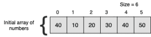
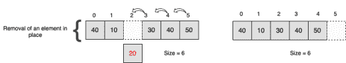
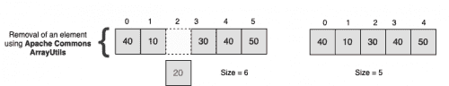

# 在 Java 中从数组中移除元素

> 原文：<https://web.archive.org/web/20220930061024/https://www.baeldung.com/java-array-remove-element>

## 1.概观

在这个快速教程中，我们将学习使用 [Apache Commons Lang](https://web.archive.org/web/20221205120628/https://commons.apache.org/proper/commons-lang/) 库在 Java 中从数组中移除元素的各种方法。

## 2.专家

让我们将 *commons-lang3* 依赖项添加到我们项目的`pom.xml`文件中:

```java
<dependency>
    <groupId>org.apache.commons</groupId>
    <artifactId>commons-lang3</artifactId>
    <version>3.12.0</version>
</dependency>
```

## 3.移除元素

在我们开始之前，让我们看看在不使用 Apache Commons Lang 库中的`ArrayUtils` 类的情况下从数组中移除元素会发生什么。

给定下面的数组，让我们删除一个位于`**index 2**`的元素:

[](/web/20221205120628/https://www.baeldung.com/wp-content/uploads/2019/07/Array-simple-300x75.png)

一个简单的方法是用存储在`index 3`的值替换存储在 `index 2` 的值，直到到达数组的末尾:

[](/web/20221205120628/https://www.baeldung.com/wp-content/uploads/2019/07/Array-rm-e1561592406558.png)

注意，通过以上述方式移除元素，**数组的大小将保持不变**，并且存储在最后一个索引处的值将为空。因为数组在初始化时分配了**固定的内存大小，所以删除一个元素并不会调整数组的大小。**

现在让我们看一下使用 Apache Commons Lang 的`ArrayUtils`类中的`remove` 方法删除元素时的数组表示:

[](/web/20221205120628/https://www.baeldung.com/wp-content/uploads/2019/07/Array-rm-common-e1561592423646.png)

正如我们所看到的，这里的数组大小在移除元素后被调整为 5。`remove` 方法创建一个全新的数组，并复制除了被删除的值之外的所有值。

`ArrayUtils` 类提供了两种从数组中移除元素的方法。接下来我们来看看这些。

## 4.使用索引作为输入

我们可以删除一个元素的第一种方法是通过它的索引和`ArrayUtils#remove`:

```java
public int[] removeAnElementWithAGivenIndex(int[] array, int index) {
      return ArrayUtils.remove(array, index);
}
```

另一种变化是`removeAll`方法，我们可以使用它从一个数组中删除多个元素，给出它们的索引:

```java
public int[] removeAllElementsWithGivenIndices(int[] array, int... indices) {
    return ArrayUtils.removeAll(array, indices);
}
```

## 5.使用元素作为输入

或者，假设我们不知道要删除的内容的索引。在这种情况下，我们可以使用`ArrayUtils#removeElement`提供要删除的元素:

```java
public int[] removeFirstOccurrenceOfGivenElement(int[] array, int element) {
    return ArrayUtils.removeElement(array, element);
}
```

这里是这个方法`ArrayUtils#removeElements`的另一个有用的变体，以防我们想要删除不止一个元素:

```java
public int[] removeAllGivenElements(int[] array, int... elements) {
    return ArrayUtils.removeElements(array, elements);
}
```

有时，我们希望删除给定元素的所有出现。我们可以通过使用`ArrayUtils#removeAllOccurences`来实现:

```java
public int[] removeAllOccurrencesOfAGivenElement(int[] array, int element) {
    return ArrayUtils.removeAllOccurences(array, element);
}
```

## 6.结论

在本文中，我们研究了使用 [Apache Commons Lang](https://web.archive.org/web/20221205120628/https://commons.apache.org/proper/commons-lang/) 库从数组中移除元素的各种方法。

要了解更多关于边缘案例的信息，请查看本教程的源代码和 GitHub 上的相关单元测试[。](https://web.archive.org/web/20221205120628/https://github.com/eugenp/tutorials/tree/master/core-java-modules/core-java-arrays-operations-basic)