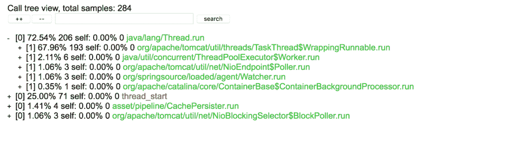
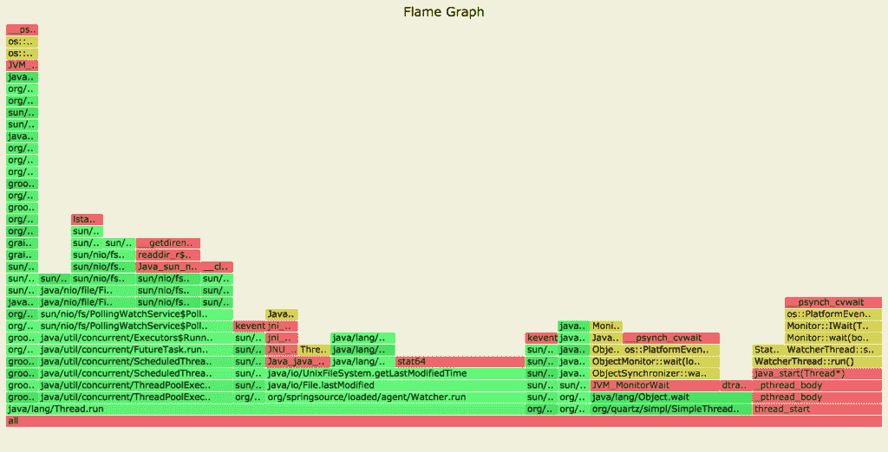
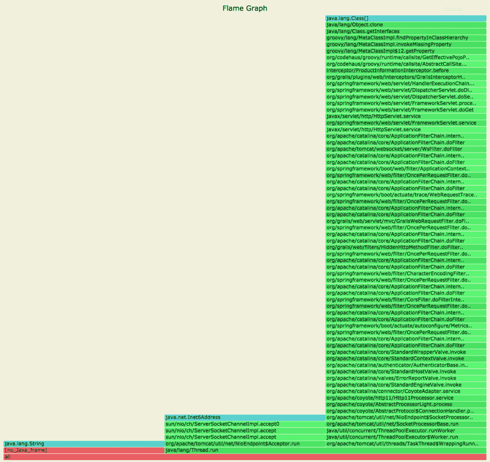
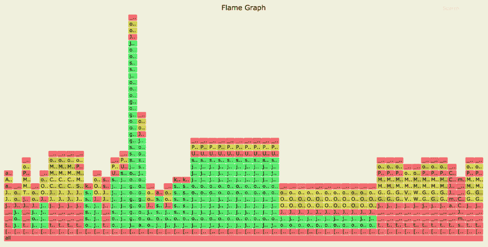
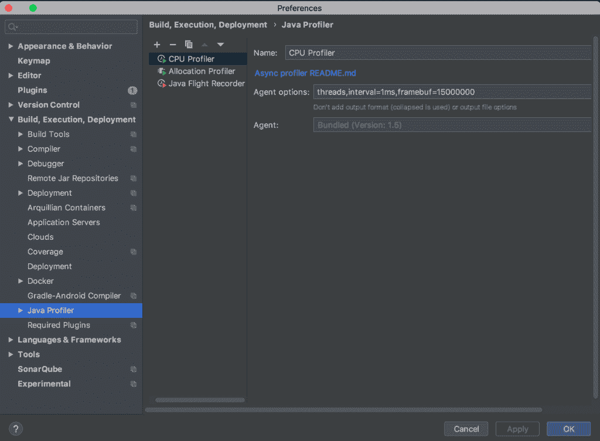
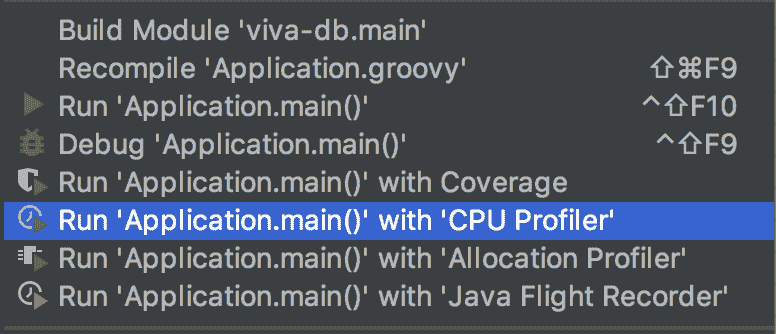
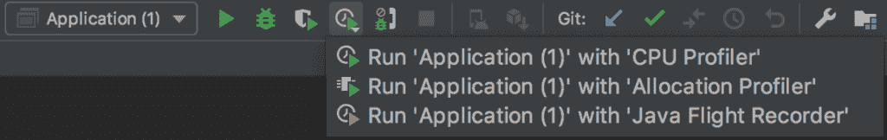
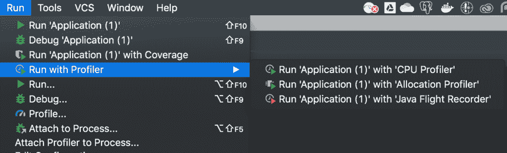
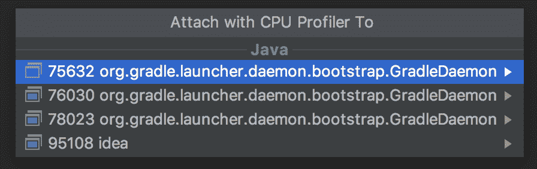
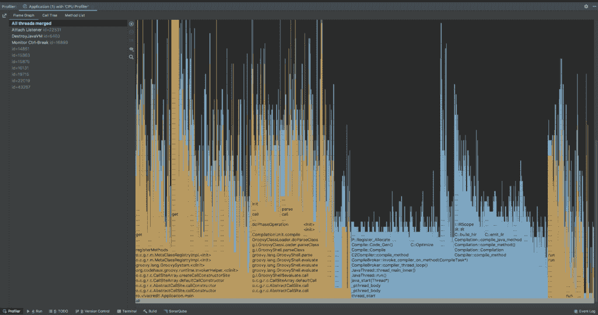

# 异步分析器指南

> 原文：<https://web.archive.org/web/20220930061024/https://www.baeldung.com/java-async-profiler>

## 1.概观

[Java 采样分析器](/web/20221205122922/https://www.baeldung.com/java-profilers)通常使用 JVM 工具接口(JVMTI)设计，并在安全点收集堆栈跟踪。因此，这些采样分析器可能会遇到[安全点偏差问题](https://web.archive.org/web/20221205122922/https://psy-lob-saw.blogspot.com/2016/02/why-most-sampling-java-profilers-are.html)。

对于应用的整体视图，**我们需要一个采样分析器，它不要求线程处于安全点，并且可以随时收集堆栈跟踪，以避免安全点偏差问题**。

在本教程中，我们将探索 [`async-profiler`](https://web.archive.org/web/20221205122922/https://github.com/jvm-profiling-tools/async-profiler) 以及它提供的各种剖析技术。

## 2.`async-profiler`

`async-profiler`是基于 [HotSpot JVM](https://web.archive.org/web/20221205122922/https://en.wikipedia.org/wiki/HotSpot) 的任何 JDK 的采样分析器。它开销低，不依赖 JVMTI。

**它通过使用 HotSpot JVM 提供的`AsyncGetCallTrace` API 来分析 Java 代码路径，使用 Linux 的`perf_events`来分析本机代码路径，从而避免了安全点偏差问题。**

换句话说，分析器匹配 Java 代码和本机代码路径的调用堆栈，以产生准确的结果。

## 3.设置

### 3.1.装置

首先，我们将基于我们的平台下载最新发布的 [`async-profiler`](https://web.archive.org/web/20221205122922/https://github.com/jvm-profiling-tools/async-profiler/releases) 。目前，它只支持 Linux 和 macOS 平台。

下载后，我们可以检查它是否在我们的平台上工作:

```java
$ ./profiler.sh --version
```

```java
Async-profiler 1.7.1 built on May 14 2020
Copyright 2016-2020 Andrei Pangin
```

事先用`async-profiler`检查所有可用选项总是一个好主意:

```java
$ ./profiler.sh
```

```java
Usage: ./profiler.sh [action] [options] 
Actions:
  start             start profiling and return immediately
  resume            resume profiling without resetting collected data
  stop              stop profiling
  check             check if the specified profiling event is available
  status            print profiling status
  list              list profiling events supported by the target JVM
  collect           collect profile for the specified period of time
                    and then stop (default action)
Options:
  -e event          profiling event: cpu|alloc|lock|cache-misses etc.
  -d duration       run profiling for  seconds
  -f filename       dump output to 
  -i interval       sampling interval in nanoseconds
  -j jstackdepth    maximum Java stack depth
  -b bufsize        frame buffer size
  -t                profile different threads separately
  -s                simple class names instead of FQN
  -g                print method signatures
  -a                annotate Java method names
  -o fmt            output format: summary|traces|flat|collapsed|svg|tree|jfr
  -I include        output only stack traces containing the specified pattern
  -X exclude        exclude stack traces with the specified pattern
  -v, --version     display version string

  --title string    SVG title
  --width px        SVG width
  --height px       SVG frame height
  --minwidth px     skip frames smaller than px
  --reverse         generate stack-reversed FlameGraph / Call tree

  --all-kernel      only include kernel-mode events
  --all-user        only include user-mode events
  --cstack mode     how to traverse C stack: fp|lbr|no

 is a numeric process ID of the target JVM
      or 'jps' keyword to find running JVM automatically
```

许多显示的选项将在后面的章节中派上用场。

### 3.2.内核配置

当在 Linux 平台上使用`async-profiler`时，我们应该确保配置我们的内核来捕获所有用户使用`perf_events`的调用栈:

首先，我们将把`perf_event_paranoid` 设置为 1，这将允许分析器收集性能信息:

```java
$ sudo sh -c 'echo 1 >/proc/sys/kernel/perf_event_paranoid'
```

然后，我们将把`kptr_restrict`设置为 0，以消除公开内核地址的限制:

```java
$ sudo sh -c 'echo 0 >/proc/sys/kernel/kptr_restrict'
```

然而，`async-profiler`将在 macOS 平台上独立工作。

现在我们的平台已经准备好了，我们可以构建我们的分析应用程序，并使用 Java 命令运行它:

```java
$ java -XX:+UnlockDiagnosticVMOptions -XX:+DebugNonSafepoints -jar path-to-jar-file
```

这里，**我们已经使用了`[-XX:+UnlockDiagnosticVMOptions](/web/20221205122922/https://www.baeldung.com/jvm-tuning-flags#1-diagnostic-flags) -XX:+DebugNonSafepoints` JVM 标志启动了我们的分析应用程序，为了获得准确的结果**，强烈推荐使用这些标志。

现在我们已经准备好分析我们的应用程序，让我们探索一下`async-profiler`支持的各种类型的分析。

## 4.CPU 分析

在分析 CPU 时，收集 Java 方法的示例堆栈跟踪，包括 JVM 代码、本地类和内核函数。

让我们使用 PID 来分析我们的应用程序:

```java
$ ./profiler.sh -e cpu -d 30 -o summary 66959
Started [cpu] profiling
--- Execution profile --- 
Total samples       : 28

Frame buffer usage  : 0.069%
```

这里，我们通过使用`-e`选项定义了`cpu`分析事件。然后，我们使用`-d` `<duration>`选项收集样本 30 秒。

最后，**`-o`选项用于定义输出格式，如摘要、HTML、跟踪、SVG 和树**。

让我们在 CPU 分析我们的应用程序时创建 HTML 输出:

```java
$ ./profiler.sh -e cpu -d 30 -f cpu_profile.html 66959
```

[](/web/20221205122922/https://www.baeldung.com/wp-content/uploads/2020/08/Screen-Shot-2020-07-27-at-5.53.44-AM.png)

在这里，我们可以看到 HTML 输出允许我们展开、折叠和搜索样本。

另外， **`async-profiler`支持现成的**火焰图形。

让我们为我们的应用程序的 CPU 配置文件使用`.svg`文件扩展名来生成一个火焰图:

```java
$ ./profiler.sh -e cpu -d 30 -f cpu_profile.svg 66959
```

[](/web/20221205122922/https://www.baeldung.com/wp-content/uploads/2020/08/Screen-Shot-2020-07-25-at-1.32.09-PM.png)

这里，生成的火焰图用绿色显示 Java 代码路径，用黄色显示 C++代码路径，用红色显示系统代码路径。

## 5.分配分析

类似地，我们可以收集内存分配的样本，而不需要使用像字节码插装这样的侵入性技术。

`async-profiler`使用基于 [TLAB](https://web.archive.org/web/20221205122922/https://alidg.me/blog/2019/6/21/tlab-jvm) (线程本地分配缓冲区)的采样技术来收集超过 TLAB 平均大小的堆分配的样本。

通过使用`alloc`事件，我们可以让分析器收集我们的分析应用程序的堆分配:

```java
$ ./profiler.sh -e alloc -d 30 -f alloc_profile.svg 66255
```

[](/web/20221205122922/https://www.baeldung.com/wp-content/uploads/2020/08/Screen-Shot-2020-07-25-at-1.37.13-PM.png)

在这里，我们可以看到对象克隆已经分配了很大一部分内存，否则在查看代码时很难察觉。

## 6.挂钟剖析

此外，`async-profiler`可以使用挂钟配置文件对所有线程进行采样，而不管它们的状态如何——比如运行、休眠或阻塞。

这在解决应用程序启动时的问题时非常方便。

通过定义`wall`事件，我们可以配置分析器来收集所有线程的样本:

```java
$ ./profiler.sh -e wall -t -d 30 -f wall_clock_profile.svg 66959
```

[](/web/20221205122922/https://www.baeldung.com/wp-content/uploads/2020/08/Screen-Shot-2020-07-26-at-12.57.34-PM.png)

这里，我们通过使用`-t`选项在每个线程模式下使用了挂钟分析器，在分析所有线程时强烈推荐使用这个选项。

此外，我们可以通过使用`list`选项来检查 JVM 支持的所有分析事件:

```java
$ ./profiler.sh list 66959
```

```java
Basic events:
  cpu
  alloc
  lock
  wall
  itimer
Java method calls:
  ClassName.methodName
```

## 7.`async-profiler`用 IntelliJ 理念

**IntelliJ IDEA 集成了`async-profiler`作为 Java** 的剖析工具。

### 7.1.探查器配置

我们可以通过选择 `Settings/Preferences > Build, Execution, Deployment` : 的`Java Profiler`菜单选项，在 IntelliJ IDEA 中配置`async-profiler`

[](/web/20221205122922/https://www.baeldung.com/wp-content/uploads/2020/08/Screen-Shot-2020-07-26-at-1.07.26-PM.png)

此外，为了快速使用，我们可以选择任何**预定义的配置，比如 IntelliJ IDEA 提供的 CPU 分析器和分配分析器**。

类似地，我们可以复制一个 profiler 模板，并为特定用例编辑`Agent options`。

### 7.2.使用 IntelliJ IDEA 分析应用程序

有几种方法可以用分析器分析我们的应用程序。

例如，我们可以选择应用程序并选择`Run <application name> with <profiler configuration name>` 选项:

[](/web/20221205122922/https://www.baeldung.com/wp-content/uploads/2020/08/Screen-Shot-2020-07-27-at-6.25.49-AM.png)

或者，我们可以点击工具栏并选择`Run <application name> with <profiler configuration name>`选项:

[](/web/20221205122922/https://www.baeldung.com/wp-content/uploads/2020/08/Screen-Shot-2020-07-27-at-6.27.06-AM.png)

或者，选择`Run`菜单下的`Run with Profiler`选项，然后选择< `profiler configuration name>`:

[](/web/20221205122922/https://www.baeldung.com/wp-content/uploads/2020/08/Screen-Shot-2020-07-27-at-6.35.23-AM.png)

此外，我们可以在`Run`菜单下看到`Attach Profiler to Process`的选项。它会打开一个对话框，让我们选择要附加的进程:

[](/web/20221205122922/https://www.baeldung.com/wp-content/uploads/2020/08/Screen-Shot-2020-07-27-at-6.42.31-AM.png)

一旦我们的应用程序被分析，我们可以使用 IDE 底部的`Profiler`工具窗口栏来分析分析结果。

我们的应用程序的分析结果将如下所示:

[](/web/20221205122922/https://www.baeldung.com/wp-content/uploads/2020/08/Screen-Shot-2020-07-27-at-6.27.41-AM.png)

它以不同的输出格式显示线程方式的结果，如火焰图、调用树和方法列表。

或者，我们可以选择 `View > Tool Windows`菜单下的`Profiler`选项来查看结果:

[](/web/20221205122922/https://www.baeldung.com/wp-content/uploads/2020/08/Screen-Shot-2020-07-27-at-6.57.15-AM.png)

## 8.结论

在本文中，我们探索了`async-profiler`，以及一些剖析技术。

首先，我们已经看到了在使用 Linux 平台时如何配置内核，以及一些推荐的 JVM 标志，用来开始分析我们的应用程序以获得准确的结果。

然后，我们研究了各种类型的分析技术，如 CPU、分配和挂钟。

最后，我们使用 IntelliJ IDEA 分析了一个带有`async-profiler`的应用程序。