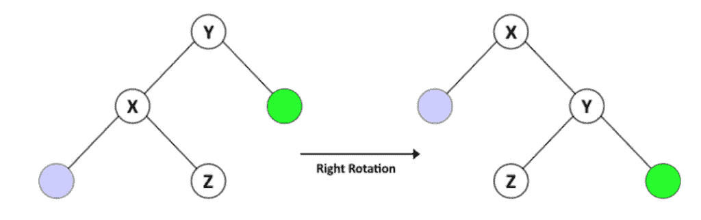
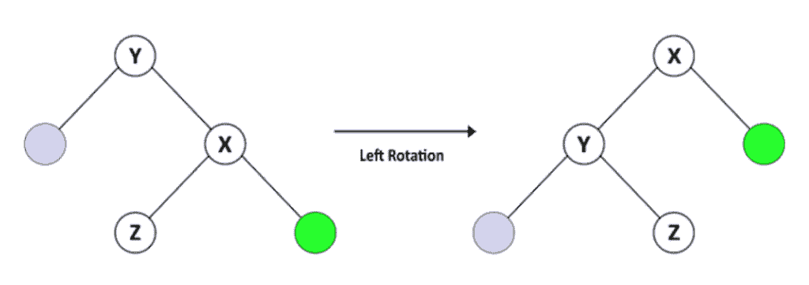
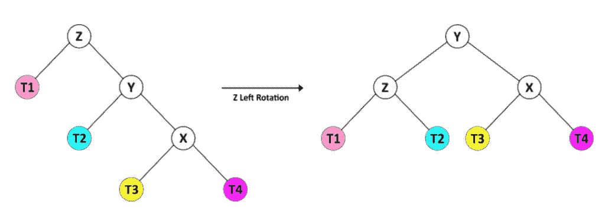
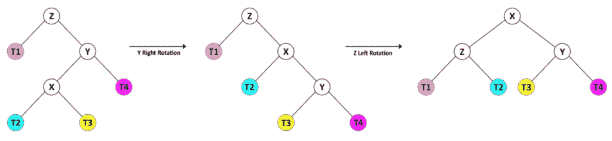
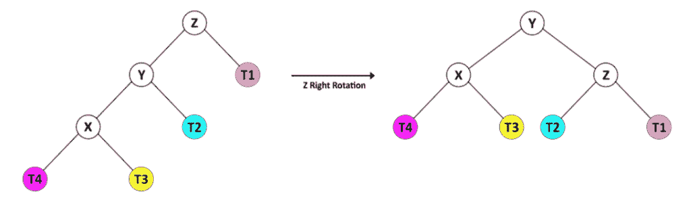
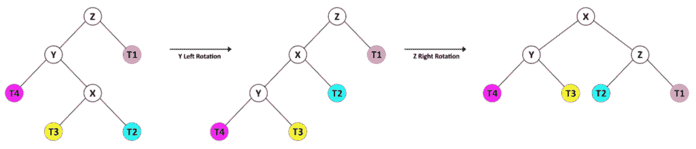

# 爪哇 AVL 树指南

> 原文：<https://web.archive.org/web/20220930061024/https://www.baeldung.com/java-avl-trees>

## 1.介绍

在本教程中，我们将介绍 AVL 树，并研究插入、删除和搜索值的算法。

## 2.什么是 AVL 树？

AVL 树以其发明者阿德尔森-维尔斯基和兰迪斯的名字命名，是一种自我平衡的[二叉查找树](/web/20221117050351/https://www.baeldung.com/java-binary-tree) (BST)。

**自平衡树是按照一定的平衡规则，平衡插入和删除后的高度的二叉查找树。**

BST 最坏情况下的时间复杂度是树的高度的函数。特别是从树根到节点的最长路径。对于有 N 个节点的 BST，假设每个节点只有零个或一个子节点。因此它的高度等于 N，最坏情况下的搜索时间是 O(N)。因此，BST 的主要目标是保持最大高度接近 log(N)。

节点 N 的平衡因子为`height(right(N)) – height(left(N))`。**在 AVL 树中，节点的平衡因子只能是 1、0 或-1 值中的一个。**

让我们为我们的树定义一个`Node` 对象:

```java
public class Node {
    int key;
    int height;
    Node left;
    Node right;
    ...
}
```

接下来，我们来定义一下`AVLTree`:

```java
public class AVLTree {

    private Node root;

    void updateHeight(Node n) {
        n.height = 1 + Math.max(height(n.left), height(n.right));
    }

    int height(Node n) {
        return n == null ? -1 : n.height;
    }

    int getBalance(Node n) {
        return (n == null) ? 0 : height(n.right) - height(n.left);
    }

    ...
}
```

## 3.如何平衡一棵 AVL 树？

在插入或删除节点后，AVL 树检查其节点的平衡因子。如果一个节点的平衡因子大于 1 或小于-1，树会重新平衡自己。

重新平衡树有两种操作:

*   右旋转和
*   向左旋转。

### 3.1.向右旋转

让我们从正确的旋转开始。

假设我们有一个名为 T1 的 BST，其中 Y 是根节点，X 是 Y 的左子节点，Z 是 X 的右子节点。

对 Y 进行右旋转后，我们得到一棵名为 T2 的树，以 X 为根，Y 为 X 的右子，Z 为 Y 的左子。T2 仍然是 BST，因为它保持了 X < Z < Y 的顺序

[](/web/20221117050351/https://www.baeldung.com/wp-content/uploads/2020/02/R-Large-1.png)

让我们来看看`AVLTree`的正确旋转操作:

```java
Node rotateRight(Node y) {
    Node x = y.left;
    Node z = x.right;
    x.right = y;
    y.left = z;
    updateHeight(y);
    updateHeight(x);
    return x;
}
```

### 3.2.向左旋转操作

我们也有左旋手术。

假设有一个叫 T1 的 BST，Y 是根节点，X 是 Y 的右子节点，Z 是 X 的左子节点，给定这个，我们知道 Y < Z < X。

对 Y 进行左旋转后，我们有了一棵名为 T2 的树，它的根是 X，Y 是 X 的左子，Z 是 Y 的右子。T2 仍然是一个 BST，因为它保持了 Y < Z < X 的顺序

[](/web/20221117050351/https://www.baeldung.com/wp-content/uploads/2020/02/L-Large-1.png)

让我们来看看`AVLTree`的左旋转操作:

```java
Node rotateLeft(Node y) {
    Node x = y.right;
    Node z = x.left;
    x.left = y;
    y.right = z;
    updateHeight(y);
    updateHeight(x);
    return x;
}
```

### 3.3.再平衡技术

我们可以在更复杂的组合中使用右旋转和左旋转操作来使 AVL 树在节点发生任何变化后保持平衡。在不平衡结构中，至少有一个节点的平衡系数等于 2 或-2。让我们看看如何在这些情况下平衡树。

当节点 Z 的平衡因子为 2 时，以 Z 为根的子树处于这两种状态之一，认为 Y 是 Z 的右子。

对于第一种情况，Y (X)的右孩子的身高大于左孩子(T2)的身高。我们可以通过向左旋转 z 来轻松地重新平衡树。

[](/web/20221117050351/https://www.baeldung.com/wp-content/uploads/2020/02/ZL-Large.png)

对于第二种情况，Y (T4)的右边孩子的高度小于左边孩子(X)的高度。这种情况需要结合轮换操作。

[](/web/20221117050351/https://www.baeldung.com/wp-content/uploads/2020/02/YRZL-Large.png)

在这种情况下，我们首先向右旋转 Y 轴，这样树的形状就和前一种情况一样了。然后我们可以通过向左旋转 z 来重新平衡树。

还有，当节点 Z 的平衡因子为-2 时，它的子树处于这两种状态之一，所以我们认为 Z 是根，Y 是它的左子。

Y 的左子中的高度大于它的右子中的高度，所以我们用 z 的右旋转来平衡树。

[](/web/20221117050351/https://www.baeldung.com/wp-content/uploads/2020/02/ZR-Large.png)

或者在第二种情况下，Y 的右边的孩子比左边的孩子高。

[](/web/20221117050351/https://www.baeldung.com/wp-content/uploads/2020/02/YLZR-Large.png)

所以，首先，我们用 Y 的左旋转把它变换成前一个形状，然后我们用 z 的右旋转来平衡树。

让我们来看看`AVLTree`的重新平衡操作:

```java
Node rebalance(Node z) {
    updateHeight(z);
    int balance = getBalance(z);
    if (balance > 1) {
        if (height(z.right.right) > height(z.right.left)) {
            z = rotateLeft(z);
        } else {
            z.right = rotateRight(z.right);
            z = rotateLeft(z);
        }
    } else if (balance < -1) {
        if (height(z.left.left) > height(z.left.right))
            z = rotateRight(z);
        else {
            z.left = rotateLeft(z.left);
            z = rotateRight(z);
        }
    }
    return z;
}
```

**我们将在插入或删除一个节点后使用`rebalance`来表示从改变的节点到根的路径中的所有节点。**

## 4.插入一个节点

当我们要在树中插入一个键时，我们必须找到它的正确位置来通过 BST 规则。所以我们从根开始，把它的值和新的键进行比较。如果键更大，我们继续向右——否则，我们去左边的孩子。

一旦我们找到正确的父节点，我们就根据值将新的键作为节点添加到左侧或右侧。

插入节点后，我们有一个 BST，但它可能不是 AVL 树。因此，我们检查平衡因子，并从新节点到根路径中的所有节点重新平衡 BST。

让我们来看看插入操作:

```java
Node insert(Node node, int key) {
    if (node == null) {
        return new Node(key);
    } else if (node.key > key) {
        node.left = insert(node.left, key);
    } else if (node.key < key) {
        node.right = insert(node.right, key);
    } else {
        throw new RuntimeException("duplicate Key!");
    }
    return rebalance(node);
}
```

记住一个键在树中是唯一的很重要——没有两个节点共享同一个键。

插入算法的时间复杂度是高度的函数。由于我们的树是平衡的，我们可以假设最坏情况下的时间复杂度是 O(log(N))。

## 5.删除节点

要从树中删除一个键，我们首先必须在 BST 中找到它。

在我们找到节点(称为 Z)之后，我们必须引入新的候选节点作为它在树中的替代节点。如果 Z 是一片叶子，则候选项为空。如果 Z 只有一个孩子，这个孩子就是候选，但是如果 Z 有两个孩子，过程就有点复杂了。

假设 Z 的右边的孩子叫做 Y。首先，我们找到 Y 的最左边的节点，并把它叫做 X。然后，我们设置 Z 的新值等于 X 的值，并继续从 Y 中删除 X。

最后，我们在最后调用 rebalance 方法来保持 BST 为 AVL 树。

下面是我们的删除方法:

```java
Node delete(Node node, int key) {
    if (node == null) {
        return node;
    } else if (node.key > key) {
        node.left = delete(node.left, key);
    } else if (node.key < key) {
        node.right = delete(node.right, key);
    } else {
        if (node.left == null || node.right == null) {
            node = (node.left == null) ? node.right : node.left;
        } else {
            Node mostLeftChild = mostLeftChild(node.right);
            node.key = mostLeftChild.key;
            node.right = delete(node.right, node.key);
        }
    }
    if (node != null) {
        node = rebalance(node);
    }
    return node;
}
```

删除算法的时间复杂度是树的高度的函数。类似于插入方法，我们可以假设最坏情况下的时间复杂度是 O(log(N))。

## 6.搜索一个节点

在 AVL 树中搜索节点的**与任何 BST** 相同。

从树根开始，将键与节点的值进行比较。如果键等于值，则返回节点。如果键更大，从右边的子元素开始搜索，否则从左边的子元素继续搜索。

搜索的时间复杂度是高度的函数。我们可以假设最坏情况下的时间复杂度是 O(log(N))。

让我们看看示例代码:

```java
Node find(int key) {
    Node current = root;
    while (current != null) {
        if (current.key == key) {
            break;
        }
        current = current.key < key ? current.right : current.left;
    }
    return current;
}
```

## 7.结论

在本教程中，我们实现了一个具有插入、删除和搜索操作的 AVL 树。

和往常一样，你可以在 Github 上找到代码[。](https://web.archive.org/web/20221117050351/https://github.com/eugenp/tutorials/tree/master/data-structures)