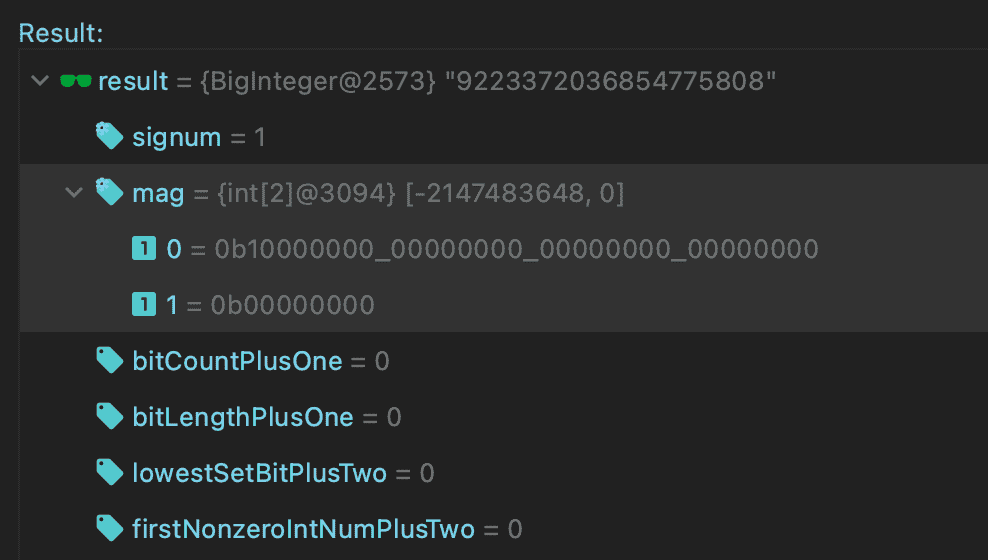

# Java BigInteger 指南

> 原文：<https://web.archive.org/web/20220930061024/https://www.baeldung.com/java-biginteger>

## 1.介绍

Java 提供了一些原语，比如`int `或者`long`，来执行整数运算。但有时，我们需要存储数字，这超出了这些数据类型的可用限制。

在本教程中，我们将深入研究`BigInteger`类。我们将通过查看源代码来检查它的结构，并回答这个问题—**h****如何在可用的[原始数据类型](/web/20220616203429/https://www.baeldung.com/java-primitives)的限制之外存储大数？**

## 2.`BigInteger`阶级

正如我们所知， [`BigInteger`类](/web/20220616203429/https://www.baeldung.com/java-bigdecimal-biginteger#biginteger)用于数学运算，涉及比原始`long`类型更大的非常大的整数计算。它**代表不可变的任意精度整数**。

在继续之前，让我们记住，在 Java 中，所有的字节都用[二进制补码系统](/web/20220616203429/https://www.baeldung.com/cs/two-complement)中的**表示，使用的是[大端记数法](/web/20220616203429/https://www.baeldung.com/cs/most-significant-bit)** 。它将一个字的最高有效字节存储在最小的内存地址(最低的索引)。此外，字节的第一位也是一个符号位。让我们检查示例字节值:

*   `1000 0000`代表`-128`
*   `0111 1111` 代表 127
*   `1111 1111`代表`-1`

所以现在，让我们检查源代码并解释它如何存储超过可用原语限制的给定数字。

### 2.1.`int signum`

`signum`属性**决定了`BigInteger`** 的符号。三个整数值代表数值的符号:`-1`代表负数，`0`代表零，`1 `代表正数:

```java
assertEquals(1, BigInteger.TEN.signum());
assertEquals(-1, BigInteger.TEN.negate().signum());
assertEquals(0, BigInteger.ZERO.signum());
```

我们要知道`BigInteger.ZERO` **一定有`0`的`signum`由于星等阵。该值确保每个`BigInteger`值**有一个精确的表示**。**

### 2.2.`int[] mag`

`BigInteger` 类的所有魔力都始于`mag`属性。它**使用二进制表示**将给定值存储在一个数组中，这允许省略原始数据类型限制。

此外，`BigInteger` **将它们分成 32 位部分**——一组四个字节。因此，类定义中的大小被声明为`int`数组:

`int[] mag;`

这个数组**以大端记数法**保存给定值的大小。这个数组的第 0 个元素是最重要的整数。让我们用 [`BigInteger(byte[] bytes)`](https://web.archive.org/web/20220616203429/https://docs.oracle.com/en/java/javase/11/docs/api/java.base/java/math/BigInteger.html#%3Cinit%3E(byte%5B%5D)) 来检查一下:

```java
assertEquals(new BigInteger("1"), new BigInteger(new byte[]{0b1}))
assertEquals(new BigInteger("2"), new BigInteger(new byte[]{0b10}))
assertEquals(new BigInteger("4"), new BigInteger(new byte[]{0b100}))
```

此构造函数将给定的包含二进制补码二进制表示形式的字节数组转换为值。

因为有一个符号幅度变量(`signum`)，我们**不使用第一位作为值**的符号位。让我们快速检查一下:

```java
byte[] bytes = { -128 }; // 1000 0000
assertEquals(new BigInteger("128"), new BigInteger(1, bytes));
assertEquals(new BigInteger("-128"), new BigInteger(-1, bytes));
```

我们使用 [`BigInteger(int signum, byte[] magnitude)`](https://web.archive.org/web/20220616203429/https://docs.oracle.com/en/java/javase/11/docs/api/java.base/java/math/BigInteger.html#%3Cinit%3E(int,byte%5B%5D)) 构造函数创建了两个不同的值。它将符号幅度表示转化为我们重用的相同字节数组的`BigInteger.`，只改变了一个符号值。

我们也可以使用 [`toString(int radix)`](https://web.archive.org/web/20220616203429/https://docs.oracle.com/en/java/javase/11/docs/api/java.base/java/math/BigInteger.html#toString(int)) 方法打印星等:

```java
assertEquals("10000000", new BigInteger(1, bytes));
assertEquals("-10000000", new BigInteger(-1, bytes));
```

请注意，对于负值，会添加减号。

最后，**量值的最高有效位`int`必须是非零的**。这意味着`BigInteger.ZERO`有一个零长度的磁阵列:

```java
assertEquals(0, BigInteger.ZERO.bitCount()); 
assertEquals(BigInteger.ZERO, new BigInteger(0, new byte[]{}));
```

现在，我们将跳过检查其他属性。由于冗余，它们被标记为不推荐使用，仅用作内部缓存。

现在让我们直接看更复杂的例子，看看`BigInteger `是如何在原始数据类型上存储数字的。

## 3.`BigInteger`大于` Long.MAX_VALUE.`

我们已经知道，**`long`数据类型是一个 64 位二进制补码整数**。有符号长整型的最小值为-2^(63)T1，最大值为 2 ^(63) -1 `(0111 1111 … 1111). `要创建一个超过这些限制的数，我们需要使用`BigInteger` 类。

现在让我们创建一个比`Long.MAX_VALUE`大 1 的值，等于 2 ^(63) 。根据上一章中的信息，它需要具备:

*   一个`signum`属性设置为 1，
*   一个`mag`数组，总共 64 位，其中只有最高有效位设置`(1000 0000 … 0000).`

首先，让我们使用 [`setBit(int n)`](https://web.archive.org/web/20220616203429/https://docs.oracle.com/en/java/javase/11/docs/api/java.base/java/math/BigInteger.html#setBit(int)) 函数创建一个`BigInteger`:

```java
BigInteger bi1 = BigInteger.ZERO.setBit(63);
String str = bi1.toString(2);
assertEquals(64, bi1.bitLength());
assertEquals(1, bi1.signum());
assertEquals("9223372036854775808", bi1.toString());
assertEquals(BigInteger.ONE, bi1.substract(BigInteger.valueOf(Long.MAX_VALUE)));

assertEquals(64, str.length());
assertTrue(str.matches("^10{63}$")); // 1000 0000 ... 0000
```

请记住，在二进制表示系统中，位从 0 开始从右到左排序。当`BigInteger.ZERO`有一个空的幅度数组时，设置第 63 位使其同时成为最重要的——64 长度数组的第 0 个元素。`signum`自动设置为 1。

另一方面，相同的位序列由`Long.MIN_VALUE`表示。让我们将这个常量转换成`byte[]`数组并创建`BigInteger:`

```java
byte[] bytes = ByteBuffer.allocate(Long.BYTES).putLong(Long.MIN_VALUE).array();
BigInteger bi2 = new BigInteger(1, bytes);
assertEquals(bi1, bi2);
...
```

正如我们看到的，两个值是相等的，所以同样的断言包适用。

最后，我们可以检查内部的`int[]` `mag`变量。目前，Java 不提供获取该值的 API，但是我们可以通过调试器中的评估工具来实现:

[](/web/20220616203429/https://www.baeldung.com/wp-content/uploads/2021/07/bael_4920_1.png)

我们使用两个整数将值存储在数组中，两个 32 位的包。第零个元素等于`Integer.MIN_VALUE`，另一个为零。

## 4.结论

在这个快速教程中，我们重点关注了`BigInteger`类的实现细节。我们首先提醒一些关于数字、原语和二进制表示规则的信息。

然后我们检查了`BigInteger.`的源代码，我们检查了`signum`和`mag`属性。我们还学习了`BigInteger`如何存储给定值，允许我们提供比可用的原始数据类型更大的数字。

和往常一样，我们可以在 GitHub 上找到所有代码片段和测试[。](https://web.archive.org/web/20220616203429/https://github.com/eugenp/tutorials/tree/master/core-java-modules/java-numbers-4)