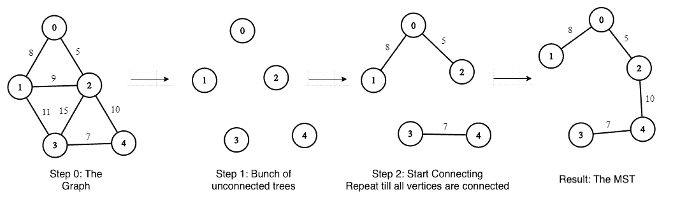

# Java 中最小生成树的 Boruvka 算法

> 原文：<https://web.archive.org/web/20220930061024/https://www.baeldung.com/java-boruvka-algorithm>

## 1.概观

在本教程中，**我们将看看 Boruvka 算法的 Java 实现，该算法用于寻找边加权图**的最小生成树(MST)。

它早于[普里姆的](/web/20220701013813/https://www.baeldung.com/java-prim-algorithm)和[克鲁斯卡尔的](/web/20220701013813/https://www.baeldung.com/java-spanning-trees-kruskal)算法，但仍然可以被认为是两者之间的交叉。

## 2.博鲁夫卡算法

我们将直接进入手边的算法。让我们先看一点历史，然后再看算法本身。

### 2.1.历史

Otakar Boruvka 在 1926 年首次提出了一种寻找给定图的 MST 的方法。这远在计算机出现之前，事实上是为了设计一个高效的配电系统而设计的。

乔治·索林在 1965 年重新发现了它，并将其用于并行计算。

### 2.2.该算法

该算法的中心思想是从一束树开始，每个顶点代表一棵孤立的树。然后，我们需要不断添加边，以减少孤立树的数量，直到我们有一个单一的连接树。

让我们通过一个示例图表来逐步了解这一点:

*   步骤 0:创建图表
*   步骤 1:从一束不相连的树开始(树的数量=顶点的数量)
*   步骤 2:当存在未连接的树时，对于每个未连接的树:
    *   找到重量较轻的边缘
    *   添加此边以连接另一棵树

[](/web/20220701013813/https://www.baeldung.com/wp-content/uploads/2020/03/Boruvka-1.png)

## 3.Java 实现

现在让我们看看如何用 Java 实现它。

### 3.1.`UnionFind`数据结构

首先，**我们需要一个数据结构来存储顶点**的父顶点和等级。

让我们为此定义一个类`UnionFind`，有两个方法:`union`和`find`:

```
public class UnionFind {
    private int[] parents;
    private int[] ranks;

    public UnionFind(int n) {
        parents = new int[n];
        ranks = new int[n];
        for (int i = 0; i < n; i++) {
            parents[i] = i;
            ranks[i] = 0;
        }
    }

    public int find(int u) {
        while (u != parents[u]) {
            u = parents[u];
        }
        return u;
    }

    public void union(int u, int v) {
        int uParent = find(u);
        int vParent = find(v);
        if (uParent == vParent) {
            return;
        }

        if (ranks[uParent] < ranks[vParent]) { 
            parents[uParent] = vParent; 
        } else if (ranks[uParent] > ranks[vParent]) {
            parents[vParent] = uParent;
        } else {
            parents[vParent] = uParent;
            ranks[uParent]++;
        }
    }
} 
```

我们可以把这个类看作是一个辅助结构，用于维护顶点之间的关系，并逐步构建我们的 MST。

为了找出**两个顶点`u`和`v`是否属于同一棵树，我们看看`find(u)`是否返回与`find(v)`** 相同的父节点。`union`法是用来组合树木的。我们很快就会看到这种用法。

### 3.2.输入用户的图形

现在，我们需要一种方法来从用户那里获取图的顶点和边，并将它们映射到运行时可以在我们的算法中使用的对象。

因为我们将使用 JUnit 来测试我们的算法，所以这一部分放在一个`@Before`方法中:

```
@Before
public void setup() {
    graph = ValueGraphBuilder.undirected().build();
    graph.putEdgeValue(0, 1, 8);
    graph.putEdgeValue(0, 2, 5);
    graph.putEdgeValue(1, 2, 9);
    graph.putEdgeValue(1, 3, 11);
    graph.putEdgeValue(2, 3, 15);
    graph.putEdgeValue(2, 4, 10);
    graph.putEdgeValue(3, 4, 7);
} 
```

这里，我们使用了 Guava 的`MutableValueGraph<Integer, Integer>`来存储我们的图表。然后我们用`ValueGraphBuilder`构造了一个无向加权图。

方法`putEdgeValue`接受三个参数，两个`Integer`用于顶点，第三个`Integer` 用于其权重，如`MutableValueGraph`的泛型类型声明所指定的。

如我们所见，这与之前图表中显示的输入相同。

### 3.3.导出最小生成树

最后，我们来看问题的关键，算法的实现。

我们将在一个名为`BoruvkaMST`的类中做这件事。首先，让我们声明几个实例变量:

```
public class BoruvkaMST {
    private static MutableValueGraph<Integer, Integer> mst = ValueGraphBuilder.undirected().build();
    private static int totalWeight;
} 
```

正如我们所看到的，我们在这里使用`MutableValueGraph<Integer, Integer>`来表示 MST。

其次，我们将定义一个构造函数，所有的魔法都在这里发生。它需要一个参数——我们之前构建的`graph`。

它做的第一件事是初始化输入图的顶点。最初，所有顶点都是它们自己的父顶点，每个顶点的等级为 0:

```
public BoruvkaMST(MutableValueGraph<Integer, Integer> graph) {
    int size = graph.nodes().size();
    UnionFind uf = new UnionFind(size); 
```

接下来，我们将创建一个循环，该循环定义创建 MST 所需的迭代次数——最多 log V 次，或者直到我们有 V-1 条边，其中 V 是顶点的数量:

```
for (int t = 1; t < size && mst.edges().size() < size - 1; t = t + t) {
    EndpointPair<Integer>[] closestEdgeArray = new EndpointPair[size]; 
```

这里我们还初始化了一个边数组，`closestEdgeArray –` 来存储最近的、权重较小的边。

之后，我们将定义一个内部的`for`循环来遍历图的所有边，以填充我们的`closestEdgeArray`。

如果两个顶点的父顶点相同，那么它就是同一棵树，我们不把它添加到数组中。否则，我们将当前边的权重与其父顶点边的权重进行比较。如果它较小，那么我们把它加到`closestEdgeArray:`

```
for (EndpointPair<Integer> edge : graph.edges()) {
    int u = edge.nodeU();
    int v = edge.nodeV();
    int uParent = uf.find(u);
    int vParent = uf.find(v);

    if (uParent == vParent) {
        continue;
    }

    int weight = graph.edgeValueOrDefault(u, v, 0);

    if (closestEdgeArray[uParent] == null) {
        closestEdgeArray[uParent] = edge;
    }
    if (closestEdgeArray[vParent] == null) {
        closestEdgeArray[vParent] = edge;
    }

    int uParentWeight = graph.edgeValueOrDefault(closestEdgeArray[uParent].nodeU(),
      closestEdgeArray[uParent].nodeV(), 0);
    int vParentWeight = graph.edgeValueOrDefault(closestEdgeArray[vParent].nodeU(),
      closestEdgeArray[vParent].nodeV(), 0);

    if (weight < uParentWeight) {
        closestEdgeArray[uParent] = edge;
    }
    if (weight < vParentWeight) {
        closestEdgeArray[vParent] = edge;
    }
} 
```

然后，我们将定义第二个内部循环来创建一棵树。我们将把上一步中的边添加到这个树中，而不会两次添加相同的边。此外，我们将对我们的`UnionFind`执行一个`union`来派生和存储新创建的树的顶点的父节点和等级:

```
for (int i = 0; i < size; i++) {
    EndpointPair<Integer> edge = closestEdgeArray[i];
    if (edge != null) {
        int u = edge.nodeU();
        int v = edge.nodeV();
        int weight = graph.edgeValueOrDefault(u, v, 0);
        if (uf.find(u) != uf.find(v)) {
            mst.putEdgeValue(u, v, weight);
            totalWeight += weight;
            uf.union(u, v);
        }
    }
} 
```

重复这些步骤最多 log V 次，或者直到我们有 V-1 条边，得到的树就是我们的 MST。

## 4.测试

最后，让我们看一个简单的 JUnit 来验证我们的实现:

```
@Test
public void givenInputGraph_whenBoruvkaPerformed_thenMinimumSpanningTree() {

    BoruvkaMST boruvkaMST = new BoruvkaMST(graph);
    MutableValueGraph<Integer, Integer> mst = boruvkaMST.getMST();

    assertEquals(30, boruvkaMST.getTotalWeight());
    assertEquals(4, mst.getEdgeCount());
} 
```

正如我们所看到的，我们得到了权重为 30 和 4 条边的 **MST，与图片示例**相同。

## 5.结论

在本教程中，我们看到了 Boruvka 算法的 Java 实现。**其时间复杂度为 O(E log V)，其中 E 为边数，V 为顶点数**。

和往常一样，源代码可以在 [GitHub](https://web.archive.org/web/20220701013813/https://github.com/eugenp/tutorials/tree/master/algorithms-modules/algorithms-miscellaneous-6) 上获得。