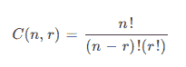
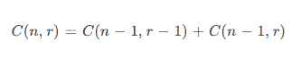
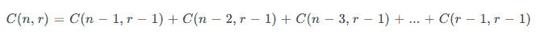

# 用 Java 生成组合

> 原文：<https://web.archive.org/web/20220930061024/https://www.baeldung.com/java-combinations-algorithm>

## 1.介绍

在本教程中，**我们将讨论 Java** 中的 [k 组合](/web/20220920171227/https://www.baeldung.com/cs/generate-k-combinations)问题的解决方案。

首先，我们将讨论并实现递归和迭代算法来生成给定大小的所有组合。然后我们将回顾使用通用 Java 库的解决方案。

## 2.组合概述

简单地说，**组合是给定集合**中元素的子集。

与排列不同，我们选择单个元素的顺序并不重要。相反，我们只关心特定的元素是否在选择中。

例如，在一个纸牌游戏中，我们必须从 52 张牌中拿出 5 张。我们对 5 张牌的选择顺序不感兴趣。相反，我们只关心手中有哪些牌。

有些问题需要我们评估所有可能的组合。为了做到这一点，我们列举了各种组合。

**从“n”个元素的集合中选择“r”个元素的不同方式的数量可以用下面的公式进行数学表达:**

[](/web/20220920171227/https://www.baeldung.com/wp-content/uploads/2019/03/combination1.png)

因此，在最坏的情况下，选择元素的方式可以呈指数增长。因此，对于大量人口，可能无法列举不同的选择。

在这种情况下，我们可以随机选择几个有代表性的选项。这个过程叫做`sampling`。

接下来，我们将回顾列出组合的各种算法。

## 3.生成组合的递归算法

[递归算法](/web/20220920171227/https://www.baeldung.com/java-recursion)通常通过将一个问题分割成类似的更小的问题来工作。这个过程一直持续到我们达到终止条件，这也是基本情况。然后我们直接解决基础案例。

我们将讨论两种细分从集合中选择元素的方法。第一种方法根据集合中的元素来划分问题。第二种方法通过只跟踪选定的元素来解决问题。

### 3.1.按整个集合中的元素划分

让我们通过逐个检查项目来划分从“`n”`项目中选择“`r”`元素”的任务。对于集合中的每个项目，我们可以将其包含在选择中，也可以将其排除。

**如果我们包含第一项，那么我们需要从剩余的`n – 1″`项**中选择“r `– 1″`个元素。另一方面，**如果我们丢弃第一项，那么我们需要从剩余的`n – 1″`项中选择`r”`元素。**

这可以用数学方法表示为:

[](/web/20220920171227/https://www.baeldung.com/wp-content/uploads/2019/03/combination2.png)

现在，让我们来看看这种方法的递归实现:

```
private void helper(List<int[]> combinations, int data[], int start, int end, int index) {
    if (index == data.length) {
        int[] combination = data.clone();
        combinations.add(combination);
    } else if (start <= end) {
        data[index] = start;
        helper(combinations, data, start + 1, end, index + 1);
        helper(combinations, data, start + 1, end, index);
    }
}
```

**`helper`方法对自身进行两次递归调用。第一个调用包含当前元素。第二个调用丢弃当前元素。**

接下来，让我们使用这个`helper`方法编写组合生成器:

```
public List<int[]> generate(int n, int r) {
    List<int[]> combinations = new ArrayList<>();
    helper(combinations, new int[r], 0, n-1, 0);
    return combinations;
}
```

在上面的代码中，`generate`方法设置对`helper`方法的第一次调用，并传递适当的参数。

接下来，让我们调用这个方法来生成组合:

```
List<int[]> combinations = generate(N, R);
for (int[] combination : combinations) {
    System.out.println(Arrays.toString(combination));
}
System.out.printf("generated %d combinations of %d items from %d ", combinations.size(), R, N);
```

在执行程序时，我们得到以下输出:

```
[0, 1]
[0, 2]
[0, 3]
[0, 4]
[1, 2]
[1, 3]
[1, 4]
[2, 3]
[2, 4]
[3, 4]
generated 10 combinations of 2 items from 5
```

最后，让我们编写测试用例:

```
@Test
public void givenSetAndSelectionSize_whenCalculatedUsingSetRecursiveAlgorithm_thenExpectedCount() {
    SetRecursiveCombinationGenerator generator = new SetRecursiveCombinationGenerator();
    List<int[]> selection = generator.generate(N, R);
    assertEquals(nCr, selection.size());
}
```

很容易观察到，所需的堆栈大小是集合中元素的数量。**当集合中的元素数量很大，比如说，大于最大调用堆栈深度时，我们将溢出堆栈并得到一个`StackOverflowError`。**

因此，如果输入集很大，这种方法就不起作用。

### 3.2.按组合中的元素划分

代替跟踪输入集中的元素，**我们将通过跟踪选择**中的项目来划分任务。

首先，让我们使用索引“1”到“`n”`”对输入集中的项目进行排序。现在，我们可以从第一个"`n-r+1″`项中选择第一项。

假设我们选择了`kth `项。然后，我们需要从剩余的`n – k”`项中选择`r – 1″`项，将`k + 1″`项索引为`n”`。

我们用数学方法将这一过程表示为:

[](/web/20220920171227/https://www.baeldung.com/wp-content/uploads/2019/03/combination3.png)

接下来，**让我们编写递归方法来实现这个方法:**

```
private void helper(List<int[]> combinations, int data[], int start, int end, int index) {
    if (index == data.length) {
        int[] combination = data.clone();
        combinations.add(combination);
    } else {
        int max = Math.min(end, end + 1 - data.length + index);
        for (int i = start; i <= max; i++) {
            data[index] = i;
            helper(combinations, data, i + 1, end, index + 1);
        }
    }
}
```

在上面的代码中，`for` 循环选择下一项，然后，**递归地调用`helper()`方法来选择剩余的项**。当选择了所需数量的项目时，我们停止。

接下来，让我们使用`helper`方法来生成选择:

```
public List<int[]> generate(int n, int r) {
    List<int[]> combinations = new ArrayList<>();
    helper(combinations, new int[r], 0, n - 1, 0);
    return combinations;
}
```

最后，让我们写一个测试用例:

```
@Test
public void givenSetAndSelectionSize_whenCalculatedUsingSelectionRecursiveAlgorithm_thenExpectedCount() {
    SelectionRecursiveCombinationGenerator generator = new SelectionRecursiveCombinationGenerator();
    List<int[]> selection = generator.generate(N, R);
    assertEquals(nCr, selection.size());
}
```

这种方法使用的调用堆栈大小与选择中的元素数量相同。因此，只要要选择的元素数量小于最大调用堆栈深度，这种方法就可以用于大量输入。

如果要选择的元素数量也很大，这种方法就行不通了。

## 4.迭代算法

在迭代方法中，我们从初始组合开始。然后，**我们继续从当前组合生成下一个组合，直到我们生成了所有组合**。

让我们按字典顺序生成组合。我们从最低的词典组合开始。

为了从当前组合中得到下一个组合，我们在当前组合中找到最右边可以递增的位置。然后，我们递增该位置，并在该位置的右侧生成最低可能的词典组合。

让我们按照这种方法编写代码:

```
public List<int[]> generate(int n, int r) {
    List<int[]> combinations = new ArrayList<>();
    int[] combination = new int[r];

    // initialize with lowest lexicographic combination
    for (int i = 0; i < r; i++) {
        combination[i] = i;
    }

    while (combination[r - 1] < n) {
        combinations.add(combination.clone());

         // generate next combination in lexicographic order
        int t = r - 1;
        while (t != 0 && combination[t] == n - r + t) {
            t--;
        }
        combination[t]++;
        for (int i = t + 1; i < r; i++) {
            combination[i] = combination[i - 1] + 1;
        }
    }

    return combinations;
}
```

接下来，让我们编写测试用例:

```
@Test
public void givenSetAndSelectionSize_whenCalculatedUsingIterativeAlgorithm_thenExpectedCount() {
    IterativeCombinationGenerator generator = new IterativeCombinationGenerator();
    List<int[]> selection = generator.generate(N, R);
    assertEquals(nCr, selection.size());
}
```

现在，让我们使用一些 Java 库来解决这个问题。

## 5.实现组合的 Java 库

我们应该尽可能重用现有的库实现，而不是推出我们自己的库实现。在这一节中，我们将探索以下实现组合的 Java 库:

*   Apache common(Apache 公共)
*   番石榴
*   组合库

### 5.1 .Apache common(Apache 公共)

Apache Commons 的`[CombinatoricsUtils](https://web.archive.org/web/20220920171227/https://commons.apache.org/proper/commons-math/javadocs/api-3.6/org/apache/commons/math3/util/CombinatoricsUtils.html)`类提供了许多组合实用函数。特别是， [`combinationsIterator`](https://web.archive.org/web/20220920171227/https://commons.apache.org/proper/commons-math/javadocs/api-3.6/org/apache/commons/math3/util/CombinatoricsUtils.html#combinationsIterator(int,%20int)) 方法返回一个迭代器，它将按字典顺序生成组合。

首先，让我们将 Maven 依赖项`[commons-math3](https://web.archive.org/web/20220920171227/https://search.maven.org/search?q=a:commons-math3)`添加到项目中:

```
<dependency>
    <groupId>org.apache.commons</groupId>
    <artifactId>commons-math3</artifactId>
    <version>3.6.1</version>
</dependency>
```

接下来，**让我们使用`combinationsIterator`方法打印组合**:

```
public static void generate(int n, int r) {
    Iterator<int[]> iterator = CombinatoricsUtils.combinationsIterator(n, r);
    while (iterator.hasNext()) {
        final int[] combination = iterator.next();
        System.out.println(Arrays.toString(combination));
    }
}
```

### 5.2.谷歌番石榴

Guava 库中的`[Sets](https://web.archive.org/web/20220920171227/https://google.github.io/guava/releases/snapshot/api/docs/com/google/common/collect/Sets.html)`类提供了集合相关操作的实用方法。**`[combinations](https://web.archive.org/web/20220920171227/https://google.github.io/guava/releases/snapshot/api/docs/com/google/common/collect/Sets.html#combinations-java.util.Set-int-)`方法返回给定大小的所有子集**。

首先，让我们将[番石榴库](https://web.archive.org/web/20220920171227/https://search.maven.org/search?q=g:com.google.guava%20a:guava)的 maven 依赖项添加到项目中:

```
<dependency>
    <groupId>com.google.guava</groupId>
    <artifactId>guava</artifactId>
    <version>31.0.1-jre</version>
</dependency>
```

接下来，**让我们使用`combinations`方法来生成组合**:

```
Set<Set<Integer>> combinations = Sets.combinations(ImmutableSet.of(0, 1, 2, 3, 4, 5), 3);
```

这里，我们使用`ImmutableSet.of`方法从给定的数字中创建一个集合。

### 5.3.组合库

是一个小而简单的 Java 库，用于排列、组合、子集、整数分割和笛卡尔积。

为了在项目中使用它，让我们添加`[combinatoricslib3](https://web.archive.org/web/20220920171227/https://search.maven.org/search?q=g:com.github.dpaukov%20AND%20a:combinatoricslib3)` Maven 依赖项:

```
<dependency>
    <groupId>com.github.dpaukov</groupId>
    <artifactId>combinatoricslib3</artifactId>
    <version>3.3.0</version>
</dependency>
```

接下来，**让我们使用库来打印组合:**

```
Generator.combination(0, 1, 2, 3, 4, 5)
  .simple(3)
  .stream()
  .forEach(System.out::println);
```

这将在执行时产生以下输出:

```
[0, 1, 2]
[0, 1, 3]
[0, 1, 4]
[0, 1, 5]
[0, 2, 3]
[0, 2, 4]
[0, 2, 5]
[0, 3, 4]
[0, 3, 5]
[0, 4, 5]
[1, 2, 3]
[1, 2, 4]
[1, 2, 5]
[1, 3, 4]
[1, 3, 5]
[1, 4, 5]
[2, 3, 4]
[2, 3, 5]
[2, 4, 5]
[3, 4, 5]
```

更多示例见`[combinatoricslib3-example](https://web.archive.org/web/20220920171227/https://github.com/dpaukov/combinatoricslib3-example)`。

## 6.结论

在本文中，我们实现了一些算法来生成组合。

我们还回顾了一些库实现。通常，我们会使用这些，而不是自己卷。

像往常一样，完整的源代码可以在 GitHub 上找到[。](https://web.archive.org/web/20220920171227/https://github.com/eugenp/tutorials/tree/master/core-java-modules/core-java-lang-math-2)