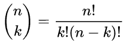
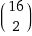
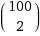
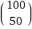

# Java 组合问题概述

> 原文：<https://web.archive.org/web/20220930061024/https://www.baeldung.com/java-combinatorial-algorithms>

## 1.概观

在本教程中，我们将学习如何解决一些常见的组合问题。它们很可能在日常工作中用处不大；然而，从算法的角度来看，它们很有趣。我们可能会发现它们便于测试。

请记住，有许多不同的方法可以解决这些问题。我们努力使提出的解决方案易于理解。

## 2.生成排列

首先，让我们从排列开始。排列是以一种不同的顺序重新排列一个序列的行为。

从数学上我们知道，**对于一个`n`元素的序列，有`n!`种不同的排列**。`n!`被称为[阶乘](/web/20221206232749/https://www.baeldung.com/java-calculate-factorial)运算:

> n！= 1 * 2 *……* n

例如，对于一个序列`[1, 2, 3] `，有六种排列:

```java
[1, 2, 3]

[1, 3, 2]

[2, 1, 3]

[2, 3, 1]

[3, 1, 2]

[3, 2, 1]
```

阶乘增长非常快——对于 10 个元素的序列，我们有 3，628，800 种不同的排列！在这种情况下，**我们讨论置换序列，其中每个元素都是不同的**。

### 2.1.算法

考虑以递归方式生成排列是一个好主意。**让我们介绍一下国家的概念。它将由两部分组成:当前排列和当前处理元素的索引。**

在这种状态下，唯一要做的工作就是将该元素与剩余的所有元素进行交换，并转换到一个状态，该状态具有修改后的序列和增加 1 的索引。

让我们用一个例子来说明。

我们希望为四个元素的序列生成所有排列-`[1, 2, 3, 4]`。所以，会有 24 种排列。下图显示了该算法的部分步骤:

[](/web/20221206232749/https://www.baeldung.com/wp-content/uploads/2019/12/permutations-1.png)

**树的每个节点都可以理解为一个状态。**顶部的红色数字表示当前处理的元素的索引。节点中的绿色数字表示互换。

因此，我们从索引等于零的状态`[1, 2, 3, 4]`开始。我们将第一个元素与每个元素交换——包括不交换任何东西的第一个元素——然后继续下一个状态。

现在，我们想要的排列位于右边的最后一列。

### 2.2.Java 实现

用 Java 写的算法很简短:

```java
private static void permutationsInternal(List<Integer> sequence, List<List<Integer>> results, int index) {
    if (index == sequence.size() - 1) {
        permutations.add(new ArrayList<>(sequence));
    }

    for (int i = index; i < sequence.size(); i++) {
        swap(sequence, i, index);
        permutationsInternal(sequence, permutations, index + 1);
        swap(sequence, i, index);
    }
}
```

我们的函数有三个参数:当前处理的序列、结果(排列)和当前正在处理的元素的索引。

首先要做的是检查我们是否到达了最后一个元素。如果是这样，我们将序列添加到结果列表中。

然后，在 for 循环中，我们执行交换，对方法进行递归调用，然后将元素交换回来。

最后一部分是一个小小的性能技巧——我们可以一直对同一个`sequence`对象进行操作，而不必为每个递归调用创建一个新的序列。

将第一个递归调用隐藏在 facade 方法下也是一个好主意:

```java
public static List<List<Integer>> generatePermutations(List<Integer> sequence) {
    List<List<Integer>> permutations = new ArrayList<>();
    permutationsInternal(sequence, permutations, 0);
    return permutations;
} 
```

请记住，所示的算法仅适用于唯一元素的序列！对具有重复元素的序列应用相同的算法将得到重复。

## 3.生成集合的幂集

另一个流行的问题是生成集合的幂集。让我们从定义开始:

> 集合`S`的幂集(或幂集)是`S`的所有子集的集合，包括空集和`S`本身

例如，给定一个集合`[a, b, c]`，幂集包含八个子集:

```java
[]

[a]

[b]

[c]

[a, b]

[a, c]

[b, c]

[a, b, c]
```

从数学上我们知道，对于包含`n`个元素的集合，**的幂集应该包含`2^n`个子集**。这个数字也在快速增长，但是没有阶乘那么快。

### 3.1.算法

这一次，我们也将递归地思考。现在，我们的状态将由两部分组成:集合中当前正在处理的元素的索引和一个累加器。

我们需要在每种状态下做出两个选择:是否将当前元素放入累加器。当我们的索引到达集合末尾时，我们有一个可能的子集。这样，我们可以生成每一个可能的子集。

### 3.2.Java 实现

我们用 Java 编写的算法非常易读:

```java
private static void powersetInternal(
  List<Character> set, List<List<Character>> powerset, List<Character> accumulator, int index) {
    if (index == set.size()) {
        results.add(new ArrayList<>(accumulator));
    } else {
        accumulator.add(set.get(index));
        powerSetInternal(set, powerset, accumulator, index + 1);
        accumulator.remove(accumulator.size() - 1);
        powerSetInternal(set, powerset, accumulator, index + 1);
    }
}
```

我们的函数有四个参数:我们要为其生成子集的集合、生成的幂集、累加器和当前处理的元素的索引。

为了简单起见，**我们将集合保存在列表中。我们想要快速访问由索引指定的元素，**，这可以通过`List`来实现，但不能通过`Set`来实现。

此外，单个元素由单个字母表示(Java 中的`Character` 类)。

首先，我们检查索引是否超过了设定的大小。如果是，那么我们把累加器放入结果集，否则我们:

*   将当前考虑的元素放入累加器中
*   使用递增的索引和扩展的累加器进行递归调用
*   从累加器中删除最后一个元素，这是我们之前添加的
*   使用不变的累加器和递增的索引再次调用

同样，我们用 facade 方法隐藏实现:

```java
public static List<List<Character>> generatePowerset(List<Character> sequence) {
    List<List<Character>> powerset = new ArrayList<>();
    powerSetInternal(sequence, powerset, new ArrayList<>(), 0);
    return powerset;
}
```

## 4.生成组合

现在，是时候解决组合问题了。我们将其定义如下:

> `k`-集合的组合 `S`是来自`S,` 的`k`不同元素的子集，其中项目的顺序无关紧要

[`k`-](/web/20221206232749/https://www.baeldung.com/cs/generate-k-combinations)的数量用二项式系数描述:

[](/web/20221206232749/https://www.baeldung.com/wp-content/uploads/2019/12/binomial.png)

例如，对于集合`[a, b, c]` ，我们有三个`2`-组合:

```java
[a, b]

[a, c]

[b, c]
```

组合有很多组合用法和解释。举个例子，假设我们有一个由 16 支球队组成的足球联赛。我们能看到多少不同的比赛？

答案是 [](/web/20221206232749/https://www.baeldung.com/wp-content/uploads/2019/12/16_2.gif) ，计算结果为 120。

### 4.1.算法

从概念上讲，我们将做一些类似于前面的幂集算法的事情。我们将有一个递归函数，其状态由当前处理的元素的索引和一个累加器组成。

**同样，我们对每个状态都得到了相同的决定:我们是否将元素添加到累加器中？** **这一次，我们有一个额外的限制——我们的累加器不能有超过`k`个元素`.`**

值得注意的是，二项式系数不一定是一个很大的数字。例如:

[](/web/20221206232749/https://www.baeldung.com/wp-content/uploads/2019/12/100_2.gif) 等于 4950，而

[](/web/20221206232749/https://www.baeldung.com/wp-content/uploads/2019/12/100_50.gif) 有 30 位数字！

### 4.2.Java 实现

为了简单起见，我们假设集合中的元素是整数。

让我们来看看该算法的 Java 实现:

```java
private static void combinationsInternal(
  List<Integer> inputSet, int k, List<List<Integer>> results, ArrayList<Integer> accumulator, int index) {
  int needToAccumulate = k - accumulator.size();
  int canAcculumate = inputSet.size() - index;

  if (accumulator.size() == k) {
      results.add(new ArrayList<>(accumulator));
  } else if (needToAccumulate <= canAcculumate) {
      combinationsInternal(inputSet, k, results, accumulator, index + 1);
      accumulator.add(inputSet.get(index));
      combinationsInternal(inputSet, k, results, accumulator, index + 1);
      accumulator.remove(accumulator.size() - 1);
  }
}
```

这一次，我们的函数有五个参数:一个输入集、`k` 参数、一个结果列表、一个累加器和当前处理的元素的索引。

我们从定义辅助变量开始:

*   `needToAccumulate`–表示我们还需要向累加器中添加多少元素才能得到正确的组合
*   `canAcculumate`–表示我们还可以向累加器中添加多少元素

现在，我们检查我们的累加器大小是否等于`k`。如果是这样，那么我们可以把复制的数组放到结果列表中。

在另一种情况下，**如果我们在集合的剩余部分仍然有足够的元素，我们进行两个独立的递归调用:将当前处理的元素放入累加器，或者不放入。**这部分类似于我们之前生成 powerset 的方式。

当然，这个方法可以写得更快一点。例如，我们可以稍后声明`needToAccumulate`和`canAcculumate`变量。然而，我们关注的是可读性。

同样，facade 方法隐藏了实现:

```java
public static List<List<Integer>> combinations(List<Integer> inputSet, int k) {
    List<List<Integer>> results = new ArrayList<>();
    combinationsInternal(inputSet, k, results, new ArrayList<>(), 0);
    return results;
}
```

## 5.摘要

在这篇文章中，我们讨论了不同的组合问题。此外，我们还展示了用 Java 实现解决这些问题的简单算法。在某些情况下，这些算法可以帮助满足不寻常的测试需求。

像往常一样，GitHub 上的[提供了完整的源代码和测试。](https://web.archive.org/web/20221206232749/https://github.com/eugenp/tutorials/tree/master/algorithms-modules/algorithms-miscellaneous-5)