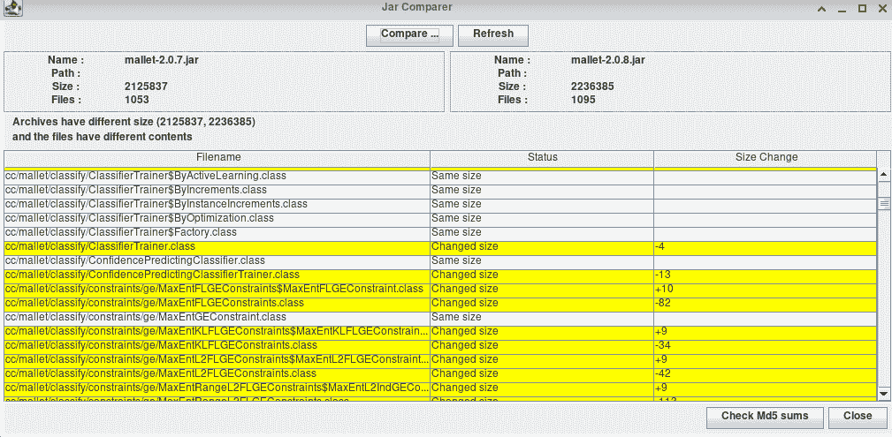
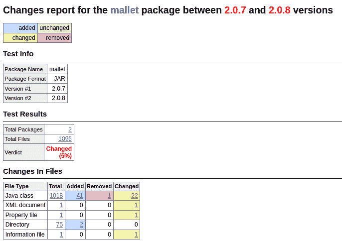
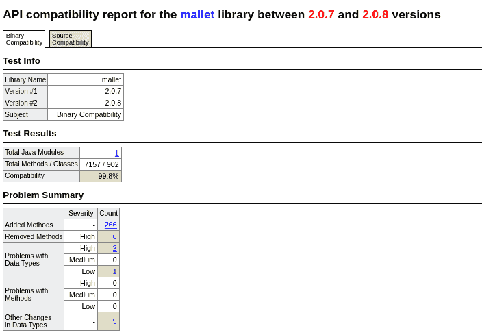
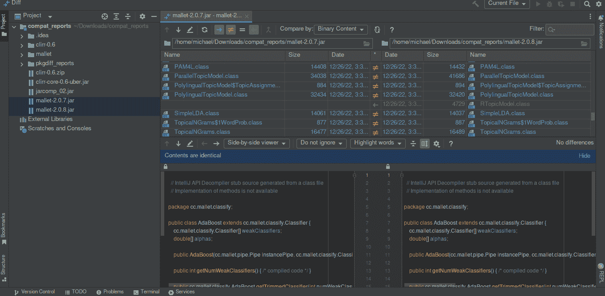

# 比较 Java 中的两个 JAR 文件

> 原文：<https://web.archive.org/web/20220930061024/https://www.baeldung.com/java-comparing-jar-files>

## 1.概观

[JAR](/web/20221231132800/https://www.baeldung.com/java-create-jar) 文件是分发 Java 应用的基本神器。有时，我们可能需要检查 JAR 文件来检查可能的更改。并找出向后兼容性。

在本教程中，我们将探索不同的工具来比较 JAR 文件。

## 2.示例 JAR 文件

在本教程中，我们将比较 [mallet](https://web.archive.org/web/20221231132800/https://mimno.github.io/Mallet/) JAR 文件。 **Mallet 是一个 Java 机器学习库**。**其用途包括聚类、自然语言处理**等。我们将比较[版本 2.0.7](https://web.archive.org/web/20221231132800/https://repo1.maven.org/maven2/cc/mallet/mallet/2.0.7/) 和[版本 2.0.8](https://web.archive.org/web/20221231132800/https://repo1.maven.org/maven2/cc/mallet/mallet/2.0.8/) 。我们将使用不同的工具来比较这两个 JAR 文件并记录变更。

## 3.使用 Jarcomp

**Jarcomp 是一款免费的跨平台比较 JAR 和 ZIP 文件的工具**。它通过引用大小变化来显示两个文件之间的变化。

我们将用它来比较我们的样本 JAR 文件。首先，让我们创建一个新目录，并将示例 JAR 文件复制到其中。

然后让我们抓取 [jarcomp](https://web.archive.org/web/20221231132800/https://activityworkshop.net/software/jarcomp/jarcomp_02.jar) 可执行 JAR，并将其放在我们创建的目录中。最后，让我们打开终端，转到我们的目录。

接下来，我们将使用示例 JAR 文件运行`Jarcomp`可执行 JAR:

```
$ java -jar jarcomp_02.jar mallet-2.0.7.jar mallet-2.0.8.jar 
```

我们的工具生成了一个报告，显示了我们的示例 JAR 文件中的变化:

[](/web/20221231132800/https://www.baeldung.com/wp-content/uploads/2022/12/2_jarcomp.png)

该报告显示了我们的二进制的变化。此外，它还总结了示例 JAR 文件中的文件数量。它还指示示例 JAR 文件的总体大小。

## 4.使用 PkgDiff

**PkgDiff 表示包变化分析器**。它可视化软件包中的变化，如 ZIP、JAR、TAR.GZ、DEB 等。**该工具帮助软件维护人员跟踪变更**。**并确保新旧版本的兼容性**。

支持的平台包括 FreeBSD、Mac OS X 和 GNU/Linux。

我们将使用这个工具来比较我们的示例 JAR 文件。

### 4.1.装置

首先，我们将 [下载](https://web.archive.org/web/20221231132800/https://lvc.github.io/pkgdiff/#Downloads) 我们机器上的工具。然后，我们将提取下载的 tar.gz:

```
$ tar -xvf pkgdiff-1.7.2.tar.gz
```

接下来，让我们转到提取的文件:

```
$ cd pkgdiff-1.7.2
```

最后，让我们使用 makefile 安装该工具:

```
$ sudo make install
```

我们的工具现在可以使用了。

### 4.2.使用

让我们使用该工具来可视化示例 JAR 文件中的变化。首先，让我们转到包含示例 JAR 文件的目录。

然后让我们使用`pkgdiff`命令来比较示例 JAR 文件:

```
$ pkgdiff  mallet-2.0.7.jar mallet-2.0.8.jar 
```

我们的工具生成了一个 HTML 格式的报告，以显示二进制文件和源文件之间的差异:

[](/web/20221231132800/https://www.baeldung.com/wp-content/uploads/2022/12/2_pkgdiff.png)

该报告显示了我们的二进制的变化。它显示了类文件中的百分比变化。此外，它还总结了二进制。它显示添加和删除的文件数量。最后，它显示了目录和新增内容的总数。

## 5.使用 JAPICC

Java API 一致性检查器(JAPICC)是一个评估 Java 库之间相似性的工具。它显示了二进制和源代码级别的变化。该工具检查可能危及向后兼容性的修改。它检查移除的方法和类字段、引入的方法等。这是通过比较两个二进制文件来实现的。

该工具为二进制和源代码兼容性检查生成 HTML 报告。它同时支持 Java 和 Scala。

### 5.1.装置

首先，我们将 [下载](https://web.archive.org/web/20221231132800/https://github.com/lvc/japi-compliance-checker/releases) 我们机器上的工具。然后，我们将解压下载的 zip 文件:

```
$ unzip japi-compliance-checker-2.4.zip
```

解压缩 zip 文件后，我们将进入目录:

```
$ cd japi-compliance-checker-2.4
```

最后，我们将使用 makefile 在我们的系统上安装它:

```
$ sudo make install
```

我们的工具现在可以使用了。

### 5.2.使用

我们将使用我们的安装工具来比较示例 JAR 文件。首先，我们将创建一个新目录并将 JAR 文件移动到其中。然后我们将打开我们的终端，进入我们的新目录。最后，我们将运行`japi-compliance`命令来比较两个 JAR 文件:

```
$ japi-compliance-checker mallet-2.0.7.jar mallet-2.0.8.jar
```

这在我们的目录中生成了一个报告。该报告包含了我们的 JAR 文件在二进制和源代码级别上的差异。

[](/web/20221231132800/https://www.baeldung.com/wp-content/uploads/2022/12/2_binary-compatibility-1.png)

我们的报告显示 99.8%的兼容性，并增加了最新版本的方法。它指示源文件中方法和类的总数。它还比较了单个二进制文件和源文件，并给出了百分比变化。

## 6.使用 IntelliJ 理念

**[IntelliJ](/web/20221231132800/https://www.baeldung.com/intellij-basics) IDEA 是 JetBrains** 的一个集成开发环境。**IDE 有一个内置的比较 JAR 文件的工具**。我们将使用 IDE 来比较我们的示例 JAR 文件。首先，让我们启动 IDE 并打开包含示例 JAR 文件的文件夹。

接下来，让我们选择两个示例 JAR 文件。最后，让我们按 CTRL + D 来比较这两个 JAR 文件。

我们将得到一份关于 JAR 文件变化的综合报告:

[](/web/20221231132800/https://www.baeldung.com/wp-content/uploads/2022/12/2_intellij.png)

生成的报告非常清楚。它显示了二进制文件、其内容以及发生的变化。这个特性简单易用，而且功能强大。我们不需要安装任何东西来使用它。

结果还会比较源文件。它显示类并指出源文件中的变化。此外，它还显示了类及其内容。并在源文件中显式显示添加的代码。

## 7.结论

在本教程中，我们研究了不同的工具来比较两个 JAR 文件。IntelliJ 的想法看起来很简单，也更容易开始。它给出了一个全面的报告，并可视化类文件中的变化。

其他工具也可以完成这项工作。PkgDiff 和 JAPICC 生成一个报告，显示二进制文件和源文件中的变化。