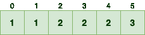
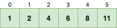
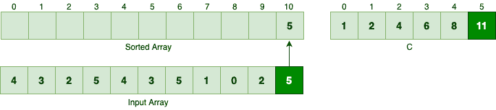
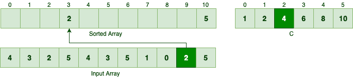
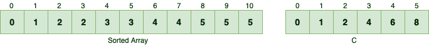
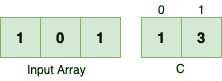
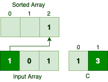
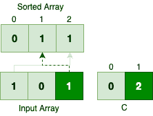
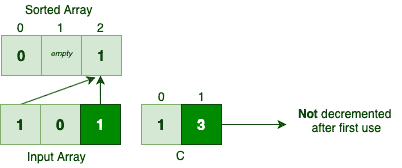

# Java 中的计数排序

> 原文：<https://web.archive.org/web/20220930061024/https://www.baeldung.com/java-counting-sort>

## 1.概观

像[合并排序](/web/20221202091715/https://www.baeldung.com/java-merge-sort)这样的通用排序算法对输入不做任何假设，所以它们在最坏的情况下也无法打败`O(n log n)`。相反，计数排序对输入有一个假设，这使它成为一个线性时间排序算法。

在本教程中，我们将熟悉计数排序的机制，然后用 Java 实现它。

## 2.计数排序

与大多数经典排序算法相反，计数排序并不通过比较元素来对给定的输入进行排序。相反，**它假设输入元素是范围[0，`k` ]** 内的`n`整数。当`k = O(n), `时，计数排序将在`O(n)`时间内运行。

请注意，我们不能将计数排序作为通用排序算法。然而，当输入与这个假设一致时，它是相当快的！

### 2.1.频率阵列

假设我们要对一个值在[0，5]范围内的输入数组进行排序: [](/web/20221202091715/https://www.baeldung.com/wp-content/uploads/2019/09/counts.png) 

[](/web/20221202091715/https://www.baeldung.com/wp-content/uploads/2019/09/To-Sort-Array.png)

首先，**我们要统计每个数字在输入数组中的出现次数。如果我们用数组`C`表示计数，那么`C[i] `表示数字`i `在输入数组**中的出现频率:

[](/web/20221202091715/https://www.baeldung.com/wp-content/uploads/2019/09/counts.png)

例如，因为 5 在输入数组中出现了 3 次，所以索引 5 的值等于 3。

**现在给定数组`C,`，我们应该确定有多少个元素小于或等于每个输入元素。**例如:

*   一个元素小于等于零，或者换句话说，只有一个零值，等于`C[0]`
*   两个元素小于或等于一，等于`C[0] + C[1]`
*   四个值小于等于二，等于`C[0] + C[1] + C[2]`

**因此，如果我们继续计算`C, `中的`n `个连续元素的总和，我们就可以知道输入数组中有多少个元素小于或等于数字`n-1`。**总之，通过应用这个简单的公式，我们可以将`C `更新如下:

[](/web/20221202091715/https://www.baeldung.com/wp-content/uploads/2019/09/less-than.png)

### 2.2.该算法

现在我们可以使用辅助数组`C `对输入数组进行排序。计数排序的工作原理如下:

*   它反向迭代输入数组
*   对于每个元素`i, ` `C[i] – 1 `表示数字`i` 在排序后的数组中的位置。这是因为存在小于或等于`i`的`C[i] `元素
*   然后，它在每一轮结束时递减`C[i] `

为了对样本输入数组进行排序，我们应该首先从数字 5 开始，因为它是最后一个元素。根据`C[5], `有 11 个元素小于或等于数字 5。

因此，5 应该是排序数组中的第 11 个^(元素，因此索引为 10:)

[](/web/20221202091715/https://www.baeldung.com/wp-content/uploads/2019/09/Untitled-Diagram.png)

由于我们将 5 移动到排序后的数组中，我们应该递减`C[5]. `逆序的下一个元素是 2。由于有 4 个元素小于或等于 2，这个数应该是排序数组中的第 4 个^(元素):

[](/web/20221202091715/https://www.baeldung.com/wp-content/uploads/2019/09/Untitled-Diagram-1.png)

类似地，我们可以找到下一个元素 0 的正确位置:

[](/web/20221202091715/https://www.baeldung.com/wp-content/uploads/2019/09/Untitled-Diagram-2.png)

如果我们继续反向迭代，并适当地移动每个元素，我们将得到如下结果:

[](/web/20221202091715/https://www.baeldung.com/wp-content/uploads/2019/09/Untitled-Diagram-3.png)

## 3.计数排序–Java 实现

### 3.1.计算频率阵列

首先，给定元素的输入数组和`k, `，我们应该计算数组`C:`

```
int[] countElements(int[] input, int k) {
    int[] c = new int[k + 1];
    Arrays.fill(c, 0);

    for (int i : input) {
        c[i] += 1;
    }

    for (int i = 1; i < c.length; i++) {
	c[i] += c[i - 1];
    }

    return c;
}
```

让我们分解方法签名:

*   代表我们要排序的数字数组
*   `input` 数组是一个范围在[0，`k` ]内的整数数组——所以`k `表示`input`中的最大数
*   返回类型是一个表示`C `数组的整数数组

下面是`countElements `方法的工作原理:

*   首先，我们初始化了`C `数组。由于[0，k]范围包含了`k+1 `个数字，我们正在创建一个能够包含`k+1 `个数字的数组
*   然后对于`input, `中的每个数字，我们计算这个数字的频率
*   最后，我们将连续的元素相加，以了解有多少元素小于或等于特定的数

此外，我们可以验证`countElements `方法是否如预期的那样工作:

```
@Test
void countElements_GivenAnArray_ShouldCalculateTheFrequencyArrayAsExpected() {
    int k = 5;
    int[] input = { 4, 3, 2, 5, 4, 3, 5, 1, 0, 2, 5 };

    int[] c = CountingSort.countElements(input, k);
    int[] expected = { 1, 2, 4, 6, 8, 11 };
    assertArrayEquals(expected, c);
}
```

### 3.2.对输入数组进行排序

既然我们可以计算频率数组，我们应该能够对任何给定的数字集合进行排序:

```
int[] sort(int[] input, int k) {
    int[] c = countElements(input, k);

    int[] sorted = new int[input.length];
    for (int i = input.length - 1; i >= 0; i--) {
        int current = input[i];
	sorted[c[current] - 1] = current;
	c[current] -= 1;
    }

    return sorted;
}
```

下面是`sort `方法的工作原理:

*   首先，它计算`C `数组
*   然后，它反向迭代`input `数组，并为`input, `中的每个元素在排序后的数组中找到正确的位置。`input `中的`i^(th) `元素应该是排序数组中的`C[i]^(th) `元素。因为 Java 数组是零索引的，`C[i]-1` 条目是`C[i]^(th) `元素——例如，`sorted[5] `是排序数组中的第六个元素
*   每当我们找到一个匹配，它就减少相应的`C[i] `值

类似地，我们可以验证`sort `方法是否如预期的那样工作:

```
@Test
void sort_GivenAnArray_ShouldSortTheInputAsExpected() {
    int k = 5;
    int[] input = { 4, 3, 2, 5, 4, 3, 5, 1, 0, 2, 5 };

    int[] sorted = CountingSort.sort(input, k);

    // Our sorting algorithm and Java's should return the same result
    Arrays.sort(input);
    assertArrayEquals(input, sorted);
}
```

## 4.重新审视计数排序算法

### 4.1.复杂性分析

**大多数经典的排序算法，如[合并排序](/web/20221202091715/https://www.baeldung.com/java-merge-sort)，通过比较输入元素来排序任何给定的输入。**这些类型的排序算法被称为`comparison sorts`。在最坏的情况下，比较排序至少需要 O 个`(n log n)`来排序`n `元素。

另一方面，计数排序不通过比较输入元素来对输入进行排序，所以它显然不是一个比较排序算法。

让我们看看对输入进行排序需要多少时间:

*   它在`O(n+k) `时间内计算`C `数组:它在`O(n) `内迭代一次大小为`n `的输入数组，然后在`O(k) –` 内迭代`C `，这样总共就是`O(n+k) `
*   在计算完`C, `之后，它通过迭代输入数组并在每次迭代中执行一些原始操作来对输入进行排序。因此，实际的排序操作需要`O(n)`

总的来说，计数排序需要`O(n+k) `时间来运行:

```
O(n + k) + O(n) = O(2n + k) = O(n + k)
```

**如果我们假设`k=O(n), `，那么计数排序算法在线性时间内对输入进行排序。**与通用排序算法相反，计数排序对输入做了一个假设，并且执行时间小于 O `(n log n) `下限。

### 4.2.稳定性

几分钟前，我们制定了一些关于计数排序机制的特殊规则，但从未阐明它们背后的原因。更具体地说:

*   **为什么要反向迭代输入数组？**
*   **为什么我们每次使用时都要减少`C[i] `？**

让我们从头开始迭代，以便更好地理解第一条规则。假设我们要对一个简单的整数数组进行排序，如下所示:

[](/web/20221202091715/https://www.baeldung.com/wp-content/uploads/2019/09/Untitled-Diagram-4.png)

在第一次迭代中，我们应该找到第一个 1:

[](/web/20221202091715/https://www.baeldung.com/wp-content/uploads/2019/09/Untitled-Diagram-5.png)

所以第一次出现的数字 1 得到排序数组中的最后一个索引。跳过数字 0，让我们看看数字 1 第二次出现时会发生什么:

[](/web/20221202091715/https://www.baeldung.com/wp-content/uploads/2019/09/Untitled-Diagram-6.png)

**相同值的元素在输入和排序数组中的出现顺序不同，所以当我们从头开始迭代时，算法不是[稳定的](/web/20221202091715/https://www.baeldung.com/stable-sorting-algorithms)。**

如果我们在每次使用后不递减`C[i] `值会发生什么？让我们看看:

[](/web/20221202091715/https://www.baeldung.com/wp-content/uploads/2019/09/Untitled-Diagram-2-1.png)

两次出现的数字 1 都是排序数组的最后一位。因此，如果我们不在每次使用后减少`C[i] `值，我们可能会在排序时丢失一些数字！

## 5.结论

在本教程中，首先，我们学习了计数排序的内部工作原理。然后我们用 Java 实现了这个排序算法，并编写了一些测试来验证它的行为。最后，我们证明了该算法是一个稳定的线性时间复杂度的排序算法。

像往常一样，我们的 [GitHub](https://web.archive.org/web/20221202091715/https://github.com/eugenp/tutorials/tree/master/algorithms-modules/algorithms-sorting) 项目中提供了示例代码，所以请务必查看一下！