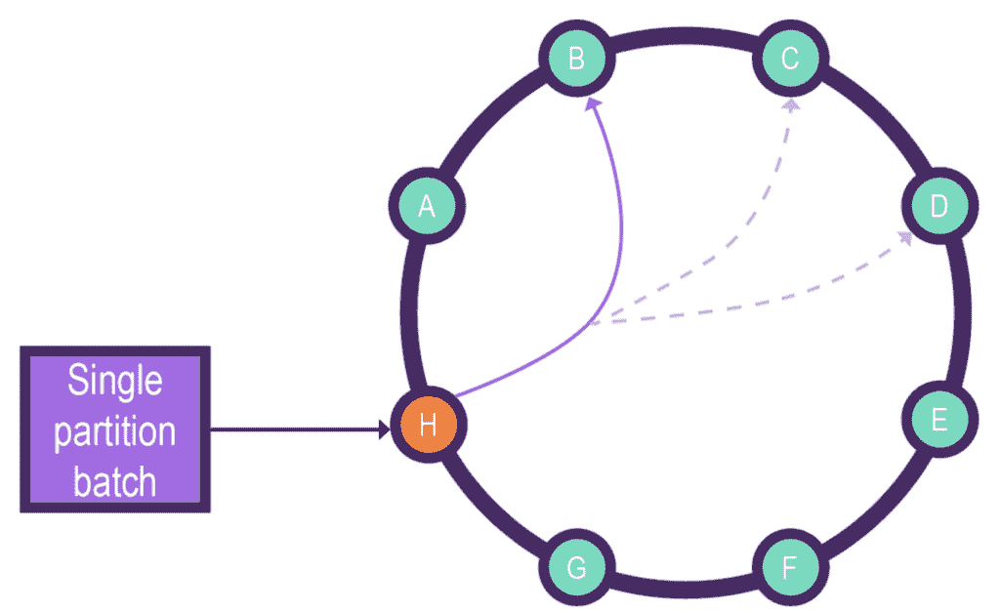
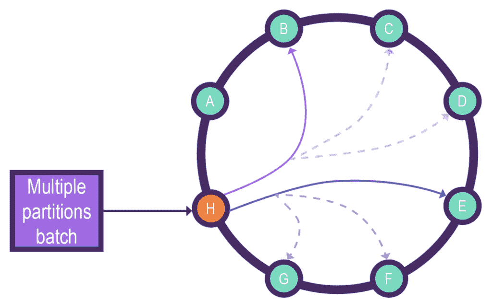
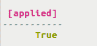

# Cassandra 查询语言和 Java 中的 Cassandra 批处理

> 原文：<https://web.archive.org/web/20220930061024/https://www.baeldung.com/java-cql-cassandra-batch>

## 1.概观

在本教程中，我们将学习 [Cassandra](/web/20220815041158/https://www.baeldung.com/cassandra-with-java) 批处理查询及其不同的用例。我们将分析单分区和多分区表批处理查询。

我们将在`Cqlsh`和 Java 应用程序中探索批处理。

## 2.Cassandra 批处理基础

与关系数据库不同，像 **Cassandra 这样的分布式数据库不支持 [ACID](/web/20220815041158/https://www.baeldung.com/cs/transactions-intro#1-acid-properties) (原子性、一致性、隔离性和持久性)属性**。尽管如此，在某些情况下，我们需要多个数据修改成为一个原子的或/和独立的操作。

batch 语句组合了多个数据修改语言语句(如 INSERT、UPDATE 和 DELETE ),以在针对单个分区时实现原子性和隔离，或者在针对多个分区时仅实现原子性。

批量查询的语法如下:

```
BEGIN [ ( UNLOGGED | COUNTER ) ] BATCH
[ USING TIMESTAMP [ epoch_microseconds ] ]
dml_statement [ USING TIMESTAMP [ epoch_microseconds ] ] ;
[ dml_statement [ USING TIMESTAMP [ epoch_microseconds ] ] [ ; ... ] ]
APPLY BATCH;
```

让我们用一个例子来看一下上面的语法:

```
BEGIN BATCH 

INSERT INTO product (product_id, variant_id, product_name) 
VALUES (2c11bbcd-4587-4d15-bb57-4b23a546bd7f,0e9ef8f7-d32b-4926-9d37-27225933a5f3,'banana'); 

INSERT INTO product (product_id, variant_id, product_name) 
VALUES (2c11bbcd-4587-4d15-bb57-4b23a546bd7f,0e9ef8f7-d32b-4926-9d37-27225933a5f5,'banana'); 

APPLY BATCH;
```

首先，我们使用不带任何可选参数(如`UNLOGGED `或 `USING TIMESTAMP` )的`BEGIN BATCH` 语句来启动批量查询，然后包含所有的 DML 操作，即`product`表的 insert 语句。

最后，我们使用`APPLY BATCH` 语句来执行批处理。

我们应该注意，我们将无法撤消任何批处理查询，因为批处理查询不支持回滚功能。

### 2.1.单一分区

批处理语句在一个分区中应用所有的 DML 语句，确保原子性和隔离性。

以单个分区为目标的设计良好的批处理可以减少客户端-服务器流量，并更有效地更新具有单行变异的表。这是因为只有当批处理操作写入单个分区时，才会发生批处理隔离。

单个分区批处理还可以涉及两个不同的表，这两个表具有相同的分区键并存在于相同的键空间中。

默认情况下，**单分区批处理操作是不记录日志的，因此不会因为记录日志而遭受性能损失。**

下图描述了从协调节点`H`到分区节点`B`及其复制节点`C`、`D`的单分区批处理请求流:

[](/web/20220815041158/https://www.baeldung.com/wp-content/uploads/2022/01/single-partition.png)

礼遇:数据税

### 2.2.多个分区

涉及多个分区的批处理需要很好地设计，因为它涉及多个节点之间的协调。多分区批处理的最佳用例是将相同的数据写入两个相关的表中，即两个表具有相同的列和不同的分区键。

多分区批处理操作**使用`batchlog` 机制来保证原子性**。协调节点向批处理日志节点发送批处理日志请求，一旦收到确认的回执，就执行批处理语句。然后，它从节点中删除*批处理日志*，并向客户端发送确认消息。

建议避免使用多分区批处理查询。这是因为这种查询给协调节点带来了巨大的压力，严重影响了它的性能。

当没有其他可行的选择时，我们应该只使用多分区批处理。

下图描述了从协调节点`H`到分区节点`B`、`E`及其各自的复制节点`C`、`D`和`F`、`G`的多分区批处理请求流:

[](/web/20220815041158/https://www.baeldung.com/wp-content/uploads/2022/01/multi-partition.png)

礼遇:数据税

## 3.`Cqlsh`中的批量执行

首先，让我们创建一个`product`表来运行一些批处理查询:

```
CREATE TABLE product (
  product_id UUID,
  variant_id UUID,
  product_name text,
  description text,
  price float,
  PRIMARY KEY (product_id, variant_id)
  );
```

### 3.1.没有时间戳的单分区批处理

我们将针对`product`表的单个分区执行下面的批处理查询，并且不提供时间戳:

```
BEGIN BATCH 

INSERT INTO product (product_id, variant_id, product_name) 
VALUES (2c11bbcd-4587-4d15-bb57-4b23a546bd7f,0e9ef8f7-d32b-4926-9d37-27225933a5f3,'banana') IF NOT EXISTS; 

INSERT INTO product (product_id, variant_id, product_name) 
VALUES (2c11bbcd-4587-4d15-bb57-4b23a546bd7f,0e9ef8f7-d32b-4926-9d37-27225933a5f5,'banana') IF NOT EXISTS; 

UPDATE product SET price = 7.12, description = 'banana v1' 
WHERE product_id = 2c11bbcd-4587-4d15-bb57-4b23a546bd7f AND variant_id=0e9ef8f7-d32b-4926-9d37-27225933a5f3; 

UPDATE product SET price = 11.90, description = 'banana v2' 
WHERE product_id = 2c11bbcd-4587-4d15-bb57-4b23a546bd7f AND variant_id=0e9ef8f7-d32b-4926-9d37-27225933a5f5; 

APPLY BATCH;
```

上面的查询**使用比较和设置(CAS)逻辑、**即`IF NOT EXISTS`子句，所有这样的条件语句必须返回`true`来执行批处理。如果任何这样的语句返回`false`，那么整批都是未处理的。

在执行上述查询后，我们将得到下面的成功确认:

[](/web/20220815041158/https://www.baeldung.com/wp-content/uploads/2022/01/useBatchExamplesAck.png)

现在让我们验证数据的`writetime`在批量执行后是否相同:

```
cqlsh:testkeyspace> select product_id, variant_id, product_name, description, price, writetime(product_name) from product;

@ Row 1
-------------------------+--------------------------------------
product_id | 3a043b68-20ee-4ece-8f4b-a07e704bc9f5
variant_id | b84b9366-9998-4b2d-9a96-7e9a59a94ae5
product_name | Banana
description | banana v1
price | 12
writetime(product_name) | 1639275574653000

@ Row 2
-------------------------+--------------------------------------
product_id | 3a043b68-20ee-4ece-8f4b-a07e704bc9f5
variant_id | facc3997-299d-419b-b133-a54b5d4dfc3b
product_name | Banana
description | banana v2
price | 12
writetime(product_name) | 1639275574653000
```

### 3.2。带时间戳的单分区批处理

我们现在将看到使用`USING TIMESTAMP`选项以`epoch`时间格式(即微秒)提供时间戳的批处理查询的例子。

下面是对所有 DML 语句应用相同时间戳的批处理查询:

```
BEGIN BATCH USING TIMESTAMP 1638810270 

INSERT INTO product (product_id, variant_id, product_name) 
VALUES (2c11bbcd-4587-4d15-bb57-4b23a546bd7f,0e9ef8f7-d32b-4926-9d37-27225933a5f3,'banana'); 

INSERT INTO product (product_id, variant_id, product_name) 
VALUES (2c11bbcd-4587-4d15-bb57-4b23a546bd7f,0e9ef8f7-d32b-4926-9d37-27225933a5f5,'banana'); 

UPDATE product SET price = 7.12, description = 'banana v1' 
WHERE product_id = 2c11bbcd-4587-4d15-bb57-4b23a546bd7f AND variant_id=0e9ef8f7-d32b-4926-9d37-27225933a5f3; 

UPDATE product SET price = 11.90, description = 'banana v2' 
WHERE product_id = 2c11bbcd-4587-4d15-bb57-4b23a546bd7f AND variant_id=0e9ef8f7-d32b-4926-9d37-27225933a5f5; 

APPLY BATCH;
```

现在，让我们在任何单个 DML 语句上指定自定义时间戳:

```
BEGIN BATCH 

INSERT INTO product (product_id, variant_id, product_name) 
VALUES (2c11bbcd-4587-4d15-bb57-4b23a546bd7f,0e9ef8f7-d32b-4926-9d37-27225933a5f3,'banana');

INSERT INTO product (product_id, variant_id, product_name) 
VALUES (2c11bbcd-4587-4d15-bb57-4b23a546bd7f,0e9ef8f7-d32b-4926-9d37-27225933a5f5,'banana') USING TIMESTAMP 1638810270; 

UPDATE product SET price = 7.12, description = 'banana v1' 
WHERE product_id = 2c11bbcd-4587-4d15-bb57-4b23a546bd7f AND variant_id=0e9ef8f7-d32b-4926-9d37-27225933a5f3 USING TIMESTAMP 1638810270; 

UPDATE product SET price = 11.90, description = 'banana v2' 
WHERE product_id = 2c11bbcd-4587-4d15-bb57-4b23a546bd7f AND variant_id=0e9ef8f7-d32b-4926-9d37-27225933a5f5; 

APPLY BATCH;
```

我们现在将看到一个无效的批处理查询，它既有自定义时间戳又有`compare-and-set (CAS)`逻辑，即`IF NOT EXISTS` 子句`:`

```
BEGIN BATCH USING TIMESTAMP 1638810270 

INSERT INTO product (product_id, variant_id, product_name) 
VALUES (2c11bbcd-4587-4d15-bb57-4b23a546bd7f,0e9ef8f7-d32b-4926-9d37-27225933a5f3,'banana') IF NOT EXISTS; 

INSERT INTO product (product_id, variant_id, product_name) 
VALUES (2c11bbcd-4587-4d15-bb57-4b23a546bd7f,0e9ef8f7-d32b-4926-9d37-27225933a5f5,'banana') IF NOT EXISTS; 

UPDATE product SET price = 7.12, description = 'banana v1' 
WHERE product_id = 2c11bbcd-4587-4d15-bb57-4b23a546bd7f AND variant_id=0e9ef8f7-d32b-4926-9d37-27225933a5f3; 

UPDATE product SET price = 11.90, description = 'banana v2' 
WHERE product_id = 2c11bbcd-4587-4d15-bb57-4b23a546bd7f AND variant_id=0e9ef8f7-d32b-4926-9d37-27225933a5f5; 

APPLY BATCH;
```

在执行上面的查询时，我们会得到下面的错误:

```
InvalidRequest: Error from server: code=2200 [Invalid query]
message="Cannot provide custom timestamp for conditional BATCH"
```

上述错误是因为客户端时间戳被禁止用于任何条件插入或更新。

### 3.3。多分区批量查询

在多个分区 **上批处理的**最佳用例是将准确的数据插入两个相关的表**。**

让我们将相同的数据插入到具有不同分区键的`product_by_name`和`product_by_id`表中:

```
BEGIN BATCH 

INSERT INTO product_by_name (product_name, product_id, description, price) 
VALUES ('banana',2c11bbcd-4587-4d15-bb57-4b23a546bd7f,'banana',12.00); 

INSERT INTO product_by_id (product_id, product_name, description, price) 
VALUES (2c11bbcd-4587-4d15-bb57-4b23a546bd7f,'banana','banana',12.00); 

APPLY BATCH;
```

现在让我们为上面的查询启用`UNLOGGED`选项:

```
BEGIN UNLOGGED BATCH 

INSERT INTO product_by_name (product_name, product_id, description, price) 
VALUES ('banana',2c11bbcd-4587-4d15-bb57-4b23a546bd7f,'banana',12.00); 

INSERT INTO product_by_id (product_id, product_name, description, price) 
VALUES (2c11bbcd-4587-4d15-bb57-4b23a546bd7f,'banana','banana',12.00); 

APPLY BATCH;
```

**上面的`UNLOGGED`批处理查询不会保证原子性或隔离性**，也不使用*批处理日志*写数据。

### 3.4.对`Counter`更新进行批处理

我们需要对任何[计数器](/web/20220815041158/https://www.baeldung.com/cassandra-data-types)列使用`COUNTER` 选项，因为 **`counter`更新操作不是等幂的**。

让我们创建一个表`product_by_sales` ，它将`sales_vol` 存储为`Counter` 数据类型:

```
CREATE TABLE product_by_sales (
  product_id UUID,
  sales_vol counter,
  PRIMARY KEY (product_id)
);
```

下面的`counter`批处理查询将`sales_vol`增加了两次，每次 100:

```
BEGIN COUNTER BATCH

UPDATE product_by_sales
SET sales_vol = sales_vol + 100
WHERE product_id = 6ab09bec-e68e-48d9-a5f8-97e6fb4c9b47;

UPDATE product_by_sales
SET sales_vol = sales_vol + 100
WHERE product_id = 6ab09bec-e68e-48d9-a5f8-97e6fb4c9b47;

APPLY BATCH
```

## 4.Java 中的批处理操作

让我们看几个在 Java 应用程序中构建和执行批处理查询的例子。

### 4.1.Maven 依赖性

首先，我们需要包含与 [DataStax](/web/20220815041158/https://www.baeldung.com/cassandra-datastax-java-driver) 相关的 Maven 依赖项:

```
<dependency>
    <groupId>com.datastax.oss</groupId>
    <artifactId>java-driver-core</artifactId>
    <version>4.1.0</version>
</dependency>
<dependency>
   <groupId>com.datastax.oss</groupId>
   <artifactId>java-driver-query-builder</artifactId>
   <version>4.1.0</version>
</dependency>
```

### 4.2.单分区批次

让我们看一个例子，看看如何对单分区数据执行批处理。

我们将使用`BatchStatement` 实例构建批处理查询。使用`DefaultBatchType` `enum`和 *BoundStatement* 实例*实例化 *BatchStatement* 。*

首先，我们将创建一个方法，通过将`Product`属性绑定到`PreparedStatement` 插入查询来获取`BoundStatement`实例:

```
BoundStatement getProductVariantInsertStatement(Product product, UUID productId) {
    String insertQuery = new StringBuilder("") 
      .append("INSERT INTO ")
      .append(PRODUCT_TABLE_NAME)
      .append("(product_id, variant_id, product_name, description, price) ")
      .append("VALUES (")
      .append(":product_id")
      .append(", ")
      .append(":variant_id")
      .append(", ")
      .append(":product_name")
      .append(", ")
      .append(":description")
      .append(", ")
      .append(":price")
      .append(");")
      .toString();

    PreparedStatement preparedStatement = session.prepare(insertQuery);

    return preparedStatement.bind(
      productId, 
      UUID.randomUUID(),
      product.getProductName(), 
      product.getDescription(),
      product.getPrice());
}
```

现在，我们将使用相同的`Product` `UUID`为上面创建的`BoundStatement` 执行`BatchStatement`:

```
UUID productId = UUID.randomUUID();
BoundStatement productBoundStatement1 = this.getProductVariantInsertStatement(productVariant1, productId);
BoundStatement productBoundStatement2 = this.getProductVariantInsertStatement(productVariant2, productId);

BatchStatement batch = BatchStatement.newInstance(DefaultBatchType.UNLOGGED,
            productBoundStatement1, productBoundStatement2);

session.execute(batch);
```

上面的代码使用`UNLOGGED`批处理在同一个分区键上插入两个产品变量。

### 4.3.多分区批处理

现在，让我们看看如何将相同的数据插入到两个相关的表中——`product_by_id`和`product_by_name` `.`

首先，我们将创建一个可重用的方法来为`PreparedStatement`插入查询获取一个`BoundStatement`实例:

```
BoundStatement getProductInsertStatement(Product product, UUID productId, String productTableName) {
    String cqlQuery1 = new StringBuilder("")
      .append("INSERT INTO ")
      .append(productTableName)
      .append("(product_id, product_name, description, price) ")
      .append("VALUES (")
      .append(":product_id")
      .append(", ")
      .append(":product_name")
      .append(", ")
      .append(":description")
      .append(", ")
      .append(":price")
      .append(");")
      .toString();

    PreparedStatement preparedStatement = session.prepare(cqlQuery1);

    return preparedStatement.bind(
      productId,
      product.getProductName(),
      product.getDescription(),
      product.getPrice());
}
```

现在，我们将使用同一个`Product` `UUID:`来执行`BatchStatement`

```
UUID productId = UUID.randomUUID();

BoundStatement productBoundStatement1 = this.getProductInsertStatement(product, productId, PRODUCT_BY_ID_TABLE_NAME);
BoundStatement productBoundStatement2 = this.getProductInsertStatement(product, productId, PRODUCT_BY_NAME_TABLE_NAME);

BatchStatement batch = BatchStatement.newInstance(DefaultBatchType.LOGGED,
            productBoundStatement1,productBoundStatement2);

session.execute(batch);
```

这会使用`LOGGED` 批处理将相同的产品数据插入到`product_by_id`和`product_by_name`表中。

## 5.结论

在本文中，我们已经了解了 Cassandra 批处理查询以及如何使用`BatchStatement`在`Cqlsh `和 Java 中应用它。

与往常一样，GitHub 上的[提供了示例的完整源代码。](https://web.archive.org/web/20220815041158/https://github.com/eugenp/tutorials/tree/master/persistence-modules/java-cassandra)