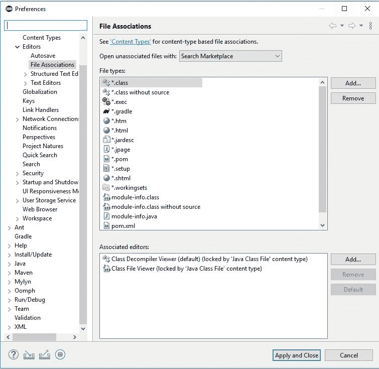
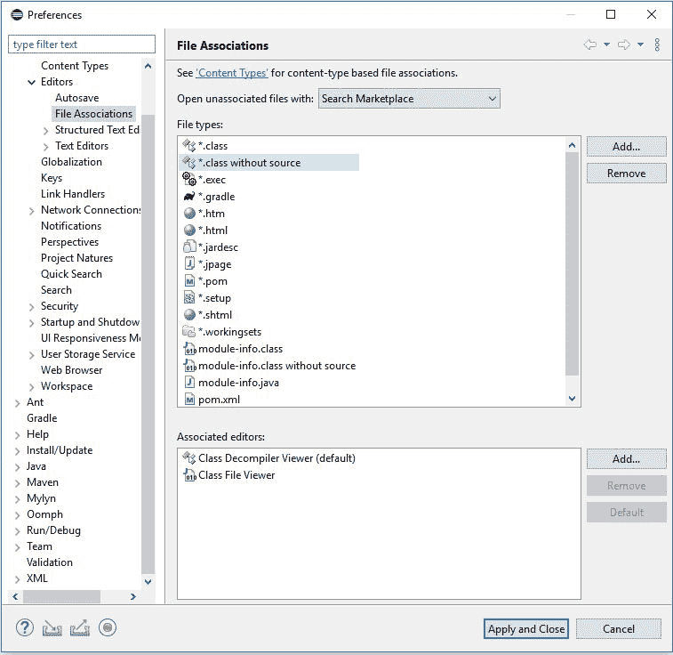
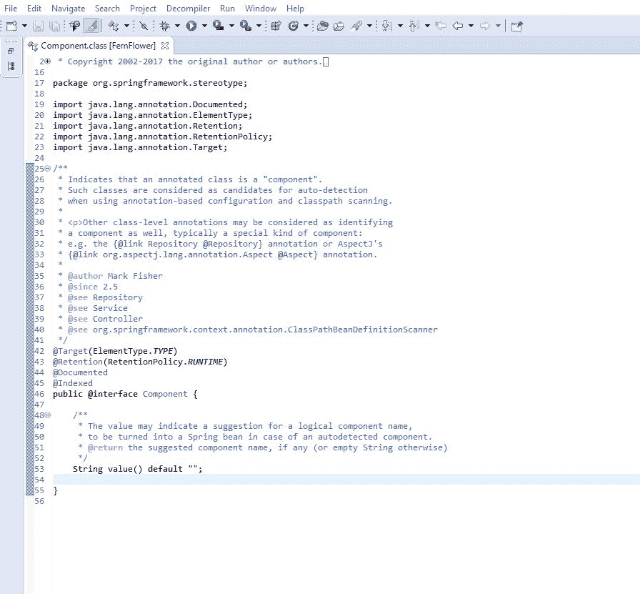
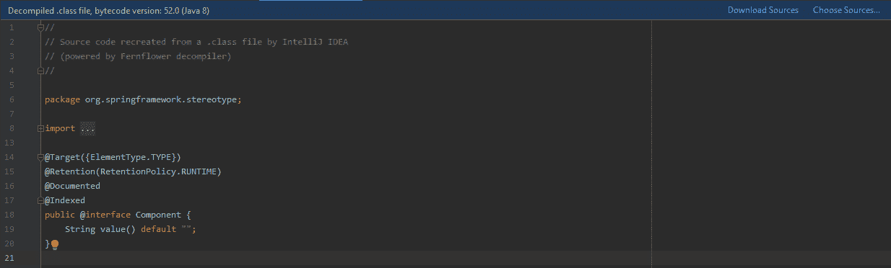
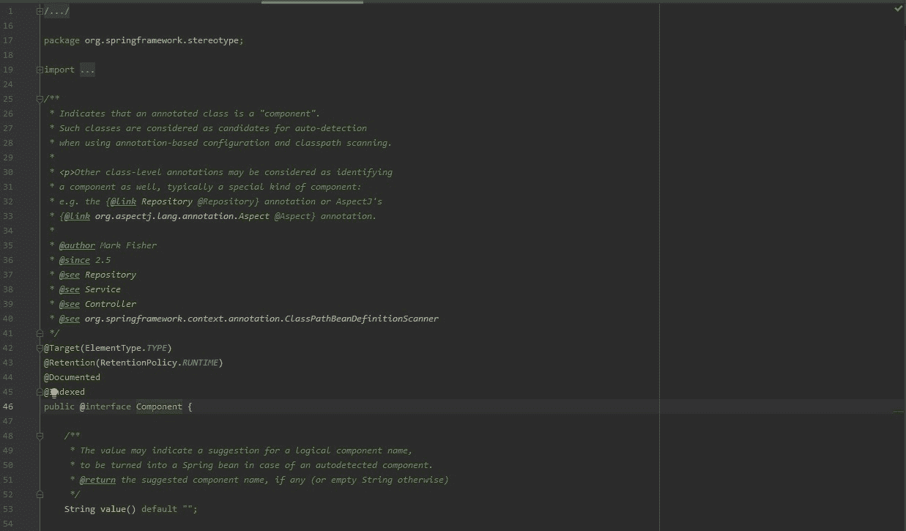

# 用 Java 反编译类

> 原文：<https://web.archive.org/web/20220930061024/https://www.baeldung.com/java-decompiling-classes>

## 1.介绍

在本教程中，我们将讨论反编译 Java 类。当源代码不可用时，反编译 Java 类有助于调试和理解源代码行为。

让我们来看看可用的不同选项。

## 2.在 IDE 中反编译

因为大多数开发都是在集成开发环境(IDE)中完成的，所以反编译也应该在 IDE 中进行。

要了解更多关于我们将使用的 ide 的信息，请查看我们关于如何在 Eclipse 中调试的文章以及关于 IntelliJ IDEA 配置的文章。

### 2.1.黯然失色

首先，在 Eclipse 中我们需要一个插件，比如[增强型类反编译器(ECD)](https://web.archive.org/web/20220815131112/https://marketplace.eclipse.org/content/enhanced-class-decompiler) 。这个插件使用了五种不同的反编译器。我们可以从 Eclipse Marketplace 安装它，然后我们需要重启 Eclipse。

接下来，ECD 需要少量的设置来将类文件与类反编译器查看器相关联:

[](/web/20220815131112/https://www.baeldung.com/wp-content/uploads/2020/01/Eclipse_class.jpg)

此外，我们需要关联没有源文件的"`.class`"文件:

[](/web/20220815131112/https://www.baeldung.com/wp-content/uploads/2020/01/Eclipse_classWithoutSource.jpg)

最后，我们可以通过在一个`class`名称上按`Ctrl+Left-Click `来使用反编译器。我们在括号中看到文件选项卡上使用的反编译器。

在这个例子中，我们使用的是蕨类植物:

[](/web/20220815131112/https://www.baeldung.com/wp-content/uploads/2020/01/Eclipse.jpg)

### 2.2.智能理念

与 Eclipse 相比， **IntelliJ IDEA 提供了默认的 FernFlower 反编译器**。

要使用它，我们只需在类名上`Ctrl+Left-Click`并查看代码:

[](/web/20220815131112/https://www.baeldung.com/wp-content/uploads/2020/01/IntelliJIDEA.png)

另外，我们可以下载源代码。下载源代码将提供实际的代码和注释。

例如，上面截图中的`Component`注释类包含了使用`Component`的 Javadoc。我们可以注意到不同之处:

[](/web/20220815131112/https://www.baeldung.com/wp-content/uploads/2020/01/IntelliJIDEA.2.jpg)

虽然反编译很有帮助，但它并不总是给出一个完整的画面。完整的源代码给了我们一个完整的画面。

## 3.命令行反编译

在 IDE 插件出现之前，命令行用于反编译类。命令行反编译程序对于调试远程服务器上的 Java 字节码也很有用，因为远程服务器不能通过 IDE 或 GUI 访问。

例如，我们可以使用一个简单的 jar 命令用 [JDCommandLine](https://web.archive.org/web/20220815131112/https://github.com/betterphp/JDCommandLine) 进行反编译:

```java
java -jar JDCommandLine.jar ${TARGET_JAR_NAME}.jar ./classes
```

不要停下来。/classes 参数。它定义了输出目录。

成功反编译后，我们可以访问输出目录中包含的源文件。他们现在已经准备好通过[查看像 Vim](/web/20220815131112/https://www.baeldung.com/linux/files-vi-nano-emacs) 这样的文本编辑器。

## 4.结论

我们研究了 Eclipse 和 IntelliJ IDEA 中的反编译，以及它们不可用时的命令行选项。

我们还研究了链接源代码和反编译之间的区别。