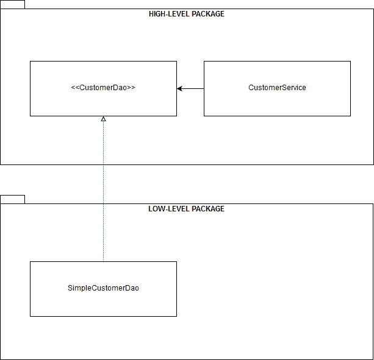
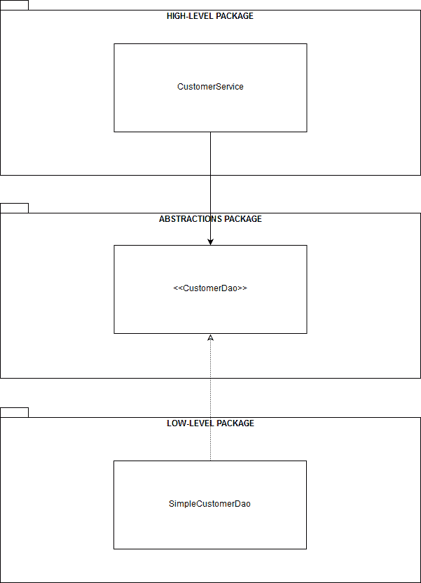
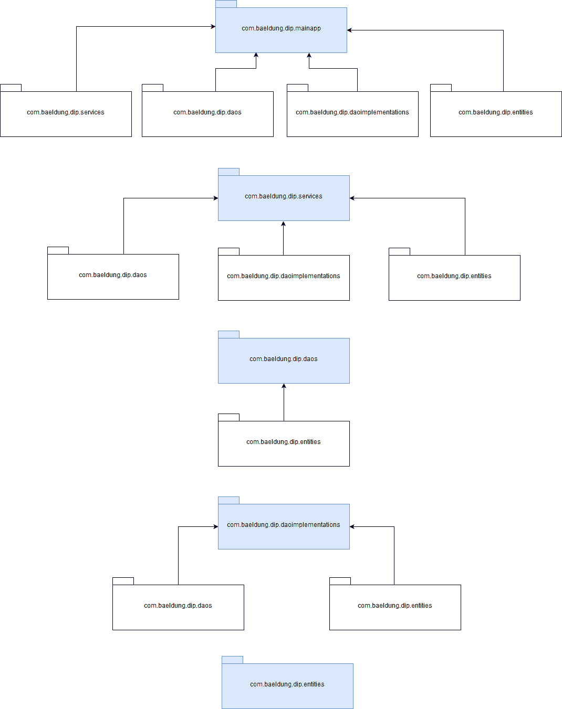

# Java 中的依赖倒置原则

> 原文：<https://web.archive.org/web/20220930061024/https://www.baeldung.com/java-dependency-inversion-principle>

## 1.**概述**

依赖倒置原则(DIP)是面向对象编程原则集合的一部分，通常被称为 [SOLID](/web/20221206050402/https://www.baeldung.com/solid-principles) 。

简单来说，DIP 是一个简单但强大的编程范例，我们可以使用它来实现结构良好、高度解耦和可重用的软件组件。

在本教程中，**我们将探索实现 DIP 的不同方法——一种在 Java 8 中，一种在 Java 11** 中使用 [JPMS](/web/20221206050402/https://www.baeldung.com/java-9-modularity) (Java 平台模块系统)。

## 2。依赖注入和控制反转不是 DIP 实现

首先也是最重要的，让我们做一个基本的区分来得到基本的权利:**DIP 是[既非依赖注入(DI)也非控制反转(IoC)](/web/20221206050402/https://www.baeldung.com/inversion-control-and-dependency-injection-in-spring)** 。即便如此，他们在一起工作得很好。

简单来说，DI 就是让软件组件通过它们的 API 明确声明它们的依赖关系或协作者，而不是自己去获取。

如果没有 DI，软件组件之间会紧密耦合。因此，它们很难重用、替换、模仿和测试，这导致了僵化的设计。

使用 DI，提供组件依赖和连接对象图的责任从组件转移到底层注入框架。从这个角度来看，直接投资只是实现国际奥委会的一种方式。

另一方面， **IoC 是一种模式，在该模式中，应用的流程控制被反转**。使用传统的编程方法，我们的定制代码控制着应用程序的流程。相反，**使用 IoC，控制权被转移到外部框架或容器**。

该框架是一个可扩展的代码库，它定义了插入我们自己代码的挂钩点。

反过来，框架通过一个或多个专门的子类，使用接口的实现，并通过注释回调我们的代码。Spring 框架是最后一种方法的一个很好的例子。

## 3。倾角的基本原理

为了理解下跌背后的动机，让我们从它的正式定义开始，由罗伯特·c·马丁在他的书 [`Agile Software Development: Principles, Patterns, and Practices`](https://web.archive.org/web/20221206050402/https://www.pearson.com/us/higher-education/program/Martin-Agile-Software-Development-Principles-Patterns-and-Practices/PGM272869.html) 中给出:

1.  高层模块不应该依赖低层模块。两者都应该依赖于抽象。
2.  抽象不应该依赖于细节。细节应该依赖于抽象。

因此，很明显，在核心处，**DIP 是关于通过抽象出高层和低层组件之间的交互来颠倒它们之间的传统依赖关系**。

在传统的软件开发中，高层组件依赖于低层组件。因此，很难重用高层组件。

### 3.1。设计选择和倾角

让我们考虑一个简单的`StringProcessor`类，它使用一个`StringReader`组件获得一个`String`值，并使用一个`StringWriter`组件将它写在其他地方:

```
public class StringProcessor {

    private final StringReader stringReader;
    private final StringWriter stringWriter;

    public StringProcessor(StringReader stringReader, StringWriter stringWriter) {
        this.stringReader = stringReader;
        this.stringWriter = stringWriter;
    }

    public void printString() {
        stringWriter.write(stringReader.getValue());
    }
} 
```

虽然`StringProcessor`类的实现是基本的，但是我们可以在这里做出几个设计选择。

让我们将每个设计选择分解成单独的项目，以便清楚地了解每个项目如何影响整体设计:

1.  **`StringReader`和`StringWriter`，底层组件，是放在同一个包里的具体类。** `StringProcessor`，高层组件被放置在不同的包中。`StringProcessor`取决于`StringReader`和`StringWriter`。没有依赖关系的反转，因此`StringProcessor`在不同的上下文中不可重用。
2.  **`StringReader``StringWriter`是与实现**放在同一个包中的接口。`StringProcessor`现在依赖于抽象，但是底层组件不依赖。我们还没有实现依赖性的反转。
3.  **`StringReader``StringWriter`是和`StringProcessor`** 放在同一个包里的接口。现在，`StringProcessor`拥有抽象的明确所有权。`StringProcessor, ` `StringReader,`和`StringWriter`都依赖于抽象。我们已经通过抽象组件`.` `StringProcessor`之间的交互实现了自顶向下的依赖倒置，现在可以在不同的上下文中重用。
4.  **`StringReader`和`StringWriter`是与`StringProcessor`** 放在一个单独的包中的接口。我们实现了依赖关系的反转，替换`StringReader`和`StringWriter`实现也变得更加容易。`StringProcessor`也可以在不同的上下文中重用。

在上述所有场景中，只有第 3 项和第 4 项是 DIP 的有效实现。

### 3.2。定义抽象的所有权

第 3 项是直接 DIP 实现，**其中高层组件和抽象放在同一个包中。**因此，**高层组件拥有抽象**。在该实现中，高级组件负责定义抽象协议，通过该协议与低级组件进行交互。

类似地，第 4 项是一个更加解耦的 DIP 实现。在这个模式的变体中，**高层组件和低层组件都不拥有抽象的所有权**。

这些抽象放在一个单独的层中，这有助于切换底层组件。同时，所有组件都相互隔离，这产生了更强的封装。

### 3.3。选择正确的抽象层次

在大多数情况下，选择高层组件将使用的抽象应该相当简单，但是有一点值得注意:抽象的级别。

在上面的例子中，我们使用 DI 将一个`StringReader`类型注入到`StringProcessor`类中。只要`StringReader`的抽象层次接近`StringProcessor` 的领域，这将是有效的**。**

相比之下，如果`StringReader`是一个从文件中读取`String`值的 [`File`](/web/20221206050402/https://www.baeldung.com/java-how-to-create-a-file) 对象，我们就会错过 DIP 的内在好处。在这种情况下，`StringReader`的抽象层次会比`StringProcessor`的领域层次低得多。

简单地说，**高层组件用来与低层组件互操作的抽象层次应该总是接近前者的领域**。

## 4。Java 8 实现

我们已经深入研究了 DIP 的关键概念，所以现在我们将探索该模式在 Java 8 中的一些实际实现。

### 4.1。直接 DIP 实施

让我们创建一个演示应用程序，它从持久层获取一些客户，并以某种额外的方式处理他们。

该层的底层存储通常是一个数据库，但是为了保持代码简单，这里我们将使用一个普通的`Map`。

让我们从**定义高级组件**开始:

```
public class CustomerService {

    private final CustomerDao customerDao;

    // standard constructor / getter

    public Optional<Customer> findById(int id) {
        return customerDao.findById(id);
    }

    public List<Customer> findAll() {
        return customerDao.findAll();
    }
}
```

正如我们所见，`CustomerService`类实现了`findById()`和`findAll()`方法，它们使用简单的[道](/web/20221206050402/https://www.baeldung.com/java-dao-pattern)实现从持久层获取客户。当然，我们可以在类中封装更多的功能，但是为了简单起见，让我们保持这样。

在这种情况下，**`CustomerDao`类型是`CustomerService`用于消费低级组件的抽象**。

因为这是一个直接的 DIP 实现，所以让我们将抽象定义为同一个包`CustomerService`中的一个接口:

```
public interface CustomerDao {

    Optional<Customer> findById(int id);

    List<Customer> findAll();

} 
```

通过将抽象放在高层组件的同一个包中，我们让组件负责拥有抽象。这个实现细节**真正颠倒了高级组件和低级组件**之间的依赖关系。

此外，**`CustomerDao`的抽象级别接近于** `**CustomerService**,`的抽象级别，这也是良好的 DIP 实现所需要的。

现在，让我们在不同的包中创建底层组件。在这种情况下，它只是一个基本的`CustomerDao`实现:

```
public class SimpleCustomerDao implements CustomerDao {

    // standard constructor / getter

    @Override
    public Optional<Customer> findById(int id) {
        return Optional.ofNullable(customers.get(id));
    }

    @Override
    public List<Customer> findAll() {
        return new ArrayList<>(customers.values());
    }
}
```

最后，让我们创建一个单元测试来检查`CustomerService`类的功能:

```
@Before
public void setUpCustomerServiceInstance() {
    var customers = new HashMap<Integer, Customer>();
    customers.put(1, new Customer("John"));
    customers.put(2, new Customer("Susan"));
    customerService = new CustomerService(new SimpleCustomerDao(customers));
}

@Test
public void givenCustomerServiceInstance_whenCalledFindById_thenCorrect() {
    assertThat(customerService.findById(1)).isInstanceOf(Optional.class);
}

@Test
public void givenCustomerServiceInstance_whenCalledFindAll_thenCorrect() {
    assertThat(customerService.findAll()).isInstanceOf(List.class);
}

@Test
public void givenCustomerServiceInstance_whenCalledFindByIdWithNullCustomer_thenCorrect() {
    var customers = new HashMap<Integer, Customer>();
    customers.put(1, null);
    customerService = new CustomerService(new SimpleCustomerDao(customers));
    Customer customer = customerService.findById(1).orElseGet(() -> new Customer("Non-existing customer"));
    assertThat(customer.getName()).isEqualTo("Non-existing customer");
}
```

单元测试练习了`CustomerService` API。此外，它还展示了如何手动将抽象注入到高级组件中。在大多数情况下，我们会使用某种 DI 容器或框架来完成这项工作。

此外，下图显示了我们的演示应用程序的结构，从高级到低级的包视角:

[](/web/20221206050402/https://www.baeldung.com/wp-content/uploads/2019/04/direct-dip.png)

### 4.2。替代 DIP 实施

正如我们之前所讨论的，可以使用一个替代的 DIP 实现，其中我们将高级组件、抽象和低级组件放在不同的包中。

由于显而易见的原因，这种变体更加灵活，能够更好地封装组件，并且更容易替换底层组件。

当然，实现这种模式的变体可以归结为将`CustomerService`、`MapCustomerDao,` 和`CustomerDao`放在不同的包中。

因此，一个图表足以显示每个组件在此实现中的布局:

[](/web/20221206050402/https://www.baeldung.com/wp-content/uploads/2019/04/alternative-dip.png)

## 5。Java 11 模块化实现

将我们的演示应用程序重构为模块化应用程序相当容易。

这是展示 JPMS 如何实施最佳编程实践的一个非常好的方式，包括强大的封装、抽象和通过 DIP 的组件重用。

我们不需要从头开始重新实现我们的示例组件。因此，**模块化我们的示例应用程序只是将每个组件文件以及相应的模块描述符**放在一个单独的模块中。

以下是模块化项目结构的外观:

```
project base directory (could be anything, like dipmodular)
|- com.baeldung.dip.services
   module-info.java
     |- com
       |- baeldung
         |- dip
           |- services
             CustomerService.java
|- com.baeldung.dip.daos
   module-info.java
     |- com
       |- baeldung
         |- dip
           |- daos
             CustomerDao.java
|- com.baeldung.dip.daoimplementations 
    module-info.java 
      |- com 
        |- baeldung 
          |- dip 
            |- daoimplementations 
              SimpleCustomerDao.java  
|- com.baeldung.dip.entities
    module-info.java
      |- com
        |- baeldung
          |- dip
            |- entities
              Customer.java
|- com.baeldung.dip.mainapp 
    module-info.java 
      |- com 
        |- baeldung 
          |- dip 
            |- mainapp
              MainApplication.java 
```

### 5.1.高级组件模块

让我们从将`CustomerService`类放在它自己的模块中开始。

我们将在根目录`com.baeldung.dip.services,` 中创建这个模块，并添加模块描述符`module-info.java`:

```
module com.baeldung.dip.services {
    requires com.baeldung.dip.entities;
    requires com.baeldung.dip.daos;
    uses com.baeldung.dip.daos.CustomerDao;
    exports com.baeldung.dip.services;
}
```

出于显而易见的原因，我们不会深入研究 JPMS 的工作原理。即便如此，通过查看 `requires`指令就可以清楚地看到模块的依赖关系。

这里最值得注意的相关细节是 `uses`指令。它声明**该模块是一个客户端模块**，它使用了`CustomerDao`接口的一个实现。

当然，我们仍然需要在这个模块中放置高级组件，即`CustomerService`类。因此，在根目录`com.baeldung.dip.services`中，让我们创建如下类似包的目录结构:`com/baeldung/dip/services.`

最后，让我们将`CustomerService.java` 文件放在该目录中。

### 5.2。抽象模块

同样，我们需要将`CustomerDao`接口放在它自己的模块中。因此，让我们在根目录`com.baeldung.dip.daos`中创建模块，并添加模块描述符:

```
module com.baeldung.dip.daos {
    requires com.baeldung.dip.entities;
    exports com.baeldung.dip.daos;
}
```

现在，让我们导航到`com.baeldung.dip.daos`目录并创建以下目录结构:`com/baeldung/dip/daos`。让我们把`CustomerDao.java`文件放在那个目录中。

### 5.3。低级组件模块

从逻辑上讲，我们也需要将底层组件`SimpleCustomerDao`放在一个单独的模块中。正如所料，这个过程看起来与我们刚刚对其他模块所做的非常相似。

让我们在根目录`com.baeldung.dip.daoimplementations`中创建新模块，并包含模块描述符:

```
module com.baeldung.dip.daoimplementations {
    requires com.baeldung.dip.entities;
    requires com.baeldung.dip.daos;
    provides com.baeldung.dip.daos.CustomerDao with com.baeldung.dip.daoimplementations.SimpleCustomerDao;
    exports com.baeldung.dip.daoimplementations;
}
```

在 JPMS 上下文中，**是一个服务提供者模块**，因为它声明了`provides`和`with`指令。

在这种情况下，模块通过`SimpleCustomerDao` 实现使`CustomerDao`服务对一个或多个消费者模块可用。

让我们记住，我们的消费者模块`com.baeldung.dip.services`通过`uses`指令消费这个服务。

这清楚地表明了**通过在不同的模块中定义消费者、服务提供者和抽象，用 JPMS 直接实现 DIP 是多么简单**。

同样，我们需要将`SimpleCustomerDao.java`文件放在这个新模块中。让我们导航到`com.baeldung.dip.daoimplementations`目录，创建一个新的类似包的目录结构，名称为:`com/baeldung/dip/daoimplementations`。

最后，让我们将`SimpleCustomerDao.java`文件放在目录中。

### 5.4。实体模块

此外，我们必须创建另一个模块来放置`Customer.java`类。正如我们之前所做的，让我们创建根目录`com.baeldung.dip.entities`并包含模块描述符:

```
module com.baeldung.dip.entities {
    exports com.baeldung.dip.entities;
}
```

在包的根目录中，让我们创建目录`com/baeldung/dip/entities`并添加下面的`Customer.java`文件:

```
public class Customer {

    private final String name;

    // standard constructor / getter / toString

}
```

### 5.5。主应用模块

接下来，我们需要创建一个额外的模块，允许我们定义演示应用程序的入口点。因此，让我们创建另一个根目录`com.baeldung.dip.mainapp`，并在其中放置模块描述符:

```
module com.baeldung.dip.mainapp {
    requires com.baeldung.dip.entities;
    requires com.baeldung.dip.daos;
    requires com.baeldung.dip.daoimplementations;
    requires com.baeldung.dip.services;
    exports com.baeldung.dip.mainapp;
}
```

现在，让我们导航到模块的根目录，并创建以下目录结构:`com/baeldung/dip/mainapp.`在该目录中，让我们添加一个`MainApplication.java`文件，该文件简单地实现了一个`main()`方法:

```
public class MainApplication {

    public static void main(String args[]) {
        var customers = new HashMap<Integer, Customer>();
        customers.put(1, new Customer("John"));
        customers.put(2, new Customer("Susan"));
        CustomerService customerService = new CustomerService(new SimpleCustomerDao(customers));
        customerService.findAll().forEach(System.out::println);
    }
}
```

最后，让我们编译并运行演示应用程序——无论是从我们的 IDE 中还是从命令控制台中。

正如预期的那样，当应用程序启动时，我们应该看到控制台输出的一列`Customer`对象:

```
Customer{name=John}
Customer{name=Susan} 
```

此外，下图显示了应用程序每个模块的依赖关系:

[](/web/20221206050402/https://www.baeldung.com/wp-content/uploads/2019/04/module-dependency-1.png)

## 6。结论

在本教程中，**我们深入探讨了 DIP 的关键概念，我们还展示了该模式在 Java 8 和 Java 11** 中的不同实现，后者使用了 JPMS。

GitHub 上有所有关于 Java 8 DIP 实现和 Java 11 实现的例子。