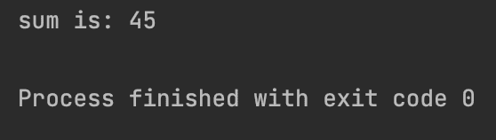

# Java 错误“变量可能尚未初始化”

> 原文：<https://web.archive.org/web/20220930061024/https://www.baeldung.com/java-error-variable-initialized>

## 1.概观

在本教程中，我们将关注 Java 程序中的“变量可能没有被初始化”错误。当我们声明一个变量而没有初始化它时，就会出现这个错误。我们将通过一个例子来讨论这个错误，并提供一些解决方案。

## 2.Java 错误:`“variable might not have been initialized”`

如果我们声明一个没有初始值的局部变量，我们会得到一个错误。这个错误只发生在局部变量上，因为 Java 在编译时自动初始化实例变量(它为整数设置 0，为布尔值设置 false，等等。)。然而，局部变量需要一个默认值，因为 Java 编译器不允许使用未初始化的变量。

让我们编写一个包含未初始化变量的简单代码:

```
public class VariableMightNotHaveBeenInitializedError {
    public static void main(String[] args) {
        int sum;
        int[] list = new int[]{1, 2, 3, 4, 5, 6, 7, 8, 9};
        for (int i = 0; i < list.length; i++) {
            sum += list[i];
        }
        System.out.println("sum is: " + sum);
    }
}
```

在这段代码中，我们计算一组整数的和。然后我们将它放入变量`sum.`中，编译时会出现以下错误:

[](/web/20221208143921/https://www.baeldung.com/wp-content/uploads/2022/04/Screenshot-2022-03-30-at-12.45.37.png)

## 3.解决方法

为了解决这个错误，**我们可以简单地在创建变量时给它赋值**:

```
public class VariableMightNotHaveBeenInitializedError {
    public static void main(String[] args) {
        int sum = 0;
        int[] list = new int[]{1, 2, 3, 4, 5, 6, 7, 8, 9};
        for (int i = 0; i < list.length; i++) {
            sum += list[i];
        }
        System.out.println("sum is: " + sum);
    }
}
```

最后，通过运行代码，我们得到了没有任何错误的结果:

[](/web/20221208143921/https://www.baeldung.com/wp-content/uploads/2022/04/Screenshot-2022-04-04-at-13.58.25.png)

## 4.结论

在本文中，我们讨论了 Java 中未初始化的变量如何导致错误。然后我们编写了一个简单的 Java 代码，并声明了一个局部变量来保存没有任何错误的操作结果。