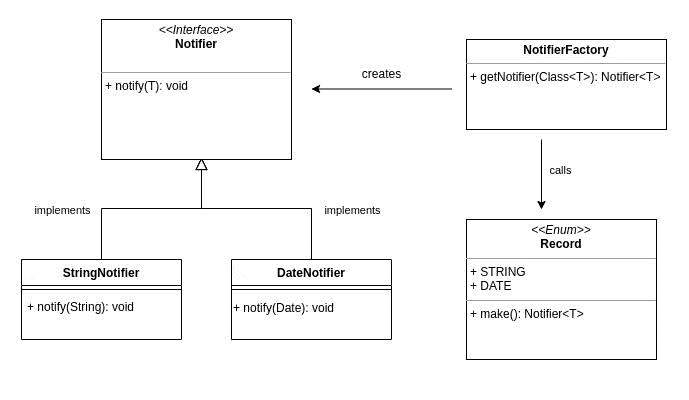

# 用 Java 中的泛型实现工厂模式

> 原文：<https://web.archive.org/web/20220930061024/https://www.baeldung.com/java-factory-pattern-generics>

## 1.概观

在本教程中，我们将学习如何在 Java 中用泛型实现工厂模式。

## 2.什么是工厂模式？

在面向对象编程中，工厂模式是一个[创造性的设计模式](/web/20221028202706/https://www.baeldung.com/creational-design-patterns)，它负责在被调用时创建对象。

**工厂是一个类，它通过方法调用创建原型类的对象，即接口:**

[](/web/20221028202706/https://www.baeldung.com/wp-content/uploads/2022/10/Factory.jpg)

当我们想要创建一个公共接口的对象，同时对用户隐藏创建逻辑时，工厂模式是很好的。

## 3.是如何实现的？

现在让我们来学习如何实现它。首先，让我们看一下类图:

[](/web/20221028202706/https://www.baeldung.com/wp-content/uploads/2022/10/ClassDiagram.jpg)

现在让我们实现图中的每个类。

### 3.1.实现`Notifier`接口

`Notifier`接口是一个原型，其他通知程序类实现了它:

```java
public interface Notifier<T> {
    void notify(T obj);
}
```

正如我们所见，`Notifier`类是一个泛型类，它有一个名为`notify`的方法。

### 3.2.实现`Notifier`类

现在让我们实现另外两个通知程序类:

```java
public class StringNotifier implements Notifier<String> {

    @Override
    public void notify(String str) {
        System.out.println("Notifying: " + str);
    }
} public class DateNotifier implements Notifier<Date> {

    @Override
    public void notify(Date date) {
        System.out.println("Notifying: " + date);
    }
}
```

现在我们有两个使用`Notifier `接口的类——一个将输出简单的文本，另一个将发布日期。

### 3.3.实现工厂

每次调用工厂类的唯一方法`getNotifier()`时，它都会生成一个通知程序实例:

```java
public class NotifierFactory {

    public <T> Notifier<T> getNotifier(Class<T> c) {
        if (c == String.class) {
            return Record.STRING.make();
        }
        if (c == Date.class) {
            return Record.DATE.make();
        }
        return null;
    }

}
```

在上面的代码中，`Record `是一个带有两个名为`STRING`和`DATE`的常量的枚举。

### 3.4.实施`Record`

**`Record`枚举保存有效通知类的记录，并在工厂类每次调用它时创建一个实例**:

```java
public enum Record {
    STRING {
        @Override
        public Notifier<String> make() {
            return new StringNotifier();
        }
    },
    DATE {
        @Override
        public Notifier<Date> make() {
            return new DateNotifier();
        }
    };

    public abstract <T> Notifier<T> make();
}
```

我们已经成功地实现了工厂模式。

## 4.使用工厂

让我们使用我们的`Main`类中的工厂:

```java
public static void main(String[] args) {
    NotifierFactory factory = new NotifierFactory();
    Notifier<String> stringNotifier = factory.getNotifier(String.class);
    Notifier<Date> dateNotifier = factory.getNotifier(Date.class);

    stringNotifier.notify("Hello world!");
    dateNotifier.notify(new Date());
}
```

现在我们应该编译并运行我们的代码:

```java
$ javac Main.java
$ java Main
Notifying: Hello world!
Notifying: Wed Oct 19 17:36:38 TRT 2022
```

正如我们所看到的，工厂已经成功地创建了两个适当类型的通知程序实例。

## 5.摘要

在本文中，我们学习了如何在 Java 中实现和使用工厂模式。

和往常一样，源代码可以在 GitHub 上的[处获得。](https://web.archive.org/web/20221028202706/https://github.com/eugenp/tutorials/tree/master/patterns-modules/design-patterns-creational)