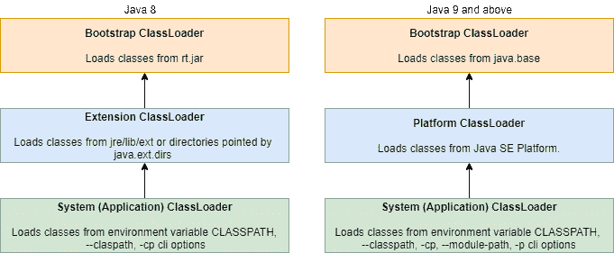

# 查找 Java 包中的所有类

> 原文：<https://web.archive.org/web/20220930061024/https://www.baeldung.com/java-find-all-classes-in-package>

## 1.概观

有时，我们希望获得关于应用程序运行时行为的信息，比如找到运行时可用的所有类。

在本教程中，我们将探索几个如何在运行时找到 Java 包中所有类的例子。

## 2.类装入器

首先，我们将从 [Java 类加载器](/web/20220630220059/https://www.baeldung.com/java-classloaders) `.` 开始讨论。Java 类加载器是 Java 运行时环境(JRE)的一部分，它将 Java 类动态加载到 Java 虚拟机(JVM)中。Java 类加载器将 JRE 从了解文件和文件系统中分离出来。**不是所有的类都由一个类加载器加载**。

让我们通过图示来了解 Java 中可用的类装入器:

[](/web/20220630220059/https://www.baeldung.com/wp-content/uploads/2021/05/ClassLoaders.png)

Java 9 对类装入器进行了一些重大修改。随着模块的引入，我们可以选择在类路径旁边提供模块路径。系统类装入器装入模块路径上的类。

**类加载器是动态的**。它们不需要告诉 JVM 它可以在运行时提供哪些类。因此，在包中寻找类本质上是一个文件系统操作，而不是通过使用 [Java 反射](/web/20220630220059/https://www.baeldung.com/java-reflection)来完成的。

然而，我们可以编写自己的类装入器或检查类路径来查找包中的类。

## 3.在 Java 包中查找类

为了便于说明，让我们创建一个包`com.baeldung.reflection.access.packages.search`。

现在，让我们定义一个示例类:

```java
public class ClassExample {
    class NestedClass {
    }
}
```

接下来，让我们定义一个接口:

```java
public interface InterfaceExample {
} 
```

在下一节中，我们将看看如何使用系统类加载器和一些第三方库来查找类。

### 3.1.系统类装入器

首先，我们将使用内置的系统类加载器`.` **系统类加载器** **加载在类路径**中找到的所有类。这发生在 JVM 的早期初始化过程中:

```java
public class AccessingAllClassesInPackage {

    public Set<Class> findAllClassesUsingClassLoader(String packageName) {
        InputStream stream = ClassLoader.getSystemClassLoader()
          .getResourceAsStream(packageName.replaceAll("[.]", "/"));
        BufferedReader reader = new BufferedReader(new InputStreamReader(stream));
        return reader.lines()
          .filter(line -> line.endsWith(".class"))
          .map(line -> getClass(line, packageName))
          .collect(Collectors.toSet());
    }

    private Class getClass(String className, String packageName) {
        try {
            return Class.forName(packageName + "."
              + className.substring(0, className.lastIndexOf('.')));
        } catch (ClassNotFoundException e) {
            // handle the exception
        }
        return null;
    }
}
```

在上面的例子中，我们使用静态的`getSystemClassLoader() `方法加载系统类加载器。

接下来，我们将在给定的包中找到资源。我们将使用`getResourceAsStream `方法读取作为 URL 流的资源。要获取包下的资源，我们需要将包名转换成 URL 字符串。所以，我们必须替换所有的点(。)和路径分隔符(“/”)。

之后，我们将把我们的流输入到一个`BufferedReader`中，并过滤所有扩展名为`.class`的 URL。在获得所需的资源后，我们将构造类并将所有结果收集到一个`Set`中。**由于 Java 不允许 lambda 抛出异常，我们必须在`getClass` 方法**中处理它。

现在让我们来测试这个方法:

```java
@Test
public void when_findAllClassesUsingClassLoader_thenSuccess() {
    AccessingAllClassesInPackage instance = new AccessingAllClassesInPackage();

    Set<Class> classes = instance.findAllClassesUsingClassLoader(
      "com.baeldung.reflection.access.packages.search");

    Assertions.assertEquals(3, classes.size());
} 
```

包中只有两个 Java 文件。然而，我们声明了三个类—包括嵌套类`NestedExample`。结果，我们的测试产生了三个类。

请注意，搜索包不同于当前的工作包。

### 3.2.反思图书馆

反射是一个流行的库，它扫描当前的类路径并允许我们在运行时查询它。

让我们从将 [`reflections`依赖项](https://web.archive.org/web/20220630220059/https://search.maven.org/artifact/org.reflections/reflections/0.9.12/jar)添加到我们的 Maven 项目开始:

```java
<dependency>
    <groupId>org.reflections</groupId>
    <artifactId>reflections</artifactId> 
    <version>0.9.12</version>
</dependency>
```

现在，让我们深入代码示例:

```java
public Set<Class> findAllClassesUsingReflectionsLibrary(String packageName) {
    Reflections reflections = new Reflections(packageName, new SubTypesScanner(false));
    return reflections.getSubTypesOf(Object.class)
      .stream()
      .collect(Collectors.toSet());
}
```

在这个方法中，我们初始化了`SubTypesScanner`类并获取了`Object`类的所有子类型。通过这种方法，我们在获取类时获得了更多的粒度。

同样，让我们来测试一下:

```java
@Test
public void when_findAllClassesUsingReflectionsLibrary_thenSuccess() {
    AccessingAllClassesInPackage instance = new AccessingAllClassesInPackage();

    Set<Class> classes = instance.findAllClassesUsingReflectionsLibrary(
      "com.baeldung.reflection.access.packages.search");

    Assertions.assertEquals(3, classes.size());
}
```

与我们之前的测试类似，这个测试查找给定包中声明的类。

现在，让我们继续下一个例子。

### 3.3.谷歌番石榴图书馆

在这一节中，我们将看到如何使用 Google Guava 库查找类。Google Guava 提供了一个`ClassPath`实用类，它扫描类加载器的源代码，找到所有可加载的类和资源。

首先，让我们将 [`guava`依赖项](https://web.archive.org/web/20220630220059/https://search.maven.org/artifact/com.google.guava/guava/30.1.1-jre/jar)添加到我们的项目中:

```java
<dependency>
      <groupId>com.google.guava</groupId>
      <artifactId>guava</artifactId>
      <version>31.0.1-jre</version>
</dependency>
```

让我们深入研究代码:

```java
public Set<Class> findAllClassesUsingGoogleGuice(String packageName) throws IOException {
    return ClassPath.from(ClassLoader.getSystemClassLoader())
      .getAllClasses()
      .stream()
      .filter(clazz -> clazz.getPackageName()
        .equalsIgnoreCase(packageName))
      .map(clazz -> clazz.load())
      .collect(Collectors.toSet());
}
```

在上面的方法中，我们提供系统类加载器作为`ClassPath#from`方法的输入。所有由`ClassPath `扫描的类都是基于包名过滤的。然后，过滤后的类被加载(但不链接或初始化)并收集到一个`Set`中。

现在让我们来测试这个方法:

```java
@Test
public void when_findAllClassesUsingGoogleGuice_thenSuccess() throws IOException {
    AccessingAllClassesInPackage instance = new AccessingAllClassesInPackage();

    Set<Class> classes = instance.findAllClassesUsingGoogleGuice(
      "com.baeldung.reflection.access.packages.search");

    Assertions.assertEquals(3, classes.size());
}
```

此外，谷歌番石榴库提供了`getTopLevelClasses()` 和`getTopLevelClassesRecursive()` 方法`.`

需要注意的是，在上面所有的例子中， **`package-info`包含在可用类的列表中，如果它们存在于包中，并且用一个或多个包级注释**进行了注释。

下一节将讨论如何在模块化应用程序中找到类。

### 4.在模块化应用程序中查找类

Java 平台模块系统(JPMS)通过[模块](/web/20220630220059/https://www.baeldung.com/java-9-modularity) 向我们介绍了**一个新层次的访问控制。每个包都必须显式导出，以便在模块外部访问。**

在模块化应用程序中，每个模块都可以是命名模块、未命名模块或自动模块之一。

对于命名模块和自动模块，内置的系统类装入器没有类路径。系统类装入器将使用应用程序模块路径搜索类和资源。

对于未命名的模块，它会将类路径设置为当前工作目录。

### 4.1.在模块内

模块中的所有包都可以看到该模块中的其他包。模块内部的代码享受对所有类型及其所有成员的反射访问。

### 4.2.模块外部

由于 Java 强制执行最严格的访问，我们必须使用`export` 或 `open`模块声明来显式声明包，以获得对模块内部类的反射访问。

对于一个普通模块，导出包(而不是打开包)的反射访问只提供对声明包的`public `和`protected`类型及其所有成员的访问。

我们可以构建一个模块来导出需要搜索的包:

```java
module my.module {
    exports com.baeldung.reflection.access.packages.search;
}
```

对于普通模块，开放包的反射访问提供对声明包的所有类型及其成员的访问:

```java
module my.module {
    opens com.baeldung.reflection.access.packages.search;
}
```

同样，开放模块授予对所有类型及其成员的反射访问，就好像所有包都已打开一样。现在，让我们打开整个模块，进行反思性访问:

```java
open module my.module{
}
```

最后，在确保为模块提供了正确的访问包的模块化描述之后，可以使用上一节中的任何方法来查找包中所有可用的类。

## 5.结论

总之，我们学习了类装入器和在包中查找所有类的不同方法。此外，我们讨论了在模块化应用程序中访问包。

像往常一样，所有的代码都可以在 GitHub 上获得[。](https://web.archive.org/web/20220630220059/https://github.com/eugenp/tutorials/tree/master/core-java-modules/core-java-reflection-2)