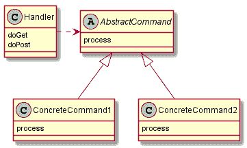

# Java 前端控制器模式指南

> 原文：<https://web.archive.org/web/20220930061024/https://www.baeldung.com/java-front-controller-pattern>

## 1。概述

在本教程中，我们将深入探讨`Front Controller` `Pattern`，在 `Martin Fowler`的书`“Patterns of Enterprise Application Architecture”.`中定义的`Enterprise Patterns` 的一部分

`Front Controller`被定义为“一个处理网站所有请求的控制器”。它位于 web 应用程序的前面，并将请求委托给后续资源。它还提供了一个通用行为的接口，如安全性、国际化和向特定用户呈现特定视图。

这使得应用程序能够在运行时改变其行为。此外，通过防止代码重复，它有助于读取和维护应用程序。

> 前端控制器通过单一处理器对象引导请求，整合所有请求处理。

## 2。它是如何工作的？

`Front Controller Pattern`主要分为两部分。单个调度控制器和命令层级。下面的 UML 描述了通用前端控制器实现的类关系:

[](/web/20220812061115/https://www.baeldung.com/wp-content/uploads/2016/09/front-controller.png)

该单个控制器将请求分派给命令，以便触发与请求相关联的行为。

为了演示它的实现，我们将在`FrontControllerServlet`中实现控制器，并将命令作为从抽象`FrontCommand`继承的类。

## 3。设置

### 3.1。Maven 依赖关系

首先，我们将建立一个新的包含`[javax.servlet-api](https://web.archive.org/web/20220812061115/https://search.maven.org/classic/#search%7Cgav%7C1%7Cg%3A%22javax.servlet%22%20AND%20a%3A%22javax.servlet-api%22)` 的`Maven WAR`项目:

```
<dependency>
    <groupId>javax.servlet</groupId>
    <artifactId>javax.servlet-api</artifactId>
    <version>4.0.0-b01</version>
    <scope>provided</scope>
</dependency> 
```

以及`[jetty-maven-plugin](https://web.archive.org/web/20220812061115/https://search.maven.org/classic/#search%7Cgav%7C1%7Cg%3A%22org.eclipse.jetty%22%20AND%20a%3A%22jetty-maven-plugin%22)`:

```
<plugin>
    <groupId>org.eclipse.jetty</groupId>
    <artifactId>jetty-maven-plugin</artifactId>
    <version>9.4.0.M1</version>
    <configuration>
        <webApp>
            <contextPath>/front-controller</contextPath>
        </webApp>
    </configuration>
</plugin>
```

### 3.2。型号

接下来，我们将定义一个`Model`类和一个模型`Repository`。我们将使用下面的`Book` 类作为我们的模型:

```
public class Book {
    private String author;
    private String title;
    private Double price;

    // standard constructors, getters and setters
}
```

这将是存储库，您可以查找具体实现的源代码，或者自己提供一个:

```
public interface Bookshelf {
    default void init() {
        add(new Book("Wilson, Robert Anton & Shea, Robert", 
          "Illuminati", 9.99));
        add(new Book("Fowler, Martin", 
          "Patterns of Enterprise Application Architecture", 27.88));
    }

    Bookshelf getInstance();

    <E extends Book> boolean add(E book);

    Book findByTitle(String title);
}
```

### 3.3。`FrontControllerServlet`

Servlet 本身的实现相当简单。我们从请求中提取命令名，动态创建一个命令类的新实例并执行它。

这允许我们在不改变`Front Controller`的代码基础的情况下添加新的命令。

另一种选择是使用静态的条件逻辑来实现 Servlet。这具有编译时错误检查的优势:

```
public class FrontControllerServlet extends HttpServlet {
    @Override
    protected void doGet(HttpServletRequest request, 
      HttpServletResponse response) {
        FrontCommand command = getCommand(request);
        command.init(getServletContext(), request, response);
        command.process();
    }

    private FrontCommand getCommand(HttpServletRequest request) {
        try {
            Class type = Class.forName(String.format(
              "com.baeldung.enterprise.patterns.front." 
              + "controller.commands.%sCommand",
              request.getParameter("command")));
            return (FrontCommand) type
              .asSubclass(FrontCommand.class)
              .newInstance();
        } catch (Exception e) {
            return new UnknownCommand();
        }
    }
}
```

### 3.4。`FrontCommand`

让我们实现一个名为`FrontCommand`的抽象类，它包含所有命令共有的行为。

这个类可以访问`ServletContext`及其请求和响应对象。此外，它将处理视图分辨率:

```
public abstract class FrontCommand {
    protected ServletContext context;
    protected HttpServletRequest request;
    protected HttpServletResponse response;

    public void init(
      ServletContext servletContext,
      HttpServletRequest servletRequest,
      HttpServletResponse servletResponse) {
        this.context = servletContext;
        this.request = servletRequest;
        this.response = servletResponse;
    }

    public abstract void process() throws ServletException, IOException;

    protected void forward(String target) throws ServletException, IOException {
        target = String.format("/WEB-INF/jsp/%s.jsp", target);
        RequestDispatcher dispatcher = context.getRequestDispatcher(target);
        dispatcher.forward(request, response);
    }
}
```

这个抽象`FrontCommand`的一个具体实现是一个`SearchCommand`。这将包括图书被找到或图书丢失时的条件逻辑:

```
public class SearchCommand extends FrontCommand {
    @Override
    public void process() throws ServletException, IOException {
        Book book = new BookshelfImpl().getInstance()
          .findByTitle(request.getParameter("title"));
        if (book != null) {
            request.setAttribute("book", book);
            forward("book-found");
        } else {
            forward("book-notfound");
        }
    }
}
```

如果应用程序正在运行，我们可以通过将浏览器指向[http://localhost:8080/front-controller/？命令=搜索&标题；=模式](https://web.archive.org/web/20220812061115/http://localhost:8080/front-controller/?command=Search&title=patterns)。

`SearchCommand` 解析为两个视图，第二个视图可以用下面的请求进行测试[http://localhost:8080/front-controller/？命令=搜索&标题；=任何标题](https://web.archive.org/web/20220812061115/http://localhost:8080/front-controller/?command=Search&title=any-title)。

为了总结我们的场景，我们将实现第二个命令，该命令在所有情况下都作为后备命令触发，Servlet 不知道命令请求:

```
public class UnknownCommand extends FrontCommand {
    @Override
    public void process() throws ServletException, IOException {
        forward("unknown");
    }
}
```

这个视图可以在[http://localhost:8080/front-controller/？命令=命令&标题；=any-title](https://web.archive.org/web/20220812061115/http://localhost:8080/front-controller/?command=Order&title=any-title) 或完全省略`URL`参数。

## 4。部署

因为我们决定创建一个`WAR` 文件项目，所以我们需要一个 web 部署描述符。有了这个`web.xml` ,我们能够在任何 Servlet 容器中运行我们的 web 应用程序:

```
<?xml version="1.0" encoding="UTF-8"?>
<web-app 
  xmlns:xsi="http://www.w3.org/2001/XMLSchema-instance"
  xsi:schemaLocation="http://xmlns.jcp.org/xml/ns/javaee
  http://xmlns.jcp.org/xml/ns/javaee/web-app_3_1.xsd"
  version="3.1">
    <servlet>
        <servlet-name>front-controller</servlet-name>
        <servlet-class>
            com.baeldung.enterprise.patterns.front.controller.FrontControllerServlet
        </servlet-class>
    </servlet>
    <servlet-mapping>
        <servlet-name>front-controller</servlet-name>
        <url-pattern>/</url-pattern>
    </servlet-mapping>
</web-app>
```

最后一步，我们将运行`‘mvn install jetty:run'`并在浏览器中检查我们的视图。

## 5。结论

正如我们到目前为止所看到的，我们现在应该熟悉了`Front Controller Pattern`及其作为 Servlet 和命令层次结构的实现。

像往常一样，你会在 GitHub 上找到资源[。](https://web.archive.org/web/20220812061115/https://github.com/eugenp/tutorials/tree/master/patterns/front-controller)