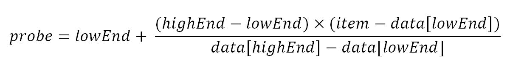
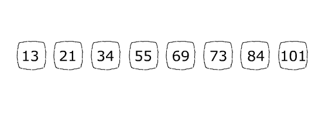
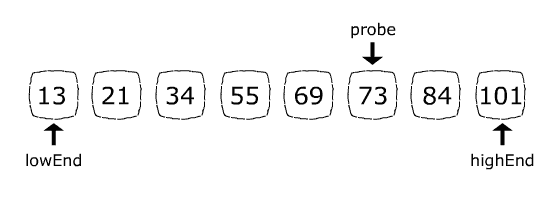
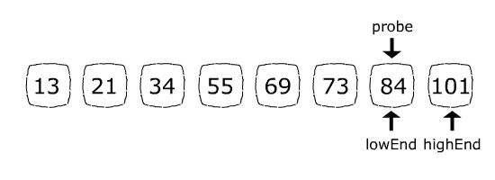

# Java 中的插值搜索

> 原文：<https://web.archive.org/web/20220930061024/https://www.baeldung.com/java-interpolation-search>

## 1。简介

在本教程中，我们将遍历插值搜索算法，并讨论其利弊。此外，我们将用 Java 实现它，并讨论算法的时间复杂度。

## 2。动机

**插值搜索是对为均匀分布数据定制的[二分搜索法](/web/20221127015614/https://www.baeldung.com/java-binary-search)的改进。**

无论数据分布如何，二分搜索法在每一步都将搜索空间减半，因此它的时间复杂度总是`O(log(n))`。

另一方面，**插值搜索的时间复杂度根据数据分布**而变化。对于时间复杂度为 `O(log(log(n)))`的均匀分布数据，比二分搜索法更快。然而，在最坏的情况下，它的性能可能会像`O(n)`一样差。

## 3。插值搜索

与二分搜索法类似，插值搜索只能在排序后的数组上工作。它在每次迭代时将探头放置在计算好的位置。如果探测器正好在我们要寻找的项目上，位置将被返回；否则，搜索空间将被限制在探头的右侧或左侧。

**探头位置计算是二分搜索法和插值搜索的唯一区别。**

在二分搜索法中，探头位置总是剩余搜索空间的最中间项目。

相反，插值搜索基于以下公式计算探头位置:

[](/web/20221127015614/https://www.baeldung.com/wp-content/uploads/2019/08/probe-position.jpg)

让我们看一下每个术语:

*   `probe`:新的探头位置将被分配给该参数。
*   `lowEnd`:当前搜索空间最左边项目的索引。
*   `highEnd`:当前搜索空间最右边项目的索引。
*   `data[]`:包含原始搜索空间的数组。
*   我们要找的东西。

为了更好地理解插值搜索的工作原理，让我们用一个例子来演示一下。

假设我们想在下面的数组中找到 84 的位置:

[](/web/20221127015614/https://www.baeldung.com/wp-content/uploads/2019/08/step-0.jpg)

数组的长度是 8，所以最初`highEnd ` = 7，`lowEnd ` = 0(因为数组的索引从 0 开始，而不是从 1 开始)。

在第一步中，探头位置公式将导致`probe` = 5:

[](/web/20221127015614/https://www.baeldung.com/wp-content/uploads/2019/08/step-1.jpg)

因为 84(我们要找的`item`)大于 73(当前的`probe`位置项)，下一步会通过赋值`lowEnd ` = `probe ` + 1 放弃数组左侧。现在搜索空间只包含 84 和 101。`probe`位置公式将设置`probe ` = 6，正好是 84 的索引:

[](/web/20221127015614/https://www.baeldung.com/wp-content/uploads/2019/08/step-2.jpg)

因为找到了我们要寻找的项目，所以将返回位置 6。

## 4。用 Java 实现

既然我们已经了解了算法的工作原理，让我们用 Java 来实现它。

首先，我们初始化`lowEnd`和`highEnd`:

```java
int highEnd = (data.length - 1);
int lowEnd = 0;
```

接下来，我们建立一个循环，在每次迭代中，我们根据前面提到的公式计算新的`probe`。循环条件通过比较`item`与`data[lowEnd]`和`data[highEnd]`来确保我们没有超出搜索空间:

```java
while (item >= data[lowEnd] && item <= data[highEnd] && lowEnd <= highEnd) {
    int probe
      = lowEnd + (highEnd - lowEnd) * (item - data[lowEnd]) / (data[highEnd] - data[lowEnd]);
}
```

在每一次新的`probe`任务后，我们还会检查是否找到了物品。

最后，我们调整`lowEnd`或`highEnd`以减少每次迭代的搜索空间:

```java
public int interpolationSearch(int[] data, int item) {

    int highEnd = (data.length - 1);
    int lowEnd = 0;

    while (item >= data[lowEnd] && item <= data[highEnd] && lowEnd <= highEnd) {

        int probe
          = lowEnd + (highEnd - lowEnd) * (item - data[lowEnd]) / (data[highEnd] - data[lowEnd]);

        if (highEnd == lowEnd) {
            if (data[lowEnd] == item) {
                return lowEnd;
            } else {
                return -1;
            }
        }

        if (data[probe] == item) {
            return probe;
        }

        if (data[probe] < item) {
            lowEnd = probe + 1;
        } else {
            highEnd = probe - 1;
        }
    }
    return -1;
}
```

## 5。结论

在本文中，我们通过一个例子探讨了插值搜索。我们也用 Java 实现了它。

本教程中展示的例子可以在 Github 的[上找到。](https://web.archive.org/web/20221127015614/https://github.com/eugenp/tutorials/tree/master/algorithms-modules/algorithms-searching)