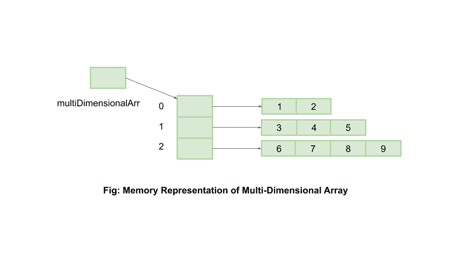

# Java 中的多维数组

> 原文：<https://web.archive.org/web/20220930061024/https://www.baeldung.com/java-jagged-arrays>

## 1.概观

Java 中的多维数组是由不同大小的数组作为元素组成的数组。它也被称为“数组的数组”、“参差不齐的数组”或“参差不齐的数组”。

在这个快速教程中，我们将更深入地研究多维数组的定义和使用。

## 2.创建多维数组

让我们先来看看创建多维数组的方法:

### 2.1.速记形式

定义多维数组的一种简单方法是:

```
int[][] multiDimensionalArr = {{1, 2}, {3, 4, 5}, {6, 7, 8, 9}};
```

这里，我们在一个步骤中声明并初始化了`multiDimensionalArr`。

### 2.2.声明，然后初始化

我们首先声明一个大小为 3 的多维数组:

```
int[][] multiDimensionalArr = new int[3][];
```

这里，**我们省略了指定第二个尺寸，因为它会变化**。

接下来，让我们进一步声明和初始化`multiDimensionalArr`中的各个元素:

```
multiDimensionalArr[0] = new int[] {1, 2};
multiDimensionalArr[1] = new int[] {3, 4, 5};
multiDimensionalArr[2] = new int[] {6, 7, 8, 9};
```

我们也可以简单地声明它的元素而不初始化它们:

```
multiDimensionalArr[0] = new int[2];
multiDimensionalArr[1] = new int[3];
multiDimensionalArr[2] = new int[4];
```

然后，这些可以在以后被初始化，例如通过使用用户输入。

我们还可以使用`java.util.Arrays.fill` 方法来初始化数组元素:

```
void initialize2DArray(int[][] multiDimensionalArray) {
    for (int[] array : multiDimensionalArray) {
        Arrays.fill(array, 7);
    }
} 
```

数组中的所有元素都用相同的值初始化。

## 3.记忆表征

我们的`multiDimensionalArr`的内存表示会是什么样子？

众所周知，Java 中的数组只不过是一个对象，它的元素可以是原语，也可以是引用。所以，Java 中的二维数组可以看作是一维数组的数组。

我们在内存中的`multiDimensionalArr`看起来类似于:

[](/web/20221206041308/https://www.baeldung.com/wp-content/uploads/2020/03/multi-dimensional-array.png)

显然，`multiDimensionalArr` `[0]`保存的是对一个大小为 2 的一维数组的引用， `multiDimensionalArr[1]`保存的是对另一个大小为 3 的一维数组的引用，以此类推。

这样 Java 让我们定义和使用多维数组成为可能。

## 4.迭代元素

我们可以像 Java 中的其他数组一样迭代多维数组。

让我们尝试使用用户输入来迭代和初始化`multiDimensionalArr`元素:

```
void initializeElements(int[][] multiDimensionalArr) {
    Scanner sc = new Scanner(System.in);
    for (int outer = 0; outer < multiDimensionalArr.length; outer++) {
        for (int inner = 0; inner < multiDimensionalArr[outer].length; inner++) {
            multiDimensionalArr[outer][inner] = sc.nextInt();
        }
    }
}
```

这里，`multiDimensionalArr[outer].length` 是在`multiDimensionalArr`中索引`outer` 处的数组长度。

**它帮助我们确保只在每个子数组**的有效范围内寻找元素，从而避免了`ArrayIndexOutOfBoundException`。

## 5.打印元素

如果我们想打印多维数组的元素呢？

一个明显的方法是使用我们已经讨论过的迭代逻辑。这包括遍历多维数组中的每一项，多维数组本身就是一个数组，然后遍历子数组——一次遍历一个元素。

我们的另一个选择是使用`java.util.Arrays.toString()`辅助方法:

```
void printElements(int[][] multiDimensionalArr) {
    for (int index = 0; index < multiDimensionalArr.length; index++) {
        System.out.println(Arrays.toString(multiDimensionalArr[index]));
    }
}
```

最终我们得到了干净简单的代码。生成的控制台输出如下所示:

```
[1, 2] [3, 4, 5] [6, 7, 8, 9]
```

## 6.元素长度

我们可以通过迭代主数组来找到多维数组中数组的长度:

```
int[] findLengthOfElements(int[][] multiDimensionalArray) {
    int[] arrayOfLengths = new int[multiDimensionalArray.length];
    for (int i = 0; i < multiDimensionalArray.length; i++) {
        arrayOfLengths[i] = multiDimensionalArray[i].length;
    }
    return arrayOfLengths;
}
```

我们还可以使用 Java 流找到数组的长度:

```
Integer[] findLengthOfArrays(int[][] multiDimensionalArray) {
    return Arrays.stream(multiDimensionalArray)
      .map(array -> array.length)
      .toArray(Integer[]::new);
}
```

## 7.复制二维数组

我们可以使用`Arrays.copyOf`方法复制一个二维数组:

```
int[][] copy2DArray(int[][] arrayOfArrays) {
    int[][] copied2DArray = new int[arrayOfArrays.length][];
    for (int i = 0; i < arrayOfArrays.length; i++) {
        int[] array = arrayOfArrays[i];
        copied2DArray[i] = Arrays.copyOf(array, array.length);
    }
    return copied2DArray;
}
```

我们也可以通过使用 Java 流来实现这一点:

```
Integer[][] copy2DArray(Integer[][] arrayOfArrays) {
    return Arrays.stream(arrayOfArrays)
      .map(array -> Arrays.copyOf(array, array.length))
      .toArray(Integer[][]::new);
}
```

## 8.结论

在本文中，我们研究了什么是多维数组，它们在内存中的样子，以及我们可以定义和使用它们的方式。

和往常一样，所展示的例子的源代码可以在 GitHub 上找到[。](https://web.archive.org/web/20221206041308/https://github.com/eugenp/tutorials/tree/master/core-java-modules/core-java-arrays-multidimensional)