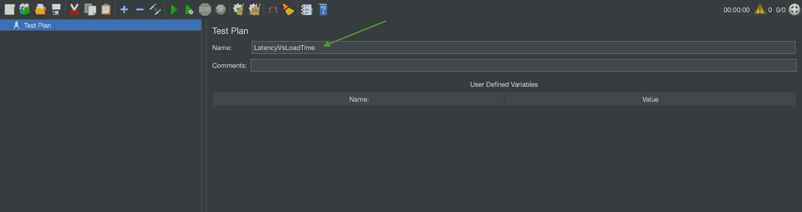
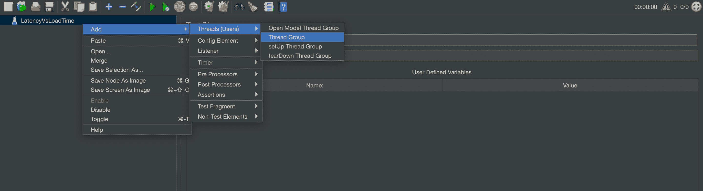
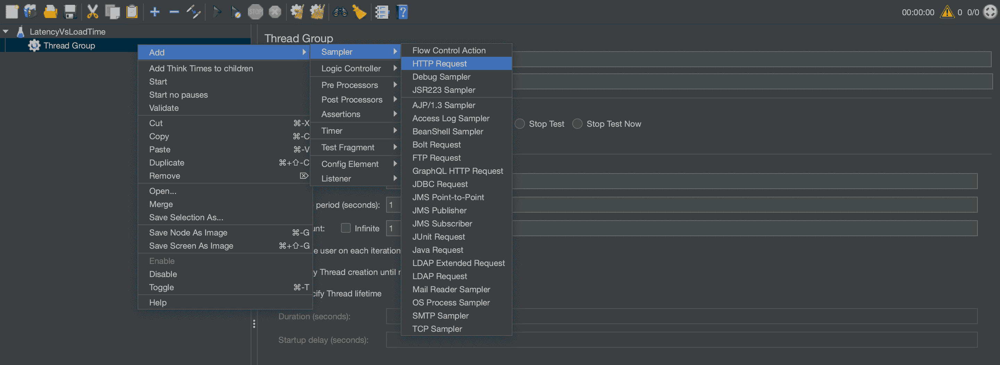
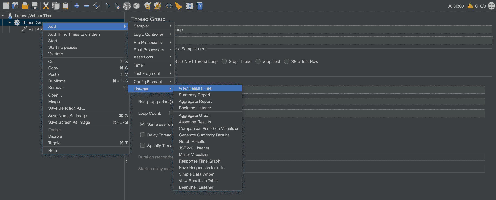
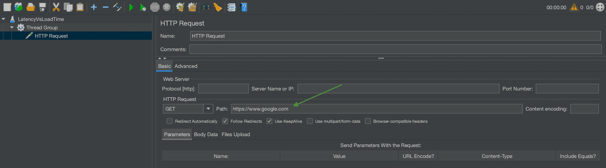
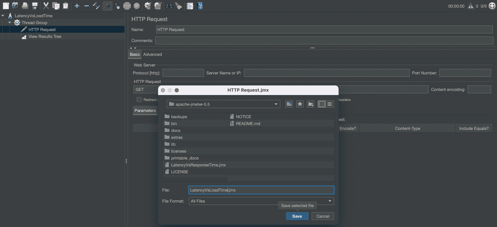
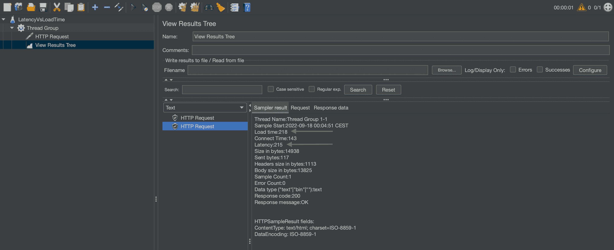

# JMeter:延迟与加载时间

> 原文：<https://web.archive.org/web/20220930061024/https://www.baeldung.com/java-jmeter-latency-vs-load-time>

## 1.概观

性能测试是软件开发的关键部分。它有助于揭示瓶颈和缺陷，并确保我们的应用程序响应迅速。一个特别重要的方面是 web 应用程序加载和响应用户交互所需的时间。

**在本文中，我们将探讨两个可以帮助检测和改善加载时间问题的指标:`latency`和`load time`。**我们将了解这些指标是如何定义的，它们之间的区别是什么，以及如何使用性能工具 [JMeter](/web/20221209001534/https://www.baeldung.com/jmeter) 来衡量它们。

## 2.JMeter 中的延迟和加载时间指标

在 JMeter 中，`latency`和`load time`都是度量往返的指标。换句话说，它们都测量从客户机向服务器发送请求到收到响应的时间。然而，这两者之间有一个重要的区别。

**`Latency`定义为刚发送请求到刚收到第一部分响应**的时间，而 **`load time`是刚发送请求到刚收到最后一部分响应**的时间。

对于这两个指标，JMeter 都包括了组装请求所需的时间。延迟还包括组装响应的第一部分所需的时间，加载时间包括组装整个响应所需的时间。组装不包括响应的呈现或任何客户端代码执行。

## 3.如何测量延迟和加载时间

**我们可以通过创建一个发送 HTTP 请求并使用`View Results Tree Listener`的测试计划来测量 JMeter** 中的`latency`和`load time` 。

我们将从打开工具时 JMeter 自动创建的测试计划开始。在我们的例子中，让我们将其重命名为`LatencyVsLoadTime`:

接下来，让我们创建一个`Thread Group`，它是每个测试计划的起点。这是通过右击测试计划，然后选择`Add -> Thread (Users) -> Thread Group`来完成的:

接下来，让我们通过右键单击`Thread Group`并选择`Add -> Sampler -> HTTP Request`来添加一个 HTTP 请求:

最后但同样重要的是，我们需要一个`Listener`来跟踪我们请求的结果。让我们通过右击`Thread Group`并选择`Add -> Listener -> View Results Tree`来添加它:

现在我们已经有了测试计划的所有部分，让我们配置我们的 HTTP 请求。

为此，我们选择`HTTP Request`并将`Path`设置为我们想要测试的 URL。对于我们的例子，让我们选择`https://www.google.com`:

在通过点击顶部栏中的磁盘图标保存测试计划之后，我们可以执行它。让我们选择`HTTP Request`并点击顶部栏中的播放按钮:

最后，让我们通过选择`Sampler result`选项卡下的`View Results Tree`元素来检查结果。在我们的示例中，请求的延迟为 215 毫秒，加载时间为 218 毫秒:

## 4.结论

在本文中，我们讨论了两个性能指标，`latency`和`load time`，它们有助于检测加载时间问题并提高应用程序的可用性。

首先，我们在 JMeter 的上下文中定义了指标，并阐述了两者之间的区别。然后，我们看到了如何建立一个带有 HTTP 请求的 JMeter 测试计划，我们可以用它来度量指标。最后，我们学习了如何执行测试计划并检查结果。

我们在本文中创建的 JMeter 测试计划可以在 GitHub 上的[处获得。](https://web.archive.org/web/20221209001534/https://github.com/eugenp/tutorials/tree/master/jmeter)