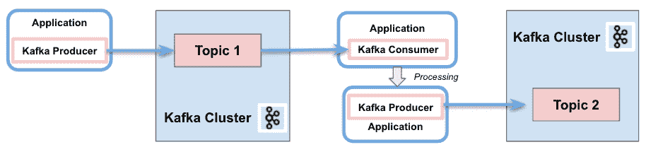
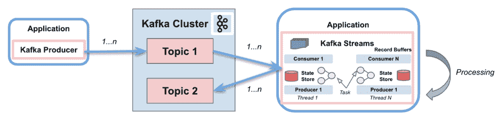
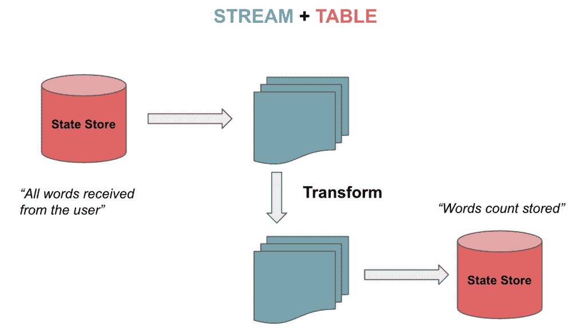

# 卡夫卡溪流 vs .卡夫卡消费者

> 原文：<https://web.archive.org/web/20220930061024/https://www.baeldung.com/java-kafka-streams-vs-kafka-consumer>

## 1.介绍

Apache Kafka 是最流行的开源分布式容错流处理系统。Kafka Consumer 提供了处理消息的基本功能。 **[Kafka Streams](/web/20221221193728/https://www.baeldung.com/java-kafka-streams) 也在 Kafka 消费客户端之上提供实时流处理。**

在本教程中，我们将解释 Kafka 流的特性，使流处理体验变得简单和容易。

## 2.流和消费者 API 之间的区别

### 2.1.Kafka 消费者 API

简而言之， [Kafka 消费者 API](https://web.archive.org/web/20221221193728/https://kafka.apache.org/documentation/#consumerapi) 允许应用程序处理来自主题的消息。**它提供了与它们交互的基本组件，包括以下功能**:

*   消费者和生产者之间的责任分离
*   单一处理
*   批处理支持
*   只有无状态支持。客户端不保留以前的状态，而是单独评估流中的每个记录
*   编写应用程序需要大量代码
*   不使用线程或并行
*   可以在几个卡夫卡集群中进行写作

[](/web/20221221193728/https://www.baeldung.com/wp-content/uploads/2021/06/Screenshot-2021-05-24-at-12.40.45.png)

### 2.2.Kafka 流 API

[Kafka Streams](https://web.archive.org/web/20221221193728/https://kafka.apache.org/10/documentation/streams/architecture) 从主题上大大简化了流处理。**建立在 Kafka 客户端库之上，它提供数据并行、分布式协调、容错和可伸缩性**。它将消息作为无限制、连续和实时的记录流来处理，具有以下特征:

*   消费和生产单一的卡夫卡流
*   执行复杂的处理
*   不支持批处理
*   支持无状态和有状态操作
*   编写应用程序只需要几行代码
*   线程和并行
*   仅与单个 Kafka 集群交互
*   将流分区和任务作为存储和传输消息的逻辑单元

[](/web/20221221193728/https://www.baeldung.com/wp-content/uploads/2021/06/Screenshot-2021-05-28-at-10.14.34.png)

**Kafka Streams 使用** **分区和任务的概念作为与主题分区**紧密链接的逻辑单元。此外，它使用线程在应用程序实例中并行处理。支持的另一个重要功能是状态存储，Kafka Streams 使用它来存储和查询来自主题的数据。最后，Kafka Streams API 与集群交互，但它并不直接在集群上运行。

在接下来的几节中，我们将重点关注与基本 Kafka 客户端不同的四个方面:流表二元性、Kafka 流领域特定语言(DSL)、一次处理语义(EOS)和交互式查询。

### 2.3.属国

为了实现这些示例，我们只需将 [Kafka 消费者 API](https://web.archive.org/web/20221221193728/https://search.maven.org/classic/#search%7Cgav%7C1%7Cg%3A%22org.apache.kafka%22%20AND%20a%3A%22kafka-clients%22) 和 [Kafka 流 API](https://web.archive.org/web/20221221193728/https://search.maven.org/classic/#search%7Cgav%7C1%7Cg%3A%22org.apache.kafka%22%20AND%20a%3A%22kafka-streams%22) 依赖项添加到我们的`pom.xml`:

```java
<dependency>
    <groupId>org.apache.kafka</groupId>
    <artifactId>kafka-clients</artifactId>
    <version>2.8.0</version>
</dependency>

<dependency>
    <groupId>org.apache.kafka</groupId>
    <artifactId>kafka-streams</artifactId>
    <version>2.8.0</version>
 </dependency>
```

## 3.流表二元性

Kafka 流支持流，也支持可以双向转换的表。就是所谓的[流表二元性](https://web.archive.org/web/20221221193728/https://www.confluent.io/blog/kafka-streams-tables-part-1-event-streaming/#stream-table-duality)。表格是一组不断发展的事实。每个新事件都会覆盖旧事件，而流是不变事实的集合。

流处理来自主题的完整数据流。表通过聚集来自流的信息来存储状态。让我们想象玩一个在 [Kafka 数据建模](/web/20221221193728/https://www.baeldung.com/apache-kafka-data-modeling#event-basics)中描述的国际象棋游戏。连续移动的流被聚集到一个表中，我们可以从一个状态转换到另一个状态:

[](/web/20221221193728/https://www.baeldung.com/wp-content/uploads/2021/06/Screenshot-2021-05-31-at-12.52.43.png)

### 3.1.`KStream`、`KTable`和`GlobalKTable`

**Kafka Streams 为流和表提供了两种抽象**。处理记录流。另一方面，`KTable`用给定键的最新状态管理 changelog 流。每个数据记录代表一次更新。

对于未分区表还有另一种抽象。我们可以使用`GlobalKTables`向所有任务广播信息，或者在不重新划分输入数据的情况下进行连接。

我们可以将一个主题作为一个流来读取和反序列化:

```java
StreamsBuilder builder = new StreamsBuilder();
KStream<String, String> textLines = 
  builder.stream(inputTopic, Consumed.with(Serdes.String(), Serdes.String()));
```

也可以阅读一个主题，以表格的形式跟踪最新收到的单词:

```java
KTable<String, String> textLinesTable = 
  builder.table(inputTopic, Consumed.with(Serdes.String(), Serdes.String()));
```

最后，我们能够使用全局表来阅读主题:

```java
GlobalKTable<String, String> textLinesGlobalTable = 
  builder.globalTable(inputTopic, Consumed.with(Serdes.String(), Serdes.String()));
```

## 4.Kafka 流 DSL

**Kafka Streams DSL 是一种声明式和函数式编程风格**。它构建在[流处理器 API](https://web.archive.org/web/20221221193728/https://kafka.apache.org/documentation/streams/developer-guide/processor-api.html) 之上。该语言为前面提到的流和表提供了内置的抽象。

此外，它还支持无状态(`map`、`filter`等)。)和状态转换(`aggregations`、`joins,`和`windowing`)。因此，只需几行代码就可以实现流处理操作。

### 4.1.无状态转换

[无状态转换](https://web.archive.org/web/20221221193728/https://kafka.apache.org/documentation/streams/developer-guide/dsl-api.html#stateless-transformations)不需要状态来处理。同样，在流处理器中不需要状态存储器。示例操作包括`filter`、`map`、`flatMap,`或`groupBy`。

现在让我们看看如何将值映射为大写，从主题中过滤它们，并将它们存储为流:

```java
KStream<String, String> textLinesUpperCase =
  textLines
    .map((key, value) -> KeyValue.pair(value, value.toUpperCase()))
    .filter((key, value) -> value.contains("FILTER"));
```

### 4.2.有状态转换

[状态转换](https://web.archive.org/web/20221221193728/https://kafka.apache.org/documentation/streams/developer-guide/dsl-api.html#stateful-transformations)依赖于状态来完成处理操作。一个消息的处理依赖于其他消息的处理(状态存储)。换句话说，可以使用 changelog 主题恢复任何表或状态存储。

有状态转换的一个例子是字数统计算法:

```java
KTable<String, Long> wordCounts = textLines
  .flatMapValues(value -> Arrays.asList(value
    .toLowerCase(Locale.getDefault()).split("\\W+")))
  .groupBy((key, word) -> word)
    .count(Materialized.<String, Long, KeyValueStore<Bytes, byte[]>> as("counts-store"));
```

我们将把这两个字符串发送到主题:

```java
String TEXT_EXAMPLE_1 = "test test and test";
String TEXT_EXAMPLE_2 = "test filter filter this sentence"; 
```

结果是:

```java
Word: and -> 1
Word: test -> 4
Word: filter -> 2
Word: this -> 1
Word: sentence -> 1
```

DSL 涵盖了几个转换特性。我们可以`join`，或者用同一个键合并两个输入流/表，产生一个新的流/表。我们还能够`aggregate`，或者将流/表中的多个记录合并成一个新表中的一个记录。最后，可以应用`windowing`，在连接或聚合函数中对具有相同关键字的记录进行分组。

与 5s 窗口连接的一个例子是将两个流中按键分组的记录合并成一个流:

```java
KStream<String, String> leftRightSource = leftSource.outerJoin(rightSource,
  (leftValue, rightValue) -> "left=" + leftValue + ", right=" + rightValue,
    JoinWindows.of(Duration.ofSeconds(5))).groupByKey()
      .reduce(((key, lastValue) -> lastValue))
  .toStream();
```

所以我们将左边的流`value=left`和`key=1`放在一起，右边的流`value=right`和`key=2`放在一起。结果如下:

```java
(key= 1) -> (left=left, right=null)
(key= 2) -> (left=null, right=right)
```

对于聚合示例，我们将计算字数算法，但使用每个单词的前两个字母作为关键字:

```java
KTable<String, Long> aggregated = input
  .groupBy((key, value) -> (value != null && value.length() > 0)
    ? value.substring(0, 2).toLowerCase() : "",
    Grouped.with(Serdes.String(), Serdes.String()))
  .aggregate(() -> 0L, (aggKey, newValue, aggValue) -> aggValue + newValue.length(),
    Materialized.with(Serdes.String(), Serdes.Long()));
```

包含以下条目:

```java
"one", "two", "three", "four", "five" 
```

输出是:

```java
Word: on -> 3
Word: tw -> 3
Word: th -> 5
Word: fo -> 4
Word: fi -> 4
```

## 5.一次性处理语义(EOS)

有些时候，我们需要确保消费者只阅读一次消息。Kafka 引入了将消息包含到事务中的功能，以使用[事务 API](/web/20221221193728/https://www.baeldung.com/kafka-exactly-once) 实现 EOS。从版本 0.11.0 开始，Kafka Streams 包含了相同的功能。

为了在 Kafka 流中配置 EOS，我们将包括以下属性:

```java
streamsConfiguration.put(StreamsConfig.PROCESSING_GUARANTEE_CONFIG,
  StreamsConfig.EXACTLY_ONCE);
```

## 6.交互式查询

**[交互查询](https://web.archive.org/web/20221221193728/https://kafka.apache.org/documentation/streams/developer-guide/interactive-queries.html)允许查询分布式环境中应用的状态**。这意味着可以从本地存储中提取信息，也可以在多个实例上从远程存储中提取信息。基本上，我们将收集所有的商店并将它们分组在一起，以获得应用程序的完整状态。

让我们看一个使用交互式查询的例子。首先，我们将定义处理拓扑，在我们的例子中是字数统计算法:

```java
KStream<String, String> textLines = 
  builder.stream(TEXT_LINES_TOPIC, Consumed.with(Serdes.String(), Serdes.String()));

final KGroupedStream<String, String> groupedByWord = textLines
  .flatMapValues(value -> Arrays.asList(value.toLowerCase().split("\\W+")))
  .groupBy((key, word) -> word, Grouped.with(stringSerde, stringSerde));
```

接下来，我们将为所有计算出的字数创建一个状态存储(键值):

```java
groupedByWord
  .count(Materialized.<String, Long, KeyValueStore<Bytes, byte[]>>as("WordCountsStore")
  .withValueSerde(Serdes.Long()));
```

然后，我们可以查询键值存储:

```java
ReadOnlyKeyValueStore<String, Long> keyValueStore =
  streams.store(StoreQueryParameters.fromNameAndType(
    "WordCountsStore", QueryableStoreTypes.keyValueStore()));

KeyValueIterator<String, Long> range = keyValueStore.all();
while (range.hasNext()) {
    KeyValue<String, Long> next = range.next();
    System.out.println("count for " + next.key + ": " + next.value);
}
```

该示例的输出如下:

```java
Count for and: 1
Count for filter: 2
Count for sentence: 1
Count for test: 4
Count for this: 1
```

## 7.结论

在本教程中，我们展示了 Kafka 流如何简化从 Kafka 主题中检索消息时的处理操作。在 Kafka 中处理流时，它极大地简化了实现。不仅用于无状态处理，也用于有状态转换。

当然，不使用 Kafka 流也可以完美地构建一个消费者应用程序。但是我们需要手动实现免费提供的额外功能。

和往常一样，代码可以在 GitHub 的[上获得。](https://web.archive.org/web/20221221193728/https://github.com/eugenp/tutorials/tree/master/apache-kafka)