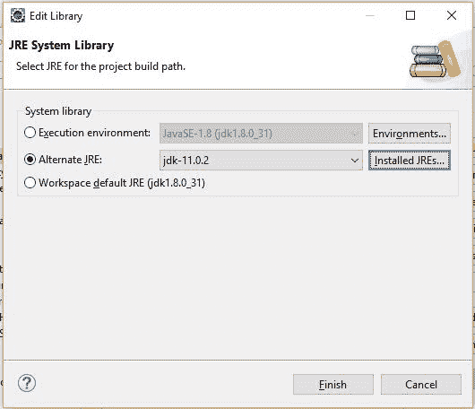
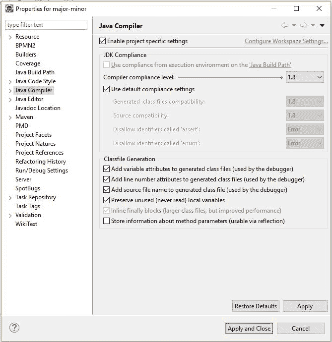
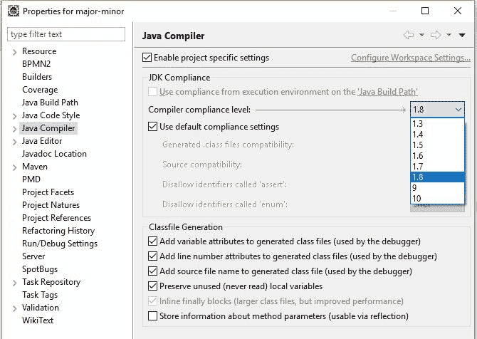
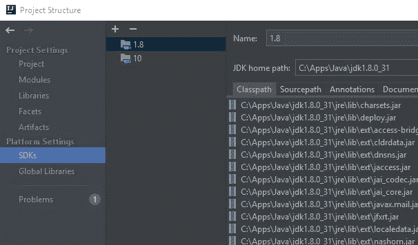
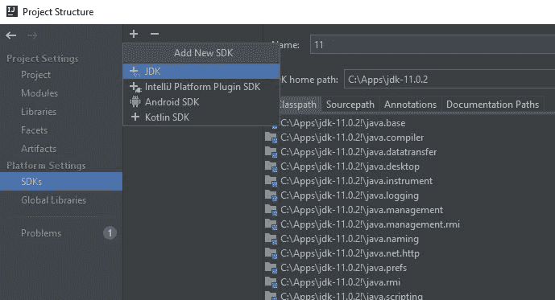
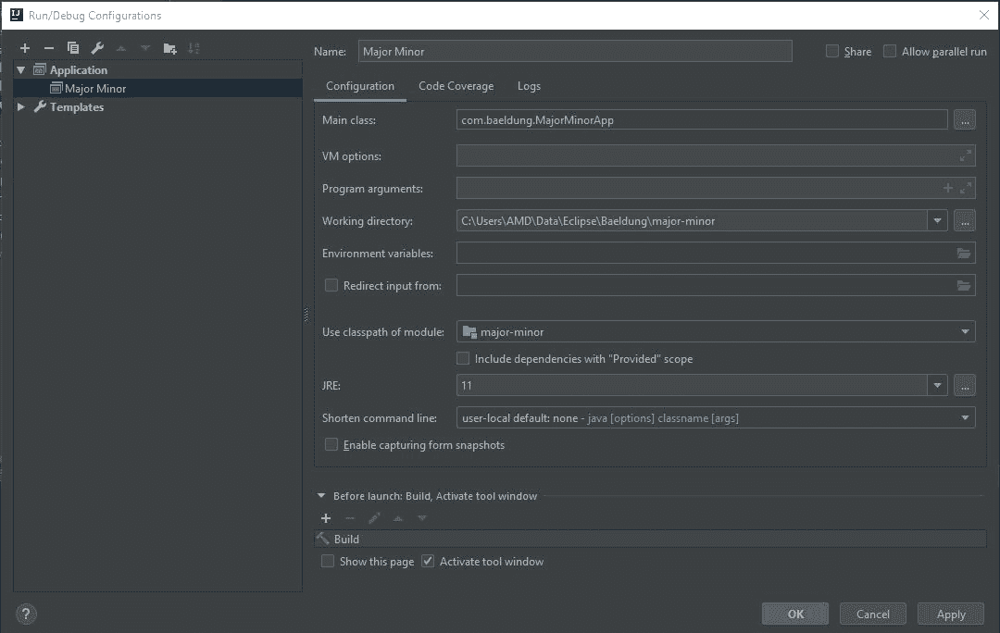
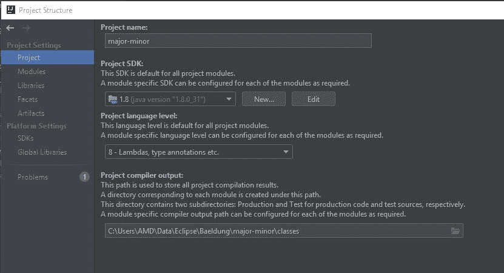

# 如何修复 Java . lang . unsupportedclassversionerror

> 原文：<https://web.archive.org/web/20220930061024/https://www.baeldung.com/java-lang-unsupportedclassversion>

## 1.介绍

在这个简短的教程中，我们将学习是什么导致了 Java 运行时错误`java.lang.UnsupportedClassVersionError: Unsupported major.minor version`以及如何修复它。

## 延伸阅读:

## [Java—“找不到或加载主类”错误](/web/20220907041916/https://www.baeldung.com/java-could-not-find-load-main-class)

Explore the reasons for the error "Could not find or load main class" and learn how to avoid them.[Read more](/web/20220907041916/https://www.baeldung.com/java-could-not-find-load-main-class) →

## [Java 编译器错误:“需要类、接口或枚举”](/web/20220907041916/https://www.baeldung.com/java-class-interface-enum-expected)

Learn about the "class, interface, or enum expected" Java compiler error and how to fix it[Read more](/web/20220907041916/https://www.baeldung.com/java-class-interface-enum-expected) →

## [Java . lang . verify error](/web/20220907041916/https://www.baeldung.com/java-lang-verifyerror)的原因及避免

Learn about the cause of java.lang.VerifyError errors and multiple ways to avoid it[Read more](/web/20220907041916/https://www.baeldung.com/java-lang-verifyerror) →

## 2.一看错误

让我们先来看一个错误示例:

```
Exception in thread "main" java.lang.UnsupportedClassVersionError: com/baeldung/MajorMinorApp 
  has been compiled by a more recent version of the Java Runtime (class file version 55.0), 
  this version of the Java Runtime only recognizes class file versions up to 52.0
```

这个错误告诉我们，我们的类是在比我们试图运行它的版本更高的 Java 版本上编译的。更具体地说，在这种情况下，我们用 Java 11 编译了我们的类，并尝试用 Java 8 运行它。

### 2.1.Java 版本号

作为参考，让我们快速看一下 Java 版本号。如果我们需要下载合适的 Java 版本，这将会派上用场。

主版本号和次版本号存储在类字节码的第六和第七个字节中。

让我们看看主要版本号是如何映射到 Java 版本的:

*   45 = Java 1.1
*   46 = Java 1.2
*   47 = Java 1.3
*   48 = Java 1.4
*   49 = Java 5
*   50 = Java 6
*   51 = Java 7
*   52 = Java 8
*   53 = Java 9
*   54 = Java 10
*   55 = Java 11
*   56 = Java 12
*   57 = Java 13

## 3.通过命令行修复

现在让我们讨论如何在从命令行运行 Java 时解决这个错误。

根据我们的情况，**我们有两种方法可以解决这个错误:为早期版本的 Java 编译我们的代码，或者在较新版本的 Java 上运行我们的代码**。

最后的决定取决于我们的情况。如果我们需要使用已经在更高层次编译过的第三方库，我们最好的选择可能是使用更新的 Java 版本运行我们的应用程序。如果我们要打包一个应用程序进行发布，最好编译成一个旧版本。

### 3.1.`JAVA_HOME`环境变量

让我们从检查我们的`[JAVA_HOME](/web/20220907041916/https://www.baeldung.com/find-java-home)`变量是如何设置的开始。当我们从命令行运行`javac`时，这会告诉我们正在使用哪个 JDK:

```
echo %JAVA_HOME%
C:\Apps\Java\jdk8-x64
```

如果我们准备好完全迁移到更新的 [JDK](/web/20220907041916/https://www.baeldung.com/jvm-vs-jre-vs-jdk) ，我们可以下载更新的版本，并确保我们的`PATH`和[环境变量设置正确](/web/20220907041916/https://www.baeldung.com/java-home-on-windows-7-8-10-mac-os-x-linux)。

### 3.2.运行新的 JRE

回到我们的例子，让我们看看如何通过在更高版本的 Java 上运行它来解决这个错误。假设我们在`C:\Apps\jdk-11.0.2`中有 Java 11 JRE，我们可以用打包的`java`命令运行我们的代码:

```
C:\Apps\jdk-11.0.2\bin\java com.baeldung.MajorMinorApp
Hello World!
```

### 3.3.用旧的 JDK 编译

如果我们正在编写一个应用程序，我们希望它可以运行到某个版本的 Java，我们需要为那个版本编译代码。

我们可以通过以下三种方式之一做到这一点:使用旧的 JDK 来编译我们的代码；使用`javac` 命令的`-bootclasspath`、`-source`和 `-target` 选项(JDK 8 及以上版本)；或者使用`–release`选项(JDK 9 及更新版本)。

让我们从使用旧的 JDK 开始，类似于我们如何使用新的 JRE 来运行我们的代码:

```
C:\Apps\Java\jdk1.8.0_31\bin\javac com/baeldung/MajorMinorApp.java
```

可以只使用`-source`和`-target`，但是它仍然可能创建与旧 Java 不兼容的类文件。

为了确保兼容性，我们可以将`-bootclasspath`指向目标 JRE 的`rt.jar`:

```
javac -bootclasspath "C:\Apps\Java\jdk1.8.0_31\jre\lib\rt.jar" \
  -source 1.8 -target 1.8 com/baeldung/MajorMinorApp.java
```

以上主要适用于 JDK 8 及以下版本。**在 JDK 9 中，增加了`–release`参数来代替`-source`和`-target`。`–release`选项支持目标 6、7、8、9、10 和 11。**

让我们用`–release`来瞄准 Java 8:

```
javac --release 8 com/baeldung/MajorMinorApp.java
```

现在我们可以在 Java 8 或更高版本的 JRE 上运行我们的代码了。

## 4.Eclipse IDE

现在我们已经了解了错误和纠正错误的一般方法，让我们利用所学的知识，看看如何在 Eclipse IDE 中应用它。

### 4.1.更改 JRE

假设我们已经用不同版本的 Java 配置了 [Eclipse，让我们改变我们项目的 JRE。](/web/20220907041916/https://www.baeldung.com/eclipse-change-java-version)

让我们转到我们的`Project properties`，然后是`Java Build Path`，然后是`Libraries` 选项卡。在那里，我们将选择 JRE 并点击`Edit`:

[](/web/20220907041916/https://www.baeldung.com/wp-content/uploads/2019/03/BAEL-2308_ProjectPropertiesLib.jpg)

现在让我们选择`Alternate JRE`并指向我们的 Java 11 安装:

[](/web/20220907041916/https://www.baeldung.com/wp-content/uploads/2019/03/BAEL-2308_ProjectEditJRE11.jpg)

此时，我们的应用程序将在 Java 11 上运行。

### 4.2.更改编译器级别

现在让我们看看如何将我们的目标更改为较低级别的 Java。

首先，让我们回到我们的`Project properties`，然后`Java Compiler`，然后检查`Enable project specific settings`:

[](/web/20220907041916/https://www.baeldung.com/wp-content/uploads/2019/03/BAEL-2308_ProjectPropertiesCompilerLevel.jpg)

在这里，我们可以将项目设置为针对早期版本的 Java 进行编译，并自定义其他遵从性设置:

[](/web/20220907041916/https://www.baeldung.com/wp-content/uploads/2019/03/BAEL-2308_ProjectPropertiesCompilerLevel_dropdown.jpg)

## 5.智能理念

我们还可以控制在 IntelliJ IDEA 中编译和运行的 Java 版本。

### 5.1.添加 JDK

在此之前，我们将看看如何添加额外的 JDK。我们来看一下`File -> Project Structure -> Platform Settings -> SDKs`:

[](/web/20220907041916/https://www.baeldung.com/wp-content/uploads/2019/03/IDEA_AddSDK1.jpg)

让我们单击中间栏中的加号图标，从下拉列表中选择`JDK`，然后选择我们的 JDK 位置:

[](/web/20220907041916/https://www.baeldung.com/wp-content/uploads/2019/03/BAEL-2308_IDEA_AddSDK2_2.jpg)

### 5.2.更改 JRE

首先，我们将看看如何使用 IDEA 在较新的 JRE 上运行我们的项目。

我们去`Run -> Edit Configurations…`把`JRE`改成 11:

[](/web/20220907041916/https://www.baeldung.com/wp-content/uploads/2019/03/BAEL-2308_IDEA_ChangeJRE.jpg)

现在，当我们运行我们的项目时，它将与 Java 11 JRE 一起运行。

### 5.3.更改编译器级别

如果我们要分发我们的应用程序以在较低的 JRE 上运行，我们需要调整我们的编译器级别以针对旧版本的 Java。

让我们去`File -> Project Structure… -> Project Settings -> Project`改变我们的`Project SDK`和`Project language level`:

[](/web/20220907041916/https://www.baeldung.com/wp-content/uploads/2019/03/BAEL-2308_IDEA_ChangeTargetLevel.jpg)

我们现在可以构建我们的项目，生成的类文件将在 Java 8 和更高版本上运行。

## 6.专家

当我们在 [Maven](/web/20220907041916/https://www.baeldung.com/maven) 中构建和打包一个文件时，我们可以控制我们目标的[版本的 Java](/web/20220907041916/https://www.baeldung.com/maven-java-version) 。

使用 Java 8 或更早版本时，我们为编译器插件设置源和目标。

让我们使用编译器插件属性来设置源和目标:

```
<properties>
    <maven.compiler.target>1.8</maven.compiler.target>
    <maven.compiler.source>1.8</maven.compiler.source>
</properties>
```

或者，我们可以在编译器插件中设置源和目标:

```
<plugins>
    <plugin>    
        <artifactId>maven-compiler-plugin</artifactId>
        <configuration>
            <source>1.8</source>
            <target>1.8</target>
        </configuration>
    </plugin>
</plugins>
```

**通过在 Java 9 中添加的`–release`选项，我们也可以用 Maven 进行配置。**

让我们使用一个编译器插件属性来设置`release`:

```
<properties>
    <maven.compiler.release>8</maven.compiler.release>
</properties>
```

或者我们可以直接配置编译器插件:

```
<plugins>
    <plugin>    
        <artifactId>maven-compiler-plugin</artifactId>
        <configuration>
            <release>8</release>
        </configuration>
    </plugin>
</plugins>
```

## 7.结论

在本文中，我们了解了什么导致了`java.lang.UnsupportedClassVersionError: Unsupported major.minor version`错误消息，以及如何修复它。