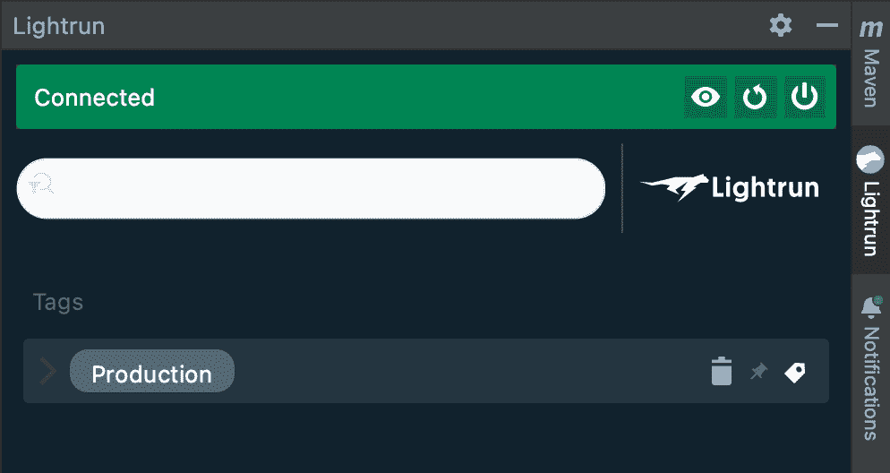
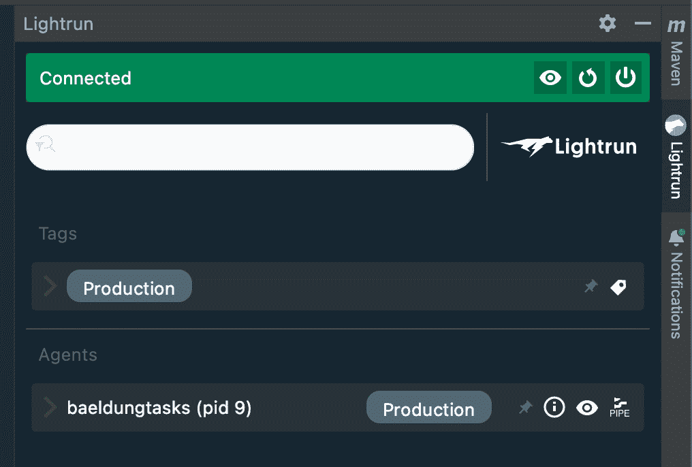
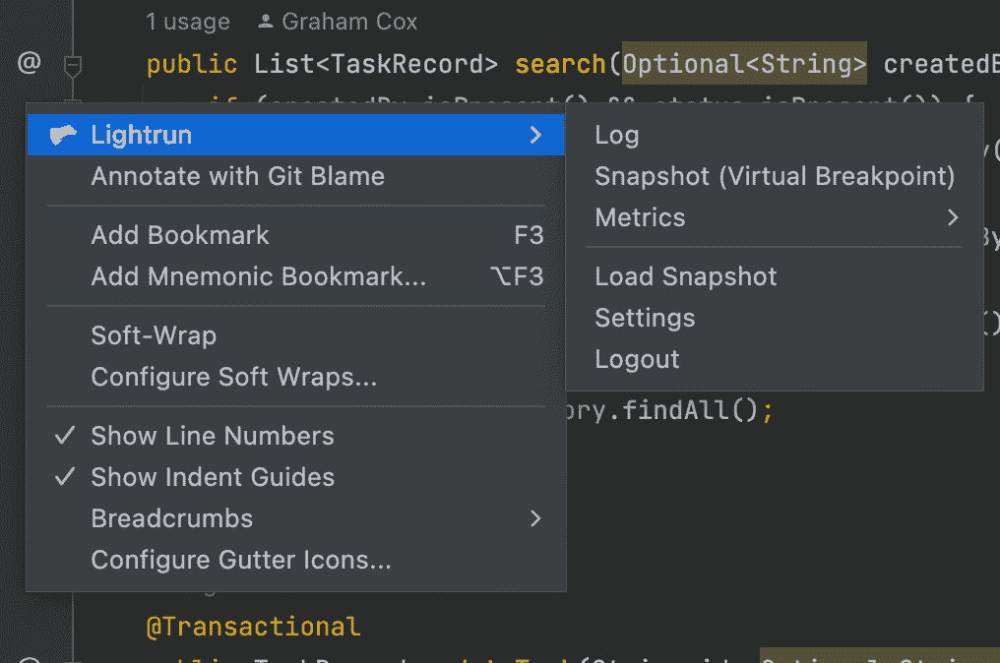
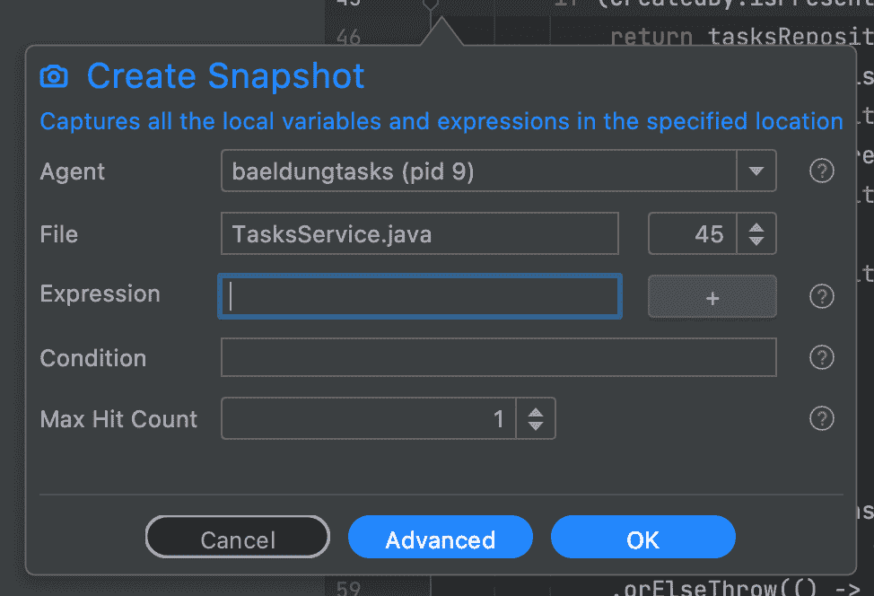
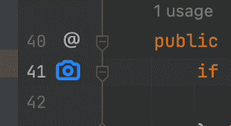
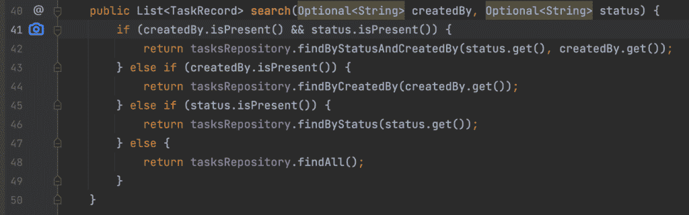
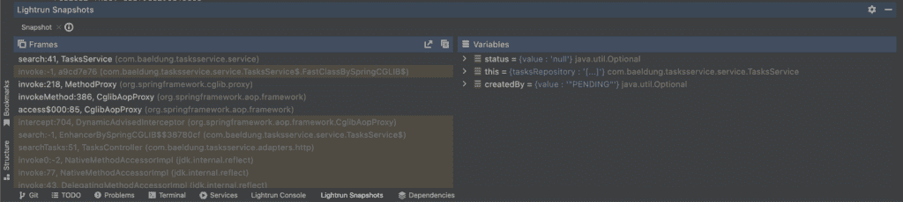

# 使用 Java 的 Lightrun 简介

> 原文：<https://web.archive.org/web/20220930061024/https://www.baeldung.com/java-lightrun>

## 1。简介

在本文中，我们将通过将 Lightrun 引入应用程序并展示我们可以利用它实现什么来探索它——一个开发人员可观察性平台。

## 2。什么是 Lightrun？

Lightrun 是一个可观察性平台，它允许我们对 Java(也支持其他语言)应用程序进行检测，然后直接从 IntelliJ、Visual Studio 代码以及许多其他日志平台和 APM 中查看检测结果。它旨在能够向运行在任何环境中的应用程序无缝添加工具，并从任何地方访问它们，使我们能够从本地工作站到生产实例的任何地方快速诊断问题。

Lightrun 使用两个集成在一起的不同组件:

*   Lightrun 代理作为应用程序的一部分运行，并根据请求安装遥测仪器。在 Java 应用程序中，这相当于一个 [Java 代理](/web/20220815214937/https://www.baeldung.com/java-instrumentation)。我们将把这个代理作为我们想要使用 Lightrun 的每个应用程序的一部分来运行。
*   Lightrun 插件作为我们开发环境的一部分运行，允许我们与代理通信。这是我们查看正在运行的程序、向应用程序添加新工具并接收工具结果的方法。

一旦所有这些都设置好了，我们就可以管理[三种不同类型的仪器](/web/20220815214937/https://www.baeldung.com/lightrun-actions):

*   日志——可以在任何时候向正在运行的应用程序添加任意日志语句，记录任何可用的值(包括复杂的表达式)。这些日志可以发送到标准输出，或者发送回我们开发环境中的 Lightrun 插件，或者同时发送到两者。此外，可以有条件地调用它们，例如，基于代码中预定义的特定用户或会话 ID。
*   快照–这使我们能够在任何时候捕获应用程序的实时快照。这将记录触发快照的确切时间和位置、所有变量的值以及到目前为止的完整调用堆栈的详细信息。这些也可以有条件地调用，很像日志。
*   度量——这些允许我们记录类似于由[千分尺](/web/20220815214937/https://www.baeldung.com/micrometer)产生的度量，允许我们计算一行代码被执行的次数，记录一个代码块的计时，或者我们可能想要的任何其他数值计算。

所有这些都可以在我们的代码中轻松完成。Lightrun 在这里给我们的是**在已经运行的应用程序中做这些事情的能力，而不需要改变或重新部署应用程序。**这意味着我们可以在零停机时间的情况下将目标仪器投入生产。

此外，所有这些日志都是短暂的。它们不存在于源代码或运行的应用程序中，可以根据需要添加或删除。

## 3。应用示例

对于本文，我们有一个已经构建好并可以使用的应用程序。此应用程序旨在跟踪分配给人员的任务，并允许用户查询这些数据。这段代码可以在 GitHub 上找到[，需要 Java 17+和 Maven 3.6 才能正确构建。](https://web.archive.org/web/20220815214937/https://github.com/eugenp/tutorials/tree/master/lightrun)

该应用程序被设计为三种不同的服务——一种用于管理用户，另一种用于管理任务，第三种用于协调这两种服务。然后,`tasks-service`和`users-services`有它们自己的数据库，并且在两者之间有一个 JMS 队列——允许`users-service`指示一个用户被删除，以便`tasks-service`可以整理东西。

为了方便起见，这些数据库和 JMS 队列都嵌入在应用程序中。然而，在现实中，这自然会使用真实的基础设施。

### 3.1。任务服务

**在本文中，我们只对`tasks-service`感兴趣。**然而，在未来的文章中，我们将探索这三者以及它们之间的相互作用。

这个服务是用 Java 17 上的 Maven 构建的 Spring Boot 应用程序。运行时，它具有以下 HTTP 端点:

*   GET/–允许客户端搜索任务，按照创建任务的用户和任务的状态进行过滤。
*   POST/–允许客户端创建新任务。
*   GET/{ id }-允许客户端通过 ID 获取单个任务。
*   PATCH/{ id }—允许客户端更新任务，更改状态和任务分配给的用户。
*   DELETE/{ id }—允许客户端删除任务。

我们还有一个 JMS 侦听器，它可以指示用户何时从我们的`users-service`中被删除。在这种情况下，我们会自动删除该用户创建的所有任务，并取消分配给该用户的所有任务。

我们的应用程序中也有一些 bug，我们将能够在 Lightrun 的帮助下进行诊断。

## 4。设置 Lightrun

在开始之前，我们需要一个 Lightrun 帐户，并在本地进行设置。这可以通过访问 https://app.lightrun.com/[并遵循说明来完成。](/web/20220815214937/https://www.baeldung.com/lightrun-app)

注册之后，我们需要选择开发环境和编程语言。对于本文，我们将使用 IntelliJ 和 Java，因此我们将选择它们并继续:

[](/web/20220815214937/https://www.baeldung.com/wp-content/uploads/2022/06/lightrun-setup.png)

然后，我们会得到如何将 Lightrun 插件安装到我们的环境中的说明，因此我们可以按照这些说明进行操作。

我们还需要确保从我们的开发环境中登录到我们的新帐户，之后我们将可以从编辑器中访问我们的 Lightrun 代理(目前还没有):

[](/web/20220815214937/https://www.baeldung.com/wp-content/uploads/2022/06/lightrun-connect.png)

最后，我们得到关于如何下载 Java 代理的说明，我们将使用它来检测我们的应用程序。这些说明是特定于平台的，所以我们需要确保我们遵循的是适合我们具体设置的说明。

一旦我们完成了这些，我们就可以启动安装了代理的应用程序了。确保`tasks-service`已经构建，然后我们可以运行它:

```java
$ java -jar -agentpath:../agent/lightrun_agent.so target/tasks-service-0.0.1-SNAPSHOT.jar
```

此时，我们的 web 浏览器中的 Onboarding 屏幕将允许我们继续前进，并且我们的开发环境中的 UI 将自动更新以显示我们的应用程序正在运行:

[](/web/20220815214937/https://www.baeldung.com/wp-content/uploads/2022/06/lightrun-connected.png)

请注意，这些都与我们的 Lightrun 帐户相关联，因此无论应用程序在哪里运行，我们都可以看到它们。这意味着我们可以在本地机器上运行的应用程序上使用完全相同的工具，在 Docker 容器中，或者在支持我们运行时的任何其他环境中，不管它在世界的什么地方。

## 5。捕捉快照

Lightrun 最强大的功能之一是能够为当前运行的应用程序添加[快照](/web/20220815214937/https://www.baeldung.com/lightrun-snapshots)。这些将允许我们在应用程序中的给定点捕捉精确的执行状态。这可以对我们的代码中到底发生了什么给出宝贵的见解。它们可以被认为是“虚拟断点”，只不过它们不会中断程序的流程。相反，它们捕获了所有的信息，您可以从断点看到这些信息，供我们以后查看。

快照以及日志和指标都是从我们的开发环境中添加的。我们通常通过右键单击想要添加工具的行，然后选择“Lightrun”选项来实现。

然后，我们可以通过从后续菜单中选择它来添加我们的仪器:

[](/web/20220815214937/https://www.baeldung.com/wp-content/uploads/2022/06/lightrun-snapshots.png)

这将打开一个面板，允许我们添加快照:

[](/web/20220815214937/https://www.baeldung.com/wp-content/uploads/2022/06/lightrun-create-snapshot.png)

在这里，我们需要选择我们想要检测的代理，并可能指定关于它将如何工作的其他细节。

当我们对一切都满意时，我们就点击创建按钮。这将在我们的边栏中添加一个新的快照条目，我们将在代码行旁边看到一个蓝色的摄像头图标。

这表明该行将在执行时捕获快照:

[](/web/20220815214937/https://www.baeldung.com/wp-content/uploads/2022/06/lightrun-snapshot-entry.png)

请注意，如果出现问题，摄像头将改为红色。通常，这意味着运行代码与源代码不一致，尽管可能存在其他原因，也需要在这里探讨。

## 6。诊断错误-搜索任务

**不幸的是，我们的`tasks-service,`有一个错误，执行任务的过滤搜索永远不会返回任何结果。**如果我们执行未过滤的搜索，那么这将正确地返回所有任务，但是一旦添加了过滤器——无论是`createdBy`、`status,`还是两者都有——那么我们突然得不到任何结果。

例如，如果我们调用 [http://localhost:8082？status=PENDING](https://web.archive.org/web/20220815214937/http://localhost:8082/?status=PENDING) 那么我们应该得到一些结果，但是，我们总是得到一个空数组。

我们的应用程序是这样构建的，我们有一个`TasksController` 来处理传入的 HTTP 请求。然后它调用`TasksService`来做真正的工作，这是按照`TasksRepository`的方式工作的。

这个库是一个 [Spring 数据](/web/20220815214937/https://www.baeldung.com/the-persistence-layer-with-spring-data-jpa)接口，这意味着我们没有可以直接插入的代码。相反，**我们将在`TasksService`** 中添加一个快照。特别是，我们将把它添加到`search()`方法的第一行。这将让我们看到调用该方法时存在的初始条件，而不管我们最终在方法中通过哪条代码路径:

[](/web/20220815214937/https://www.baeldung.com/wp-content/uploads/2022/06/lightrun-add-snapshot.png)

完成这些后，我们将调用我们的端点。同样，我们将得到一个空数组的相同结果。

但是，这次我们将在开发环境中捕获一个快照，我们可以在“快照”选项卡上看到:

[](/web/20220815214937/https://www.baeldung.com/wp-content/uploads/2022/06/lightrun-snapshots-tab.png)

**这向我们显示了捕获快照的堆栈跟踪，以及捕获快照时所有可见变量的状态。**让我们关注这里的变量。其中两个是传递给方法的参数，第三个是`this`。这些参数可能是最有意思的，所以我们要看看它们。

马上就能看出问题了。在`createdBy`参数中，我们被赋予了值“PENDING”，这是我们正在搜索的状态！

仔细查看代码，我们会发现我们不幸地调换了`TasksController`和`TasksService.` 之间的参数。这是一个简单的修复方法，如果我们做到了——通过交换`TasksService`中的参数或者从`TasksController`传入的值——那么我们的搜索会突然开始正常工作。

## 7。总结

在这里，我们已经看到了 Lightrun observability 平台的快速介绍，如何开始使用它，以及它可以给我们带来的一些好处。我们将在接下来的文章中更深入地探讨这些问题。

为什么不在您的下一个应用程序中使用它，让您对它的运行方式更有信心和洞察力。