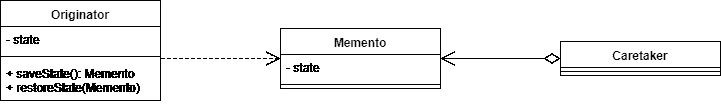

# java 中的 momento 设计模式

> 原文：<https://web.archive.org/web/20220930061024/https://www.baeldung.com/java-memento-design-pattern>

## 1.概观

在本教程中，我们将学习什么是 Memento 设计模式以及如何使用它。

首先，我们将回顾一些理论。然后，我们将创建一个示例来说明该模式的用法。

## 2.什么是纪念品设计模式？

Memento 设计模式，由四人组在他们的书中描述，是一种行为设计模式。**Memento 设计模式提供了实现可撤销动作的解决方案。**我们可以通过保存一个对象在给定时刻的状态，并在此后执行的操作需要撤销时恢复它来做到这一点。

实际上，其状态需要被保存的对象被称为发起者。看护者是触发状态的保存和恢复的对象，这被称为纪念品。

纪念品应该尽可能少地暴露给护理人员。这是为了确保我们不会将发起者的内部状态暴露给外界，因为这将违反封装原则。但是，发起者应该访问足够的信息，以便恢复到原始状态。

让我们来看一个简单的类图，展示不同的对象是如何相互作用的:

[](/web/20221205120350/https://www.baeldung.com/wp-content/uploads/2019/08/Memento-Design-Pattern-1.png)

如我们所见，发起者可以生产和消费纪念品。同时，看守者只保留恢复之前的状态。发起者的内部表示对外部世界是隐藏的。

这里，我们使用单个字段来表示发起者的状态，尽管**我们并不局限于一个字段，而是可以根据需要使用多个字段**。另外，Memento 对象中保存的状态不必与发起者的完整状态相匹配。只要保留的信息足以恢复发起者的状态，我们就可以开始了。

## 3.何时使用 Memento 设计模式？

通常，Memento 设计模式将用于某些操作是不可撤销的情况，因此需要回滚到以前的状态。然而，如果发起者的状态是沉重的，使用 Memento 设计模式会导致昂贵的创建过程和增加的内存使用。

## 4.纪念品图案的例子

### 4.1。初始样本

现在让我们看一个 Memento 设计模式的例子。假设我们有一个文本编辑器:

```java
public class TextEditor {

    private TextWindow textWindow;

    public TextEditor(TextWindow textWindow) {
        this.textWindow = textWindow;
    }
}
```

它有一个文本窗口，保存当前输入的文本，并提供添加更多文本的方法:

```java
public class TextWindow {

    private StringBuilder currentText;

    public TextWindow() {
        this.currentText = new StringBuilder();
    }

    public void addText(String text) {
        currentText.append(text);
    }
}
```

### 4.2.纪念品

现在，让我们想象我们希望我们的文本编辑器实现一些保存和撤销功能。保存时，我们希望保存当前文本。因此，当撤销后续更改时，我们将恢复保存的文本。

为了做到这一点，我们将利用 Memento 设计模式。首先，我们将创建一个保存窗口当前文本的对象:

```java
public class TextWindowState {

    private String text;

    public TextWindowState(String text) {
        this.text = text;
    }

    public String getText() {
        return text;
    }
}
```

这件物品是我们的纪念品。正如我们所看到的，我们选择使用`String`而不是`StringBuilder`来防止外人对当前文本的任何更新。

### 4.3.发起人

**之后，我们必须为`TextWindow`类提供创建和消费 Memento 对象的方法，使`TextWindow`成为我们的发起者:**

```java
private StringBuilder currentText;

public TextWindowState save() {
    return new TextWindowState(currentText.toString());
}

public void restore(TextWindowState save) {
    currentText = new StringBuilder(save.getText());
}
```

`save()`方法允许我们创建对象，而`restore()`方法使用它来恢复之前的状态。

### 4.4.看门人

最后，我们必须更新我们的`TextEditor`类。**作为看守者，它将保持发起者的状态，并在需要时请求恢复它:**

```java
private TextWindowState savedTextWindow;

public void hitSave() {
    savedTextWindow = textWindow.save();
}

public void hitUndo() {
    textWindow.restore(savedTextWindow);
}
```

### 4.5.测试解决方案

让我们通过一个示例运行来看看它是否有效。假设我们在编辑器中添加一些文本，保存它，然后再添加一些，最后撤销。为了实现这一点，我们将在我们的`TextEditor`上添加一个`print() `方法，它返回当前文本的一个`String`:

```java
TextEditor textEditor = new TextEditor(new TextWindow());
textEditor.write("The Memento Design Pattern\n");
textEditor.write("How to implement it in Java?\n");
textEditor.hitSave();

textEditor.write("Buy milk and eggs before coming home\n");

textEditor.hitUndo();

assertThat(textEditor.print()).isEqualTo("The Memento Design Pattern\nHow to implement it in Java?\n");
```

正如我们所看到的，最后一句不是当前文本的一部分，因为 Memento 是在添加之前保存的。

## 5.结论

在这篇短文中，我们解释了 Memento 设计模式及其用途。我们还通过一个例子说明了它在一个简单的文本编辑器中的用法。

本文中使用的完整代码可以在 GitHub 上找到[。](https://web.archive.org/web/20221205120350/https://github.com/eugenp/tutorials/tree/master/patterns-modules/design-patterns-behavioral-2)