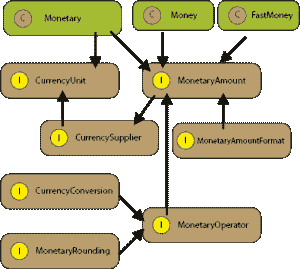

# Java 货币和货币 API

> 原文：<https://web.archive.org/web/20220930061024/https://www.baeldung.com/java-money-and-currency>

## 1。概述

[JSR 354](https://web.archive.org/web/20221020142806/https://jcp.org/en/jsr/detail?id=354)–“货币和金钱”解决了 Java 中货币和货币金额的标准化问题。

它的目标是为 Java 生态系统添加一个灵活且可扩展的 API，并使货币数量的处理更加简单和安全。

JSR 没有进入 JDK 9，但它是未来 JDK 版本的候选。

## 2。设置

首先，让我们在`pom.xml`文件中定义依赖关系:

```java
<dependency>
    <groupId>org.javamoney</groupId>
    <artifactId>moneta</artifactId>
    <version>1.1</version>
</dependency> 
```

依赖关系的最新版本可以在[这里](https://web.archive.org/web/20221020142806/https://search.maven.org/classic/#search%7Cgav%7C1%7Cg%3A%22org.javamoney%22%20AND%20a%3A%22moneta%22)查看。

## 3。JSR-354 的特点

“货币与金钱”API 的目标:

*   提供用于处理和计算货币金额的 API
*   定义表示货币和货币金额以及货币舍入的类
*   处理货币汇率
*   处理货币和货币金额的格式化和解析

## 4。型号

下图描述了 JSR-354 规范的主要类别:

[](/web/20221020142806/https://www.baeldung.com/wp-content/uploads/2017/03/javax-monetary3-1.png)

该模型包含两个主要接口`CurrencyUnit` 和`MonetaryAmount,` ，将在以下章节中解释。

## 5。`CurrencyUnit`

模拟货币的最小属性。它的实例可以使用`Monetary.getCurrency`方法获得:

```java
@Test
public void givenCurrencyCode_whenString_thanExist() {
    CurrencyUnit usd = Monetary.getCurrency("USD");

    assertNotNull(usd);
    assertEquals(usd.getCurrencyCode(), "USD");
    assertEquals(usd.getNumericCode(), 840);
    assertEquals(usd.getDefaultFractionDigits(), 2);
}
```

我们使用货币的`String`表示来创建`CurrencyUnit` ，这可能导致我们试图用不存在的代码创建货币的情况。用不存在的代码创建货币会引发`UnknownCurrency`异常:

```java
@Test(expected = UnknownCurrencyException.class)
public void givenCurrencyCode_whenNoExist_thanThrowsError() {
    Monetary.getCurrency("AAA");
} 
```

## 6。`MonetaryAmount`

`MonetaryAmount`是货币金额的数字表示。它总是与`CurrencyUnit` 相关联，并定义一种货币的货币表示。

金额可以以不同的方式实现，集中在一个货币表示的行为需求上，由每个具体的用例定义。比如说。`Money`和`FastMoney`是`MonetaryAmount`接口的实现。

`FastMoney`以`long`为数值表示实现`MonetaryAmount`，以精度为代价比`BigDecimal` 快；当我们需要性能和精度不成问题时，可以使用它。

可以使用缺省工厂创建通用实例。让我们展示获得`MonetaryAmount`实例的不同方式:

```java
@Test
public void givenAmounts_whenStringified_thanEquals() {

    CurrencyUnit usd = Monetary.getCurrency("USD");
    MonetaryAmount fstAmtUSD = Monetary.getDefaultAmountFactory()
      .setCurrency(usd).setNumber(200).create();
    Money moneyof = Money.of(12, usd);
    FastMoney fastmoneyof = FastMoney.of(2, usd);

    assertEquals("USD", usd.toString());
    assertEquals("USD 200", fstAmtUSD.toString());
    assertEquals("USD 12", moneyof.toString());
    assertEquals("USD 2.00000", fastmoneyof.toString());
}
```

## 7 **。货币算术**

我们可以在`Money`和`FastMoney`之间执行货币算术，但是当我们组合这两个类的实例时需要小心。

例如，当我们将一个欧元实例的`FastMoney`与一个欧元实例的`Money`进行比较时，结果是它们并不相同:

```java
@Test
public void givenCurrencies_whenCompared_thanNotequal() {
    MonetaryAmount oneDolar = Monetary.getDefaultAmountFactory()
      .setCurrency("USD").setNumber(1).create();
    Money oneEuro = Money.of(1, "EUR");

    assertFalse(oneEuro.equals(FastMoney.of(1, "EUR")));
    assertTrue(oneDolar.equals(Money.of(1, "USD")));
}
```

我们可以使用`MonetaryAmount`类提供的方法执行加、减、乘、除和其他货币算术运算。

算术运算应该抛出一个`ArithmeticException`，如果数量之间的算术运算超过了所使用的数字表示类型的能力，例如，如果我们试图除以 3，我们会得到一个`ArithmeticException` ，因为结果是一个无穷大的数:

```java
@Test(expected = ArithmeticException.class)
public void givenAmount_whenDivided_thanThrowsException() {
    MonetaryAmount oneDolar = Monetary.getDefaultAmountFactory()
      .setCurrency("USD").setNumber(1).create();
    oneDolar.divide(3);
}
```

当增加或减少金额时，最好使用作为`MonetaryAmount`实例的参数，因为我们需要确保两个金额使用相同的货币来执行金额之间的运算。

### 7.1。计算金额

可以通过多种方式计算总金额，其中一种方式是简单地将金额与以下各项联系起来:

```java
@Test
public void givenAmounts_whenSummed_thanCorrect() {
    MonetaryAmount[] monetaryAmounts = new MonetaryAmount[] {
      Money.of(100, "CHF"), Money.of(10.20, "CHF"), Money.of(1.15, "CHF")};

    Money sumAmtCHF = Money.of(0, "CHF");
    for (MonetaryAmount monetaryAmount : monetaryAmounts) {
        sumAmtCHF = sumAmtCHF.add(monetaryAmount);
    }

    assertEquals("CHF 111.35", sumAmtCHF.toString());
}
```

链接也可以应用于减法:

```java
Money calcAmtUSD = Money.of(1, "USD").subtract(fstAmtUSD); 
```

乘法:

```java
MonetaryAmount multiplyAmount = oneDolar.multiply(0.25);
```

或者划分:

```java
MonetaryAmount divideAmount = oneDolar.divide(0.25);
```

让我们使用字符串来比较我们的算术结果，假设使用字符串，因为结果也包含货币:

```java
@Test
public void givenArithmetic_whenStringified_thanEqualsAmount() {
    CurrencyUnit usd = Monetary.getCurrency("USD");

    Money moneyof = Money.of(12, usd);
    MonetaryAmount fstAmtUSD = Monetary.getDefaultAmountFactory()
      .setCurrency(usd).setNumber(200.50).create();
    MonetaryAmount oneDolar = Monetary.getDefaultAmountFactory()
      .setCurrency("USD").setNumber(1).create();
    Money subtractedAmount = Money.of(1, "USD").subtract(fstAmtUSD);
    MonetaryAmount multiplyAmount = oneDolar.multiply(0.25);
    MonetaryAmount divideAmount = oneDolar.divide(0.25);

    assertEquals("USD", usd.toString());
    assertEquals("USD 1", oneDolar.toString());
    assertEquals("USD 200.5", fstAmtUSD.toString());
    assertEquals("USD 12", moneyof.toString());
    assertEquals("USD -199.5", subtractedAmount.toString());
    assertEquals("USD 0.25", multiplyAmount.toString());
    assertEquals("USD 4", divideAmount.toString());
}
```

## 8。货币舍入

货币舍入就是将一个不确定精度的金额转换成一个舍入金额。

我们将使用由`Monetary` 类提供的`getDefaultRounding` API 来进行转换。默认舍入值由货币提供:

```java
@Test
public void givenAmount_whenRounded_thanEquals() {
    MonetaryAmount fstAmtEUR = Monetary.getDefaultAmountFactory()
      .setCurrency("EUR").setNumber(1.30473908).create();
    MonetaryAmount roundEUR = fstAmtEUR.with(Monetary.getDefaultRounding());

    assertEquals("EUR 1.30473908", fstAmtEUR.toString());
    assertEquals("EUR 1.3", roundEUR.toString());
}
```

## 9。货币兑换

货币兑换是处理货币的一个重要方面。不幸的是，这些转换有很多种不同的实现和用例。

该 API 侧重于基于来源、目标货币和汇率的货币兑换的常见方面。

货币转换或访问汇率可以参数化:

```java
@Test
public void givenAmount_whenConversion_thenNotNull() {
    MonetaryAmount oneDollar = Monetary.getDefaultAmountFactory().setCurrency("USD")
      .setNumber(1).create();

    CurrencyConversion conversionEUR = MonetaryConversions.getConversion("EUR");

    MonetaryAmount convertedAmountUSDtoEUR = oneDollar.with(conversionEUR);

    assertEquals("USD 1", oneDollar.toString());
    assertNotNull(convertedAmountUSDtoEUR);
}
```

转换总是与货币绑定。通过向 amount 的`with`方法传递一个`CurrencyConversion`可以简单地转换`MonetaryAmount`。

## 10。货币格式

格式化允许访问基于`java.util.Locale`的格式。与 JDK 相反，这个 API 定义的格式化程序是线程安全的:

```java
@Test
public void givenLocale_whenFormatted_thanEquals() {
    MonetaryAmount oneDollar = Monetary.getDefaultAmountFactory()
      .setCurrency("USD").setNumber(1).create();

    MonetaryAmountFormat formatUSD = MonetaryFormats.getAmountFormat(Locale.US);
    String usFormatted = formatUSD.format(oneDollar);

    assertEquals("USD 1", oneDollar.toString());
    assertNotNull(formatUSD);
    assertEquals("USD1.00", usFormatted);
}
```

这里我们使用预定义的格式，并为我们的货币创建自定义格式。通过使用`MonetaryFormats`类的方法格式，标准格式的使用非常简单。我们通过设置格式查询构建器的 pattern 属性来定义我们的自定义格式。

和以前一样，因为货币包含在结果中，所以我们使用`Strings`测试我们的结果:

```java
@Test
public void givenAmount_whenCustomFormat_thanEquals() {
    MonetaryAmount oneDollar = Monetary.getDefaultAmountFactory()
            .setCurrency("USD").setNumber(1).create();

    MonetaryAmountFormat customFormat = MonetaryFormats.getAmountFormat(AmountFormatQueryBuilder.
      of(Locale.US).set(CurrencyStyle.NAME).set("pattern", "00000.00 ¤").build());
    String customFormatted = customFormat.format(oneDollar);

    assertNotNull(customFormat);
    assertEquals("USD 1", oneDollar.toString());
    assertEquals("00001.00 US Dollar", customFormatted);
}
```

## 11。总结

在这篇简短的文章中，我们已经介绍了 Java 货币 JSR 的基础知识。

货币值到处都在使用，Java provides 开始支持和处理货币值、算术或货币转换。

和往常一样，你可以在 Github 上找到文章[中的代码。](https://web.archive.org/web/20221020142806/https://github.com/eugenp/tutorials/tree/master/core-java-modules/core-java)