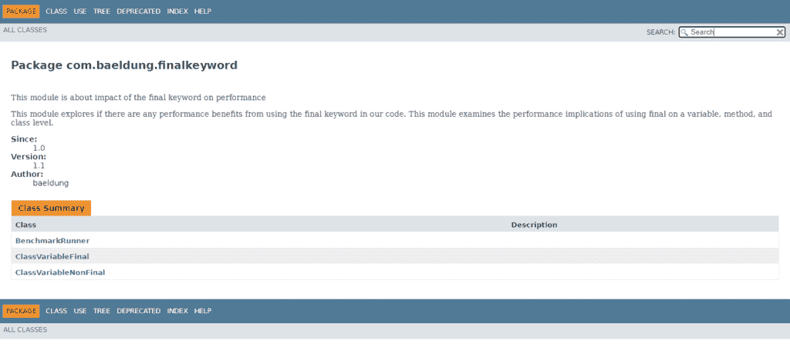
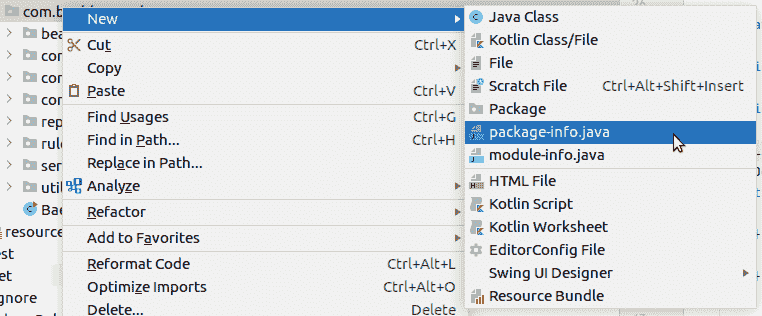
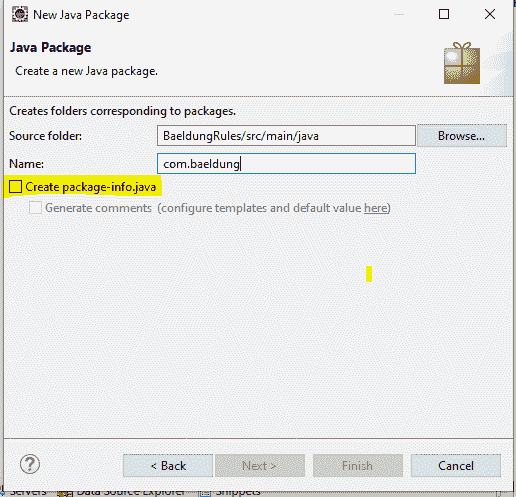

# package-info.java 档案

> 原文：<https://web.archive.org/web/20220930061024/https://www.baeldung.com/java-package-info>

## 1.概观

在本教程中，我们将了解`package-info.java`的用途以及它的用处。简单来说，`package-info`是一个 **Java 文件，可以添加到任何 Java 包**中。

## 2.`package-info`的目的

`package-info.java`文件目前有两个用途:

*   包级文档的位置
*   包级注释的主页

除了上面提到的，用例可以根据需要扩展。将来，如果需要添加任何包级特性，这个文件将是一个完美的地方。

让我们详细检查一下当前的用例。

## 3.包文档

在 Java 版本 5 之前，与包相关的文档被放在一个 HTML 文件`package.html`中。这只是一个普通的 HTML 文件，Javadoc 注释放在`body`标签中。

随着 **JDK 5** 的到来， **`package.html`让位给了一个新的选择，`package-info.java`，**现在比`package.html`更受青睐。

让我们看一个在`package-info.java`文件中的包文档的例子:

```java
/**
 * This module is about impact of the final keyword on performance
 * <p>
 * This module explores  if there are any performance benefits from
 * using the final keyword in our code. This module examines the performance
 * implications of using final on a variable, method, and class level.
 * </p>
 *
 * @since 1.0
 * @author baeldung
 * @version 1.1
 */
package com.baeldung.finalkeyword;
```

上面的`package-info.java`将生成 Javadoc:

[](/web/20220523132711/https://www.baeldung.com/wp-content/uploads/2021/04/PackageJavadoc-1.png)

因此，正如我们在其他地方编写 Javadoc 一样，我们可以将 Javadoc 包放在 Java 源文件中。

## 4.包注释

假设我们必须**对整个包**应用注释。在这种情况下，`package-info.java`可以来援助我们。

考虑这样一种情况，默认情况下，我们需要将字段、参数和返回值声明为非 null。我们可以通过简单地在我们的`package-info.java`文件`.`中包含非空参数和返回值的`@NonNullApi`注释、和非空字段的`@NonNullFields`注释来实现这个目标

`@NonNullFields`和`@NonNullApi`将字段、参数和返回值标记为非空，除非它们被明确标记为 `@Nullable`:

```java
@NonNullApi
@NonNullFields
package com.baeldung.nullibility;

import org.springframework.lang.NonNullApi;
import org.springframework.lang.NonNullFields;
```

有各种注释可以在包级别使用。例如，在 Hibernate 项目中，我们有一个[类别的注释](https://web.archive.org/web/20220523132711/https://docs.jboss.org/hibernate/orm/6.0/javadocs/org/hibernate/annotations/package-summary.html)，JAXB 项目也有[包级注释](https://web.archive.org/web/20220523132711/https://docs.oracle.com/javase/8/docs/api/javax/xml/bind/annotation/package-summary.html)。

## 5.如何创建一个`package-info`文件

创建一个`package-info`文件相当简单:我们可以手动创建它或者寻求 IDE 帮助来生成它。

在 IntelliJ IDEA 中，我们可以右击包并选择`New-> package-info.java`:

[](/web/20220523132711/https://www.baeldung.com/wp-content/uploads/2021/04/Screenshot-from-2021-04-05-11-21-15.png)

Eclipse 的`New Java Package`选项允许我们生成一个`package-info.java`:

[](/web/20220523132711/https://www.baeldung.com/wp-content/uploads/2021/04/PackageInfo.png)

上述方法也适用于现有的包。选择现有的包，`New-> Package`选项，并勾选`Create package-info.java`选项。

在我们的项目编码指南中强制包含`package-info.java`总是一个好的实践。像[声纳](https://web.archive.org/web/20220523132711/https://rules.sonarsource.com/java/tag/convention/RSPEC-1228)或[检查型](https://web.archive.org/web/20220523132711/https://checkstyle.sourceforge.io/config_javadoc.html#JavadocPackage)这样的工具可以帮助实现这一点。

## 6.结论

HTML 和 Java 文件用法的主要区别在于，对于 Java 文件，我们有使用 Java 注释的额外可能性。所以`package-info java`文件不仅仅是包 Javadocs 的**家，也是包范围注释**的**家。此外，这个**用例列表可以在将来扩展**。**

和往常一样，代码可以在 GitHub 的[上获得。](https://web.archive.org/web/20220523132711/https://github.com/eugenp/tutorials/tree/master/core-java-modules/core-java-lang-4)