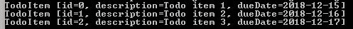

# Java 包指南

> 原文：<https://web.archive.org/web/20220930061024/https://www.baeldung.com/java-packages>

## 1.介绍

在这个快速教程中，我们将介绍 Java 包的基础知识。我们将看到如何创建包并访问我们放在包中的类型。

我们还将讨论命名约定以及它与底层目录结构的关系。

最后，我们将编译并运行我们打包的 Java 类。

## 2.Java 包概述

在 Java 中，我们**使用包来分组相关的类、接口和子包**。

这样做的主要好处是:

*   使相关类型更容易找到——包通常包含逻辑上相关的类型
*   避免命名冲突——包将帮助我们唯一地识别一个类；例如，我们可以有一个`com.baeldung.Application,`和`com.example.Application`类
*   控制访问——我们可以通过组合包和[访问修饰符](/web/20221111032102/https://www.baeldung.com/java-access-modifiers)来控制对类型的可见性和访问

接下来，让我们看看如何创建和使用 Java 包。

## 3.创建包

为了创建一个包，**我们必须使用`package`语句，将它作为第一行代码添加到一个文件**中。

让我们在名为`com.baeldung.packages`的包中放置一个类型:

```java
package com.baeldung.packages;
```

**强烈建议将每种新类型放在一个包装中。**如果我们定义了类型，但没有把它们放在一个包中，它们会放在`default`或未命名的包中。使用默认包有一些缺点:

*   我们失去了拥有包结构的好处，并且我们不能拥有子包
*   我们不能从其他包中导入默认包中的类型
*   [`protected `和`package-private`](/web/20221111032102/https://www.baeldung.com/java-access-modifiers) 访问范围将毫无意义

正如 [Java 语言规范所述](https://web.archive.org/web/20221111032102/https://docs.oracle.com/javase/specs/jls/se14/html/jls-7.html#jls-7.4.2)，Java SE 平台提供未命名的包主要是为了在开发小型或临时应用程序或刚开始开发时方便起见。

因此，**我们应该避免在现实应用中使用未命名或默认的包**。

### 3.1.命名规格

为了避免包具有相同的名称，我们遵循一些命名约定:

*   我们用小写字母来定义我们的包**名**
*   包名用句点分隔
*   名字也是由**创造它们的公司或组织**决定的

为了根据组织来确定包名，我们通常从反转公司 URL 开始。之后，命名约定由公司定义，可能包括分部名称和项目名称。

比如用`www.baeldung.com`做一个包，我们反过来说:

```java
com.baeldung
```

然后我们可以进一步定义它的子包，比如`com.baeldung.packages`或者`com.baeldung.packages.domain.`

### 3.2.目录结构

Java 中的包对应于一个目录结构。

**每个包和子包都有自己的目录。**所以，对于包`com.baeldung.packages`，我们应该有一个`com -> baeldung -> packages`的目录结构。

大多数 IDE 会根据我们的包名来帮助创建这个目录结构，所以我们不需要手动创建。

## 4.使用包成员

让我们首先在名为`domain`的子包中定义一个类`TodoItem`:

```java
package com.baeldung.packages.domain;

public class TodoItem {
    private Long id;
    private String description;

    // standard getters and setters
}
```

### 4.1.进口

为了从另一个包的类中使用我们的`TodoItem`类，我们需要导入它。一旦导入，我们就可以按名称访问它。

我们可以从一个包中导入一个类型，或者使用星号来导入一个包中的所有类型。

让我们导入整个`domain`子包:

```java
import com.baeldung.packages.domain.*;
```

现在，让我们只导入`TodoItem`类:

```java
import com.baeldung.packages.domain.TodoItem;
```

JDK 和其他 Java 库也有自己的包。我们可以用同样的方式导入我们想要在项目中使用的预先存在的类。

例如，让我们导入 Java 核心`List`接口和`ArrayList`类:

```java
import java.util.ArrayList;import java.util.List;
```

然后，我们可以在应用程序中使用这些类型，只需使用它们的名称:

```java
public class TodoList {
    private List<TodoItem> todoItems;

    public void addTodoItem(TodoItem todoItem) {
        if (todoItems == null) {
            todoItems = new ArrayList<TodoItem>();
        }
        todoItems.add(todoItem);
    }
}
```

这里，我们使用了新的类和 Java 核心类，创建了一个`ToDoItems.`的`List`

### 4.2.完全限定名

有时，我们可能使用来自不同包的同名的两个类。例如，我们可能同时使用了`java.sql.Date`和`java.util.Date`。**当我们遇到命名冲突时，我们需要为至少一个类使用完全限定的类名。**

让我们使用带有完全限定名的`TodoItem`:

```java
public class TodoList {
    private List<com.baeldung.packages.domain.TodoItem> todoItems;

    public void addTodoItem(com.baeldung.packages.domain.TodoItem todoItem) {
        if (todoItems == null) {
            todoItems = new ArrayList<com.baeldung.packages.domain.TodoItem>();
        }todoItems.add(todoItem);
    }

    // standard getters and setters
}
```

## 5.用`javac`编译

当需要编译打包的类时，我们需要记住我们的目录结构。从源文件夹开始，我们需要告诉`javac`在哪里可以找到我们的文件。

我们需要首先编译我们的`TodoItem`类，因为我们的`TodoList`类依赖于它。

让我们从打开命令行或终端并导航到我们的源目录开始。

现在，让我们编译我们的`com.baeldung.packages.domain.TodoItem`类:

```java
> javac com/baeldung/packages/domain/TodoItem.java
```

如果我们的类编译干净，我们将看不到错误消息，并且文件`TodoItem.class`应该出现在我们的`com/baeldung/packages/domain`目录中。

对于引用其他包中类型的类型，我们应该使用`-classpath`标志告诉`javac`命令在哪里可以找到其他编译的类。

现在我们的`TodoItem`类已经编译好了，我们可以编译我们的`TodoList` 和 `TodoApp`类了:

```java
>javac -classpath . com/baeldung/packages/*.java
```

同样，我们应该看不到错误消息，并且应该在我们的`com/baeldung/packages`目录中找到两个类文件。

让我们使用我们的`TodoApp`类的完全限定名来运行我们的应用程序:

```java
>java com.baeldung.packages.TodoApp
```

我们的输出应该如下所示:



## 6.结论

在这篇短文中，我们学习了什么是包以及为什么我们应该使用它们。

我们讨论了命名约定以及包与目录结构的关系。我们还看到了如何创建和使用包。

最后，我们讨论了如何使用`javac`和`java`命令编译和运行带有包的应用程序。

完整的示例代码可以在 GitHub 的[上找到。](https://web.archive.org/web/20221111032102/https://github.com/eugenp/tutorials/tree/master/core-java-modules/core-java-lang-syntax-2)