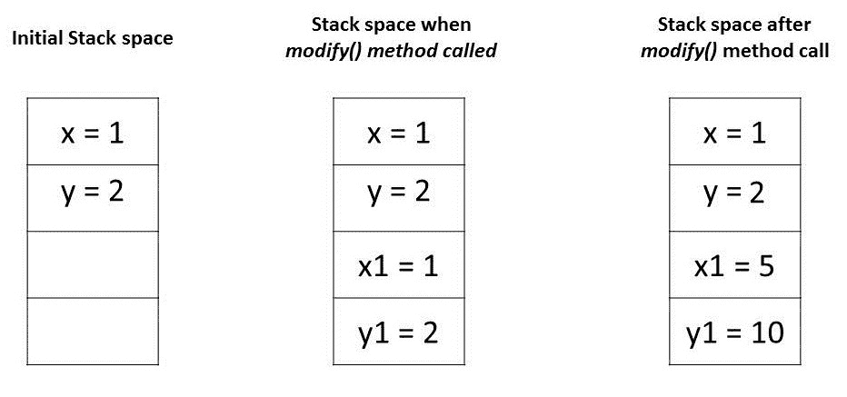
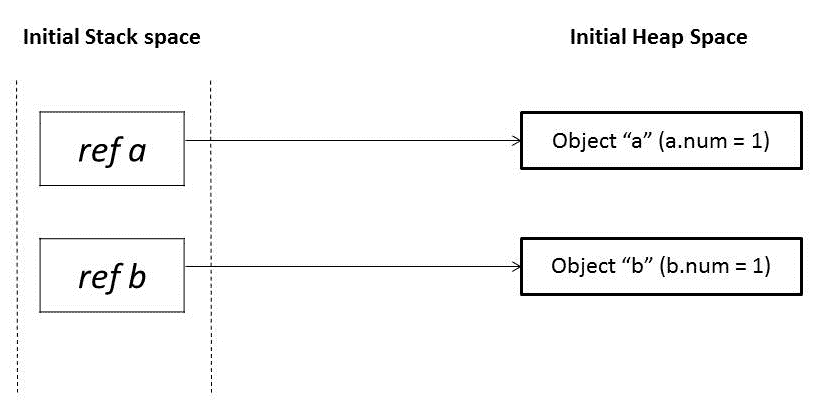
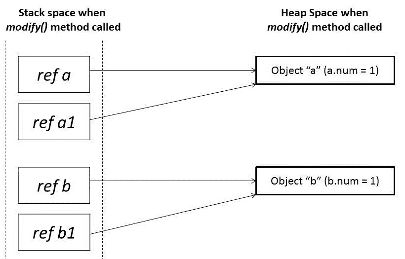
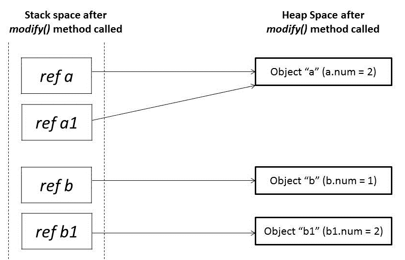

# Java 中作为参数传递机制的按值传递

> 原文：<https://web.archive.org/web/20220930061024/https://www.baeldung.com/java-pass-by-value-or-pass-by-reference>

## 1。简介

向方法传递参数的两种最流行的方式是“按值传递”和“按引用传递”。不同的编程语言以不同的方式使用这些概念。**就 Java 而言，一切都是严格的`Pass-by-Value`。**

在本教程中，我们将说明 Java 如何传递各种类型的参数。

## 2。按值传递与按引用传递

让我们从向函数传递参数的一些不同机制开始:

*   价值
*   参考
*   结果
*   价值-结果
*   名字

现代编程语言中最常见的两种机制是“按值传递”和“按引用传递”。在我们继续之前，让我们先讨论这些:

### 2.1。传递值

当参数按值传递时，调用方和被调用方方法对两个不同的变量进行操作，这两个变量是彼此的副本。对一个变量的任何改变都不会改变另一个变量。

这意味着在调用一个方法时，传递给被调用者方法的**参数将是原始参数的克隆。**在被调用者方法中进行的任何修改都不会影响调用者方法中的原始参数。

### 2.2。参照传递

当参数通过引用传递时，调用方和被调用方对同一个对象进行操作。

这意味着当一个变量通过引用传递时，**对象的唯一标识符被发送给方法。**对参数实例成员的任何更改都将导致对原始值的更改。

## 3。Java 中的参数传递

任何编程语言的基本概念都是“值”和“引用”。在 Java 中，**原语变量存储实际值，而非原语变量存储引用变量，这些变量指向它们所引用的对象的地址。**值和参考值都存储在堆栈存储器中。

Java 中的参数总是按值传递的。在方法调用期间，每个参数的副本，无论是值还是引用，都在堆栈内存中创建，然后传递给方法。

在原语的情况下，值被简单地复制到堆栈内存中，然后被传递给被调用方法；在非原语的情况下，堆栈内存中的引用指向驻留在堆中的实际数据。当我们传递一个对象时，堆栈内存中的引用被复制，新的引用被传递给方法。

现在，让我们在一些代码示例的帮助下看看这一点。

### 3.1。传递原始类型

Java 编程语言有八种原始数据类型。**原始变量直接存储在堆栈内存中。每当原始数据类型的任何变量作为参数传递时，实际的参数被复制到形式参数，这些形式参数在堆栈内存中累积它们自己的空间。**

这些形参的生命周期只持续到方法运行的时候，一旦返回，这些形参就会从堆栈中清除并被丢弃。

让我们借助一个代码示例来理解它:

```java
public class PrimitivesUnitTest {

    @Test
    public void whenModifyingPrimitives_thenOriginalValuesNotModified() {

        int x = 1;
        int y = 2;

        // Before Modification
        assertEquals(x, 1);
        assertEquals(y, 2);

        modify(x, y);

        // After Modification
        assertEquals(x, 1);
        assertEquals(y, 2);
    }

    public static void modify(int x1, int y1) {
        x1 = 5;
        y1 = 10;
    }
} 
```

让我们通过分析这些值在内存中的存储方式来理解上面程序中的断言:

1.  main 方法中的变量“`x”`和“`y”`”是原始类型，它们的值直接存储在堆栈存储器中
2.  当我们调用方法`modify()`时，会为这些变量中的每一个创建一个精确的副本，并存储在堆栈内存中的不同位置
3.  对这些副本的任何修改只会影响它们，而不会改变原始变量

[](/web/20220923231236/https://www.baeldung.com/wp-content/uploads/2018/05/baeldung_-_pass_by_value_-_passing_primitives.jpg)

### 3.2。传递对象引用

在 Java 中，所有对象都是动态存储在堆空间中的。这些对象是从称为引用变量的引用中引用的。

与原语不同，Java 对象分两个阶段存储。引用变量存储在堆栈内存中，它们所引用的对象存储在堆内存中。

每当一个对象作为一个参数被传递时，引用变量的一个精确副本被创建，它指向对象在堆内存中与原始引用变量相同的位置。

**由于这一点，每当我们在方法中对同一对象进行任何改变时，那种改变就反映在原来的对象中。**但是，如果我们给传递的引用变量分配了一个新的对象，那么它就不会反映在原来的对象中。

让我们借助一个代码示例来理解这一点:

```java
public class NonPrimitivesUnitTest {

    @Test
    public void whenModifyingObjects_thenOriginalObjectChanged() {
        Foo a = new Foo(1);
        Foo b = new Foo(1);

        // Before Modification
        assertEquals(a.num, 1);
        assertEquals(b.num, 1);

        modify(a, b);

        // After Modification
        assertEquals(a.num, 2);
        assertEquals(b.num, 1);
    }

    public static void modify(Foo a1, Foo b1) {
        a1.num++;

        b1 = new Foo(1);
        b1.num++;
    }
}

class Foo {
    public int num;

    public Foo(int num) {
        this.num = num;
    }
}
```

让我们分析一下上面程序中的断言。我们已经在`modify() `方法中传递了具有相同值`1`的对象`a `和`b`。最初，这些对象引用指向堆空间中两个不同的对象位置:
[](/web/20220923231236/https://www.baeldung.com/wp-content/uploads/2018/05/baeldung_-_pass_by_value_-_passing_primitives_-_initial.jpg)

当在`modify()`方法中传递这些引用`a `和`b `时，它创建指向相同旧对象的那些引用`a1 `和`b1`的镜像副本:

[](/web/20220923231236/https://www.baeldung.com/wp-content/uploads/2018/05/baeldung_-_pass_by_value_-_passing_primitives_-_before_method_ca.jpg)

在`modify() `方法中，当我们修改引用`a1`时，它改变了原来的对象。然而，对于参考`b1, `我们已经分配了一个新的对象。所以它现在指向堆内存中的一个新对象。

对`b1`的任何更改都不会反映原始对象中的任何内容:

[](/web/20220923231236/https://www.baeldung.com/wp-content/uploads/2018/05/baeldung_-_pass_by_value_-_passing_primitives_-_after_method_cal.jpg)

## 4。结论

在本文中，我们研究了在原语和非原语的情况下如何处理参数传递。

我们了解到 Java 中的参数传递总是按值传递。然而，上下文的变化取决于我们处理的是原语还是对象:

1.  对于基元类型，参数是按值传递的
2.  对于对象类型，对象引用是按值传递的

本文中使用的代码片段可以在 GitHub 上找到[。](https://web.archive.org/web/20220923231236/https://github.com/eugenp/tutorials/tree/master/core-java-modules/core-java-lang-oop-others)