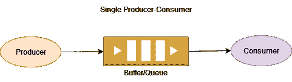
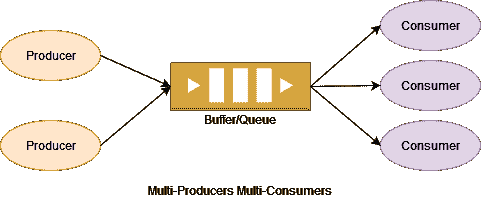

# Java 中的生产者-消费者问题示例

> 原文：<https://web.archive.org/web/20220930061024/https://www.baeldung.com/java-producer-consumer-problem>

## 1.概观

在本教程中，我们将学习如何用 Java 实现生产者-消费者问题。这个问题就是**也称为有界缓冲区问题**。

关于这个问题的更多细节，我们可以参考[生产者-消费者问题](https://web.archive.org/web/20220524053111/https://en.wikipedia.org/wiki/Producer%E2%80%93consumer_problem) wiki 页面。对于 Java 线程/并发基础知识，请务必访问我们的 [Java 并发](/web/20220524053111/https://www.baeldung.com/java-concurrency)文章。

## 2.生产者-消费者问题

生产者和消费者是两个独立的过程。两个进程共享一个公共缓冲区或队列。生产者不断地产生某些数据并将其推送到缓冲区，而消费者则从缓冲区消费这些数据。

让我们来看一个展示这个简单场景的图表:

[](/web/20220524053111/https://www.baeldung.com/wp-content/uploads/2022/02/Producer-Consumer1.png)

**本来这个问题处理起来就有一定的复杂性**:

*   生产者和消费者都可能试图同时更新队列。这可能会导致数据丢失或不一致。
*   生产者可能比消费者慢。在这种情况下，消费者会快速处理元素并等待。
*   在某些情况下，消费者可能比生产者慢。这种情况会导致队列溢出问题。
*   在真实的场景中，我们可能有多个生产者、多个消费者，或者两者都有。这可能会导致不同的使用者处理相同的消息。

下图描述了一个有多个生产者和多个消费者的案例:

[](/web/20220524053111/https://www.baeldung.com/wp-content/uploads/2022/02/Multi-Producers-Multi-Consumers.png)

我们需要处理资源共享和同步，以解决一些复杂问题:

*   添加和删除数据时对队列进行同步
*   当队列为空时，使用者必须等待，直到生产者将新数据添加到队列中
*   当队列已满时，生产者必须等待，直到消费者使用数据并且队列有一些空缓冲区

## 3.使用线程的 Java 示例

我们为问题的每个实体定义了一个单独的类。

### 3.1.`Message`阶级

`Message`类保存产生的数据:

```java
public class Message {
    private int id;
    private double data;

    // constructors and getter/setters
}
```

数据可以是任何类型。它可能是一个 JSON 字符串，一个复杂的对象，或者只是一个数字。此外，将数据包装到一个`Message`类中并不是强制性的。

### 3.2.`DataQueue`阶级

共享队列和相关对象被包装到`DataQueue`类中:

```java
public class DataQueue {
    private final Queue<Message> queue = new LinkedList<>();
    private final int maxSize;
    private final Object FULL_QUEUE = new Object();
    private final Object EMPTY_QUEUE = new Object();

    DataQueue(int maxSize) {
        this.maxSize = maxSize;
    }

    // other methods
}
```

要制作有界缓冲区，需要一个`queue`和它的`maxSize`。

在 Java 中，`synchronized`块使用一个对象来实现线程同步。**每个对象都有一个固有的锁。**只有首先获得锁的线程才被允许执行`synchronized`块。

这里，我们创建了两个引用，`FULL_QUEUE`和`EMPTY_QUEUE`，用于同步。由于这些句柄没有其他用途，我们使用`Object`类初始化它们。

当队列满时，生产者等待`FULL_QUEUE`对象。并且，消费者一消费消息就通知。

生产者进程调用`waitOnFull`方法:

```java
public void waitOnFull() throws InterruptedException {
    synchronized (FULL_QUEUE) {
        FULL_QUEUE.wait();
    }
} 
```

消费者流程通过`notifyAllForFull`方法通知生产者:

```java
public void notifyAllForFull() {
    synchronized (FULL_QUEUE) {
        FULL_QUEUE.notifyAll();
    }
}
```

如果队列是空的，消费者就等待`EMPTY_QUEUE`对象。而且，一旦有消息添加到队列中，生产者就会通知它。

消费者进程使用`waitOnEmpty`方法等待:

```java
public void waitOnEmpty() throws InterruptedException {
    synchronized (EMPTY_QUEUE) {
        EMPTY_QUEUE.wait();
    }
}
```

生产者使用`notifyAllForEmpty`方法通知消费者:

```java
public void notifyAllForEmpty() {
    synchronized (EMPTY_QUEUE) {
        EMPTY_QUEUE.notify();
    }
}
```

生产者使用`add()`方法将消息添加到队列中:

```java
public void add(Message message) {
    synchronized (queue) {
        queue.add(message);
    }
}
```

消费者调用`remove`方法从队列中检索消息:

```java
public Message remove() {
    synchronized (queue) {
        return queue.poll();
    }
}
```

### 3.3.`Producer`阶级

`Producer`类实现了`Runnable`接口来启用线程创建:

```java
public class Producer implements Runnable {
    private final DataQueue dataQueue;
    private volatile boolean runFlag;

    public Producer(DataQueue dataQueue) {
        this.dataQueue = dataQueue;
        runFlag = true;
    }

    @Override
    public void run() {
        produce();
    }

    // Other methods
} 
```

构造函数使用共享的`dataQueue`参数。**成员变量`runFlag`有助于优雅地停止生产者进程。**初始化为`true`。

线程开始调用`produce()`方法:

```java
public void produce() {
    while (runFlag) {
        Message message = generateMessage();
        while (dataQueue.isFull()) {
            try {
                dataQueue.waitOnFull();
            } catch (InterruptedException e) {
                break;
            }
        }
        if (!runFlag) {
            break;
        }
        dataQueue.add(message);
        dataQueue.notifyAllForEmpty();
    }
}
```

生产者在`while`循环中连续运行步骤。当`runFlag`为`false`时，该循环中断。

在每次迭代中，它都会生成一条消息。然后，它检查队列是否已满，并根据需要等待。使用一个`while`循环代替`if`块来检查队列是否已满。**这是为了避免从等待状态虚假唤醒。**

当生产者从等待中醒来时，它检查它是否仍然需要继续或者从过程中中断。它向队列中添加一条消息，并通知在空队列中等待的消费者。

`stop`()方法优雅地终止进程:

```java
public void stop() {
    runFlag = false;
    dataQueue.notifyAllForFull();
}
```

将`runFlag`更改为`false`后，通知所有处于“队列已满”状态的生产者。这确保了所有生产者线程终止。

### 3.4.消费者阶层

`Consumer`类实现`Runnable`来启用线程创建:

```java
public class Consumer implements Runnable {
    private final DataQueue dataQueue;
    private volatile boolean runFlag;

    public Consumer(DataQueue dataQueue) {
        this.dataQueue = dataQueue;
        runFlag = true;
    }

    @Override
    public void run() {
        consume();
    }

    // Other methods
} 
```

它的构造函数有一个共享的`dataQueue`作为参数。`runFlag`被初始化为`true`。该标志在需要时停止消费进程。

**线程启动时，运行`consume`方法**:

```java
public void consume() {
    while (runFlag) {
        Message message;
        if (dataQueue.isEmpty()) {
            try {
                dataQueue.waitOnEmpty();
            } catch (InterruptedException e) {
                break;
            }
        }
        if (!runFlag) {
            break;
        }
        message = dataQueue.remove();
        dataQueue.notifyAllForFull();
        useMessage(message);
    }
}
```

它有一个连续运行的`while` 循环。并且，当`runFlag`是`false`时，这个过程优雅地停止。

每次迭代检查队列是否为空。**如果队列为空，消费者等待消息产生**。此等待也被`while`循环用来避免虚假唤醒。

当消费者从等待中醒来时，它检查`runFlag`。如果标志是`false`，那么它就跳出循环。否则，它会从队列中读取一条消息，并通知生成器它正在“满队列”状态下等待。最后，它消耗消息。

为了优雅地停止进程，它使用了`stop()`方法:

```java
public void stop() {
    runFlag = false;
    dataQueue.notifyAllForEmpty();
}
```

在`runFlag`被设置为`false`之后，所有处于空队列状态等待的消费者被通知。这确保了所有消费者线程都终止。

### 3.5.运行生产者线程和消费者线程

让我们创建一个具有最大所需容量的`dataQueue`对象:

```java
DataQueue dataQueue = new DataQueue(MAX_QUEUE_CAPACITY); 
```

现在，让我们创建`producer`对象和一个线程:

```java
Producer producer = new Producer(dataQueue);
Thread producerThread = new Thread(producer);
```

然后，我们将初始化一个`consumer`对象和一个线程:

```java
Consumer consumer = new Consumer(dataQueue);
Thread consumerThread = new Thread(consumer);
```

最后，我们启动线程来启动进程:

```java
producerThread.start();
consumerThread.start();
```

它会持续运行，直到我们想要停止那些线程。阻止他们很简单:

```java
producer.stop();
consumer.stop(); 
```

### 3.6.运行多个生产者和消费者

运行多个生产者和消费者类似于单个生产者和消费者的情况。我们只需要创建所需数量的线程并启动它们。

让我们创建多个生成器和线程并启动它们:

```java
Producer producer = new Producer(dataQueue);
for(int i = 0; i < producerCount; i++) {
    Thread producerThread = new Thread(producer);
    producerThread.start();
}
```

接下来，让我们创建所需数量的消费者对象和线程:

```java
Consumer consumer = new Consumer(dataQueue);
for(int i = 0; i < consumerCount; i++) {
    Thread consumerThread = new Thread(consumer);
    consumerThread.start();
}
```

我们可以通过在生产者和消费者对象上调用`stop()`方法来优雅地停止这个过程:

```java
producer.stop();
consumer.stop();
```

## 4.使用`BlockingQueue`的简化示例

Java 提供了一个线程安全的`BlockingQueue`接口。换句话说，**多个线程可以在这个队列中添加和删除，而没有任何并发问题**。

如果队列已满，它的`put()`方法会阻塞调用线程。类似地，如果队列为空，它的`take()`方法会阻塞调用线程。

### 4.1.创建有界的`BlockingQueue`

我们可以使用构造函数中的容量值创建一个有界的`BlockingQueue`:

```java
BlockingQueue<Double> blockingQueue = new LinkedBlockingDeque<>(5);
```

### 4.2.简化`produce`方法

在`produce()`方法中，我们可以避免队列的显式同步:

```java
private void produce() {
    while (true) {
        double value = generateValue();
        try {
            blockingQueue.put(value);
        } catch (InterruptedException e) {
            break;
        }
    }
}
```

这个方法不断地产生对象，并将它们添加到队列中。

### 4.3.简化`consume`方法

`consume()`方法没有明确使用同步:

```java
private void consume() {
    while (true) {
        Double value;
        try {
            value = blockingQueue.take();
        } catch (InterruptedException e) {
            break;
        }
        // Consume value
    }
}
```

它只是从队列中取一个值，并不断地使用它。

### 4.4.运行生产者和消费者线程

我们可以根据需要创建任意多的生产者和消费者线程:

```java
for (int i = 0; i < 2; i++) {
    Thread producerThread = new Thread(this::produce);
    producerThread.start();
}

for (int i = 0; i < 3; i++) {
    Thread consumerThread = new Thread(this::consume);
    consumerThread.start();
}
```

## 5.结论

在本文中，我们学习了如何使用 Java 线程实现生产者-消费者问题。此外，我们还学习了如何运行多个生产者和消费者的场景。

完整的代码样本可以在 GitHub 上找到[。](https://web.archive.org/web/20220524053111/https://github.com/eugenp/tutorials/tree/master/core-java-modules/core-java-concurrency-advanced-4)