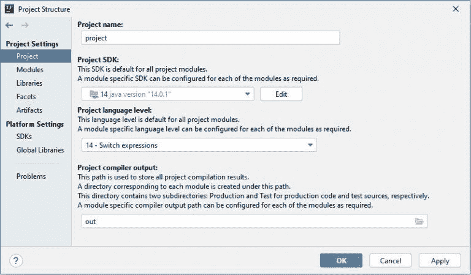
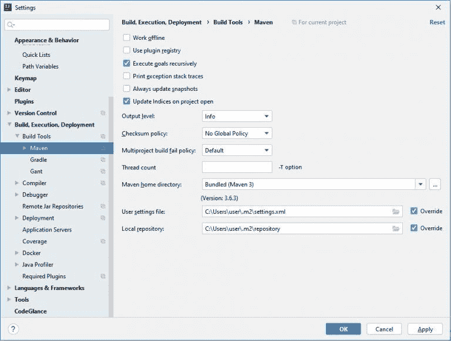
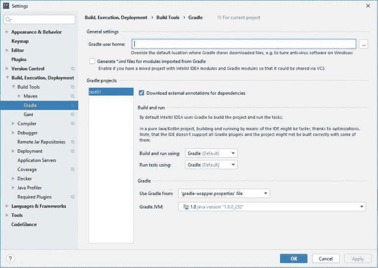
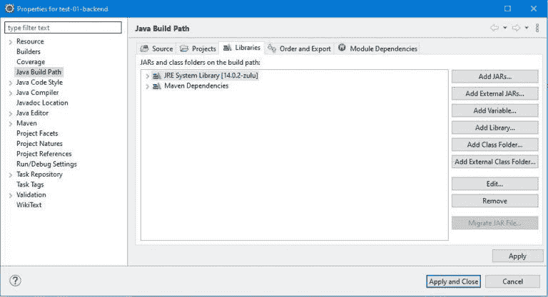
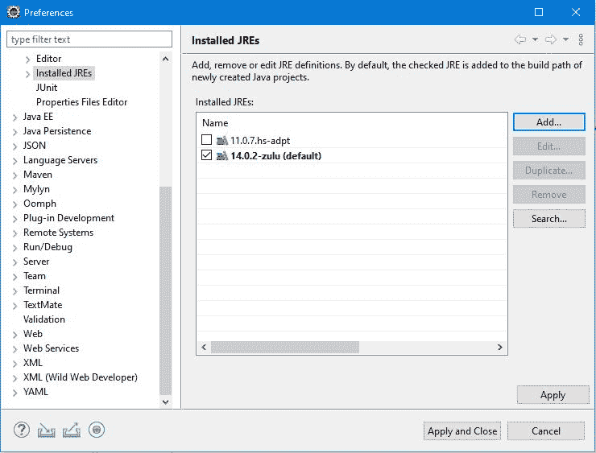

# SDKMAN 指南！

> 原文：<https://web.archive.org/web/20220930061024/https://www.baeldung.com/java-sdkman-intro>

## 1.概观

随着 Java 新发布周期的到来，开发人员可能需要在其环境中管理并行版本和不同版本的软件开发工具包(SDK)。因此，设置 PATH 变量有时会非常麻烦。

在本教程中，我们将看到 SDKMAN！可以帮助轻松管理 SDK 的安装和选择。

## 2.什么是 SDKMAN！？

**SDKMAN！是一个管理多个 SDK 并行版本的工具，哪个 SDKMAN！**称“候选人”。

它提供了一个方便的命令行界面(CLI)和 API，用于列出、安装、切换和删除候选项。此外，它还负责为我们设置环境变量。

它还允许开发人员安装基于 JVM 的 SDK，如 Java、Groovy、Scala、Kotlin 和 Ceylon。也支持 Maven、Gradle、SBT、Spring Boot、Vert.x 和许多其他软件。 **SDKMAN！是一个用 Bash 编写的免费、轻量级、开源的实用程序。**

## 3.装 SDKMAN！

SDKMAN！受所有主要操作系统的支持，并且可以很容易地安装在所有基于 Unix 的系统上。而且，它支持 Bash 和 Zsh shells。

因此，让我们从使用终端安装它开始:

```
$ curl -s "https://get.sdkman.io" | bash
```

然后，按照屏幕上的说明完成安装。

我们可能需要安装 zip 和 unzip 包来完成安装过程。

接下来，打开一个新的终端或运行:

```
$ source "$HOME/.sdkman/bin/sdkman-init.sh"
```

最后，运行以下命令以确保安装工作正常。如果一切顺利，应该会显示以下版本:

```
$ sdk version
SDKMAN 5.8.5+522 
```

如需更多定制，请参考 SDKMAN 上的[安装指南](https://web.archive.org/web/20221129012154/https://sdkman.io/install)！网站。

要查看所有可用的命令，使用`help`命令:

```
$ sdk help
```

## 4.列出所有 SDK 候选项

所以，让我们从列出所有可用的 SDK 候选开始。

```
$ sdk list 
```

`list`命令**显示所有可用的候选项，通过唯一的名称、描述、官方网站和安装命令来识别:**

```
=====================================================
Available Candidates
=====================================================
q-quit                                  /-search down
j-down                                  ?-search up
k-up                                    h-help
-----------------------------------------------------
Java (11.0.7.hs-adpt)                https://zulu.org
...
                                   $ sdk install java
-----------------------------------------------------
Maven (3.6.3)                https://maven.apache.org
...
                                  $ sdk install maven
-----------------------------------------------------
Spring Boot (2.3.1.RELEASE)          http://spring.io
...
                             $ sdk install springboot
------------------------------------------------------
... 
```

因此，我们可以使用这个标识符来安装候选的默认版本，比如 Spring Boot (2.3.1.RELEASE)或 Maven (3.6.3)。此列表中指定的版本代表每个 SDK 的稳定版本或 LTS 版本。

## 5.安装和管理 Java 版本

### 5.1.列出版本

要列出 Java 的可用版本，使用`list`命令。结果是一个按供应商分组并按版本排序的条目表:

```
$ sdk list java
===================================================================
Available Java Versions
===================================================================
Vendor       | Use | Version | Dist    | Status | Identifier
-------------------------------------------------------------------
AdoptOpenJDK |     | 14.0.1  | adpt    |        | 14.0.1.j9-adpt
...
Amazon       |     | 11.0.8  | amzn    |        | 11.0.8-amzn
...
Azul Zulu    |     | 14.0.2  | zulu    |        | 14.0.2-zulu
...
BellSoft     |     | 14.0.2  | librca  |        | 14.0.2.fx-librca
...
GraalVM      |     | 20.1.0  | grl     |        | 20.1.0.r11-grl
...
Java.net     |     | 16.ea   | open    |        | 16.ea.6-open
...
SAP          |     | 14.0.2  | sapmchn |        | 14.0.2-sapmchn
... 
```

每次我们想要检查、切换或管理候选人的存储时，我们都需要这个命令。

### 5.2.安装 Java 版本

假设我们想要安装来自 Azul Zulu 的 Java 14 的最新版本。因此，我们复制它的标识符，也就是表中的版本，并将其作为参数添加到`install`命令中:

```
$ sdk install java 14.0.2-zulu
Downloading: java 14.0.2-zulu
In progress...
########### 100.0%
Repackaging Java 14.0.2-zulu...
Done repackaging...
Installing: java 14.0.2-zulu
Done installing!
Setting java 14.0.2-zulu as default. 
```

SDKMAN！将下载并解压这个版本到我们电脑上的一个目录中。

此外，它将更新环境变量，以便我们可以立即在终端中使用 Java。

我们可以通过使用`list`命令来验证任何版本的状态和使用情况。因此，现在安装并使用的版本`14.0.1 i`:

```
$ sdk list java
=================================================================
Available Java Versions
=================================================================
 Vendor    | Use | Version | Dist    | Status    | Identifier
-----------------------------------------------------------------
 ...
 Azul Zulu | >>> | 14.0.1  | adpt    | installed | 14.0.1.j9-adpt
 ... 
```

此外，可以使用相同的命令从计算机上安装 Java 或任何自定义版本，但是要将二进制文件的路径指定为附加参数:

```
$ sdk install java custom-8 ~/Downloads/my-company-jdk-custom-8 
```

### 5.3.在版本之间切换

我们可以用两种形式暂时控制版本之间的切换:

```
$ sdk use java 14.0.1.j9-adpt
```

或者永久:

```
$ sdk default java 14.0.1.j9-adpt 
```

### 5.4.移除版本

要删除已安装的版本，运行目标版本的`uninstall`命令:

```
$ sdk uninstall java 14.0.1.j9-adpt 
```

### 5.5.显示正在使用的版本

为了检查 Java 的当前版本，我们运行`current`命令:

```
$ sdk current java
Using java version 14.0.2-zulu 
```

同样，最后一个命令的效果与:

```
$ java -version 
```

要在我们的机器上显示 SDK 的版本，我们可以运行不带参数的`current`命令:

```
$ sdk current
Using:
java: 14.0.2-zulu
gradle: 6.2.2 
```

## 6.用 SDKMAN！使用 IDE

安装的 SDK 存储在 SDKMAN 中！默认为`~/.sdkman/candidates`的目录。

例如，`~/.sdkman/candidates/java/`目录下也有不同版本的 Java，子目录以版本命名:

```
$ ls -al ~/.sdkman/candidates/java/
total 0
drwxrwxrwx 1 user user 12 Jul 25 20:00 .
drwxrwxrwx 1 user user 12 Jul 25 20:00 ..
drwxrwxr-x 1 user user 12 Jul 25 20:00 14.0.2-zulu
lrwxrwxrwx 1 user user 14 Jul 25 20:00 current -> 14.0.2-zulu 
```

因此，当前选定的 Java 版本也将作为当前版本出现在该目录中。

同样，Gradle 或任何其他 SDK 都将安装在`candidates`目录下。

这样，我们可以使用任何特定版本的 Java，例如在我们最喜欢的 IDE 中。我们所要做的就是复制一个特定版本的路径，并在我们 IDE 的配置中设置它。

### 6.1.智能理念

在 IntelliJ IDEA 中，打开“项目结构”，然后打开“项目设置”。在项目配置中，我们可以通过从“项目 SDK”部分选择“新建…”来添加新的 Java 版本:

[](/web/20221129012154/https://www.baeldung.com/wp-content/uploads/2020/07/projectij-768x449-1.jpg)

我们还可以在“构建工具”部分定义要使用的 Java、Gradle 或 Maven 的版本:

[](/web/20221129012154/https://www.baeldung.com/wp-content/uploads/2020/07/maven-768x582-1.jpg)

### [](/web/20221129012154/https://www.baeldung.com/wp-content/uploads/2020/07/gradle-768x544-1.jpg)

提示:Java 的版本必须与 Gradle 或 Maven 的“项目 SDK”中使用的版本相同。

### 6.2.黯然失色

在 Eclipse 中打开“项目属性”，选择“Java 构建路径”，然后切换到“库”选项卡。在这里，我们可以通过“添加库…”并按照说明来管理 Java 的新 SDK:

[](/web/20221129012154/https://www.baeldung.com/wp-content/uploads/2020/07/eclipse-project-768x417-1.jpg)

我们还可以控制所有项目安装的 SDK。打开“窗口”菜单下的“首选项”，然后转到“已安装的 JREs”。在这里，我们可以通过“添加…”并按照说明来管理 Java 的 SDK:

[](/web/20221129012154/https://www.baeldung.com/wp-content/uploads/2020/07/eclipse.jpg)

## 7.结论

在本教程中，我们已经展示了 SDKMAN！可以帮助我们管理不同版本的 Java SDKs 以及其他 Java 环境工具，比如 Maven。