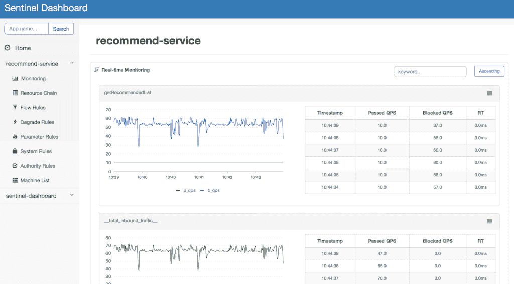

# 阿里巴巴哨兵简介

> 原文：<https://web.archive.org/web/20220930061024/https://www.baeldung.com/java-sentinel-intro>

## 1.概观

顾名思义，[哨兵](https://web.archive.org/web/20221208143828/https://github.com/alibaba/Sentinel)是微服务的强力卫士。它提供了诸如流量控制、并发限制、电路中断和自适应系统保护等功能来保证它们的可靠性。这是一个由阿里巴巴集团积极维护的开源组件。此外，它还正式成为了[弹簧云断路器](https://web.archive.org/web/20221208143828/https://spring.io/projects/spring-cloud-circuitbreaker)的一部分。

在本教程中，我们将看看哨兵的一些主要功能。此外，我们将看到一个如何使用它的例子，它的注释支持，以及它的监控仪表板。

## 2.特征

### 2.1.流控制

Sentinel 控制随机传入请求的速度，以避免微服务过载。这确保了我们的服务不会被流量激增所扼杀。**它支持多种流量整形策略。当每秒查询数(QPS)过高时，这些策略会自动将流量调整到适当的形状**。

这些流量整形策略包括:

*   **直接拒绝模式**–当每秒的请求数超过设定的阈值时，它会自动拒绝进一步的请求
*   **慢启动预热模式**–如果流量突然激增，该模式可确保请求数量逐渐增加，直至达到上限

### 2.2.断路和降级

当一个服务同步调用另一个服务时，另一个服务可能会因为某种原因而关闭。在这种情况下，线程被阻塞，因为它们一直在等待另一个服务的响应。这可能导致资源耗尽，调用者服务也将无法处理进一步的请求。**这被称为级联效应，可能会破坏我们的整个微服务架构**。

为了防止这种情况发生，电路断路器就出现了。它将立即阻止对其他服务的所有后续调用。超时之后，一些请求会被通过。如果成功，则断路器恢复正常电流。否则，超时周期再次开始。

**Sentinel 利用最大并发限制**原理实现断路。它通过限制并发线程的数量来减少不稳定资源的影响。

哨兵也降级不稳定的资源。当资源的响应时间过长时，所有对资源的调用都将在指定的时间窗口内被拒绝。这可以防止呼叫变得非常慢，从而导致级联效应。

### 2.3.适应性系统保护

在系统负载过高的情况下，哨兵保护我们的服务器。它使用`load1`(系统负载)作为度量来启动流量控制。在下列情况下，请求将被阻止:

*   当前系统负荷(`load1` ) >)【阈值(`highestSystemLoad`)；
*   当前并发请求(线程数) >估计容量(最短响应时间*最大 QPS)

## 3.如何使用

### 3.1.添加 Maven 依赖项

在我们的 Maven 项目中，我们需要在`pom.xml`中添加 [`sentinel-core`](https://web.archive.org/web/20221208143828/https://mvnrepository.com/artifact/com.alibaba.csp/sentinel-core) 依赖项:

```
<dependency>
    <groupId>com.alibaba.csp</groupId>
    <artifactId>sentinel-core</artifactId>
    <version>1.8.0</version>
</dependency>
```

### 3.2。定义资源

让我们使用 Sentinel API 在`try-catch `块中用相应的业务逻辑定义我们的资源:

```
try (Entry entry = SphU.entry("HelloWorld")) {
    // Our business logic here.
    System.out.println("hello world");
} catch (BlockException e) {
    // Handle rejected request.
}
```

这个资源名为“HelloWorld”的`try-catch`块充当我们业务逻辑的入口点，由 Sentinel 保护。

### 3.3。定义流量控制规则

这些规则控制流向我们资源的流量，如阈值计数或控制行为—例如，直接拒绝或减慢启动。让我们使用`FlowRuleManager.loadRules()`来配置流规则:

```
List<FlowRule> flowRules = new ArrayList<>();
FlowRule flowRule = new FlowRule();
flowRule.setResource(RESOURCE_NAME);
flowRule.setGrade(RuleConstant.FLOW_GRADE_QPS);
flowRule.setCount(1);
flowRules.add(flowRule);
FlowRuleManager.loadRules(flowRules);
```

这个规则定义了我们的资源“RESOURCE_NAME”每秒最多可以响应一个请求。

### 3.4.定义降级规则

使用降级规则，我们可以配置断路器的阈值请求计数、恢复超时和其他设置。
让我们使用`DegradeRuleManager.loadRules()`配置降级规则:

```
List<DegradeRule> rules = new ArrayList<DegradeRule>();
DegradeRule rule = new DegradeRule();
rule.setResource(RESOURCE_NAME);
rule.setCount(10);
rule.setTimeWindow(10);
rules.add(rule);
DegradeRuleManager.loadRules(rules);
```

该规则规定，当我们的资源`RESOURCE_NAME`未能满足 10 个请求(阈值计数)时，电路将中断。Sentinel 将阻止对资源的所有后续请求 10 秒钟(时间窗口)。

### 3.5.定义系统保护规则

使用系统保护规则，我们可以配置和确保自适应系统保护(阈值`load1`，平均响应时间，并发线程数)。让我们使用`SystemRuleManager.loadRules()`方法配置系统规则:

```
List<SystemRule> rules = new ArrayList<>();
SystemRule rule = new SystemRule();
rule.setHighestSystemLoad(10);
rules.add(rule);
SystemRuleManager.loadRules(rules);
```

这条规则规定，对于我们的系统，最高系统负载是每秒 10 个请求。如果当前负载超过这个阈值，所有进一步的请求都将被阻塞。

## 4.注释支持

**Sentinel 还为定义资源**提供了面向方面的注释支持。

首先，我们将为 [`sentinel-annotation-aspectj`](https://web.archive.org/web/20221208143828/https://search.maven.org/search?q=g:com.alibaba.csp%20a:sentinel-annotation-aspectj) 添加 Maven 依赖项:

```
<dependency>
    <groupId>com.alibaba.csp</groupId>
    <artifactId>sentinel-annotation-aspectj</artifactId>
    <version>1.8.0</version>
</dependency>
```

然后，我们将`@Configuration`添加到配置类中，将 sentinel 方面注册为 Spring bean:

```
@Configuration
public class SentinelAspectConfiguration {

    @Bean
    public SentinelResourceAspect sentinelResourceAspect() {
        return new SentinelResourceAspect();
    }
}
```

`@SentinelResource `表示资源定义。它有类似于`value`的属性，定义了资源名称。属性`fallback`是回退方法的名称。当电路中断时，这个回退方法定义了我们程序的备用流程。让我们使用`@SentinelResource `注释来定义资源:

```
@SentinelResource(value = "resource_name", fallback = "doFallback")
public String doSomething(long i) {
    return "Hello " + i;
}

public String doFallback(long i, Throwable t) {
    // Return fallback value.
    return "fallback";
}
```

这定义了名为`resource_name`的资源以及回退方法。

## 5.监控仪表板

Sentinel 还提供了一个监控仪表板。这样，我们可以监控客户端并动态配置规则。我们可以实时看到我们定义的资源的传入流量。

### 5.1.启动仪表板

首先，我们需要下载 [Sentinel 仪表盘 jar](https://web.archive.org/web/20221208143828/https://github.com/alibaba/Sentinel/releases) 。然后，我们可以使用以下命令启动控制面板:

```
java -Dserver.port=8080 -Dcsp.sentinel.dashboard.server=localhost:8080 -Dproject.name=sentinel-dashboard -jar sentinel-dashboard.jar
```

一旦仪表板应用程序启动，我们就可以按照下一节中的步骤连接我们的应用程序。

### 5.2.准备我们的申请

让我们将 [`sentinel-transport-simple-http`](https://web.archive.org/web/20221208143828/https://search.maven.org/search?q=g:com.alibaba.csp%20a:sentinel-transport-simple-http) 依赖项添加到我们的`pom.xml`中:

```
<dependency>
    <groupId>com.alibaba.csp</groupId>
    <artifactId>sentinel-transport-simple-http</artifactId>
    <version>1.8.0</version>
</dependency>
```

### 5.3.将我们的应用程序连接到仪表板

启动应用程序时，我们需要添加仪表板 IP 地址:

```
-Dcsp.sentinel.dashboard.server=consoleIp:port
```

现在，无论何时调用资源，仪表板都将从我们的应用程序接收心跳:

[](/web/20221208143828/https://www.baeldung.com/wp-content/uploads/2021/04/sentinel_dashboard-1024x567-1.png)

我们还可以使用仪表板动态地操纵流、降级和系统规则。

## 6.结论

在本文中，我们看到了阿里巴巴 Sentinel 流量控制、断路器和自适应系统保护的主要功能。

相应的例子可以在 GitHub 上找到[。](https://web.archive.org/web/20221208143828/https://github.com/eugenp/tutorials/tree/master/spring-cloud-modules/spring-cloud-sentinel)